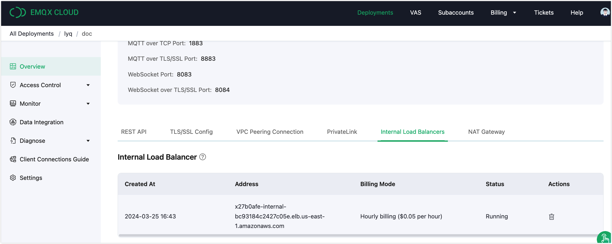

# Value Added Services

Value Added Services (VAS) are highly available service plans provided and maintained by EMQX Platform, it helps to meet the specific technical and product needs of our customers.

All value-added services offered by EMQX Platform can be found in the top menu bar - **VAS**, where you can view and activate the services. Services that have already been purchased will be displayed in **Value Added Services**. In general, we offer a free trial period to let you fully explore the features before you decide to purchase.

Value-added services are associated with the deployment you purchase. You can activate related value-added services only after purchasing a dedicated edition deployment. Please pay attention to the service descriptions. If you have purchased multiple deployments, please select the deployment for which you need to create the service instance.

Once you have signed up you can view the list of services, which will show all the value-added services of the same type that you have purchased. You can also go directly to the value-added services under deployment.

In addition to opening the service in the **VAS**, you can also see the display where the service can be offered in the features under Deployment (the portal will be different for different value-added services). You can open this service directly here, and the process is the same as opening it in the VAS Center.

## Trial Instructions

NAT Gateway and Internal Load Balancing offer a trial of their functionalities, with the following trial requirements:

<table>    <tr>       <th>Value-Added Service</th>       <th>Deployment Requirement</th>       <th>Trial Period</th>       <th>Trial Limitations</th>    </tr>    <tr>       <td>NAT Gateway</td>       <td>Dedicated Edition</td>       <td>14 days</td>       <td>One trial per cloud account</td>    </tr>    <tr>       <td>Internal Load Balancing</td>       <td>Dedicated Edition</td>       <td>14 days</td>       <td>One trial per cloud account</td>    </tr> </table>

