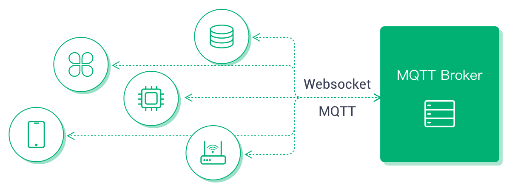
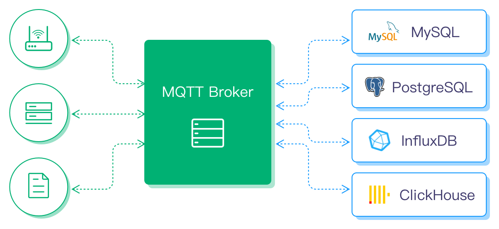
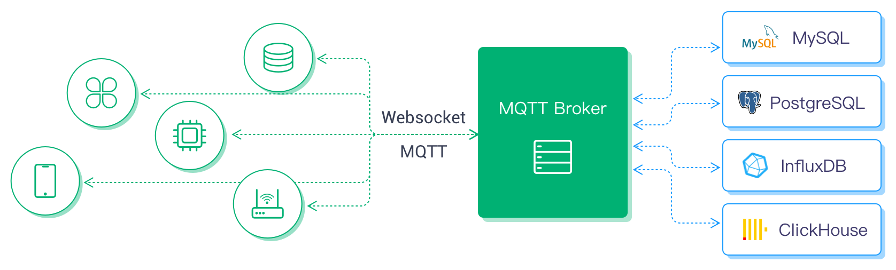
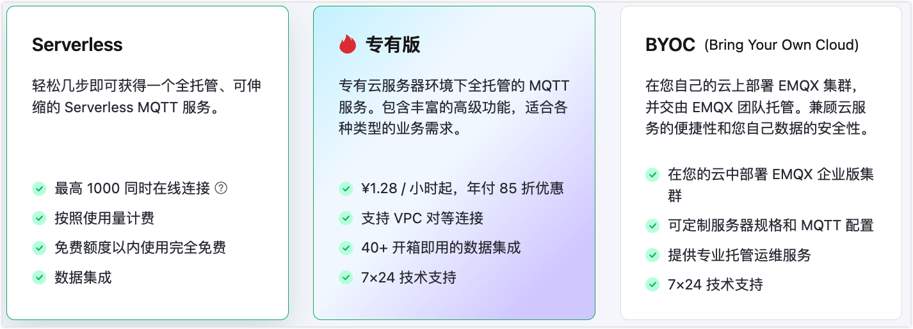
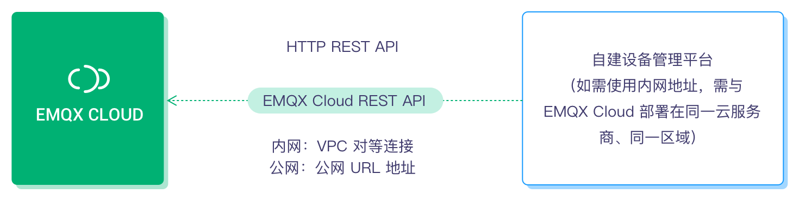
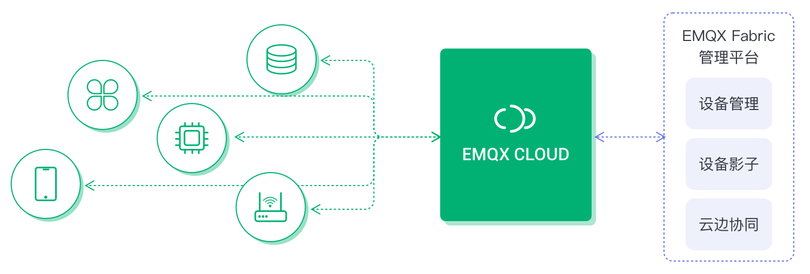

# EMQ X Cloud 产品简介

EMQ X Cloud 是 EMQ 公司推出的一款面向物联网领域的 MQTT 消息中间件产品。作为全球首个全托管的 MQTT 5.0 公有云服务，EMQ X Cloud 提供了一站式运维代管、独有隔离环境的 MQTT 消息服务。在万物互联的时代，EMQ X Cloud 可以帮助您快速构建面向物联网领域的行业应用，轻松实现物联网数据的采集、传输、计算和持久化。

借助云服务商提供的基础计算设施，EMQ X Cloud 面向全球数十个国家与地区提供服务，为 5G 与万物互联应用提供低成本、安全可靠的云服务。

## 物联网消息收发模型

### *双向通信*

EMQ X Cloud 支持海量设备及应用端连接，为应用程序及物联网设备提供安全可靠的双向通信能力:

在该模型中，EMQ X Cloud 提供的 MQTT 服务将海量设备与应用连接起来，支持应用与设备间的双向通信，也支持设备与设备间的双向通信。该模型适用于有类即时通讯需求的物联网应用，比较典型的如：智能家居场景中，手机 APP 获取智能设备的状态信息，并且用户可以通过 APP 向智能设备发送控制指令。又如在工业场景中，AGV 机器人之间通过 MQTT 协议来进行即时通信，实现多机协作。EMQ X Cloud 提供的 MQTT 服务不仅支持标准 MQTT 协议，也支持 MQTT over WebSocket，以及 CoAP、 MQTT-SN、LwM2M、JT/T808等协议，只需一个消息中间件即可满足多类终端同时接入的需求。

### *数据采集*

EMQ X Cloud 支持设备数据上云，通过海量 Topic 及规则引擎的支持，低代码即可实现数据的采集、过滤、转换、计算及持久化。

在该模型中，EMQ X Cloud 提供的 MQTT 服务可以实现数据的采集、计算和持久化。该模型适用于有数据采集和持久化需求的物联网应用，比较典型的如：在工业场景中，各个物联网传感器将实时采集的数据汇集到边缘网关，通过边缘网关将数据上传到 MQTT 服务器上，再由规则引擎触发数据的过滤、转换和简单计算，并将最终结果转发至其他服务或持久化至目标数据库中。EMQ X Cloud 提供了多种接入方案，涵盖了不同的网络条件、各种类型终端设备和边缘网关设备，支持70多种工业协议接入。

### *混合模型*

EMQ X Cloud 提供的 MQTT 服务支持双向通信和数据采集模型的混合应用。通过共享订阅、规则引擎等能力，实现数据在物与物、物与应用间流转的同时进行持久化。

在该模型中，EMQ X Cloud 提供的 MQTT 服务不仅为设备与设备、设备与应用间架起桥梁，同时可将需要的数据进行持久化，以便非实时应用在后续对获取的数据加以利用。比较典型的如一些人工智能应用，终端获取的数据需要发送至云端，通过云端运行的计算模型经过计算后即时反馈给终端，如物品或人脸识别应用。同时数据的副本需要持久化到数据库中，以便于后续离线训练和改进人工智能计算模型。

## 产品版本

EMQ X Cloud 分为三个版本，每个版本包含多个规格，我们支持在全球主流的公有云上部署专属于您的全托管 MQTT 服务

1. 基础版：适用于 MQTT 协议或 EMQ X Broker 产品的学习和体验，及轻量级物联网应用的开发。
2. 专业版：适用于构建关键任务的物联网应用，本版本提供了数据持久化，消息分发，VPC 对等连接等高级功能。
3. 旗舰版：适用于企业级物联网平台的构建，提供多地域及独享硬件部署的支持，并增加了设备管理、设备影子、物模型等功能。

## 产品优势

### 协议支持完整

支持 MQTT v3.1，v3.1.1 与 v5.0 协议版本，是全球首个支持 MQTT 5.0 的公有云服务，支持 MQTT WebSocket 服务，完整支持 QoS0, QoS1 与 QoS2 级别 MQTT 消息。

### 更少地使用限制

大部分公有云 IoT 平台有多方面的使用限制，包括 MQTT 主题数量、消息大小、消息速率以及接入/通信模式。EMQ X Cloud 拥有更少的使用限制，让您无阻碍地集成使用。

### 显著的成本优势

按集群实例与消息流量收费，而非消息条数，不限 API 与规则引擎的使用，业务海量扩张的时候成本仍然清晰可控。

### 完全托管的运维

数分钟内创建高可用 MQTT 集群立即开始设备接入，随后整个使用周期由我们的全球服务支持团队和 EMQ 专家提供最高 7*24 不间断的技术支持和运维服务，您可以随时通过工单，电子邮件，电话等快速获得响应。

### 高可用性与数据安全

EMQ X Cloud 专业版和旗舰版采用高冗余集群架构，以确保服务的高可用性；通过独有隔离环境保障您数据安全与业务稳定性，每个部署集群都有自己的公共 IP、专用 VPC 网络、独立 EMQ X 服务器与数据库服务器，这更安全，更可靠。

### 多种协议接入，私有化定制功能扩展

支持包含 MQTT、MQTT-SN、CoAP、LwM2M、私有 TCP 协议在内的多种通信协议接入，覆盖各类行业应用；可根据您的特殊使用场景定制私有化功能，充分契合业务需求。

### 容量预估与伸缩

通过连接数与消息吞吐量自动预估容量，通过紧密的监控来制定伸缩计划，集群大小可随业务规模平滑调整。

### 灵活的数据流转方案

EMQ X Cloud 专业版和旗舰版支持实时预处理设备事件与消息数据，并存储到云上 MySQL、Kafka、InfluxDB 等十余种数据库与消息系统中。

## 产品能力

EMQ X Cloud 作为全托管的 EMQ X 接入平台服务，提供了设备接入、设备管理、消息存储等功能。

### 设备接入

支持海量设备连接上云，提供设备与设备、设备与应用稳定可靠的双向通信能力。

- 支持标准的 MQTT 协议（包括 MQTT over WebSocket），使用标准 MQTT 客户端库即可连接上云
- 支持 CoAP、MQTT-SN、LwM2M 协议以及私有 TCP 协议接入，满足各类系统接入上云需求
- 提供不同网络设备、工业/边缘设备上云接入方案
- 开源多种语言/平台接入示例代码，提供跨平台移植指导
- 完美契合 EMQ [边缘计算](https://www.emqx.cn/products/kuiper)、[边缘工业物联网](https://www.emqx.cn/products/neuron) 产品生态，支持数十种工业协议接入上云

::: tip
多协议以及私有协议支持请 [工单](./contact.md) 联系进行开通。
:::

### 设备管理

EMQ X Cloud 基础版和专业版提供了丰富的 REST API ，用户可通过 API 和规则引擎与自己的设备管理系统、物联网平台集成。EMQ X Cloud 旗舰版提供了企业级的设备管理功能，用户可以利用企业版直接创建和管理设备对象，并利用设备影子，云边协同管理等旗舰版特有的功能来管理边缘终端设备和网关设备。

- **设备认证信息管理**：平台通过 REST API 进行认证信息增、删、查、改

- **设备在线状态查看**：
    - 平台通过 REST API 获取在线设备列表，查询设备是否在线
    - 平台通过规则引擎在设备上线、下线时改写私有数据库中设备的状态或发送到自建服务（Web 服务）
    - 设备离线告警： 设备离线时通知平台，判断是否需要告警

- **设备上下线历史记录**：
    - 平台通过规则引擎在设备上线、下线时将上下线信息写入私有数据库或发送到自建服务（Web 服务）
    - 设备发布订阅 ACL 权限管理： 平台通过 REST API 对 ACL 权限进行增、删、查、改

- **在线设备踢下线**：平台将在线设备踢下线

- **代理订阅**：平台通过 REST API 为在线设备订阅或取消订阅主题

- **向设备发布消息**：平台通过 REST API 或 MQTT 接入向指定主题发布消息，支持批量操作

- **消息收发、连接数等业务统计**：通过 REST API 获取相关统计信息。

::: tip
仅专业版和旗舰版
:::

- **获取设备消息进行桥接/存储**：通过规则引擎，将设备事件（上下线、订阅/取消订阅、消息发布）以及消息数据存储至私有数据库（主流关系/非关系，各类时序数据库）、消息队列 Kafka 以及自建 Web 服务。

::: tip
仅旗舰版
:::

- **设备影子**：通过设备影子，间接获取设备的状态，无论是非是否离线，可以通过设备影子修改设备属性。当设备在线时自动同步设备影子状态。
- **云边协同**：通过旗舰版管理平台创建和管理边缘网关和终端设备，并对边缘网关和设备进行配置。

### 消息存储（规则引擎）

EMQ X Cloud 支持使用规则引擎配置设备消息、事件的处理、响应规则。

规则引擎不仅提供了清晰、灵活的"配置式"的业务集成方案，简化了业务开发流程，提升用户易用性，降低业务系统与 EMQ X 的耦合度。

- **发送到 HTTP 服务与其他 MQTT 服务**
    - 发送数据到 Web 服务
    - 桥接数据到 MQTT Broker

::: tip
仅专业版和旗舰版
:::

- **保存设备事件信息、消息数据到数据库，用设备事件驱动业务数据**
    - 保存数据到 MySQL
    - 保存数据到 PostgreSQL
    - 保存数据到 Cassandra
    - 保存数据到 MongoDB
    - 保存数据到 DynamoDB
    - 保存数据到 Redis
    - 保存数据到 ClickHouse
    - 保存数据到 TDengine
    - 保存数据到 OpenTSDB
    - 保存数据到 TimescaleDB
    - 保存数据到 InfluxDB

::: tip
仅专业版和旗舰版
:::

- **桥接数据到 Kafka、RabbitMQ 等消息与流处理平台**
    - 桥接数据到 Kafka
    - 桥接数据到 Pulsar
    - 桥接数据到 RocketMQ
    - 桥接数据到 RabbitMQ
    - 桥接数据到 RPC 服务

::: tip
仅专业版和旗舰版
:::

- **消费消息下发到设备，事务级的平台指令下发**
    - 从 Kafka 消费消息到 EMQ X
    - 从 Pulsar 消费消息到 EMQ X

## 使用限制

相比于公有云 IoT Hub 平台，EMQ X Cloud 有更少的使用限制。下表中相关的限制取决于购买的连接数与硬件性能，对应的参数 EMQ 官方均进行过严密性能测试。

> 以下各表中 EMQ X 的"不限"指不做技术手段限制，相关项的性能取决于部署规格，具体数据以实际使用场景为准。

### 连接通信

| **限制描述**         | **EMQ X**                                             | **公有云 IoT Hub**                     |
| -------------------- | ----------------------------------------------------- | -------------------------------------- |
| 最大同时在线长连接数 | 取决于规格，1000-1000W+ 可选，大于 20W 请工单联系申请 | 1W-50W                                 |
| 每秒建立连接次数     | 1W                                                    | 200-500                                |
| 单客户端订阅主题数   | 不限                                                  | 10-100                                 |
| 单客户端每秒订阅请求 | 不限                                                  | 10-1W                                  |
| 单客户端上行消息速度 | 不限                                                  | QoS0：30条/秒；QoS1：10条/秒；QoS2：不支持 |
| 单客户端消息下行     | 不限                                                  | 50-100条/s                             |
| 单客户端每秒吞吐带宽 | 不限                                                  | 512-1024KB                             |
| 单个消息长度         | 默认 1024KB，1-256MB 可申请调整                        | 256KB                                  |
| 离线消息最大存储时长 | 默认不限                                              | 1周                                    |

### Topic 限制

| **限制描述**              | **EMQ X**          | **公有云 IoT Hub**                              |
| ------------------------- | ------------------ | ----------------------------------------------- |
| Topic 数量                | 不限               | 单产品50个                                      |
| 权限                      | 自定义任意主题权限 | 设备只能对自己的有限数量的 Topic 进行消息发布订阅 |
| 订阅/取消订阅操作响应时间 | 立即               | 5-10秒                                          |

