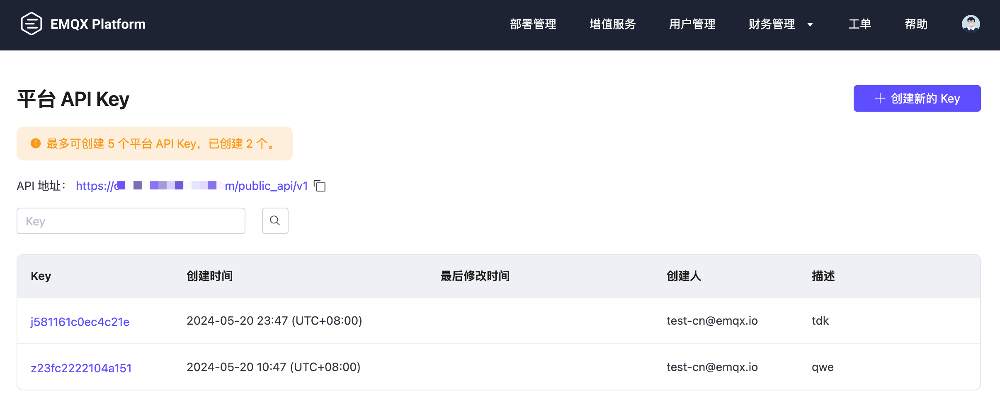

# 平台 API

本节介绍了 EMQX Platform 中用于 TLS 证书管理的平台 API，以及如何创建和管理用于安全访问平台 API 的 API key。

::: tip 注意
平台 API 仅适用于专有版和旗舰版部署。
:::

## API 功能

目前 EMQX Platform 仅支持 TLS 证书管理和部署管理 API，我们计划将在未来支持更多平台层面的 API。

| API                                  | 适用部署                                                     | 描述                             |
| ------------------------------------ | ------------------------------------------------------------ | -------------------------------- |
| [TLS 证书管理](./tls_certificate.md) | 平台账号下专有版 v5 部署和旗舰版部署；  v4（4.4.x）部署 | 管理部署 TLS 证书的更新、删除。  |
| [部署管理](./deployment_manage.md)   | 平台账号下专有版 v5 部署和旗舰版部署；  v4（4.4.x）部署 | 查询部署状态、启动部署和停止部署 |

## 创建和管理平台 API Key

平台 API Key 授予对 EMQX Platform 平台层面的访问管理。您可以使用 EMQX Platform 主账号或管理员账号创建和管理平台 API Key，其他[角色](../feature/role.md)的账号无法创建和管理平台 API Key。

1. 用您的账号登录 EMQX Platform。

2. 点击右上角用户图标，然后点击**平台 API Key**，进入平台 API 管理页面。

   

3. 点击**创建新的 Key**，填写 API Key 描述，点击**创建平台 API Key**。

4. 选择**功能范围**，目前仅支持 `TLS 证书管理`。选择**项目范围**，API 只能用于被选择的项目。点击**下一步**。

5. 将 API Key 和密钥存储在安全的地方，点击**确认并返回**。

现在您已经创建了一个平台 API key。您可以点击 key 修改 API 信息和作用域。您还可以点击页面上的删除图标将该 API key 删除。

