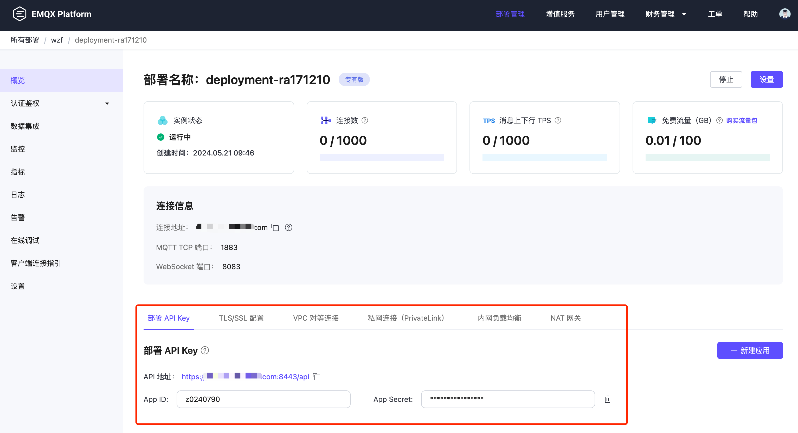

# API 功能和管理

EMQX Platform API Key 用于对 EMQX Platform 和 EMQX 部署的控制和管理，遵循 RESTful 定义。 每一个 API Key 由一个 API Key 和 API Secret 组成。

EMQX Platform 的 API Key 分为 **平台 API Key** 和 **部署 API Key**，分别针对平台层面的功能和部署层面的功能设计，下么将为您详细介绍这 2 种 API Key。

## 平台 API Key
平台 API Key 授予对 EMQX Platform 平台层面的访问管理。目前支持 1 种类型平台 API Key：TLS 证书管理，我们计划将在未来支持更多平台层面的 API Key。

### API 功能
| API         | 适用部署    | 描述                            |
| ----------- | ---------------|-------------------------------------------- |
|  [TLS 证书管理](./tls_certificate.md)  |平台账号下 v5 部署和 v4（4.4.x）部署 | 管理部署 TLS 证书的更新、删除。 |

### 平台 API 管理
如需创建和管理 平台 API Key，请登录 EMQX Platform **[主账号或管理员账号](../feature/role.md)**，其他角色的账号无法创建和管理平台 API Key。登录后请前往**右上角用户图标** - **平台 API Key**，进入平台 API 管理页面。

## 部署 API Key
部署 API Key 授予对指定部署层面的访问管理，例如用于客户端监控、消息发布，认真授权等。如果要创建部署 API Key，请先创建部署，然后在部署概览页面中添加 API Key。

### API 功能
| API         | 适用部署    | 描述                            |
| ----------- | ---------------|-------------------------------------------- |
|  [Serverless 部署 API](./serverless.md)  | Serverless 部署 | 访问管理 Serverless 部署 API。 |
|  [专有版 部署 API](https://docs.emqx.com/zh/cloud/latest/api/dedicated)  | v5 专有版部署 | 访问管理专有版(v5) 部署 API。如果需要访问和管理专有版(v4) 部署 API，请查看 [v4 API](https://docs.emqx.com/zh/cloud/v4/api/dedicated.html)。 |

### 部署 API 管理
如需创建和管理 部署 API Key，请登录 EMQX Platform 后[创建部署](../create/overview.md)。部署创建完成之后，前往部署详情页面，可在**部署 API Key** 中创建和管理。

## API 使用说明
以下 API 使用说明同时适用于平台和部署 2 种 API。

### 调用 API

您可以分别在[平台 API 管理页面](./introduction.md#平台-api-管理)和[部署详情页面](./introduction.md#部署-api-管理)下获取到 API 访问地址。请通过 HTTPS 访问 API，确保所有通过网络发送的数据都使用 TLS 加密。

### 认证鉴权
HTTP API 使用 [Basic 认证](https://zh.m.wikipedia.org/zh-hans/HTTP%E5%9F%BA%E6%9C%AC%E8%AE%A4%E8%AF%81) 方式，id 和 password 须分别填写 Key 和 Secret（平台 API），以及 APP ID 和 APP Secret（部署 API）。 所有的 Secret 只在创建时显示一次，请妥善保管到安全的地方。

### HTTP 状态码 (status codes)

接口在调用成功时返回 200，响应内容则以 JSON 格式返回。

可能的状态码如下：

| 状态码 | 描述                                                     |
| :----- | :------------------------------------------------------- |
| 200    | 成功，返回的 JSON 数据将提供更多信息                     |
| 400    | 请求无效，例如请求体或参数错误                     |
| 401    | 未通过服务端认证，使用无效的身份验证凭据可能会发生 |
| 404    | 找不到请求的路径或者请求的对象不存在                     |
| 422    | 字段错误                   |
| 500    | 服务端处理请求时发生内部错误                             |

