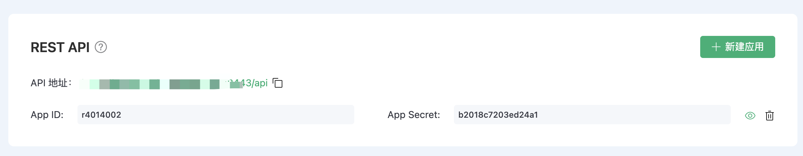

# REST API

EMQ X Cloud  API 遵循 REST 体系结构，您可以通过编程方式访问 EMQ X 的功能。

## API 概览

|  API                          |  描述  |
|  ---                          |  ---  |
|  [认证管理](auth.md)         |  管理认证信息的创建，删除和更新 |
|  [访问控制管理](acl.md)       |  管理访问控制的创建，删除和更新 |
|  [客户端管理](clients.md)     |  查看在线客户端信息，剔除客户端 |
|  [订阅信息](subscriptions.md) |  查看订阅信息  |
|  [主题订阅](subscribe.md)     |  订阅，取消订阅，批量订阅，批量取消订阅 |
|  [消息发布](publish.md)       |  消息发布，批量消息发布 |
|  [指标](metrics.md)          |  查看指标  |

## 如何调用 API

### 构造请求

请求地址由以下几个部分组成

{API}/{resource-path}?{query-string}

您可以在部署详情页面下的 API 访问中，获取到 API 访问地址

### 认证鉴权

HTTP API 使用 [Basic 认证](https://en.wikipedia.org/wiki/Basic_access_authentication) 方式，id 和 password 须分别填写 AppID 和 AppSecret。 您可以在部署详情页面下的 API 访问中，通过创建应用访问来添加和删除 AppID/AppSecret。

## 响应码

### HTTP 状态码 (status codes)

接口在调用成功时总是返回 200 OK，响应内容则以 JSON 格式返回。

可能的状态码如下：

| Status Code | Description                                              |
| :---------- | :------------------------------------------------------- |
| 200         | 成功，返回的 JSON 数据将提供更多信息                     |
| 400         | 客户端请求无效，例如请求体或参数错误                     |
| 401         | 客户端未通过服务端认证，使用无效的身份验证凭据可能会发生 |
| 404         | 找不到请求的路径或者请求的对象不存在                     |
| 500         | 服务端处理请求时发生内部错误                             |

### 返回码 (result codes)

接口的响应消息体为 JSON 格式，其中总是包含返回码 `code`。

可能的返回码如下：

| Return Code | Description                |
| :---------- | :------------------------- |
| 0           | 成功                       |
| 101         | RPC 错误                   |
| 102         | 未知错误                   |
| 103         | 用户名或密码错误           |
| 104         | 空用户名或密码             |
| 105         | 用户不存在                 |
| 106         | 管理员账户不可删除         |
| 107         | 关键请求参数缺失           |
| 108         | 请求参数错误               |
| 109         | 请求参数不是合法 JSON 格式 |
| 110         | 插件已开启                 |
| 111         | 插件已关闭                 |
| 112         | 客户端不在线               |
| 113         | 用户已存在                 |
| 114         | 旧密码错误                 |
| 115         | 不合法的主题               |