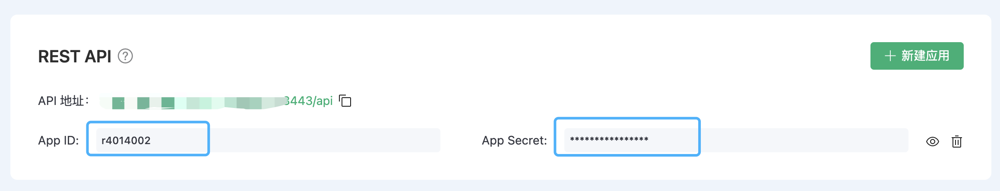

# API

EMQX Cloud API 遵循 RESTful 定义，为您提供编程访问 EMQX Cloud 中管理部署的能力。通过 API，您可以对认证、客户端、主题等进行管理，并可以获取到更多的指标信息。

API 具有以下特征：

- JSON 格式：所有响应内容均以 JSON 格式呈现。
- 仅支持 HTTPS：您只能通过 HTTPS 访问 API，确保所有通过网络发送的数据都使用 TLS 加密。
- 基于密钥的访问和摘要认证。在访问 EMQX Cloud API 之前，您必须生成 API 密钥。所有请求都通过 HTTP 摘要认证进行身份验证，并确保 API 密钥永远不会通过网络发送。

## 如何调用 API

您可以在部署详情页面下的 API 访问中，获取到 API 访问地址。

### 认证鉴权

HTTP API 使用 [Basic 认证](https://zh.m.wikipedia.org/zh-hans/HTTP%E5%9F%BA%E6%9C%AC%E8%AE%A4%E8%AF%81) 方式，id 和 password 须分别填写 AppID 和 AppSecret。 您可以在部署详情页面下的 API 访问中，通过创建应用访问来添加和删除 AppID/AppSecret。

### 构造请求

请求地址由以下几个部分组成：

{API}/{resource-path}?{query-string}

## 响应码

### HTTP 状态码 (status codes)

接口在调用成功时总是返回 200 OK，响应内容则以 JSON 格式返回。

可能的状态码如下：

| 状态码 | 描述                                                     |
| :----- | :------------------------------------------------------- |
| 200    | 成功，返回的 JSON 数据将提供更多信息                     |
| 400    | 客户端请求无效，例如请求体或参数错误                     |
| 401    | 客户端未通过服务端认证，使用无效的身份验证凭据可能会发生 |
| 404    | 找不到请求的路径或者请求的对象不存在                     |
| 500    | 服务端处理请求时发生内部错误                             |

### 返回码 (result codes)

接口的响应消息体为 JSON 格式，其中总是包含返回码 `code`。

可能的返回码如下：

| 返回码 | 描述                       |
| :----- | :------------------------- |
| 0      | 成功                       |
| 101    | RPC 错误                   |
| 102    | 未知错误                   |
| 103    | 用户名或密码错误           |
| 104    | 空用户名或密码             |
| 105    | 用户不存在                 |
| 106    | 管理员账户不可删除         |
| 107    | 关键请求参数缺失           |
| 108    | 请求参数错误               |
| 109    | 请求参数不是合法 JSON 格式 |
| 110    | 插件已开启                 |
| 111    | 插件已关闭                 |
| 112    | 客户端不在线               |
| 113    | 用户已存在                 |
| 114    | 旧密码错误                 |
| 115    | 不合法的主题               |

## API 版本说明

基于 EMQX Cloud 使用的 EMQX 内核版本的不同，API 也分为基于 EMQX 4.x 和 EMQX 5.x 版本。请选择您开通的部署类型对应的 API 版本。

- [Serverless API](./serverless.md)
- [专有版 / BdeYOC API](./dedicated.md)

