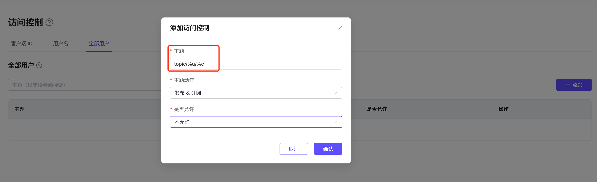

# 配置和使用 EMQX Platform v4 部署中的访问控制（ACL）

访问控制（ACL）用于控制客户端在 EMQX Platform 中执行发布（PUBLISH）和订阅（SUBSCRIBE）操作的权限。

本页详细介绍了客户端 ID、用户名、配额限制，如何开启白名单，使用占位符，以及借助外部访问控制实现更高级的权限控制。

## 添加访问控制信息

:::tip 提示

- 内置访问控制的**最大条目数**为部署连接数的两倍，上限是 10w。若超过此限额，请使用外部 ACL。
- 字段可以包含字母、数字以及部分特殊字符（_、-、/、+、#、$、%、@、& 和 .），最长 128 个字符。
:::

访问控制可以在以下三个层级进行权限控制：

1. **客户端 ID**：通过 ClientId 字段限制访问权限。
2. **用户名**：通过 Username 字段限制访问权限。
3. **全部用户**：对所有用户应用访问控制规则。

在**添加访问控制**对话框中依次填入客户端 ID 或用户名、主题，选择是否允许，再选择动作（sub/pub/pubsub），最后点击**添加**按钮完成操作。

### 批量导入访问控制信息

您可以通过以下两种方式批量倒入访问控制信息：

1. 可以使用提供的 CSV 模板批量导入访问控制信息（全部用户不支持）。导入字段说明如下：

- `clientid`：客户端 ID
- `username`：用户名
- `topic`：访问控制的主题
- `action`：动作（sub/pub/pubsub）
- `access`：是否允许（allow/deny）

2. 通过 API 批量导入 ACL 规则，可参考 [API](../api/acl.md) 小节。

## 如何使用占位符

在**主题**字段中，您可以使用以下占位符，EMQX Platform 在请求时将自动替换为客户端信息：

- `%u`：用户名
- `%c`：客户端 ID

如果您想要限制所有用户只允许订阅或发布特定主题，可以在全部用户处添加类似这样的 ACL：

- 用户名 `%u`，主题 `xx/%u/report`
- 客户端 ID `%c`，主题 `xx/%c/report`

## 如何开启白名单

:::tip 提示

- 默认情况下，访问控制采用**黑名单模式**（即默认允许所有订阅和发布）。
- 访问控制的**匹配顺序**为：全部用户 ACL -> 用户名/客户端 ACL。
- ClientId/Username + Topic 组合是唯一的，即同一 ClientId/Username + Topic 的多条记录中，仅最新一条记录有效。
:::

如需在 EMQX Platform 中开启白名单（即默认拒绝所有订阅和发布），您有以下两种选择：

### 1. 未使用外部访问控制

如果您未使用外部访问控制，请在部署左侧菜单中选择**认证鉴权** -> **访问控制**。在**全部用户**页签中，添加一条授权信息，在**主题**字段中输入 `#`，选择**主题动作**为 `发布&订阅`，然后设置**权限**为`不允许`，即可开启白名单模式。

### 2. 使用外部访问控制

如果您使用了外部访问控制，请提交[工单](../feature/tickets.md)与我们联系，我们的运维团队将为您切换到白名单模式。

## 如何借助外部 ACL 实现更高级的权限控制

:::tip 提示

- Serverless 版本不支持外部访问控制，其他版本均支持。
- 虽然同时最多支持两种外部扩展，但为了性能考虑，不建议使用多种外部访问控制。
:::

通过启用[外部访问控制](../deployments/acl_dedicated.md)，您可以使用自定义服务进行鉴权。目前支持的外部数据源包括 Redis、MySQL、PostgreSQL，以及通过 HTTP 服务进行鉴权。

当内置访问控制和外部访问控制同时启用时，EMQX Platform 会按顺序进行**链式鉴权**：

- 如果某一鉴权方式验证成功，将终止后续鉴权链，并允许客户端订阅发布。
- 如果某一鉴权方式验证失败，将终止后续鉴权链，并拒绝客户端订阅发布。

当启用了多种外部访问控制方式时，系统将按**模块的启用顺序**进行查询。例如，若先启用了 MySQL 访问控制，后启用了 PostgreSQL，查询顺序如下：

- 若 MySQL 返回了验证结果，系统将直接依据该结果进行判断，不再查询 PostgreSQL。
- 若 MySQL 未返回结果，系统将继续查询 PostgreSQL，并以 PostgreSQL 返回的结果为准。