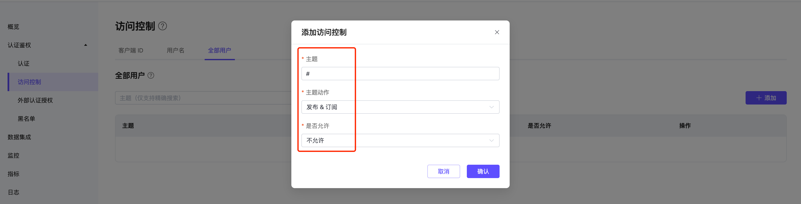

# 配置和使用 EMQX Platform v5 部署中的授权

在 EMQX Platform v5 中，客户端授权用于控制 MQTT 客户端的发布和订阅权限。本文将详细介绍如何配置客户端 ID、用户名、配额限制，以及如何使用白名单、占位符和扩展授权实现更高级的权限控制。

## 添加授权信息

:::tip 提示

- 内置授权的**最大条目数**为部署连接数的两倍，上限是 10w。若超过此限额，请使用外部 ACL。
- 授权字段支持字母、数字以及部分特殊字符（_、-、/、+、#、$、%、@、& 和 .），最大长度为 128 个字符。
:::

授权可以在以下三个层级进行权限控制：

1. **客户端 ID**：对特定客户端 ID 进行授权验证。
2. **用户名**：对特定用户名进行授权验证。
3. **全部用户**：对所有用户基于主题进行授权验证。

在添加授权信息时，依次填写客户端 ID 或用户名、主题，选择是否允许，再选择动作（sub/pub/pubsub），最后点击“添加”按钮完成操作。

### 批量导入授权信息

您可以使用提供的 CSV 模板批量导入授权信息（全部用户不支持）。导入字段说明如下：

- `clientid`：客户端 ID
- `username`：用户名
- `topic`：授权的主题
- `action`：动作（sub/pub/pubsub）
- `access`：是否允许（allow/deny）

## 使用占位符

> 占位符只能用于替换主题的整个字段，例如 `a/b/${username}/c/d`，而不能替换字段的一部分，例如 `a/b${username}c/d`。

在**主题**中使用占位符时，您可以动态替换当前客户端信息。支持的占位符包括：

- `${clientid}`
- `${username}`

如果您想要限制所有用户只允许订阅或者发布特定主题，可以类似这样：

- 用户名 `${username}`，主题 `xx/${username}/report`
- 客户端ID `${clientid}`，主题 `xx/${clientid}/report`

## 开启白名单

:::tip 提示

- 默认情况下，授权采用**黑名单模式**（即默认允许所有订阅和发布操作）。
- 授权的**匹配顺序**为：全部用户 ACL -> 用户名/客户端 ACL。
- ClientId/Username 与 Topic 的组合是唯一的，对于同一 ClientId/Username + Topic 的多条记录，仅最新一条记录有效。
- 如果您添加了扩展授权数据源，请确保在扩展授权页面的**授权排序**中将“默认授权”排在最后，以启用白名单模式。
:::

如需在 EMQX Platform 中开启白名单（即默认拒绝所有订阅和发布操作），请在部署左侧菜单中选择“认证鉴权” -> “访问控制”。在**全部用户**页签中，添加一条授权信息，在**主题**字段中输入 `#`，选择**主题动作**为 `pubsub`，然后设置**权限**为“拒绝”，即可开启白名单模式。

## 使用外部授权实现高级权限控制

:::tip 提示

- Serverless 版本不支持外部认证授权，其他版本均支持。
- 虽然最多支持两种扩展授权，但为确保性能，不建议同时使用多种扩展授权。
:::

通过启用[扩展授权](../deployments/custom_authz)，您可以使用自定义服务进行鉴权。当前支持的外部数据源包括 Redis、MySQL、PostgreSQL，以及通过 HTTP 服务进行鉴权。

### 授权排序

添加扩展授权数据源后，您可以对授权数据源进行排序，即支持**自定义授权链**：可通过拖动授权数据源图标，左右排列授权顺序。

在扩展授权页面点击**授权排序**进入排序页面。部署将按**从左到右**的顺序进行授权检查，默认情况下最新添加的授权排在最前面，默认授权排在最后。

- 操作与权限匹配时，依据权限决定允许或拒绝客户端的操作。
- 操作与权限不匹配时，将由下一个授权检查器继续检查。

