# 使用 EMQX 事件主题和 TimescaleDB 集成追踪消息延迟

EMQX Cloud 的消息收集和传输能力可以充分利用[事件主题](https://docs.emqx.com/zh/enterprise/latest/data-integration/rule-sql-events-and-fields.html#%E5%AE%A2%E6%88%B7%E7%AB%AF%E4%BA%8B%E4%BB%B6)功能，以实现整个传输过程中的全面端到端消息监控。这一能力使用户能够生成详细的日志，以跟踪消息从发布者的起点，经过 EMQX Cloud，到达订阅者的终点。全面的监控涵盖了各种场景，允许精确检测任何消息延迟。此外，用户可以灵活地通过 EMQX Cloud 的数据集成功能，轻松将关键监控数据传输到外部数据库或消息队列。

本指南演示了一个端到端消息追踪系统的设置，重点使用 Timescale 数据库作为示例，介绍了如何使用 EMQX Cloud 与 TimescaleDB 的数据集成，来观察整个传输过程中，从发布客户端到订阅客户端的 MQTT 消息延迟。

## 前置准备

在演示之前必须满足以下条件：

- **客户端时区**：EMQX 操作在 **UTC** 时区；确保客户端的时区设置为 UTC。如有必要，调整数据库表中时间字段的默认时区。
- **客户端时间同步**：确保所有客户端的系统时钟同步。
- **消息时间戳**：配置 MQTT 客户端，在每条消息中包含一个 `publish_at` 时间戳。
- **数据集成**：设置 EMQX 数据集成，以捕获 `$events/message_delivered` 和 `$events/message_acked` 事件，并将它们记录在 TimescaleDB 中。
- **策略**：为了保证接收到 `message_acked events`，使用**至少 QoS 1 级别**。

### 时间戳定义

以下是为本演示自定义的时间戳字段：

- 消息负载时间戳（`publish_at`）：客户端发布消息时的时间戳。
- EMQX 接收消息时间戳（`publish_received_at`）：EMQX 接收消息时的时间戳。
- EMQX 处理时间戳（`message_delivered`）：EMQX 处理消息并将其放入 TCP 包时的时间戳。
- 订阅客户端确认时间戳（`message_acked`）：订阅客户端接收消息并发送确认（ACK）时的时间戳。

## 设置 Timescale 实例

本节演示如何创建 Timescale 实例并创建表格用于存储消息追踪和数据监控。

1. 登录到 Timescale Cloud。在 **Create a service** 页面，从 **Region** 下拉列表中选择一个区域。点击页面底部的 **Create service**。

   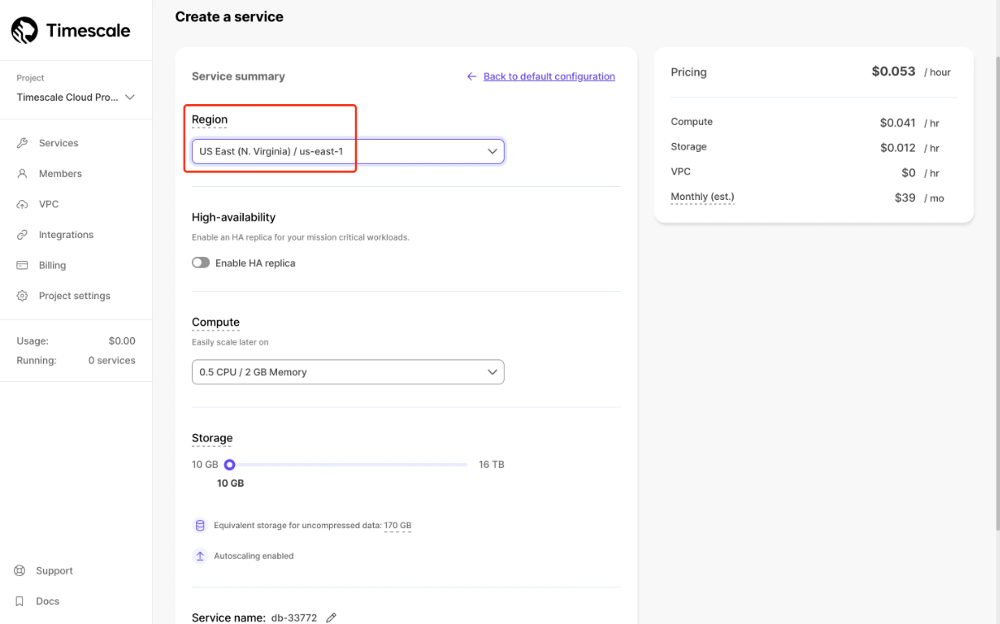

2. 创建服务后，按照页面上的说明连接到您的服务。妥善存储您的用户名和密码。

   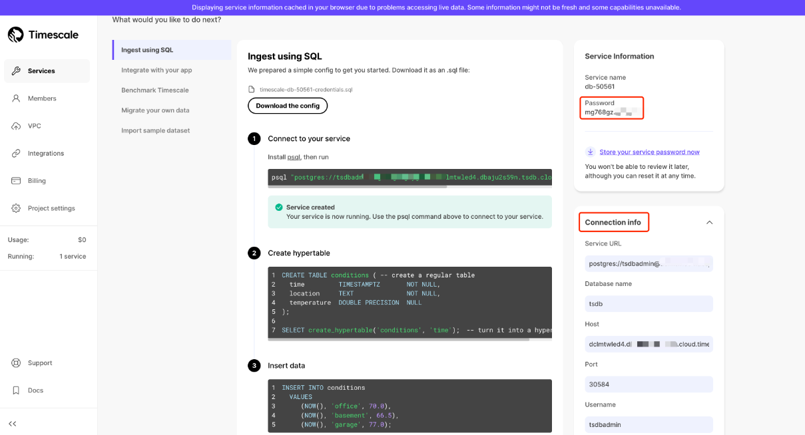

3. 使用以下 SQL 语句为存储 MQTT 消息追踪和监控数据创建一个新表 `mqtt_message_traces`。

   ```sql
   CREATE TABLE mqtt_message_traces
   (
       event_at          TIMESTAMPTZ       NOT NULL,
       event             character varying NOT NULL,
       msg_id            character varying NOT NULL,
       publish_at        bigint,
       emqx_received_at  bigint,
       emqx_delivered_at bigint,
       sub_ack_at        bigint,
       pub_clientid      character varying,
       sub_clientid      character varying,
       topic             character varying NOT NULL,
       qos               integer           NOT NULL,
       payload           text
   );
   ```

4. 通过指定 `event_at` 列作为时间维度，将 `mqtt_message_traces` 表转换为超级表。

   ```sql
   SELECT create_hypertable(
                  'mqtt_message_traces',
                  'event_at',
                  chunk_time_interval => interval '12 hour',
                  if_not_exists => TRUE
              );
   ```

5. 创建 3 个索引以优化查询性能：

   - `emqx_mqtt_message_traces_event_idx` 针对 `event` 列，用于更快速地查找事件类型。
   - `emqx_mqtt_message_traces_msg_id_event_at_idx` 针对 `msg_id` 和降序的 `event_at`，用于随时间查询特定消息的事件。
   - `emqx_mqtt_message_traces_pub_clientid_event_at_idx` 针对 `pub_clientid` 和降序的 `event_at`，用于随时间跟踪与特定发布者相关的事件。

   ```sql
   CREATE INDEX IF NOT EXISTS "emqx_mqtt_message_traces_event_idx" ON mqtt_message_traces ("event");
   
   CREATE INDEX IF NOT EXISTS "emqx_mqtt_message_traces_msg_id_event_at_idx" ON mqtt_message_traces ("msg_id", "event_at" DESC);
   
   CREATE INDEX IF NOT EXISTS "emqx_mqtt_message_traces_pub_clientid_event_at_idx" O
   ```

## 在 EMQX Cloud 中配置 TimescaleDB 数据集成

本节演示如何创建与 TimescaleDB 的数据集成，以将客户端的消息追踪转发到 TimescaleDB。

1. 登录到您的云控制台并导航至部署详情页。

2. 从左侧导航菜单点击 **数据集成**。在 **数据持久化** 下，选择 **TimescaleDB**。

3. 填写从创建 Timescale 云服务获得的 TimescaleDB 连接信息。将池大小设置为 `1`。然后点击 **测试** 来测试连接。

4. 在 **配置资源** 下，选择配置的 TimescaleDB 资源。点击 **新建规则** 并输入以下规则以匹配 SQL 语句。规则的 `SELECT` 部分包括以下字段：

   - `id`：MQTT 消息 ID
   - `clientid`：客户端 ID
   - `topic`：MQTT 主题
   - `qos`：消息 QoS 0、1、2 的枚举
   - `event`：EMQX 事件主题
   - `timestamp`：事件时间戳（毫秒）
   - `publish_received_at`：PUBLISH 消息到达 Broker 的时间（毫秒）
   - `up_timestamp`：发布客户端报告数据的时间（毫秒）
   - `payload`：MQTT payload

   ```sql
   SELECT
   timestamp div 1000 as event_at,
   event,
   id as msg_id,
   payload.publish_at as publish_at,
   publish_received_at as emqx_received_at,
   clientid as pub_clientid,
   topic,
   qos,
   payload
    
   FROM "#"
   ```

   当发布客户端向任何匹配 `#` 的主题发送消息时，规则将被触发。

5. 点击底部的 **下一步** 按钮进入动作视图。选择 TimescaleDB 资源并输入以下数据插入到 SQL 模板中。

   ```bash
   INSERT INTO mqtt_message_traces(event_at,event,msg_id,publish_at,emqx_received_at,emqx_delivered_at,sub_ack_at,pub_clientid,sub_clientid,topic,qos,payload) VALUES ( to_timestamp(${event_at}), ${event}, ${msg_id}, ${publish_at}, ${emqx_received_at}, NULL, NULL, ${pub_clientid}, NULL, ${topic}, ${qos}, ${payload} );
   ```

   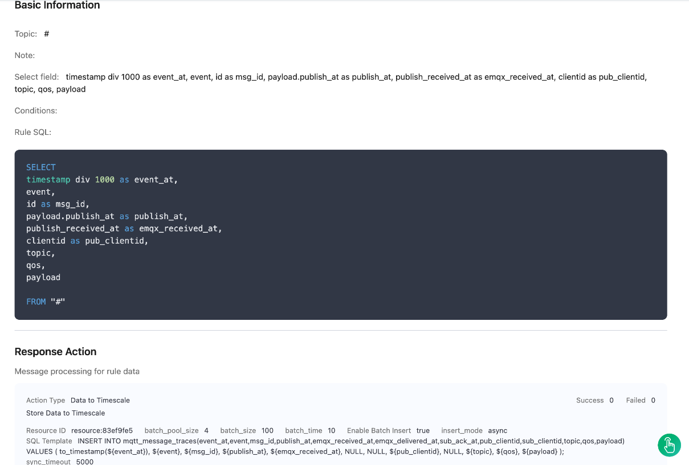

6. 点击 **创建规则** 完成创建。

7. 创建第二条规则。它必须在消息由 EMQX 传递给订阅该主题的客户端时触发。

   ```sql
   SELECT
   timestamp div 1000 as event_at,
   event,
   id as msg_id,
   payload.publish_at as publish_at,
   publish_received_at as emqx_received_at,
   timestamp as emqx_delivered_at,
   from_clientid as pub_clientid,
   clientid as sub_clientid,
   topic,
   qos,
   payload
    
   FROM
    "$events/message_delivered"
   ```

8. 点击底部的 **下一步** 按钮进入动作视图。选择 TimescaleDB 资源并输入以下数据插入到 SQL 模板中。

   ```bash
   INSERT INTO mqtt_message_traces(event_at,event,msg_id,publish_at,emqx_received_at,emqx_delivered_at,sub_ack_at,pub_clientid,sub_clientid,topic,qos,payload) VALUES ( to_timestamp(${event_at}), ${event}, ${msg_id}, ${publish_at}, ${emqx_received_at}, ${emqx_delivered_at}, NULL, ${pub_clientid}, ${sub_clientid}, ${topic}, ${qos}, ${payload} );
   ```

   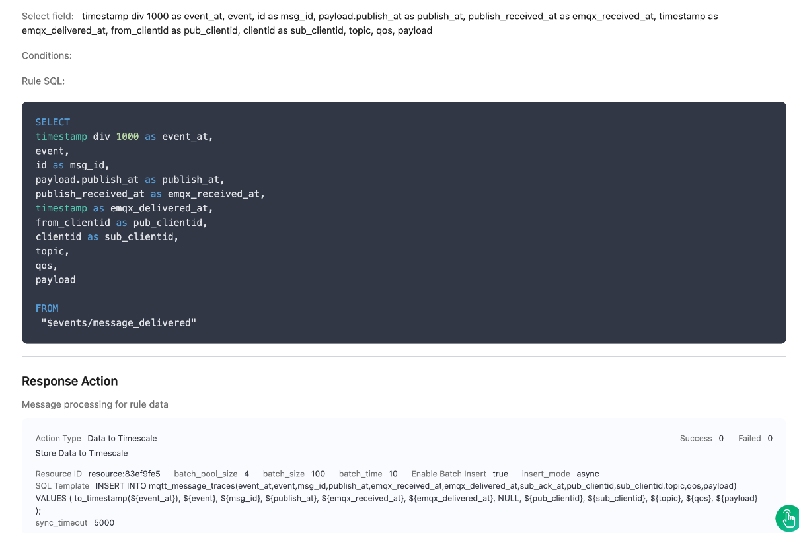

9. 点击 **创建规则** 按钮完成创建。

10. 创建第三条规则。当消息发送给客户端并且从客户端收到确认时，将触发此规则。仅当消息 QoS 为 1 和 2 时，规则才会被触发。

    ```sql
    SELECT
    timestamp div 1000 as event_at,
    event,
    id as msg_id,
    payload.publish_at as publish_at,
    publish_received_at as emqx_received_at,
    timestamp as sub_ack_at,
    from_clientid as pub_clientid,
    clientid as sub_clientid,
    topic,
    qos,
    payload
     
    FROM
     "$events/message_acked"
    ```

11. 点击底部的 **下一步** 按钮进入动作视图。选择 TimescaleDB 资源并输入以下数据插入到 SQL 模板中。

    ```bash
    INSERT INTO mqtt_message_traces(event_at,event,msg_id,publish_at,emqx_received_at,emqx_delivered_at,sub_ack_at,pub_clientid,sub_clientid,topic,qos,payload) VALUES ( to_timestamp(${event_at}), ${event}, ${msg_id}, ${publish_at}, ${emqx_received_at}, NULL, ${sub_ack_at}, ${pub_clientid}, ${sub_clientid}, ${topic}, ${qos}, ${payload} );
    ```

    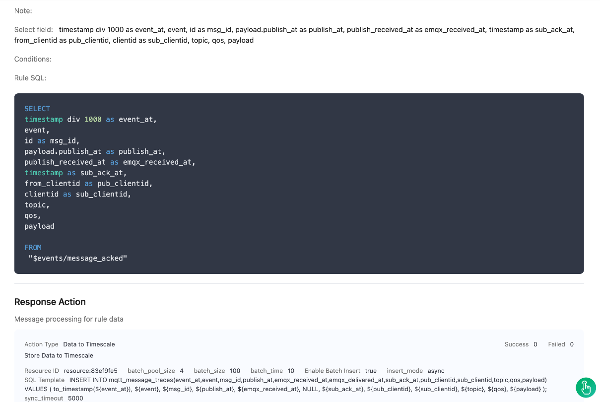

12. 点击 **创建规则** 按钮完成创建。

## 使用 Python SDK 模拟消息传递

1. 使用 Python SDK 作为发布者向 `emqx/test` 主题发送消息。消息 QoS 等级大于 0。

   ```python
   # python 3.8
   
   import random
   import time
   from datetime import datetime
   from paho.mqtt import client as mqtt_client
   
   broker = 'x.x.x.x'
   port = 1883
   topic = "emqx/test"
   # 随机生成带有 pub 前缀的客户端 ID
   client_id = f'python-mqtt-{random.randint(0, 1000)}'
   username = 'xxx'
   password = 'xxx'
   
   
   def connect_mqtt():
       def on_connect(client, userdata, flags, rc):
           if rc == 0:
               print("已连接到 MQTT 代理！")
           else:
               print("连接失败，返回码 %d\n", rc)
   
       client = mqtt_client.Client(client_id)
       # client.tls_set(ca_certs='./server-ca.crt')
       client.username_pw_set(username, password)
       client.on_connect = on_connect
       client.connect(broker, port)
       return client
   
   
   def publish(client):
       msg_count = 0
       while True:
           time.sleep(1)
           timestamp_ms = int(datetime.utcnow().timestamp() * 1000)
           msg = f'{{"publish_at": {timestamp_ms}, "msg": {msg_count}}}'
           result = client.publish(topic, msg, qos=1)
           # result: [0, 1]
           status = result[0]
           if status == 0:
               print(f"向主题`{topic}`发送`{msg}`")
           else:
               print(f"无法发送消息到主题 {topic}")
           msg_count += 1
   
   
   def run():
       client = connect_mqtt()
       client.loop_start()
       publish(client)
   
   
   if __name__ == '__main__':
       run()
   ```

   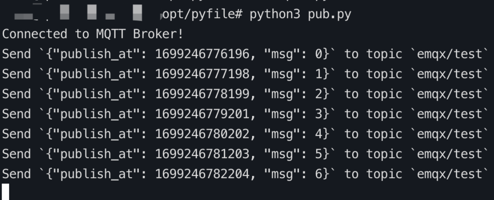

2. 使用 Python SDK 作为订阅者订阅主题 `emqx/test`。

   ```python
   # python3.8
   
   import random
   from paho.mqtt import client as mqtt_client
   
   broker = 'x.x.x.x'
   port = 1883
   topic = "emqx/test"
   # 随机生成带有 pub 前缀的客户端 ID
   client_id = f'python-mqtt-{random.randint(0, 100)}'
   username = 'xxx'
   password = 'xxx'
   
   
   def connect_mqtt() -> mqtt_client:
       def on_connect(client, userdata, flags, rc):
           if rc == 0:
               print("已连接到 MQTT 代理！")
           else:
               print("连接失败，返回码 %d\n", rc)
   
       client = mqtt_client.Client(client_id)
       # client.tls_set(ca_certs='./server-ca.crt')
       client.username_pw_set(username, password)
       client.on_connect = on_connect
       client.connect(broker, port)
       return client
   
   
   def subscribe(client: mqtt_client):
       def on_message(client, userdata, msg):
           print(f"从主题`{msg.topic}`收到`{msg.payload.decode()}`")
   
       client.subscribe(topic, qos=1)
       client.on_message = on_message
   
   
   def run():
       client = connect_mqtt()
       subscribe(client)
       client.loop_forever()
   
   
   if __name__ == '__main__':
       run()
   ```

   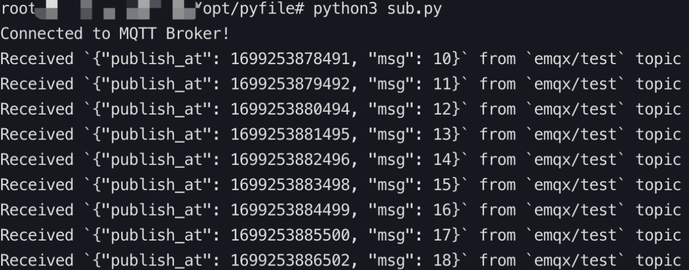

## 查看消息延迟

本节提供了一些 SQL 查询语句，可以帮助从 TimescaleDB 检索信息，例如 EMQX Cloud 平台上所有消息的延迟，包括从发布者到服务器，服务器内部以及从服务器到订阅者。

### 如何计算延迟

- 发布客户端到 EMQX 延迟：`publish_received_at` 时间戳减去 `publish_at` 时间戳。
- EMQX 处理延迟：`message_delivered` 时间戳减去 `publish_received_at` 时间戳。
- EMQX 到订阅客户端延迟：`message_acked` 时间戳减去 `message_delivered` 时间戳。
- 总传输延迟：`message_acked` 时间戳减去 `publish_at` 时间戳。

::: tip 提示

- 如果消息缺少 `publish_at` 时间戳，则无法计算客户端到 EMQX 的延迟。
- 没有 QoS 0，`message_acked` 事件不会触发，使得无法计算 EMQX 到订阅客户端的延迟。

:::

### 使用查询语句示例

1. 查询数据库以检索过去一小时内的平均消息延迟。

   ```sql
   SELECT
     AVG(emqx_received_at - publish_at) AS avg_delay
   FROM
     mqtt_message_traces
   WHERE
     event_at >= NOW() - INTERVAL '1 hour'
     AND publish_at IS NOT NULL
     AND emqx_received_at IS NOT NULL;
   ```

   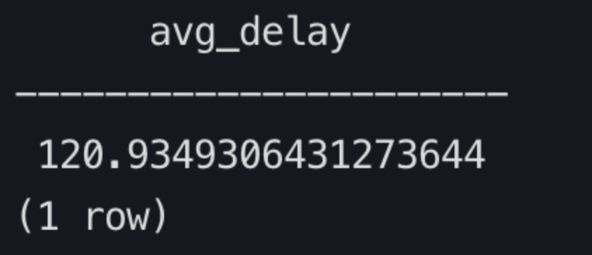

2. 查询数据库以检索过去一小时内发布客户端的平均延迟。

   ```sql
   SELECT
       AVG(emqx_received_at - publish_at) AS avg_publish_delay
   FROM
       mqtt_message_traces
   WHERE
       event_at >= NOW() - INTERVAL '1 hour'
       AND publish_at IS NOT NULL
       AND emqx_received_at IS NOT NULL;
   ```

   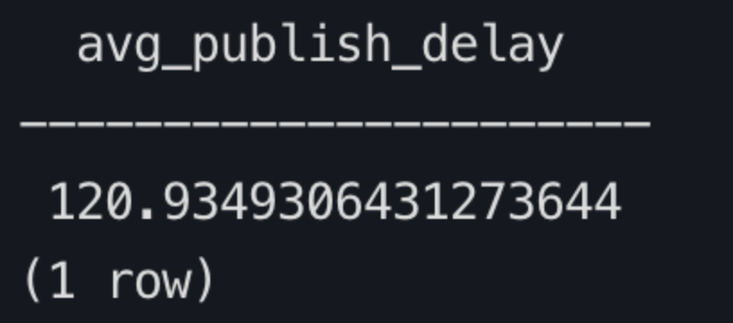

3. 查询数据库，检索过去一小时内订阅客户端的平均订阅延迟，并返回前 10 条记录。

   ```sql
   WITH message_events AS (
     SELECT
       msg_id,
       sub_clientid,  -- 在此处添加 sub_clientid
       MAX(CASE WHEN event = 'message.acked' THEN sub_ack_at END) AS event_ma,
       MAX(CASE WHEN event = 'message.delivered' THEN emqx_delivered_at END) AS event_md
     FROM
       mqtt_message_traces
     WHERE
       event IN ('message.acked', 'message.delivered')
       AND event_at >= NOW() - INTERVAL '1 hour'
     GROUP BY
       msg_id, sub_clientid  -- 在分组中包含 sub_clientid
   )
   SELECT
     msg_id,
     sub_clientid,  -- 在结果中包含 sub_clientid
     AVG(event_ma - event_md) AS avg_subscription_delay
   FROM
     message_events
   WHERE
     event_ma IS NOT NULL
     AND event_md IS NOT NULL
   GROUP BY
     msg_id, sub_clientid  -- 按 msg_id 和 sub_clientid 分组
   ORDER BY
     avg_subscription_delay DESC
   LIMIT 10;
   ```

   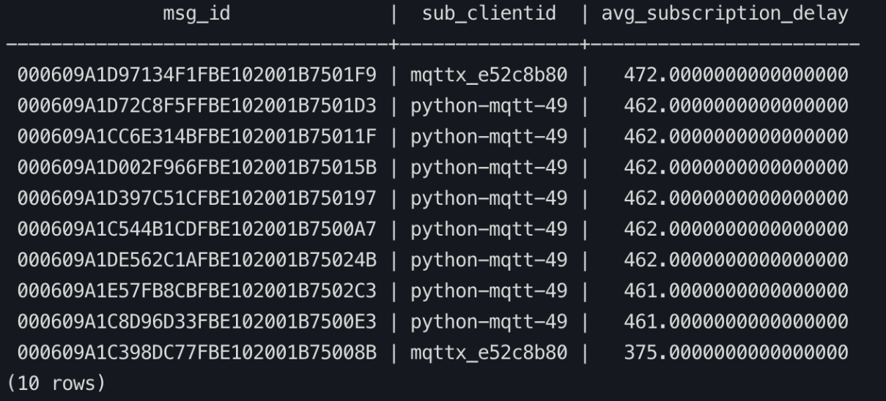

4. 查询数据库以检索过去一小时内每个消息 ID 在所有阶段的平均延迟。根据总传输延迟（如果没有确认延迟，则使用发布延迟）降序排序。返回前 10 条记录。

   ```sql
   WITH relevant_messages AS (
     SELECT * 
     FROM mqtt_message_traces 
     WHERE event_at >= NOW() - INTERVAL '1 hour'
   )
   SELECT
     t1.msg_id,
     ROUND(AVG(t1.emqx_received_at - t1.publish_at)) AS client_to_emqx_delay,
     ROUND(AVG(t2.emqx_delivered_at - t1.emqx_received_at)) AS emqx_processing_delay,
     ROUND(AVG(t3.sub_ack_at - t2.emqx_delivered_at)) AS emqx_to_subscriber_delay,
     ROUND(AVG(t3.sub_ack_at - t1.publish_at)) AS total_message_delay
   FROM
     relevant_messages t1
     JOIN relevant_messages t2 ON t1.msg_id = t2.msg_id AND t2.event = 'message.delivered'
     JOIN relevant_messages t3 ON t1.msg_id = t3.msg_id AND t3.event = 'message.acked'
   GROUP BY t1.msg_id
   ORDER BY total_message_delay DESC
   LIMIT 10;
   ```

   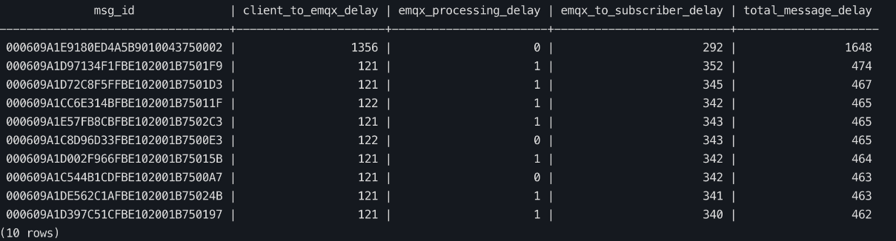

5. 查询数据库以检索过去一小时内每个发布客户端 ID 的平均消息延迟。根据发布延迟降序排序并返回前 10 条记录。

   ```sql
   SELECT
       pub_clientid,
       AVG(emqx_received_at - publish_at) AS avg_publish_delay
   FROM
       mqtt_message_traces
   WHERE
       event_at >= NOW() - INTERVAL '1 hour'
       AND publish_at IS NOT NULL
       AND emqx_received_at IS NOT NULL
   GROUP BY
       pub_clientid
   ORDER BY
       avg_publish_delay DESC
   LIMIT 10;
   ```

   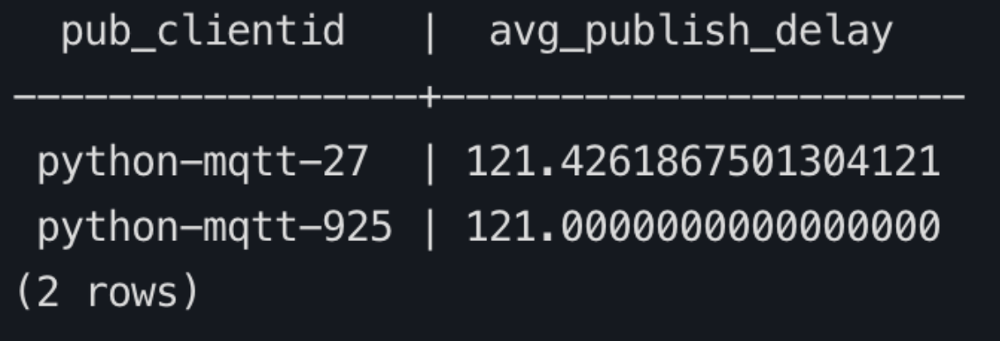

6. 查询数据库以检索过去一小时内每个订阅客户端 ID 的平均消息延迟。根据延迟降序返回前 10 条记录。

   ```sql
   WITH message_events AS (
     SELECT
       sub_clientid,
       MAX(CASE WHEN event = 'message.acked' THEN sub_ack_at END) AS event_ma,
       MAX(CASE WHEN event = 'message.delivered' THEN emqx_delivered_at END) AS event_md
     FROM
       mqtt_message_traces
     WHERE
       event IN ('message.acked', 'message.delivered')
       AND event_at >= NOW() - INTERVAL '1 hour'
       AND sub_clientid IS NOT NULL
     GROUP BY
       sub_clientid
   )
   SELECT
     sub_clientid,
     AVG(event_ma - event_md) AS avg_subscription_delay
   FROM
     message_events
   WHERE
     event_ma IS NOT NULL
     AND event_md IS NOT NULL
   GROUP BY
     sub_clientid
   ORDER BY
     avg_subscription_delay DESC
   LIMIT 10;
   ```

   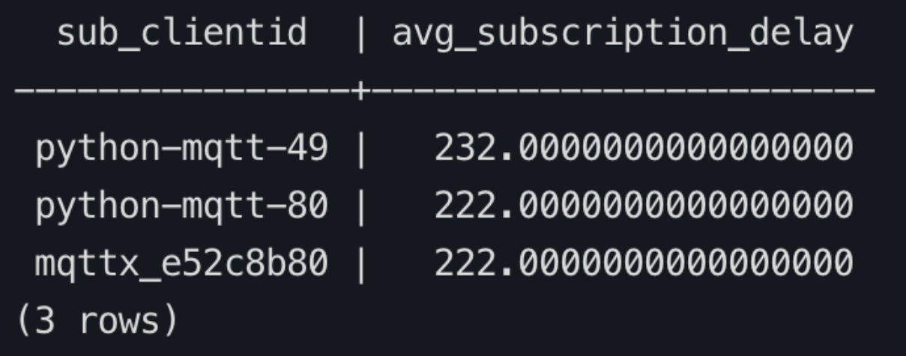
