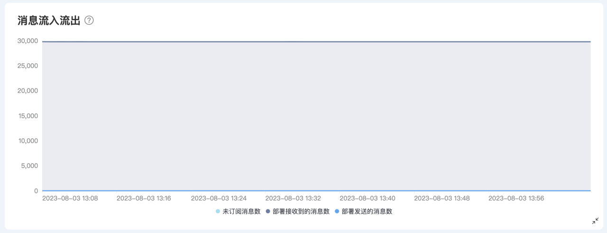
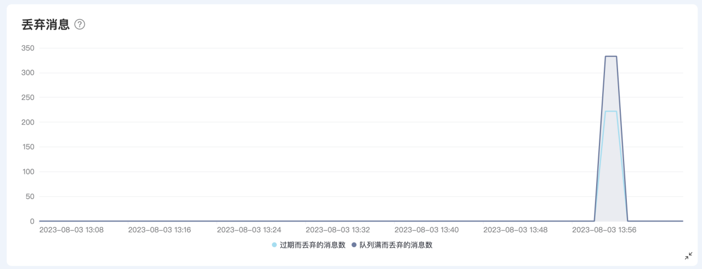
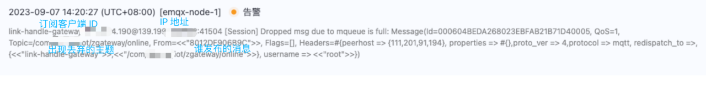

# 如何排查消息丢失

消息丢失通常涉及两种情况，需要仔细考虑和跟踪。

## EMQX 中的消息未被订阅而被丢弃

这种情况发生在消息已经传入 EMQX，但没有任何订阅者，因此被丢弃。您可以在部署仪表板的“消息流入流出”部分下的“未订阅消息数”中查看具体的丢弃统计。

   

为了跟踪这些被丢弃的消息，您可以利用[事件主题 - 设备消息通知](https://docs.emqx.com/zh/cloud/latest/rule_engine/rule_engine_events.html#设备消息通知)`$events/message_dropped`。每当消息被丢弃时，都会触发一个事件，将消息的相关信息发送到该事件主题。这样，我们可以将消息丢弃事件传送给第三方系统，以进行记录和后续问题排查。

## EMQX 在消息传递过程中丢弃消息

这种情况是指消息已经被订阅者接收，但由于多种原因未能成功传递给订阅者。这些原因包括客户端设置 Clean Session 为 False 但离线时间过长，或者客户端的消息处理能力不足。以下是可能导致消息传递失败的情况：

**a. 客户端设置 Clean Session 为 False，但离线时间过长导致消息丢失**

在这种情况下，即使客户端处于离线状态，EMQX 仍会尝试向其发送消息。这些未成功传递的消息会堆积在客户端的消息队列中，等待客户端重新连接。如果客户端离线时间过长（默认为 MQTT v3 协议为 2 小时，MQTT v5 协议根据客户端的 session_expiry_interval 值设定），或者客户端无法及时处理这些消息，它们可能会被丢弃。

**解决方法**包括将 Clean Session 设置为 True，以避免客户端重新上线时积累大量设备的上下线消息。如果要将 Clean Session 设置为 False，请设置自动重连机制，以避免客户端长时间离线。此外，需要避免使用随机客户端 ID，因为如果使用随机客户端 ID 并设置 Clean Session 为 False，一旦客户端重新连接，会话将会更改，可能导致消息丢失。

**b. 客户端的消息处理能力不足**

具体而言，当某个客户端订阅多个主题的消息时，这些主题的消息会共享一个固定长度的消息队列（默认为 1,000）。如果某一主题的消息积压过多，超出了队列长度限制，这将导致消息丢失。因此，客户端的消息处理能力不足可能会导致某些消息未能成功传递给订阅者。

**解决方法**包括：

- 优化客户端代码以提高订阅性能。
- 尝试使用共享订阅，关于共享订阅的更多信息可参考：[共享订阅文档](https://docs.emqx.com/zh/cloud/latest/connect_to_deployments/shared_subscription.html#%E5%85%B1%E4%BA%AB%E8%AE%A2%E9%98%85%E5%89%8D%E7%BC%80%E6%A0%BC%E5%BC%8F)。

您可以在部署控制台的“指标”部分的“丢弃消息”中查看相关统计信息。

   

此外，在部署日志中，选择“错误类型”为“消息”，您可以查找类似的记录，例如：[Session] Dropped msg due to mqueue is full: Message，以获取更详细的信息。

   

为了跟踪这类消息丢失事件，我们可以使用[事件主题 - 设备消息通知](https://docs.emqx.com/zh/cloud/latest/rule_engine/rule_engine_events.html#设备消息通知)`$events/delivery_dropped`。每当消息传递失败时，系统会触发一个事件，并将消息的相关信息发送到该事件主题。此外，我们还可以将消息传递失败的事件传递给第三方系统，以进行记录和后续问题排查。

综上，您可以使用以下 SQL 规则来监听消息丢失相关事件：

```sql
SELECT
*

FROM "$events/message_dropped", "$events/delivery_dropped"

WHERE topic =~ 'xxx'
```

这样的 SQL 规则将帮助您筛选与特定主题（例如 'xxx'）相关的消息丢弃事件，以便进一步分析和处理。如果消息量较大，可以考虑添加其他过滤条件，如客户端 ID 等。有关可用于过滤的字段，请参考[事件订阅](https://docs.emqx.com/zh/cloud/latest/rule_engine/rule_engine_events.html#%E8%AE%BE%E5%A4%87%E6%B6%88%E6%81%AF%E9%80%9A%E7%9F%A5)文档。
