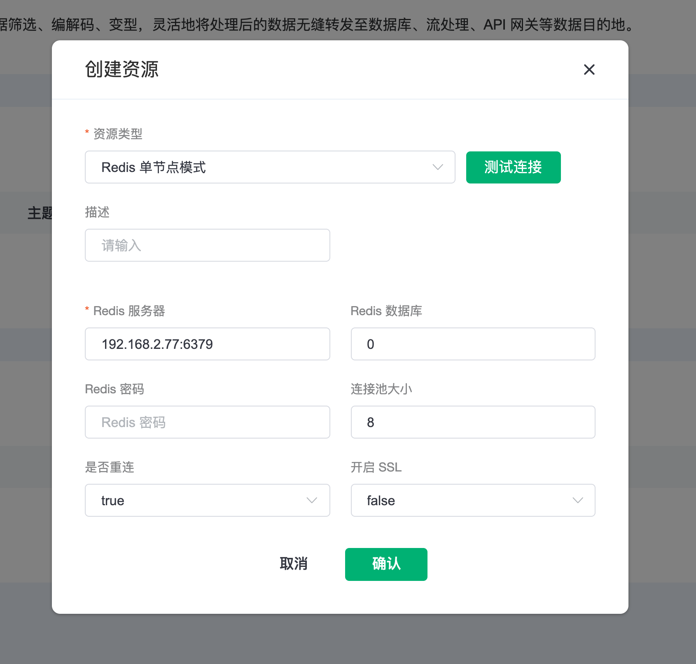
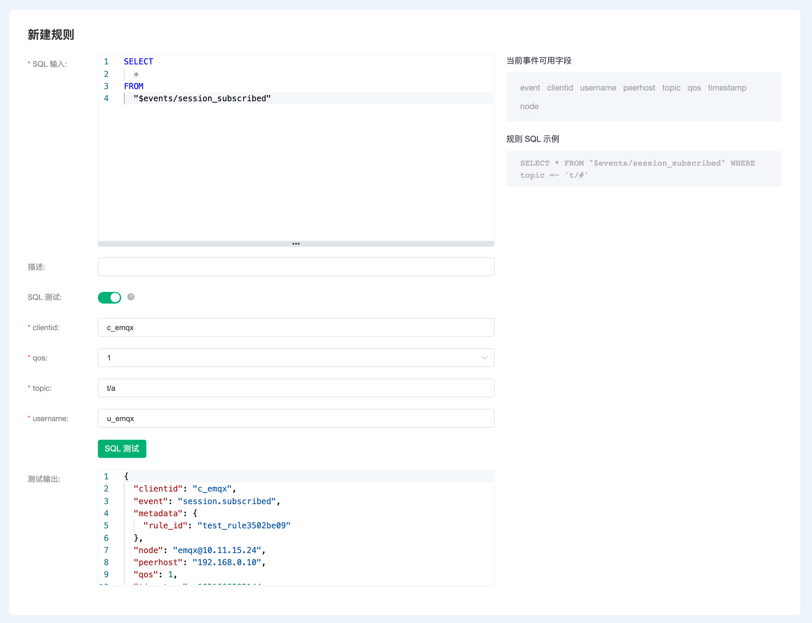
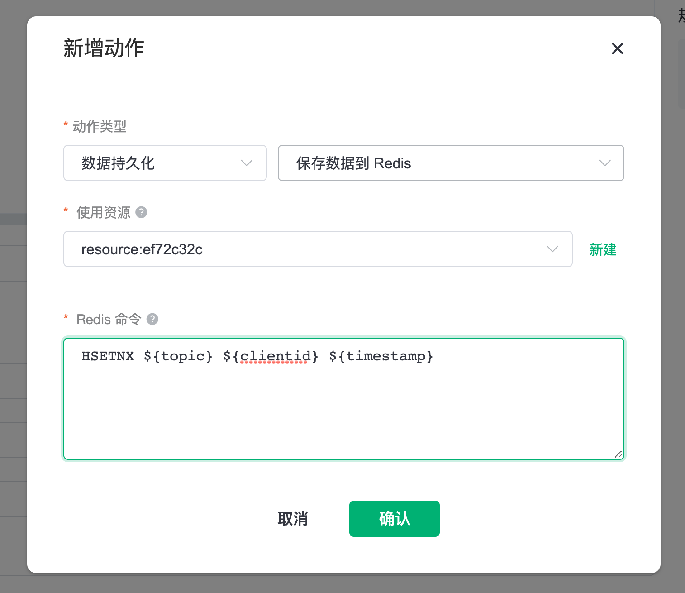
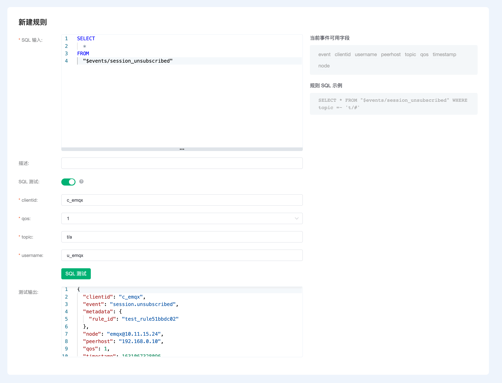
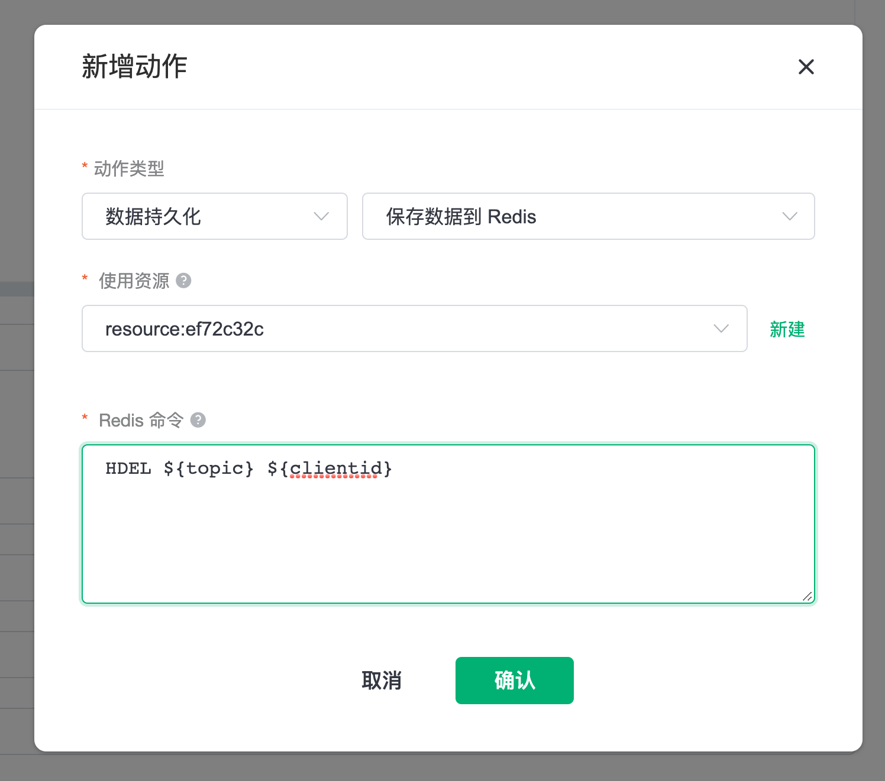
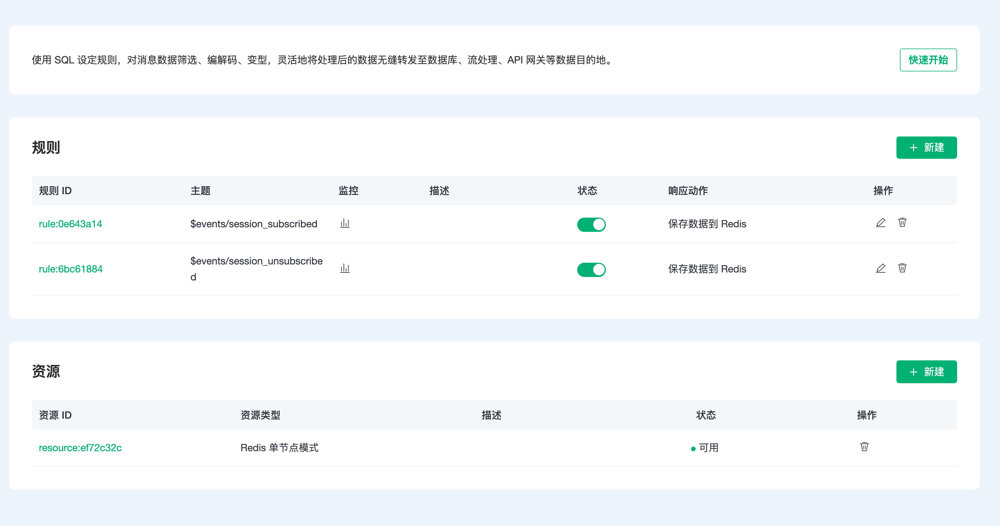
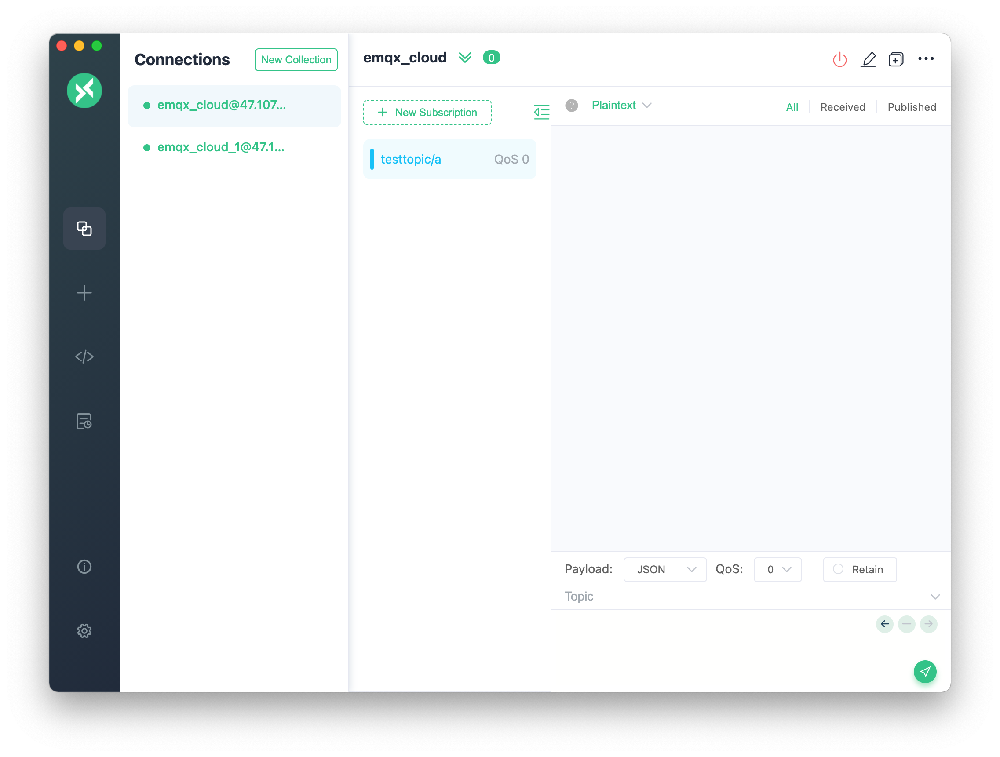
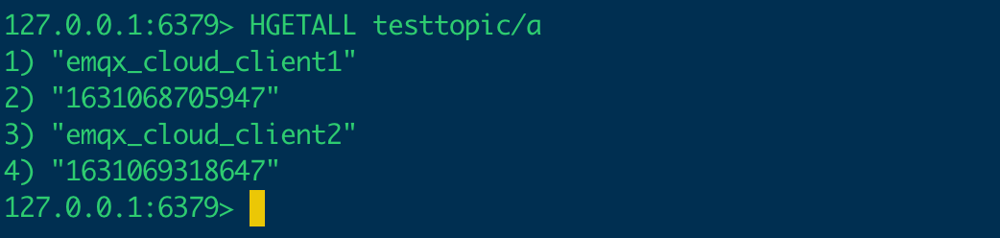
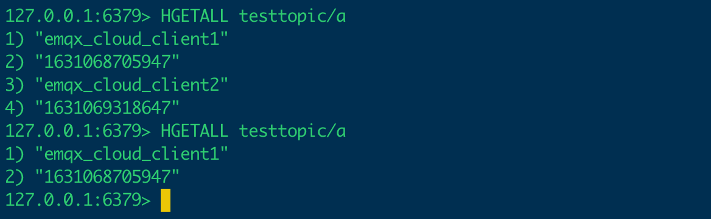
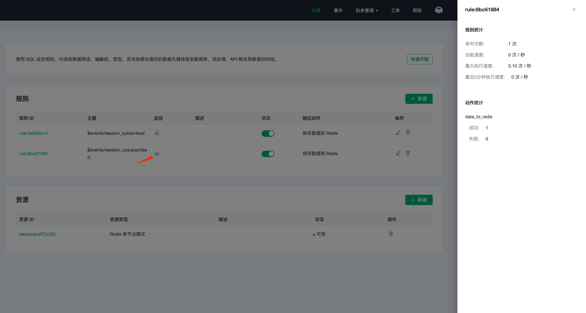

# 数据集成 + Redis 实时获取主题下订阅的客户端

::: warning
该功能在基础版中不可用
:::

在本文中我们将使用 EMQX Cloud 数据集成保存 topic 和客户端的订阅关系到 Redis，可以实时获取主题下订阅的客户端列表。

在开始之前，您需要完成以下操作：
* 已经在 EMQX Cloud 上创建部署(EMQX 集群)。
* 对于专业版部署用户：请先完成 [对等连接的创建](../deployments/vpc_peering.md)，下文提到的 IP 均指资源的内网 IP。
* 对于 BYOC 部署用户：请先对 BYOC 部署所在 VPC 与资源所在 VPC 建立对等连接，下文提到的 IP 均指资源的内网 IP。如需通过公网访问资源，请在您的公有云控制台中为 BYOC 部署所在 VPC 配置 NAT 网关，使用资源的公网 IP 进行连接。

## Redis 配置

1. 安装运行 Redis 镜像
   ```bash
   docker run -d --name redis -p 6379:6379 redis
   ```

## EMQX Cloud 数据集成配置

### 资源创建

点击左侧菜单栏`数据集成`，找到资源面板，点击新建资源，下拉选择 Redis单节点模式。填入刚才创建好的 Redis 信息，并点击测试，如果出现错误应及时检查 Redis 配置是否正确。

   

### 规则创建

#### 订阅规则

1. 创建规则

   点击左侧左侧菜单栏`数据集成`，找到规则面板，点击创建，然后输入如下 SQL 语句。在下面规则中我们从订阅事件中获取所有信息。

   ```sql
   SELECT
   *
   FROM
   "$events/session_subscribed"
   ```
   

2. 添加响应动作

   点击左下角添加动作，下拉选择 → 数据持久化 → 保存数据到 Redis，选择第一步创建好的资源，并输入以下 Redis 的命令：

   ```bash
   HSETNX ${topic} ${clientid} ${timestamp}
   ```
   

3. 点击创建规则

#### 取消订阅规则

1. 创建规则

   点击左侧左侧菜单栏`数据集成`，找到规则面板，点击创建，然后输入如下规则匹配 SQL 语句。在下面规则中我们从取消订阅事件中获取所有信息。

   ```sql
   SELECT
   *
   FROM
   "$events/session_unsubscribed"
   ```
   

2. 添加响应动作

   点击左下角添加动作，下拉选择 → 数据持久化 → 保存数据到 Redis，选择第一步创建好的资源，并输入以下 Redis 的命令：

   ```bash
   HDEL ${topic} ${clientid}
   ```
   

3. 点击创建规则

至此，我们的资源和规则都已经创建好



## 测试

1. 使用 [MQTT X](https://mqttx.app/) 订阅、取消订阅 topic

   需要将 broker.emqx.io 替换成已创建的部署连接地址，并添加客户端认证信息。
   
   我们分别使用 `emqx_cloud_client1` 和 `emqx_cloud_client2` 客户端订阅 topic：`testtopic/a` 
   

2. 查看数据转存结果

   ```bash
   docker exec -it redis bash
   redis-cli
   HGETALL testtopic/a
   ```
   
   
3. 此时我们使用 `emqx_cloud_client2` 客户端取消订阅 topic：`testtopic/a`，然后查看 redis 数据
    
   
   
4. 同时在规则列表可以点击监控查看监控数据
    

   