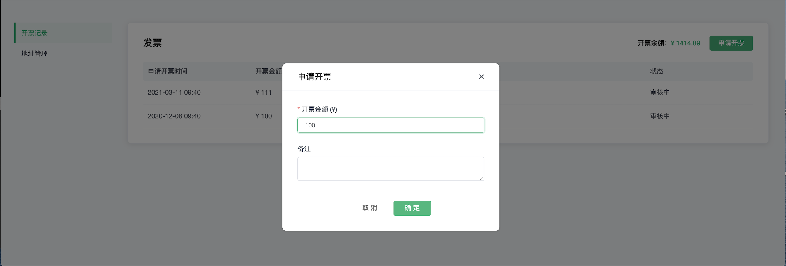
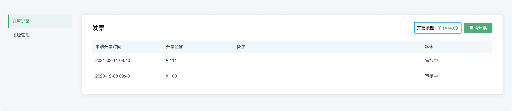
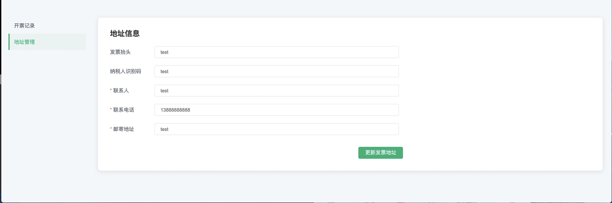

# 发票

发票包括账户的开票记录、申请开票，以及地址管理。点击顶部菜单中的 `财务管理` -> `发票` 可进入发票页面

## 发票申请

发票申请需基于月度结算，且不可拆分为多张发票。但多个月结算单可以合并，开具为一张发票。

1. 在 `地址管理` 中更新开票地址信息
2. 在 `开票记录` 中点击 `申请开票` ，输入开票金额(开票金额不能小于 100 元)

## 查看开票记录

开票记录将展示账户的开票记录，以及可开票余额。

## 发票信息管理

地址管理中可对账户的发票信息进行更新。

