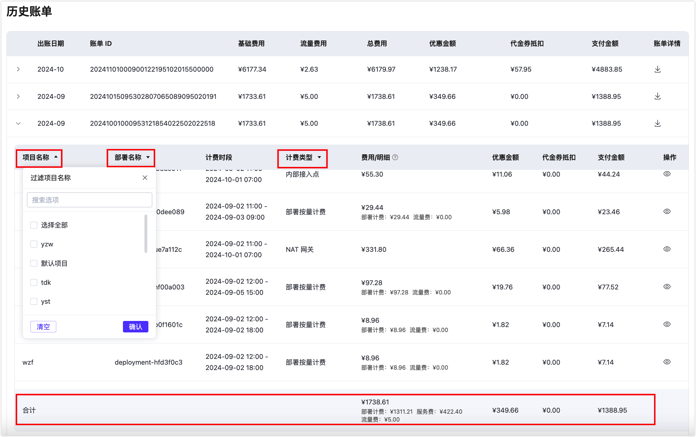

<!-- markdownlint-disable MD001 --> 
# 账单概览

您可以在账单概览页面查看 EMQX Platform 账户的余额并进行充值，还可以查看交易记录、账单、订单以及费用趋势统计。点击顶部菜单中的**财务管理** ->**概览**可进入账单概览查看页面。

## 余额

显示了当前账户的可用余额，可点击 `充值` 按钮进行账户充值。EMQX Platform 支持通过支付宝、微信或者对公汇款的方式进行支付和充值。如果选择对公汇款的方式，您可以通过[提交工单](../feature/tickets.md)或者拨打400电话联系我们。

#### 交易记录

交易记录展示了账户的充值、付款等和金额交易相关的信息。

1. 点击**交易记录**进入交易记录页面。

2. 可以查找一段时间内的交易记录， 同时也可以通过**交易方式**和**交易单号**查找相关交易信息。

## 账单

账单模块默认显示从本月第一天到当前时间点的出帐数额。

#### 小时账单

点击**小时账单**进入小时账单页面。小时账单详细展示了小时时间维度下，部署和服务相关费用的明细。

您可以查找一段时间内的账单记录， 同时也可以通过**部署名称**，**项目名称**和**账单 ID** 查找相关交易信息。

#### 历史账单

点击**历史账单**进入历史账单页面。历史账单详细展示了一个月时间维度下，部署和服务相关费用的明细。点击每个月条目后的下载按钮，可以下载该月账单的 CSV 文件。

点击**出帐日期**前的箭头可展开当月内详细的账单条目和服务记录。可以点击**项目名称**、**部署名称**、**计费类型**表头字段旁的箭头，对指定项目、部署或计费类型进行筛选，并查看按条件过滤之后的月账单。

## 订单

账单模块默认显示未完成待支付的订单数。

1. 点击**全部订单** 进入订单页面。

2. 可以通过**类型**，**状态**和**订单号**查找相关订单信息。
3. 对于未支付的订单可以点击**支付**，继续支付流程，未支付的订单将在 7 天之后自动关闭。
4. 点击订单号可查看订单详情，可点击**下载 PDF**获取订单文本。

## 费用趋势统计

费用趋势显示了在某一特定时期内你的账户使用所产生的费用，可以按照天或者月维度进行查看。

