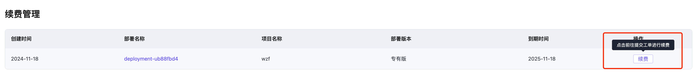
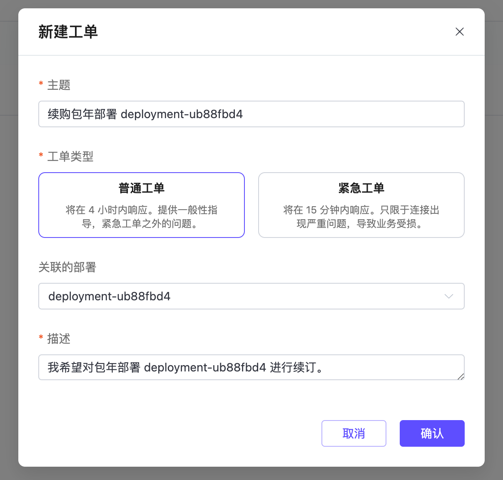
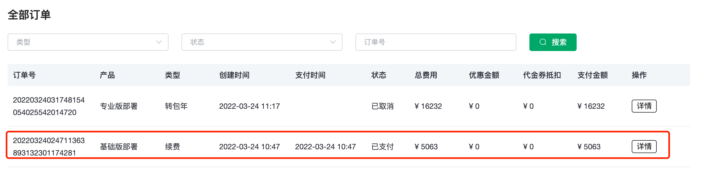
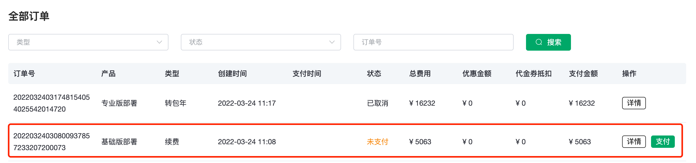

# 续费管理

续费管理页面可以管理所有**包年部署**的续费状态（项目管理者只能显示权限项目下的包年部署）。您可以在控制台的顶部菜单中点击**财务管理**->**续费管理**进入**续费管理**页面，在该页面上可以对部署进行续费操作。

点击**操作**列的**续费**按钮，在弹出的**新建工单**对话框中点击**确认**。

## 续费规则

1. 当部署开启了自动续费，在包年到期时间点的前12小时，系统会自动尝试在**账户余额**中扣取1年时长的当前规格部署的年费。成功扣费之后，部署将获得1年的时长。同时在**财务管理**->**订单**中可以看到相关支付的订单和相关的交易记录。

2. 如果账户余额中没有足够的费用，自动扣费将失败，并生成一笔未支付的订单。可以在**财务管理**->**订单**中查看到该笔订单。在进行支付之后，即可完成部署的续费。

3. 续费的订单有效期为7天。在此时间内如果部署到期，部署的服务将停止，直到订单支付成功后，重新可变成运行状态。