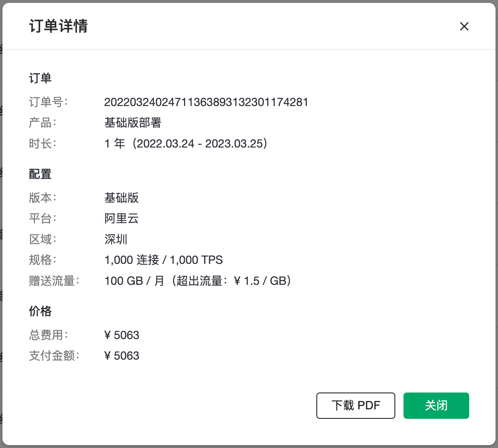
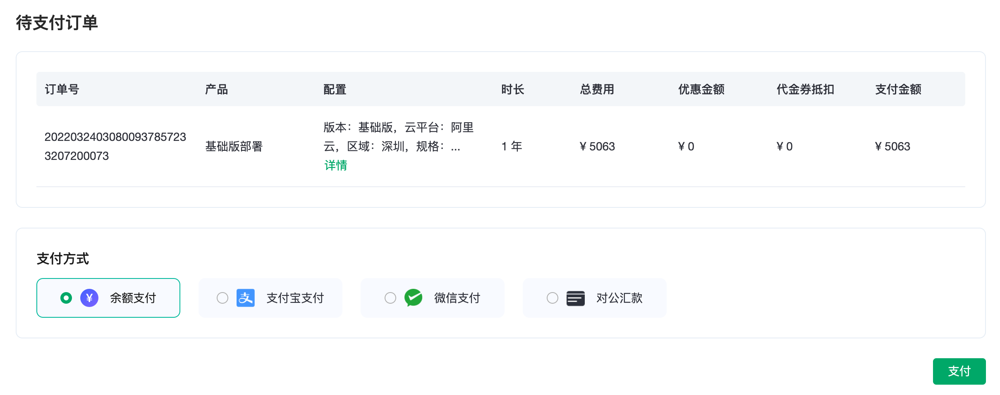

# 续费管理

续费管理页面可以管理所有**包年部署**的自动续费状态（项目管理者只能显示权限项目下的包年部署）。可以关闭和开启自动续费。

::: tip Tip
1. 部署的自动续费状态是独立的，可以对每一个部署单独设置
2. 自动续费时长为部署再购买**1年**的服务
3. 自动续费只针对于**包年**类型的部署
:::

## 续费规则

1. 当部署开启了自动续费，在包年到期时间点的前12小时，系统会自动尝试在**账户余额**中扣取1年时长的当前规格部署的年费。成功扣费之后，部署将获得1年的时长。同时在【财务管理】- 【订单】中可以看到相关支付的订单和相关的交易记录。

2. 如果账户余额中没有足够的费用，自动扣费将失败，并生成一笔未支付的订单。可以在【财务管理】- 【订单】中查看到该笔订单。在进行支付之后，即可完成部署的续费。

3. 续费的订单有效期为7天，在此时间内，如果部署到期，部署的服务将停止，直到订单支付成功后，重新可变成运行状态。