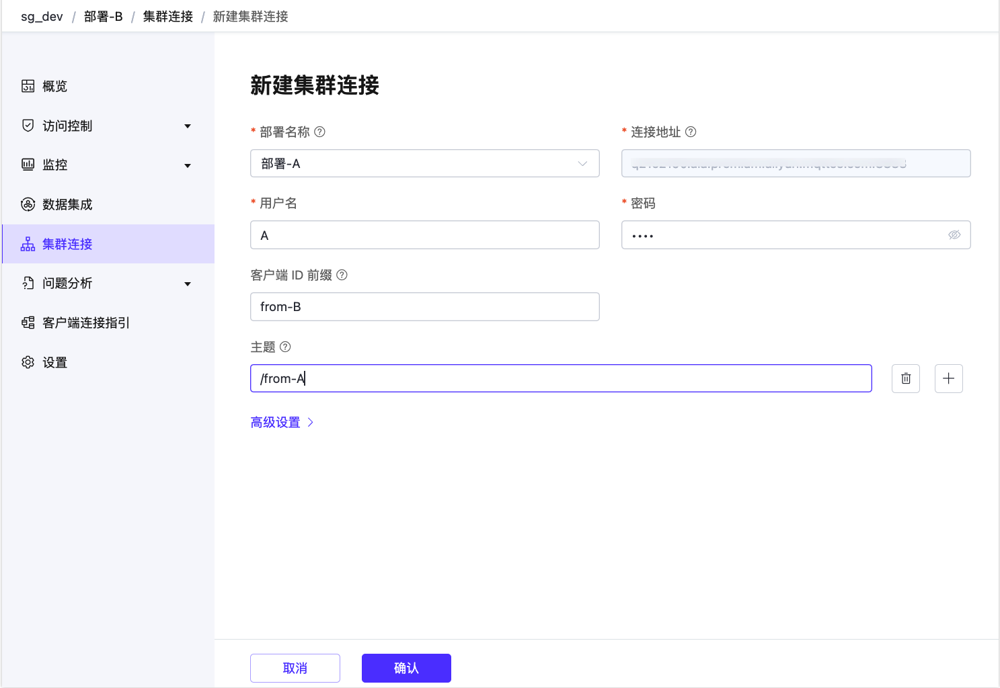

# 集群连接

::: tip 注意

集群连接功能仅在旗舰版部署中可用。

:::

集群连接功能用于连接多个独立的 EMQX 集群，方便不同集群上客户端之间的通信。这种方式相比传统的 MQTT 桥接更加高效、可靠和可扩展。它最小化了带宽需求，并能够容忍网络中断。

本页面介绍集群连接功能以及如何在旗舰版部署中使用和配置该功能。

## 功能介绍

单个部署可以有效服务成千上万分布于不同地域的 MQTT 客户端。然而，当客户端分布在全球各地时，高延迟和网络连接不良的问题就会出现。在不同区域创建多个部署可以通过本地服务客户端来缓解这些问题，但这也引入了一个新的挑战：如何实现不同部署之间客户端的无缝通信。

传统的解决方案是在每个部署中添加一个 MQTT 桥接，转发两个部署之间的所有消息。这种方法导致过度的带宽使用，并可能增加消息延迟，因为许多转发的消息可能与另一侧的客户端无关。

集群连接通过仅转发相关消息来解决这些问题。这种优化减少了带宽使用，并确保在网络中断期间也能有效通信。

## 开始使用集群连接

要在两个旗舰版部署之间创建集群连接，您需要在两个部署中都设置集群连接功能。本节将演示如何在两个旗舰版部署之间创建集群连接。

在开始之前，您需要创建两个部署。例如，您可以创建名称分别为`部署-A` 和`部署-B` 的两个部署。有关如何创建旗舰版部署的更多信息，请参见[创建旗舰版部署](../create/premium.md)。

### 设置网络

为了确保集群间的高效连接，部署应通过公共网络连接相互通信。您需要为两个部署设置 [NAT 网关](../vas/nat-gateway.md)，并确保 NAT 网关状态为运行中。

### 在`部署-A` 中创建集群连接

1. 在控制台中点击 `部署-A` 的部署卡片。

2. 从左侧导航菜单中选择**集群连接**。

3. 点击右上角的**新建**。在**新建集群连接** 页面，配置以下选项：

   - **部署名称**：选择要连接的旗舰版部署名称。在本演示中为 `部署-B`。

   - **连接地址**：要连接的部署的 MQTT 域名和端口。在选择部署名称后会自动填充。

   - **用户名**：输入 `部署-B` 认证页面中配置的用户名。

   - **密码**：输入 `部署-B` 的认证页面中配置的密码。

   - **客户端 ID 前缀**：为 MQTT 连接到 `部署-B` 使用的客户端 ID 定义前缀，例如 `from-A`。

     ::: tip

     根据部署集群的大小和配置，可能会建立多个 MQTT 客户端连接到远程部署，每个客户端必须具有唯一的 ClientID。您可以通过设置这些连接的“客户端 ID 前缀”来控制 ClientIDs 的分配方式。

     :::

   - **主题**：指定当前部署将从远程部署接收的 MQTT 消息的主题过滤器列表，例如 `/from-B`。您可以点击加号图标添加更多主题。

     ::: tip

     这些是本地部署期望从远程部署接收消息的主题。如果留空，本地部署将不会接收到来自远程部署的任何消息。

     :::

   - **高级设置**：配置 MQTT 协议参数等高级设置。

4. 点击**确认**。您将被重定向到集群连接页面，并看到新创建的集群连接条目已默认启用。

### 在 `部署-B` 中创建集群连接

1. 在控制台中点击 `部署-B` 的部署卡片。
2. 从左侧导航菜单中选择**集群连接**。
3. 点击右上角的**新建**。在新建集群连接页面，配置以下选项：
   - **部署名称**：从下拉列表中选择 `部署-A`。
   - **连接地址**：`部署-A` 的 MQTT 域名和端口。在选择部署名称后会自动填充。
   - **用户名**：输入 `部署-A` 认证页面中配置的用户名。
   - **密码**：输入 `部署-A` 认证页面中配置的密码。
   - **客户端 ID 前缀**：为 MQTT 连接到 `部署-A` 使用的客户端 ID 指定前缀，例如 `from-B`。
   - **主题**：指定本地部署将从远程部署接收的消息的 MQTT 主题过滤器列表，例如 `/from-A`。您可以点击加号图标添加更多主题。
   - **高级设置**：配置 MQTT 协议参数等高级设置。
4. 点击**确认**。您将将被重定向到集群连接页面，并看到新创建的集群连接条目已默认启用。

## 验证集群连接

您可以使用 MQTTX 验证集群连接是否成功创建。

1. 在 MQTTX 中创建名为 `A-client` 的新连接，并连接到 `部署-A`。创建对主题 `/from-B` 的订阅。
2. 在 MQTTX 中创建名为 `B-client` 的新连接，并连接到 `部署-B`。创建对主题 `/from-A` 的订阅。
3. 使用 `A-client` 客户端向主题 `/from-A` 发送消息， payload 为 `from A`。
4. 验证 `B-client` 客户端接收到该消息。
5. 使用 `B-client` 客户端向主题 `/from-B` 发送消息，`A-client` 客户端也应该接收到该消息。

## 创建不对称连接

要创建不对称连接，您只需通过将**主题**字段设置为空并保持其他设置不变来修改集群连接配置。

例如，您可以在 `部署-A` 的集群连接设置中删除主题。这意味着 `部署-A` 现在对来自 `部署-B` 的任何消息都不感兴趣。这使得集群连接变为“不对称”，适用于集群之间的单向消息转发。

如果您重复[验证集群连接](#验证集群连接)中的消息发布和订阅步骤，您会注意到，从 `部署-B` 发布的消息不会被 `部署-A` 上的订阅者接收到。

## 管理集群连接

您可以在集群连接页面查看列出的集群连接的基本信息。

通过点击部署名称，您可以在**概览**标签页下查看集群连接执行和消息传输的指标和统计信息。通过点击**设置**标签，您可以修改配置。或者，您还可以在**操作**列中点击编辑图标修改配置。

点击**操作**列中的删除图标将删除所选的集群连接条目。
