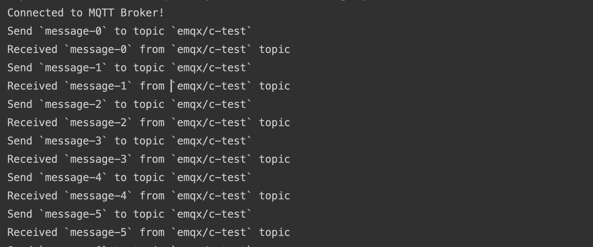

# 使用 Paho C 连接到部署

本文主要介绍如何在 C 项目中使用 `Eclipse Paho C` ，实现客户端与 MQTT 服务器的连接、订阅、收发消息等功能。

[Eclipse Paho C](https://www.eclipse.org/paho/index.php?page=clients/c/index.php) 与 Eclipse Paho Embedded C 均为 Eclipse Paho 项目下的 C 语言客户端库（MQTT C Client），均为使用 ANSI C 编写的功能齐全的 MQTT 客户端。

## 前置准备

### MQTT 服务器部署

- 使用 EMQX 提供的 [免费公共 MQTT 服务器](https://www.emqx.com/zh/mqtt/public-mqtt5-broker)，该服务基于 EMQX 的 [全托管 MQTT 云服务](https://www.emqx.com/zh) 创建。服务器接入信息如下： 
  - 连接地址: broker.emqx.io 
  - TCP Port: 1883 
  - SSL/TLS Port: 8883 
- 您也可以自己[创建部署](https://github.com/emqx/cloud-docs/blob/master/zh_CN/create/overview.md)，在部署概览下可以查看到连接相关的信息，请确保部署状态为运行中。使用 TCP 端口或 SSL/TLS 端口 测试连接到 MQTT 服务器。如果您是自己创建部署，请设置[认证](../deployments/auth_overview.md)，在部署控制台认证鉴权 > 认证 中设置用户名和密码，用于连接验证。

## 安装依赖

```bash
sudo apt-get update
sudo apt-get -y install build-essential git cmake
```

### 编译 Paho MQTT 库

#### Linux/Mac

```bash
git clone https://github.com/eclipse/paho.mqtt.c.git
cd org.eclipse.paho.mqtt.c.git
make
sudo make install
```

#### Windows

```
mkdir build.paho

cd build.paho

call "C:\Program Files (x86)\Microsoft Visual Studio 14.0\VC\vcvarsall.bat" x64

cmake -G "NMake Makefiles" -DPAHO_WITH_SSL=TRUE -DPAHO_BUILD_DOCUMENTATION=FALSE -DPAHO_BUILD_SAMPLES=TRUE -DCMAKE_BUILD_TYPE=Release -DCMAKE_VERBOSE_MAKEFILE=TRUE ..

nmake
```

## 通过 TCP 端口连接

本节介绍了如何通过 TCP 端口连接到部署。

1. 导入所需库函数

   ```c
   #include "stdlib.h"
   #include "string.h"
   #include "unistd.h"
   #include "MQTTClient.h"
   ```
   
2. 定义连接地址、认证信息以及消息发布和接收主题

   ```c
   // Enable or disable SSL/TLS connection (1 for SSL/TLS, 0 for TCP)
   #define USE_SSL 0
   
   #if USE_SSL
   #define ADDRESS "ssl://broker.emqx.io:8883"
   #else
   #define ADDRESS "tcp://broker.emqx.io:1883"
   #endif
   
   #define USERNAME    "emqx"
   #define PASSWORD    "public"
   #define CLIENTID    "c-client"
   #define QOS         0
   #define TOPIC       "emqx/c-test"
   #define TIMEOUT     10000L
   ```
   
3. 开始连接 / 编写 MQTT 代码

   ```c
   int rc;
   MQTTClient client;
   
   MQTTClient_create(&client, ADDRESS, CLIENTID, 0, NULL);
   MQTTClient_connectOptions conn_opts = MQTTClient_connectOptions_initializer;
   conn_opts.username = USERNAME;
   conn_opts.password = PASSWORD;
   
   if ((rc = MQTTClient_connect(client, &conn_opts)) != MQTTCLIENT_SUCCESS) {
       printf("Failed to connect, return code %d\n", rc);
       exit(-1);
   } else {
       printf("Connected to MQTT Broker!\n");
   }
   ```
   
## 通过 SSL/TLS 协议连接

本节介绍了如何通过 SSL/TLS 端口连接到部署。

1. 调整连接地址，通过将 `USE_SSL` 设置为1实现。

   ``` c
   // Enable or disable SSL/TLS connection (1 for SSL/TLS, 0 for TCP)
   #define USE_SSL 1
   ```
   
2. 开始连接 / 编写 MQTT 代码，

   通过函数 `configureSSLOptions()` 来设置SSL选项。如果需要配置服务器证书，可以通过 `ssl_opts.trustStore` 加载证书。如果不需要，将 `ssl_opts.enableServerCertAuth` 设置为0。
   
   ``` c
   MQTTClient_SSLOptions configureSSLOptions() {
       MQTTClient_SSLOptions ssl_opts = MQTTClient_SSLOptions_initializer;
       ssl_opts.enableServerCertAuth = 1;
       // CA_CERTIFICATE_FILE_Path specify server CA
       // ssl_opts.trustStore = CA_CERTIFICATE_FILE_Path;
       return ssl_opts;
   }
   
   ···
   
   #if USE_SSL
       MQTTClient_SSLOptions ssl_opts = configureSSLOptions();
       conn_opts.ssl = &ssl_opts;
   #endif
   ```

## 订阅和发布

本节主要介绍了如何在已连接到部署的情况下订阅主题并发布消息。

### 订阅主题

设置将要订阅的主题及对应 [QoS 等级](https://www.emqx.com/zh/blog/introduction-to-mqtt-qos)。

``` c 
// subscribe topic
MQTTClient_subscribe(client, TOPIC, QOS);
```

### 取消订阅

通过以下代码取消订阅，此时应指定取消订阅的主题。

``` c 
MQTTClient_unsubscribe(client, TOPIC);
```

### 发布消息

发布消息时需要告知 MQTT Broker 目标主题及消息内容。

```c
void publish(MQTTClient client, char *topic, char *payload) {
    MQTTClient_message message = MQTTClient_message_initializer;
    message.payload = payload;
    message.payloadlen = strlen(payload);
    message.qos = QOS;
    message.retained = 0;
    MQTTClient_deliveryToken token;
    MQTTClient_publishMessage(client, topic, &message, &token);
    MQTTClient_waitForCompletion(client, token, TIMEOUT);
    printf("Send `%s` to topic `%s` \n", payload, TOPIC);
}

// Call the `publish` function in a loop to finish publishing the message
char payload[16];
for (int i = 0; i < 100; i += 1) {
    // publish message to broker
    snprintf(payload, 16, "message-%d", i);
    publish(client, TOPIC, payload);
    sleep(1);
}
```

### 接收消息

通过以下代码指定客户端对消息事件进行监听，并在收到消息后执行回调函数，将接收到的消息及其主题打印到控制台。

``` c 
MQTTClient_setCallbacks(client, NULL, NULL, on_message, NULL);
···
// Define the on_message callback function to print the content of the messages received by the subscribed topic
int on_message(void *context, char *topicName, int topicLen, MQTTClient_message *message) {
    char *payload = message->payload;
    printf("Received `%s` from `%s` topic \n", payload, topicName);
    MQTTClient_freeMessage(&message);
    MQTTClient_free(topicName);
    return 1;
}
```

### 断开连接

如客户端希望主动断开连接，可以通过如下代码实现：

``` c 
MQTTClient_disconnect(client, TIMEOUT);
MQTTClient_destroy(&client);
```

以上部分仅列出了一些关键代码，项目完整代码请见：[mqtt-client-C-paho]https://github.com/emqx/MQTT-Client-Examples/tree/master/mqtt-client-C-paho)，您可以进行下载并体验。

### 完整代码

```c
#include "stdlib.h"
#include "string.h"
#include "unistd.h"
#include "MQTTClient.h"

// Enable or disable SSL/TLS connection (1 for SSL/TLS, 0 for TCP)
#define USE_SSL 1

#if USE_SSL
#define ADDRESS "ssl://broker.emqx.io:8883"
#else
#define ADDRESS "tcp://broker.emqx.io:1883"
#endif

#define USERNAME    "emqx"
#define PASSWORD    "public"
#define CLIENTID    "c-client"
#define QOS         0
#define TOPIC       "emqx/c-test"
#define TIMEOUT     10000L

MQTTClient_SSLOptions configureSSLOptions() {
    MQTTClient_SSLOptions ssl_opts = MQTTClient_SSLOptions_initializer;
    ssl_opts.enableServerCertAuth = 1;
    ssl_opts.trustStore = CA_CERTIFICATE_FILE;
    return ssl_opts;
}


void publish(MQTTClient client, char *topic, char *payload) {
    MQTTClient_message message = MQTTClient_message_initializer;
    message.payload = payload;
    message.payloadlen = strlen(payload);
    message.qos = QOS;
    message.retained = 0;
    MQTTClient_deliveryToken token;
    MQTTClient_publishMessage(client, topic, &message, &token);
    MQTTClient_waitForCompletion(client, token, TIMEOUT);
    printf("Send `%s` to topic `%s` \n", payload, TOPIC);
}

int on_message(void *context, char *topicName, int topicLen, MQTTClient_message *message) {
    char *payload = message->payload;
    printf("Received `%s` from `%s` topic \n", payload, topicName);
    MQTTClient_freeMessage(&message);
    MQTTClient_free(topicName);
    return 1;
}

int main(int argc, char *argv[]) {
    int rc;
    MQTTClient client;

    MQTTClient_create(&client, ADDRESS, CLIENTID, 0, NULL);
    MQTTClient_connectOptions conn_opts = MQTTClient_connectOptions_initializer;
    conn_opts.username = USERNAME;
    conn_opts.password = PASSWORD;

#if USE_SSL
    MQTTClient_SSLOptions ssl_opts = configureSSLOptions();
    conn_opts.ssl = &ssl_opts;
#endif

    MQTTClient_setCallbacks(client, NULL, NULL, on_message, NULL);
    if ((rc = MQTTClient_connect(client, &conn_opts)) != MQTTCLIENT_SUCCESS) {
        printf("Failed to connect, return code %d\n", rc);
        exit(-1);
    } else {
        printf("Connected to MQTT Broker!\n");
    }
    // subscribe topic
    MQTTClient_subscribe(client, TOPIC, QOS);
    
    char payload[16];
    for (int i = 0; i < 10; i += 1) {
        // publish message to broker
        snprintf(payload, 16, "message-%d", i);
        publish(client, TOPIC, payload);
        sleep(1);
    }
    MQTTClient_unsubscribe(client, TOPIC);
    MQTTClient_disconnect(client, TIMEOUT);
    MQTTClient_destroy(&client);
    return rc;
}
```

## 测试验证

1. 编写 CMakeLists.txt
   ```
   cmake_minimum_required(VERSION 3.17)
   find_package(eclipse-paho-mqtt-c 1.3.9 REQUIRED)
   project(mqtt_c C)
   include_directories(/usr/local/include)
   link_directories(/usr/local/lib)
   set(CMAKE_C_STANDARD 99)
   add_executable(mqtt_c main.c)
   target_link_libraries(mqtt_c paho-mqtt3c)
   ```
2. 编译和运行代码
   

## 更多内容

综上所述，我们实现了在 C 项目中创建 MQTT 连接，使用客户端与 MQTT 服务器进行订阅、收发消息、取消订阅以及断开连接的场景。可以在 [这里](https://github.com/emqx/MQTT-Client-Examples/tree/master/mqtt-client-c) 下载到示例的源码，同时也可以在 [GitHub](https://github.com/emqx/MQTT-Client-Examples) 上找到更多其他语言的 Demo 示例。
