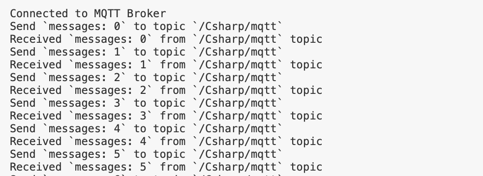

# 使用 C# SDK 连接到部署
[C#](https://docs.microsoft.com/en-us/dotnet/csharp/) 是微软推出的一种基于 **.NET框架的**、 **面向对象** 的高级编程语言。
C#是一种由C和C++派生出来的面向对象的编程语言。
它在继承C和C++强大功能的同时去掉了一些它们的复杂特性，使其成为C语言家族中的一种高效强大的编程语言。

本文主要介绍如何在 C# 项目中使用 **paho.mqtt.m2mqtt** 客户端库 ，实现客户端与 MQTT 服务器的连接、订阅、收发消息等功能。

## 项目初始化
本项目使用 .NET 5.0  进行开发测试，可以用以下命令确认 .NET 的版本。
```bash
~ dotnet --version            
5.0.301
```

### 选择 MQTT 客户端库
[paho.mqtt.m2mqtt](https://www.eclipse.org/paho/clients/dotnet/) 是适用于所有 .NET 平台的MQTT客户端库，为客户端类提供了对 MQTT v3.1 和 v3.1.1 的支持。

### .NET CLI 安装 M2Mqtt 客户端
在项目的根目录下执行以下命令，添加M2Mqtt包
```bash
dotnet add package M2Mqtt --version 4.3.0
```

## C# MQTT 客户端库使用
本文将使用 EMQ X 提供的 [免费公共 MQTT 服务器](https://www.emqx.com/zh/mqtt/public-mqtt5-broker) ，该服务基于 EMQ X 的 [MQTT 物联网云平台](https://www.emqx.com/zh/cloud) 创建。服务器接入信息如下：
- Broker: **broker.emqx.io**
- TCP Port: **1883**
- Websocket Port: **8083**

### 导入 M2Mqtt客户端库
```c#
using uPLibrary.Networking.M2Mqtt;
```

### 设置 MQTT Broker 连接参数
设置 MQTT Broker 连接地址，端口以及 topic，同时我们调用 C# `Guid.NewGuid()` 函数随机生成 uid作为MQTT 客户端 id。
```c#
string broker = "broker.emqx.io";
int port = 1883;
string topic = "Csharp/mqtt";
string clientId = Guid.NewGuid().ToString();
// 如果 broker 需要鉴权，设置用户名密码
string username = "emqx";
string password = "public";
```

### 编写 MQTT 连接函数
编写连接静态类方法 `ConnectMQTT`，该方法会创建MQTT客户端并连接到指定的Broker，并根据客户端的`IsConnected`属性来判断连接是否成功，最后将客户端对象返回。
```c#
static MqttClient ConnectMQTT(string broker, int port, string clientId, string username, string password)
{
    MqttClient client = new MqttClient(broker, port, false, MqttSslProtocols.None, null, null);
    client.Connect(clientId, username, password);
    if (client.IsConnected)
    {
        Console.WriteLine("Connected to MQTT Broker");
    }
    else
    {
        Console.WriteLine("Failed to connect");
    }
    return client;
}
```

### 发布消息
定义一个 while 循环语句，在循环中我们将设置每秒调用 MQTT 客户端 `Publish` 方法向指定主题发送消息。
```c#
static void Publish(MqttClient client, string topic)
{
    int msg_count = 0;
    while (true)
    {
        System.Threading.Thread.Sleep(1*1000);
        string msg = "messages: " + msg_count.ToString();
        client.Publish(topic, System.Text.Encoding.UTF8.GetBytes(msg));
        Console.WriteLine("Send `{0}` to topic `{1}`", msg, topic);
        msg_count++;
    }
}
```

### 订阅消息
编写静态方法 `client_MqttMsgPublishReceived`，该方法将在客户端从 MQTT Broker 收到消息后被调用，在控制台打印消息的topic和payload。
```c#
static void Subscribe(MqttClient client, string topic)
{
    client.MqttMsgPublishReceived += client_MqttMsgPublishReceived;
    client.Subscribe(new string[] { topic }, new byte[] { MqttMsgBase.QOS_LEVEL_AT_MOST_ONCE });
}
static void client_MqttMsgPublishReceived(object sender, MqttMsgPublishEventArgs e)
{
    string payload = System.Text.Encoding.Default.GetString(e.Message);
    Console.WriteLine("Received `{0}` from `{1}` topic", payload, e.Topic.ToString());
}
```

### 完整代码
```c#
using System;
using uPLibrary.Networking.M2Mqtt;
using uPLibrary.Networking.M2Mqtt.Messages;

namespace csharpMQTT
{
    class Program
    {
        static MqttClient ConnectMQTT(string broker, int port, string clientId, string username, string password)
        {
            MqttClient client = new MqttClient(broker, port, false, MqttSslProtocols.None, null, null);
            client.Connect(clientId, username, password);
            if (client.IsConnected)
            {
                Console.WriteLine("Connected to MQTT Broker");
            }
            else
            {
                Console.WriteLine("Failed to connect");
            }
            return client;
        }

        static void Publish(MqttClient client, string topic)
        {
            int msg_count = 0;
            while (true)
            {
                System.Threading.Thread.Sleep(1*1000);
                string msg = "messages: " + msg_count.ToString();
                client.Publish(topic, System.Text.Encoding.UTF8.GetBytes(msg));
                Console.WriteLine("Send `{0}` to topic `{1}`", msg, topic);
                msg_count++;
            }
        }

        static void Subscribe(MqttClient client, string topic)
        {
            client.MqttMsgPublishReceived += client_MqttMsgPublishReceived;
            client.Subscribe(new string[] { topic }, new byte[] { MqttMsgBase.QOS_LEVEL_AT_MOST_ONCE });
        }
        static void client_MqttMsgPublishReceived(object sender, MqttMsgPublishEventArgs e)
        {
            string payload = System.Text.Encoding.Default.GetString(e.Message);
            Console.WriteLine("Received `{0}` from `{1}` topic", payload, e.Topic.ToString());
        }

        static void Main(string[] args)
        {
            string broker = "broker.emqx.io";
            int port = 1883;
            string topic = "Csharp/mqtt";
            string clientId = Guid.NewGuid().ToString();
            string username = "emqx";
            string password = "public";
            MqttClient client = ConnectMQTT(broker, port, clientId, username, password);
            Subscribe(client, topic);
            Publish(client, topic);
        }
    }
}
```
## 测试
运行代码，控制台输出如下。
