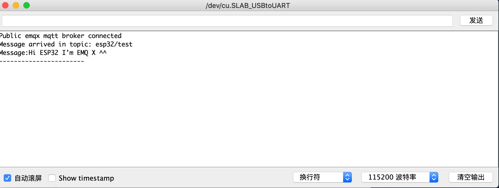
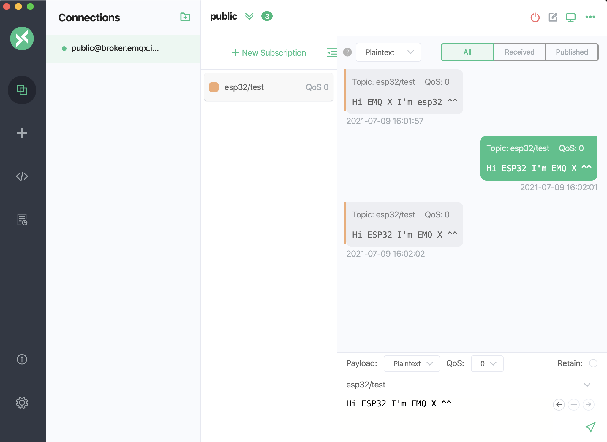

# 连接 ESP32

本文主要介绍如何在 ESP32 项目中使用 `PubSubClient` ，实现客户端与 MQTT 服务器的连接、订阅、收发消息等功能。

作为 ESP8266 的升级版本，[ESP32](https://www.espressif.com/zh-hans/products/socs/esp32) 是物联网项目的理想选择。除了 Wi-Fi 模块，该模块还包含蓝牙 4.0 模块。双核 CPU 工作频率为 80 至 240 MHz，包含两个 Wi-Fi 和蓝牙模块以及各种输入和输出引脚。

本文将分别介绍通过 TCP 端口和 SSL/TLS 端口来连接 ESP32 客户端到 MQTT 服务器，对于使用 Serverless 部署的用户，请查看 SSL/TLS 端口连接示例。TCP 端口和 SSL/TLS 端口连接在连接设置部分略有不同，发布和订阅部分代码相同。

## 前置准备

在进行连接之前，您需要准备好 MQTT 服务器和客户端。

### 获得 MQTT 服务器
使用 EMQX 提供的 [免费公共 MQTT 服务器](https://www.emqx.com/zh/mqtt/public-mqtt5-broker)，该服务基于 EMQX 的 [MQTT 物联网云平台](https://www.emqx.com/zh) 创建。服务器接入信息如下：

- Broker: **broker.emqx.io**
- TCP Port: **1883**
- TLS/SSL Port: **8883**

您也可以自己[创建部署](../create/overview.md)，在部署概览下可以查看到连接相关的信息，请确保部署状态为运行中。使用 TCP 端口或 TLS/SSL 端口  测试连接到 MQTT 服务器。

如果您是自己创建部署，请设置[客户端认证](../deployments/auth_overview.md)，在部署控制台**访问控制**->**客户端认证** 中设置用户名和密码，用于连接验证。

### Arduino IDE
本文中使用 [Arduino IDE](https://www.arduino.cc/en/guide/environment?setlang=cn) 作为代码编辑和上传，Arduino 集成开发环境（或是 ArduinoIDE）包含了一个用于写代码的文本编辑器、一个消息区、一个文本控制台以及一个带有常用功能按钮和文本菜单的工具栏。软件连接 Arduino 和 Genuino 之后，能给所连接的控制板上传程序，还能与控制板相互通信。

## 安装依赖

在 Arduino IDE 中完成以下安装。

1. 安装 ESP32 开发板。

   点击**工具** -> **开发板** -> **开发板管理**。搜索 ESP32，点击**安装**。

2. 安装 PubSub client 库。

   点击**项目** -> **加载库** -> **管理库...**。搜索 PubSubClient，安装 PubSubClient by Nick O’Leary。

## 通过 TCP 端口连接

本章节介绍了如何在 Arduino IDE 中通过 TCP 端口连接 ESP32 和 MQTT 服务器。

1. 导入 WiFi 和 PubSubClient 库。

```c
#include <WiFi.h>
#include <PubSubClient.h>
```

2. 设置 Wi-Fi 名称和密码，以及 MQTT 服务器连接地址和端口。


> 示例代码将使用公共 MQTT 服务器来连接，公共 MQTT 服务器无需设置用户名和密码。如果您创建了部署，请在部署控制台找到相应的连接地址，请参考 [默认认证](../deployments/default_auth.md)设置用户名和密码。


```c
// WiFi Credentials
const char *ssid = "WIFI_SSID";            // Replace with your WiFi name
const char *password = "WIFI_PASSWORD";  // Replace with your WiFi password

// MQTT Broker Settings
const char *mqtt_broker = "broker.emqx.io";
const char *mqtt_topic = "emqx/esp32";
const char *mqtt_username = "emqx";
const char *mqtt_password = "public";
const int mqtt_port = 1883;
```

3. 打开串行连接，以便于输出程序的结果并且连接到 Wi-Fi 网络。

```c
void setup() {
    Serial.begin(115200);
    connectToWiFi();
    mqtt_client.setServer(mqtt_broker, mqtt_port);
    mqtt_client.setKeepAlive(60);
    mqtt_client.setCallback(mqttCallback); // Corrected callback function name
    connectToMQTT();
}

void connectToWiFi() {
    WiFi.begin(ssid, password);
    Serial.print("Connecting to WiFi");
    while (WiFi.status() != WL_CONNECTED) {
        delay(500);
        Serial.print(".");
    }
    Serial.println("\nConnected to WiFi");
}
```

4. 使用 PubSubClient 连接到公共 MQTT Broker。

```c
void connectToMQTT() {
    while (!mqtt_client.connected()) {
        String client_id = "esp32-client-" + String(WiFi.macAddress());
        Serial.printf("Connecting to MQTT Broker as %s.....\n", client_id.c_str());
        if (mqtt_client.connect(client_id.c_str(), mqtt_username, mqtt_password)) {
            Serial.println("Connected to MQTT broker");
            mqtt_client.subscribe(mqtt_topic);
            mqtt_client.publish(mqtt_topic, "Hi EMQX I'm ESP32 ^^"); // Publish message upon successful connection
        } else {
            Serial.print("Failed, rc=");
            Serial.print(mqtt_client.state());
            Serial.println(" try again in 5 seconds");
            delay(5000);
        }
    }
}
```

5. MQTT 服务器连接成功后，ESP32 将向 MQTT 服务器发布消息和订阅 `esp32/test` 主题消息。

```c
// publish and subscribe
mqtt_client.subscribe(mqtt_topic);
mqtt_client.publish(mqtt_topic, "Hi EMQX I'm ESP32 ^^"); // Publish message upon successful connection

```

6. 设置回调函数将主题名称打印到串行端口并打印从 `esp32/test` 主题接收的消息。

```c
void mqttCallback(char *mqtt_topic, byte *payload, unsigned int length) {
    Serial.print("Message received on mqtt_topic: ");
    Serial.println(mqtt_topic);
    Serial.print("Message: ");
    for (unsigned int i = 0; i < length; i++) {
        Serial.print((char) payload[i]);
    }
    Serial.println("\n-----------------------");
}
```

完整代码示例如下:

```c
#include <WiFi.h>
#include <PubSubClient.h>

// WiFi Credentials
const char *ssid = "WIFI_SSID";            // Replace with your WiFi name
const char *password = "WIFI_PASSWORD";  // Replace with your WiFi password

// MQTT Broker Settings
const char *mqtt_broker = "broker.emqx.io";
const char *mqtt_topic = "emqx/esp32";
const char *mqtt_username = "emqx";
const char *mqtt_password = "public";
const int mqtt_port = 1883;

WiFiClient espClient;
PubSubClient mqtt_client(espClient);

// Function Declarations
void connectToWiFi();

void connectToMQTT();

void mqttCallback(char *mqtt_topic, byte *payload, unsigned int length);

void setup() {
    Serial.begin(115200);
    connectToWiFi();
    mqtt_client.setServer(mqtt_broker, mqtt_port);
    mqtt_client.setKeepAlive(60);
    mqtt_client.setCallback(mqttCallback); // Corrected callback function name
    connectToMQTT();
}

void connectToWiFi() {
    WiFi.begin(ssid, password);
    Serial.print("Connecting to WiFi");
    while (WiFi.status() != WL_CONNECTED) {
        delay(500);
        Serial.print(".");
    }
    Serial.println("\nConnected to WiFi");
}

void connectToMQTT() {
    while (!mqtt_client.connected()) {
        String client_id = "esp32-client-" + String(WiFi.macAddress());
        Serial.printf("Connecting to MQTT Broker as %s.....\n", client_id.c_str());
        if (mqtt_client.connect(client_id.c_str(), mqtt_username, mqtt_password)) {
            Serial.println("Connected to MQTT broker");
            mqtt_client.subscribe(mqtt_topic);
            mqtt_client.publish(mqtt_topic, "Hi EMQX I'm ESP32 ^^"); // Publish message upon successful connection
        } else {
            Serial.print("Failed, rc=");
            Serial.print(mqtt_client.state());
            Serial.println(" try again in 5 seconds");
            delay(5000);
        }
    }
}

void mqttCallback(char *mqtt_topic, byte *payload, unsigned int length) {
    Serial.print("Message received on mqtt_topic: ");
    Serial.println(mqtt_topic);
    Serial.print("Message: ");
    for (unsigned int i = 0; i < length; i++) {
        Serial.print((char) payload[i]);
    }
    Serial.println("\n-----------------------");
}


void loop() {
    if (!mqtt_client.connected()) {
        connectToMQTT();
    }
    mqtt_client.loop();
}
```

## 通过 TLS/SSL 端口连接
本章节介绍了如何在 Arduino IDE 中通过 TLS/SSL 端口连接 ESP32 和 MQTT 服务器。TCP 端口和 TLS/SSL 端口连接在连接设置部分略有不同，发布和订阅部分代码相同。

1. 导入 WiFi 和 PubSubClient 库。

```c
#include <WiFi.h>
#include <PubSubClient.h>
#include <WiFiClientSecure.h>
```

2. 设置 Wi-Fi 名称和密码，以及 MQTT 服务器连接地址和端口。


> 示例代码将使用公共 MQTT 服务器来连接，公共 MQTT 服务器无需设置用户名和密码。如果您创建了部署，请在部署控制台找到相应的连接地址，请参考 [默认认证](../deployments/default_auth.md)设置用户名和密码。


```c
// WiFi credentials
const char *ssid = "WIFI_SSID";             // Replace with your WiFi name
const char *password = "WIFI_PASSWORD";   // Replace with your WiFi password

// MQTT Broker settings
const char *mqtt_broker = "broker.emqx.io";
const char *mqtt_topic = "emqx/esp32";
const char *mqtt_username = "emqx";
const char *mqtt_password = "public";
const int mqtt_port = 8883;
```

3. 添加服务端证书。如果您在使用公共 MQTT Broker、Serverless 部署或基础版部署的 TLS/SSL 端口连接，在此[下载 CA 证书](https://assets.emqx.com/data/emqxsl-ca.crt)。 如您使用专业版 / BYOC 部署的 TLS/SSL 端口连接，请使用自己的服务端证书。

```c
// Root CA Certificate
// Load DigiCert Global Root G2, which is used by EMQX Public Broker: broker.emqx.io
const char *ca_cert = R"EOF(
-----BEGIN CERTIFICATE-----
MIIDjjCCAnagAwIBAgIQAzrx5qcRqaC7KGSxHQn65TANBgkqhkiG9w0BAQsFADBh
MQswCQYDVQQGEwJVUzEVMBMGA1UEChMMRGlnaUNlcnQgSW5jMRkwFwYDVQQLExB3
d3cuZGlnaWNlcnQuY29tMSAwHgYDVQQDExdEaWdpQ2VydCBHbG9iYWwgUm9vdCBH
MjAeFw0xMzA4MDExMjAwMDBaFw0zODAxMTUxMjAwMDBaMGExCzAJBgNVBAYTAlVT
MRUwEwYDVQQKEwxEaWdpQ2VydCBJbmMxGTAXBgNVBAsTEHd3dy5kaWdpY2VydC5j
b20xIDAeBgNVBAMTF0RpZ2lDZXJ0IEdsb2JhbCBSb290IEcyMIIBIjANBgkqhkiG
9w0BAQEFAAOCAQ8AMIIBCgKCAQEAuzfNNNx7a8myaJCtSnX/RrohCgiN9RlUyfuI
2/Ou8jqJkTx65qsGGmvPrC3oXgkkRLpimn7Wo6h+4FR1IAWsULecYxpsMNzaHxmx
1x7e/dfgy5SDN67sH0NO3Xss0r0upS/kqbitOtSZpLYl6ZtrAGCSYP9PIUkY92eQ
q2EGnI/yuum06ZIya7XzV+hdG82MHauVBJVJ8zUtluNJbd134/tJS7SsVQepj5Wz
tCO7TG1F8PapspUwtP1MVYwnSlcUfIKdzXOS0xZKBgyMUNGPHgm+F6HmIcr9g+UQ
vIOlCsRnKPZzFBQ9RnbDhxSJITRNrw9FDKZJobq7nMWxM4MphQIDAQABo0IwQDAP
BgNVHRMBAf8EBTADAQH/MA4GA1UdDwEB/wQEAwIBhjAdBgNVHQ4EFgQUTiJUIBiV
5uNu5g/6+rkS7QYXjzkwDQYJKoZIhvcNAQELBQADggEBAGBnKJRvDkhj6zHd6mcY
1Yl9PMWLSn/pvtsrF9+wX3N3KjITOYFnQoQj8kVnNeyIv/iPsGEMNKSuIEyExtv4
NeF22d+mQrvHRAiGfzZ0JFrabA0UWTW98kndth/Jsw1HKj2ZL7tcu7XUIOGZX1NG
Fdtom/DzMNU+MeKNhJ7jitralj41E6Vf8PlwUHBHQRFXGU7Aj64GxJUTFy8bJZ91
8rGOmaFvE7FBcf6IKshPECBV1/MUReXgRPTqh5Uykw7+U0b6LJ3/iyK5S9kJRaTe
pLiaWN0bfVKfjllDiIGknibVb63dDcY3fe0Dkhvld1927jyNxF1WW6LZZm6zNTfl
MrY=
-----END CERTIFICATE-----
)EOF";

// Load DigiCert Global Root CA ca_cert, which is used by EMQX Cloud Serverless Deployment
/*
const char* ca_cert = R"EOF(
-----BEGIN CERTIFICATE-----
MIIDrzCCApegAwIBAgIQCDvgVpBCRrGhdWrJWZHHSjANBgkqhkiG9w0BAQUFADBh
MQswCQYDVQQGEwJVUzEVMBMGA1UEChMMRGlnaUNlcnQgSW5jMRkwFwYDVQQLExB3
d3cuZGlnaWNlcnQuY29tMSAwHgYDVQQDExdEaWdpQ2VydCBHbG9iYWwgUm9vdCBD
QTAeFw0wNjExMTAwMDAwMDBaFw0zMTExMTAwMDAwMDBaMGExCzAJBgNVBAYTAlVT
MRUwEwYDVQQKEwxEaWdpQ2VydCBJbmMxGTAXBgNVBAsTEHd3dy5kaWdpY2VydC5j
b20xIDAeBgNVBAMTF0RpZ2lDZXJ0IEdsb2JhbCBSb290IENBMIIBIjANBgkqhkiG
9w0BAQEFAAOCAQ8AMIIBCgKCAQEA4jvhEXLeqKTTo1eqUKKPC3eQyaKl7hLOllsB
CSDMAZOnTjC3U/dDxGkAV53ijSLdhwZAAIEJzs4bg7/fzTtxRuLWZscFs3YnFo97
nh6Vfe63SKMI2tavegw5BmV/Sl0fvBf4q77uKNd0f3p4mVmFaG5cIzJLv07A6Fpt
43C/dxC//AH2hdmoRBBYMql1GNXRor5H4idq9Joz+EkIYIvUX7Q6hL+hqkpMfT7P
T19sdl6gSzeRntwi5m3OFBqOasv+zbMUZBfHWymeMr/y7vrTC0LUq7dBMtoM1O/4
gdW7jVg/tRvoSSiicNoxBN33shbyTApOB6jtSj1etX+jkMOvJwIDAQABo2MwYTAO
BgNVHQ8BAf8EBAMCAYYwDwYDVR0TAQH/BAUwAwEB/zAdBgNVHQ4EFgQUA95QNVbR
TLtm8KPiGxvDl7I90VUwHwYDVR0jBBgwFoAUA95QNVbRTLtm8KPiGxvDl7I90VUw
DQYJKoZIhvcNAQEFBQADggEBAMucN6pIExIK+t1EnE9SsPTfrgT1eXkIoyQY/Esr
hMAtudXH/vTBH1jLuG2cenTnmCmrEbXjcKChzUyImZOMkXDiqw8cvpOp/2PV5Adg
06O/nVsJ8dWO41P0jmP6P6fbtGbfYmbW0W5BjfIttep3Sp+dWOIrWcBAI+0tKIJF
PnlUkiaY4IBIqDfv8NZ5YBberOgOzW6sRBc4L0na4UU+Krk2U886UAb3LujEV0ls
YSEY1QSteDwsOoBrp+uvFRTp2InBuThs4pFsiv9kuXclVzDAGySj4dzp30d8tbQk
CAUw7C29C79Fv1C5qfPrmAESrciIxpg0X40KPMbp1ZWVbd4=
-----END CERTIFICATE-----
*/
```

4. 打开串行连接，以便于输出程序的结果并且连接到 Wi-Fi 网络。

```c
void setup() {
    Serial.begin(115200);
    connectToWiFi();

    // Set Root CA certificate
    esp_client.setCACert(ca_cert);

    mqtt_client.setServer(mqtt_broker, mqtt_port);
    mqtt_client.setKeepAlive(60);
    mqtt_client.setCallback(mqttCallback);
    connectToMQTT();
}

void connectToWiFi() {
    WiFi.begin(ssid, password);
    Serial.print("Connecting to WiFi");
    while (WiFi.status() != WL_CONNECTED) {
        delay(500);
        Serial.print(".");
    }
    Serial.println("\nConnected to WiFi");
}
```

5. 设置证书并使用 PubSubClient 连接到公共 MQTT Broker。

```c
void connectToMQTT() {
    while (!mqtt_client.connected()) {
        String client_id = "esp32-client-" + String(WiFi.macAddress());
        Serial.printf("Connecting to MQTT Broker as %s...\n", client_id.c_str());
        if (mqtt_client.connect(client_id.c_str(), mqtt_username, mqtt_password)) {
            Serial.println("Connected to MQTT broker");
            mqtt_client.subscribe(mqtt_topic);
            mqtt_client.publish(mqtt_topic, "Hi EMQX I'm ESP32 ^^");  // Publish message upon connection
        } else {
            Serial.print("Failed to connect to MQTT broker, rc=");
            Serial.print(mqtt_client.state());
            Serial.println(" Retrying in 5 seconds.");
            delay(5000);
        }
    }
}
```

6. MQTT 服务器连接成功后，ESP32 将向 MQTT 服务器发布消息和订阅主题。

```c
// publish and subscribe
mqtt_client.subscribe(mqtt_topic);
mqtt_client.publish(mqtt_topic, "Hi EMQX I'm ESP32 ^^");  // Publish message upon connection

```

7. 设置回调函数将主题名称打印到串行端口并打印从 `esp32/test` 主题接收的消息。

```c
void callback(char *topic, byte *payload, unsigned int length) {
    Serial.print("Message arrived in topic: ");
    Serial.println(topic);
    Serial.print("Message:");
    for (int i = 0; i < length; i++) {
        Serial.print((char) payload[i]);
    }
    Serial.println();
    Serial.println("-----------------------");
}
```

8. 重新连接函数
```c
void mqttCallback(char *topic, byte *payload, unsigned int length) {
    Serial.print("Message received on topic: ");
    Serial.println(topic);
    Serial.print("Message: ");
    for (unsigned int i = 0; i < length; i++) {
        Serial.print((char) payload[i]);
    }
    Serial.println("\n-----------------------");
}
```


完整代码示例如下：

```c
#include <WiFi.h>
#include <PubSubClient.h>
#include <WiFiClientSecure.h>

// WiFi credentials
const char *ssid = "WIFI_SSID";             // Replace with your WiFi name
const char *password = "WIFI_PASSWORD";   // Replace with your WiFi password

// MQTT Broker settings
const char *mqtt_broker = "broker.emqx.io";
const char *mqtt_topic = "emqx/esp32";
const char *mqtt_username = "emqx";
const char *mqtt_password = "public";
const int mqtt_port = 8883;

// WiFi and MQTT client initialization
WiFiClientSecure esp_client;
PubSubClient mqtt_client(esp_client);

// Root CA Certificate
// Load DigiCert Global Root G2, which is used by EMQX Public Broker: broker.emqx.io
const char *ca_cert = R"EOF(
-----BEGIN CERTIFICATE-----
MIIDjjCCAnagAwIBAgIQAzrx5qcRqaC7KGSxHQn65TANBgkqhkiG9w0BAQsFADBh
MQswCQYDVQQGEwJVUzEVMBMGA1UEChMMRGlnaUNlcnQgSW5jMRkwFwYDVQQLExB3
d3cuZGlnaWNlcnQuY29tMSAwHgYDVQQDExdEaWdpQ2VydCBHbG9iYWwgUm9vdCBH
MjAeFw0xMzA4MDExMjAwMDBaFw0zODAxMTUxMjAwMDBaMGExCzAJBgNVBAYTAlVT
MRUwEwYDVQQKEwxEaWdpQ2VydCBJbmMxGTAXBgNVBAsTEHd3dy5kaWdpY2VydC5j
b20xIDAeBgNVBAMTF0RpZ2lDZXJ0IEdsb2JhbCBSb290IEcyMIIBIjANBgkqhkiG
9w0BAQEFAAOCAQ8AMIIBCgKCAQEAuzfNNNx7a8myaJCtSnX/RrohCgiN9RlUyfuI
2/Ou8jqJkTx65qsGGmvPrC3oXgkkRLpimn7Wo6h+4FR1IAWsULecYxpsMNzaHxmx
1x7e/dfgy5SDN67sH0NO3Xss0r0upS/kqbitOtSZpLYl6ZtrAGCSYP9PIUkY92eQ
q2EGnI/yuum06ZIya7XzV+hdG82MHauVBJVJ8zUtluNJbd134/tJS7SsVQepj5Wz
tCO7TG1F8PapspUwtP1MVYwnSlcUfIKdzXOS0xZKBgyMUNGPHgm+F6HmIcr9g+UQ
vIOlCsRnKPZzFBQ9RnbDhxSJITRNrw9FDKZJobq7nMWxM4MphQIDAQABo0IwQDAP
BgNVHRMBAf8EBTADAQH/MA4GA1UdDwEB/wQEAwIBhjAdBgNVHQ4EFgQUTiJUIBiV
5uNu5g/6+rkS7QYXjzkwDQYJKoZIhvcNAQELBQADggEBAGBnKJRvDkhj6zHd6mcY
1Yl9PMWLSn/pvtsrF9+wX3N3KjITOYFnQoQj8kVnNeyIv/iPsGEMNKSuIEyExtv4
NeF22d+mQrvHRAiGfzZ0JFrabA0UWTW98kndth/Jsw1HKj2ZL7tcu7XUIOGZX1NG
Fdtom/DzMNU+MeKNhJ7jitralj41E6Vf8PlwUHBHQRFXGU7Aj64GxJUTFy8bJZ91
8rGOmaFvE7FBcf6IKshPECBV1/MUReXgRPTqh5Uykw7+U0b6LJ3/iyK5S9kJRaTe
pLiaWN0bfVKfjllDiIGknibVb63dDcY3fe0Dkhvld1927jyNxF1WW6LZZm6zNTfl
MrY=
-----END CERTIFICATE-----
)EOF";

// Load DigiCert Global Root CA ca_cert, which is used by EMQX Cloud Serverless Deployment
/*
const char* ca_cert = R"EOF(
-----BEGIN CERTIFICATE-----
MIIDrzCCApegAwIBAgIQCDvgVpBCRrGhdWrJWZHHSjANBgkqhkiG9w0BAQUFADBh
MQswCQYDVQQGEwJVUzEVMBMGA1UEChMMRGlnaUNlcnQgSW5jMRkwFwYDVQQLExB3
d3cuZGlnaWNlcnQuY29tMSAwHgYDVQQDExdEaWdpQ2VydCBHbG9iYWwgUm9vdCBD
QTAeFw0wNjExMTAwMDAwMDBaFw0zMTExMTAwMDAwMDBaMGExCzAJBgNVBAYTAlVT
MRUwEwYDVQQKEwxEaWdpQ2VydCBJbmMxGTAXBgNVBAsTEHd3dy5kaWdpY2VydC5j
b20xIDAeBgNVBAMTF0RpZ2lDZXJ0IEdsb2JhbCBSb290IENBMIIBIjANBgkqhkiG
9w0BAQEFAAOCAQ8AMIIBCgKCAQEA4jvhEXLeqKTTo1eqUKKPC3eQyaKl7hLOllsB
CSDMAZOnTjC3U/dDxGkAV53ijSLdhwZAAIEJzs4bg7/fzTtxRuLWZscFs3YnFo97
nh6Vfe63SKMI2tavegw5BmV/Sl0fvBf4q77uKNd0f3p4mVmFaG5cIzJLv07A6Fpt
43C/dxC//AH2hdmoRBBYMql1GNXRor5H4idq9Joz+EkIYIvUX7Q6hL+hqkpMfT7P
T19sdl6gSzeRntwi5m3OFBqOasv+zbMUZBfHWymeMr/y7vrTC0LUq7dBMtoM1O/4
gdW7jVg/tRvoSSiicNoxBN33shbyTApOB6jtSj1etX+jkMOvJwIDAQABo2MwYTAO
BgNVHQ8BAf8EBAMCAYYwDwYDVR0TAQH/BAUwAwEB/zAdBgNVHQ4EFgQUA95QNVbR
TLtm8KPiGxvDl7I90VUwHwYDVR0jBBgwFoAUA95QNVbRTLtm8KPiGxvDl7I90VUw
DQYJKoZIhvcNAQEFBQADggEBAMucN6pIExIK+t1EnE9SsPTfrgT1eXkIoyQY/Esr
hMAtudXH/vTBH1jLuG2cenTnmCmrEbXjcKChzUyImZOMkXDiqw8cvpOp/2PV5Adg
06O/nVsJ8dWO41P0jmP6P6fbtGbfYmbW0W5BjfIttep3Sp+dWOIrWcBAI+0tKIJF
PnlUkiaY4IBIqDfv8NZ5YBberOgOzW6sRBc4L0na4UU+Krk2U886UAb3LujEV0ls
YSEY1QSteDwsOoBrp+uvFRTp2InBuThs4pFsiv9kuXclVzDAGySj4dzp30d8tbQk
CAUw7C29C79Fv1C5qfPrmAESrciIxpg0X40KPMbp1ZWVbd4=
-----END CERTIFICATE-----
*/


// Function Declarations
void connectToWiFi();

void connectToMQTT();

void mqttCallback(char *topic, byte *payload, unsigned int length);


void setup() {
    Serial.begin(115200);
    connectToWiFi();

    // Set Root CA certificate
    esp_client.setCACert(ca_cert);

    mqtt_client.setServer(mqtt_broker, mqtt_port);
    mqtt_client.setKeepAlive(60);
    mqtt_client.setCallback(mqttCallback);
    connectToMQTT();
}

void connectToWiFi() {
    WiFi.begin(ssid, password);
    Serial.print("Connecting to WiFi");
    while (WiFi.status() != WL_CONNECTED) {
        delay(500);
        Serial.print(".");
    }
    Serial.println("\nConnected to WiFi");
}

void connectToMQTT() {
    while (!mqtt_client.connected()) {
        String client_id = "esp32-client-" + String(WiFi.macAddress());
        Serial.printf("Connecting to MQTT Broker as %s...\n", client_id.c_str());
        if (mqtt_client.connect(client_id.c_str(), mqtt_username, mqtt_password)) {
            Serial.println("Connected to MQTT broker");
            mqtt_client.subscribe(mqtt_topic);
            mqtt_client.publish(mqtt_topic, "Hi EMQX I'm ESP32 ^^");  // Publish message upon connection
        } else {
            Serial.print("Failed to connect to MQTT broker, rc=");
            Serial.print(mqtt_client.state());
            Serial.println(" Retrying in 5 seconds.");
            delay(5000);
        }
    }
}

void mqttCallback(char *topic, byte *payload, unsigned int length) {
    Serial.print("Message received on topic: ");
    Serial.println(topic);
    Serial.print("Message: ");
    for (unsigned int i = 0; i < length; i++) {
        Serial.print((char) payload[i]);
    }
    Serial.println("\n-----------------------");
}


void loop() {
    if (!mqtt_client.connected()) {
        connectToMQTT();
    }
    mqtt_client.loop();
}
```

## 测试连接

在成功连接 MQTT 服务器后，您可以使用 Arduino IDE 和 MQTTX 测试连接。

1. 请使用 Arduino IDE 将完整代码上传到 ESP32，并打开串口监视器，选择 115200 波特率查看 ESP32 连接情况。
   
2. 建立 MQTTX 客户端 与 MQTT 服务器的连接, 并向 ESP32 发送消息。
   

## 更多内容

综上所述，我们实现了在 ESP32 项目中创建 MQTT 连接，模拟了使用客户端与 MQTT 服务器进行连接、订阅、收发消息的场景。可以在 [这里](https://github.com/emqx/MQTT-Client-Examples/tree/master/mqtt-client-ESP32) 下载到示例的源码，同时也可以在 [GitHub](https://github.com/emqx/MQTT-Client-Examples) 上找到更多其他语言的 Demo 示例。
