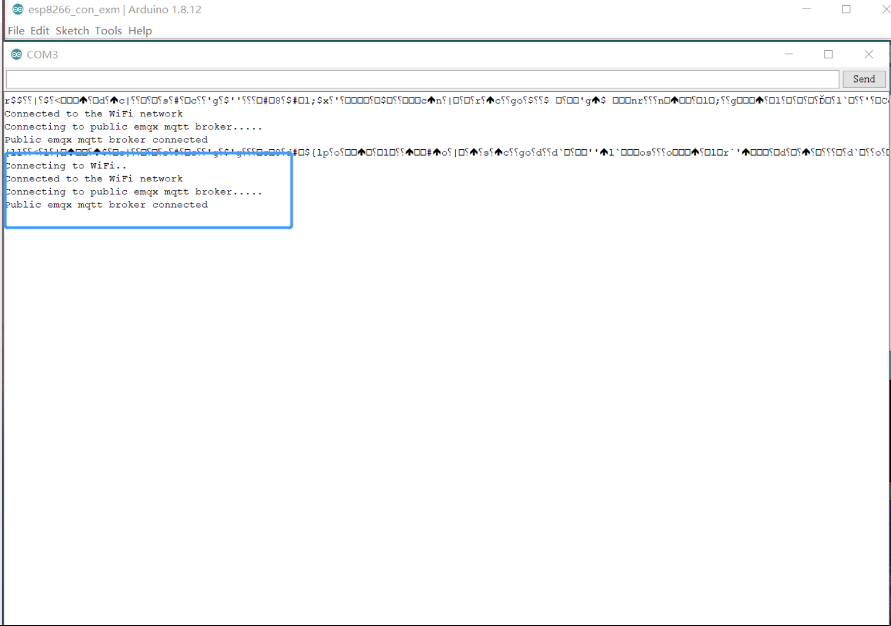
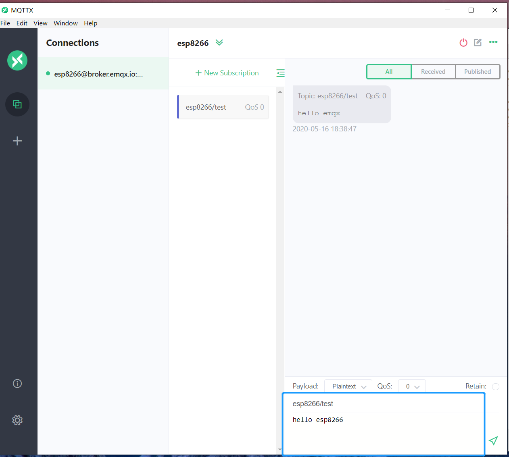
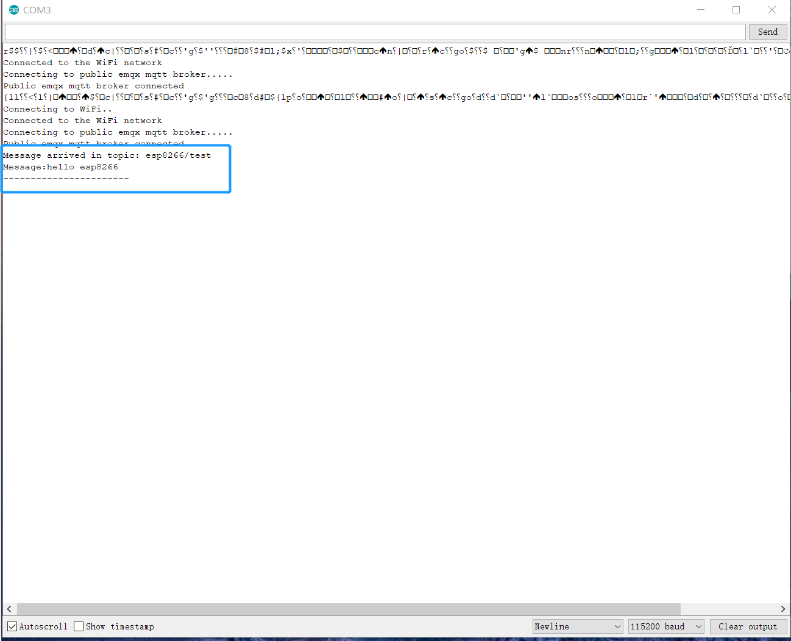

# 使用 ESP8266 连接到部署

本文主要介绍如何在 ESP8266 项目中使用 `PubSubClient` ，实现客户端与 MQTT 服务器的连接、订阅、收发消息、取消订阅等功能。

[ESP8266](https://www.espressif.com/zh-hans/products/modules/esp8266) 提供了⼀套⾼度集成的 Wi-Fi SoC 解决⽅案，其低功耗、 紧凑设计和⾼稳定性可以满⾜⽤户的需求。ESP8266 拥有完整的且⾃成体系的 Wi-Fi ⽹络功能，既能够独⽴应⽤，也可以作为从机搭载于其他主机 MCU 运⾏。

[MQTT](https://www.emqx.com/zh/mqtt) 是一种基于发布/订阅模式的 **轻量级物联网消息传输协议**。该协议提供了一对多的消息分发和应用程序的解耦，具备很小的传输消耗和协议数据交换、最大限度减少网络流量和三种不同消息服务质量等级，满足不同投递需求的优势。

## 前提条件

> 1. 已经创建了部署，在 [部署概览](../deployments/view_deployment.md) 下可以查看到连接相关的信息，请确保部署状态为运行中。同时你可以使用 WebSocket 测试连接到 MQTT 服务器。
> 2. 在 `认证鉴权` > `认证` 中设置用户名和密码，用于连接验证。

本文中使用 [Arduino IDE](https://www.arduino.cc/en/guide/environment?setlang=cn)作为代码编辑和上传，Arduino 集成开发环境（或是 ArduinoIDE）包含了一个用于写代码的文本编辑器、一个消息区、一个文本控制台以及一个带有常用功能按钮和文本菜单的工具栏。软件连接 Arduino 和 Genuino 之后，能给所连接的控制板上传程序，还能与控制板相互通信。

## 安装依赖

1. 安装 ESP8266 开发板
   点击 工具 -> 开发板 -> 开发板管理 -> 搜索 ESP8266 -> 点击安装

2. 安装 PubSub client 库
   项目 -> 加载库 -> 管理库... -> 搜索 PubSubClient -> 安装 PubSubClient by Nick O’Leary

## 连接

> 请在控制台的 [部署概览](../deployments/view_deployment.md) 找到相关的地址以及端口信息，需要注意如果是基础版，端口不是 1883 或 8883 端口，请确认好端口。

### 连接设置

本文将使用 EMQ X 提供的 [免费公共 MQTT 服务器](https://www.emqx.com/zh/mqtt/public-mqtt5-broker)，该服务基于 EMQ X 的 [MQTT 物联网云平台](https://www.emqx.com/zh/cloud) 创建。服务器接入信息如下：

- Broker: **broker-cn.emqx.io**
- TCP Port: **1883**
- Websocket Port: **8083**

### 导入 WiFi 和 PubSubClient 库

```c
#include <ESP8266WiFi.h>
#include <PubSubClient.h>
```

### 设置 Wi-Fi 名称和密码，以及 MQTT 服务器连接地址和端口

```c
// WiFi
const char *ssid = "mousse"; // Enter your WiFi name
const char *password = "qweqweqwe";  // Enter WiFi password

// MQTT Broker
const char *mqtt_broker = "broker-cn.emqx.io";
const char *topic = "esp8266/test";
const char *mqtt_username = "emqx";
const char *mqtt_password = "public";
const int mqtt_port = 1883;
```

### 打开串行连接，以便于输出程序的结果并且连接到 Wi-Fi 网络

```c
// Set software serial baud to 115200;
Serial.begin(115200);
// connecting to a WiFi network
WiFi.begin(ssid, password);
while (WiFi.status() != WL_CONNECTED) {
    delay(500);
    Serial.println("Connecting to WiFi..");
}
```

### 使用 PubSubClient 连接到公共 MQTT Broker。

```c
client.setServer(mqtt_broker, mqtt_port);
client.setCallback(callback);
while (!client.connected()) {
    String client_id = "esp8266-client-";
    client_id += String(WiFi.macAddress());
    Serial.printf("The client %s connects to the public mqtt broker\n", client_id.c_str());
    if (client.connect(client_id.c_str(), mqtt_username, mqtt_password)) {
  Serial.println("Public emqx mqtt broker connected");
    } else {
        Serial.print("failed with state ");
        Serial.print(client.state());
        delay(2000);
    }
}

void callback(char *topic, byte *payload, unsigned int length) {
    Serial.print("Message arrived in topic: ");
    Serial.println(topic);
    Serial.print("Message:");
    for (int i = 0; i < length; i++) {
        Serial.print((char) payload[i]);
    }
    Serial.println();
    Serial.println("-----------------------");
}
```

### MQTT 服务器连接成功后，ESP8266 将向 MQTT 服务器发布消息和订阅主题

```c
// publish and subscribe
client.publish(topic, "hello emqx");
client.subscribe(topic);
```

### 将主题名称打印到串行端口，然后打印收到消息的每个字节

```c
void callback(char *topic, byte *payload, unsigned int length) {
    Serial.print("Message arrived in topic: ");
    Serial.println(topic);
    Serial.print("Message:");
    for (int i = 0; i < length; i++) {
        Serial.print((char) payload[i]);
    }
    Serial.println();
    Serial.println("-----------------------");
}
```

### 完整代码

```c
#include <ESP8266WiFi.h>
#include <PubSubClient.h>

// WiFi
const char *ssid = "mousse"; // Enter your WiFi name
const char *password = "qweqweqwe";  // Enter WiFi password

// MQTT Broker
const char *mqtt_broker = "broker.emqx.io";
const char *topic = "esp8266/test";
const char *mqtt_username = "emqx";
const char *mqtt_password = "public";
const int mqtt_port = 1883;

WiFiClient espClient;
PubSubClient client(espClient);

void setup() {
    // Set software serial baud to 115200;
    Serial.begin(115200);
    // connecting to a WiFi network
    WiFi.begin(ssid, password);
    while (WiFi.status() != WL_CONNECTED) {
        delay(500);
        Serial.println("Connecting to WiFi..");
    }
    Serial.println("Connected to the WiFi network");
    //connecting to a mqtt broker
    client.setServer(mqtt_broker, mqtt_port);
    client.setCallback(callback);
    while (!client.connected()) {
        String client_id = "esp8266-client-";
        client_id += String(WiFi.macAddress());
        Serial.printf("The client %s connects to the public mqtt broker\n", client_id.c_str());
        if (client.connect(client_id.c_str(), mqtt_username, mqtt_password)) {
            Serial.println("Public emqx mqtt broker connected");
        } else {
            Serial.print("failed with state ");
            Serial.print(client.state());
            delay(2000);
        }
    }
    // publish and subscribe
    client.publish(topic, "hello emqx");
    client.subscribe(topic);
}

void callback(char *topic, byte *payload, unsigned int length) {
    Serial.print("Message arrived in topic: ");
    Serial.println(topic);
    Serial.print("Message:");
    for (int i = 0; i < length; i++) {
        Serial.print((char) payload[i]);
    }
    Serial.println();
    Serial.println("-----------------------");
}

void loop() {
    client.loop();
}
```

## 测试验证

1. 请使用 Arduino IDE 将完整代码上传到 ESP8266，并打开串口监视器
   

2. 建立 MQTT X 客户端 与 MQTT 服务器的连接, 并向 ESP8266 发送消息
   

3. 在串口监视器查看 ESP8266 接收到的消息
   

## 更多内容

综上所述，我们实现了在 ESP8266 项目中创建 MQTT 连接，使用客户端与 MQTT 服务器进行订阅、收发消息、取消订阅以及断开连接的场景。可以在 [这里](https://github.com/emqx/MQTT-Client-Examples/tree/master/mqtt-client-ESP8266) 下载到示例的源码，同时也可以在 [GitHub](https://github.com/emqx/MQTT-Client-Examples) 上找到更多其他语言的 Demo 示例。
