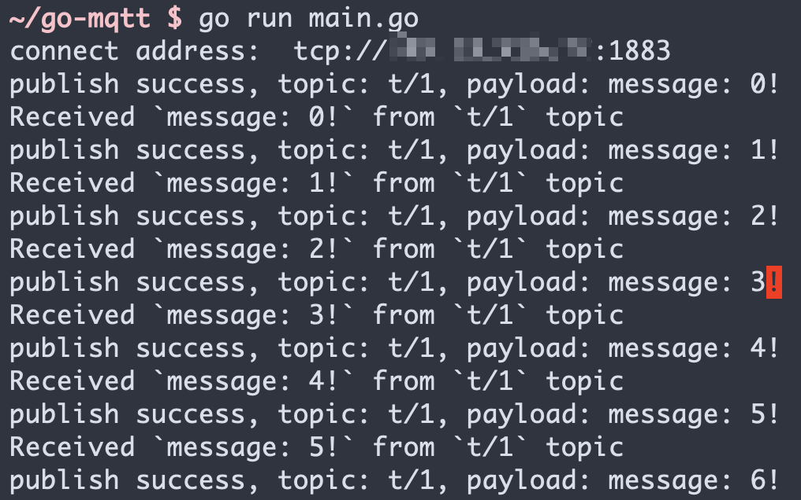

# 使用 Go SDK 连接到部署

本文主要介绍如何在 Go 项目中，使用 `paho.mqtt.golang` 库实现一个 MQTT 客戶端与 MQTT 服务器的连接、订阅、收发消息等功能。

[Go](https://go.dev/) 是 Google
开发的一种静态强类型、编译型、并发型，并具有垃圾回收功能的编程语言。而 `paho.mqtt.golang` 是一个 MQTT 库，它提供了一个简单的 API，用于在 Go 项目中连接到 MQTT 服务器，并发送和接收消息。

## 前提条件

已经创建了部署，在部署概览下可以查看到连接相关的信息，同时你可以使用 `在线调试` 先测试连接到 MQTT 服务器。

本项目使用 Go 1.15.13 版本进行开发测试，可用如下命令确认 Go 版本。

``` bash
➜ ~ go version
go version go1.15.13 darwin/amd64
```

## 安装 MQTT 客戶端

### 项目初始化

1.  创建一个新的文件夹 `go_client`, 进入文件夹, 运行以下命令

    ``` bash
    ➜ ~ go mod init go-client
    go: creating new go.mod: module go-mqtt
    ```

2.  使用 `go get <库>` 命令安装 `paho.mqtt.golang`

    ``` bash
    ➜ ~ go get github.com/eclipse/paho.mqtt.golang
    go: downloading github.com/eclipse/paho.mqtt.golang v1.3.5
    go: github.com/eclipse/paho.mqtt.golang upgrade => v1.3.5
    ```
3.  创建  `main.go` 文件, 并导入 `paho.mqtt.golang` 客戶端

    ``` go
    package main
    
    import (
        mqtt "github.com/eclipse/paho.mqtt.golang"
    )
    
    func main(){
    }
    ```

## 连接

请在控制台的部署概览找到相关的地址以及端口信息。

> 需要注意如果是基础版，端口不一定是1883或8883端口，请确认好端口。

### 连接设置

设置 MQTT Broker 连接地址，端口以及 topic, 以及用戶名和密码。

``` go
const broker = "" // MQTT Broker 连接地址
const port = 1883
const topic = "t/1"
const username = ""
const password = ""
```

### 编写 MQTT 连接函数

我们编写一个函数, 用于创建并返回 MQTT 客户端。

``` go
func createMqttClient() mqtt.Client {
    connectAddress := fmt.Sprintf("tcp://%s:%d", broker, port)
    client_id := fmt.Sprintf("go-client-%d", rand.Int())

    fmt.Println("connect address: ", connectAddress)
    opts := mqtt.NewClientOptions()
    opts.AddBroker(connectAddress)
    opts.SetUsername(username)
    opts.SetPassword(password)
    opts.SetClientID(client_id)
    opts.SetKeepAlive(60)
    client := mqtt.NewClient(opts)
    token := client.Connect()
    // 如果连接失败，则终止程序
    if token.WaitTimeout(3*time.Second) && token.Error() != nil {
        log.Fatal(token.Error())
    }
    return client
}
```

## 发布和订阅

### 发布消息

定义发布函数，用于发布消息。

在这个函数里，我们定义了一个无条件的循环，每隔 1s 发布一条消息。通过 msgCount 来统计发布的消息数量。

``` go
func publish(client mqtt.Client) {
    qos := 0
    msgCount := 0
    for {
        payload := fmt.Sprintf("message: %d!", msgCount)
        if token := client.Publish(topic, byte(qos), false, payload); token.Wait() && token.Error() != nil {
            fmt.Printf("publish failed, topic: %s, payload: %s\n", topic, payload)
        } else {
            fmt.Printf("publish success, topic: %s, payload: %s\n", topic, payload)
        }
        msgCount++
        time.Sleep(time.Second * 1)
    }
}
```

### 订阅消息

定义订阅函数，用于订阅消息。该方法将在控制台打印消息的 Topic 和 Payload。

``` go
func subscribe(client mqtt.Client) {
    qos := 0
    client.Subscribe(topic, byte(qos), func(client mqtt.Client, msg mqtt.Message) {
        fmt.Printf("Received `%s` from `%s` topic", msg.Payload(), msg.Topic())
    })
}
```

## 完整代码

``` go
package main

import (
        "fmt"
        "log"
        "math/rand"
        "time"

        mqtt "github.com/eclipse/paho.mqtt.golang"
)

const broker = ""
const port = 1883
const topic = "t/1"
const username = ""
const password = ""

func main() {
        client := createMqttClient()
        go subscribe(client)        // 在主函数里, 我们用另起一个 go 协程来订阅消息
        time.Sleep(time.Second * 1) // 暂停一秒等待 subscribe 完成
        publish(client)
}

func createMqttClient() mqtt.Client {
        connectAddress := fmt.Sprintf("tcp://%s:%d", broker, port)
        client_id := fmt.Sprintf("go-client-%d", rand.Int())

        fmt.Println("connect address: ", connectAddress)
        opts := mqtt.NewClientOptions()
        opts.AddBroker(connectAddress)
        opts.SetUsername(username)
        opts.SetPassword(password)
        opts.SetClientID(client_id)
        opts.SetKeepAlive(60)
        client := mqtt.NewClient(opts)
        token := client.Connect()
        if token.WaitTimeout(3*time.Second) && token.Error() != nil {
                log.Fatal(token.Error())
        }
        return client
}

func publish(client mqtt.Client) {
        qos := 0
        msgCount := 0
        for {
                payload := fmt.Sprintf("message: %d!", msgCount)
                if token := client.Publish(topic, byte(qos), false, payload); token.Wait() && token.Error() != nil {
                        fmt.Printf("publish failed, topic: %s, payload: %s\n", topic, payload)
                } else {
                        fmt.Printf("publish success, topic: %s, payload: %s\n", topic, payload)
                }
                msgCount++
                time.Sleep(time.Second * 1)
        }
}

func subscribe(client mqtt.Client) {
        qos := 0
        client.Subscribe(topic, byte(qos), func(client mqtt.Client, msg mqtt.Message) {
                fmt.Printf("Received `%s` from `%s` topic\n", msg.Payload(), msg.Topic())
        })
}
```

## 测试验证

执行程序

``` bash
➜ ~ go run main.go
connect address:  tcp://***.***.***.***:1883
publish success, topic: t/1, payload: message: 0!
Received `message: 0!` from `t/1` topic
publish success, topic: t/1, payload: message: 1!
Received `message: 1!` from `t/1` topic
publish success, topic: t/1, payload: message: 2!
Received `message: 2!` from `t/1` topic
publish success, topic: t/1, payload: message: 3!
Received `message: 3!` from `t/1` topic
publish success, topic: t/1, payload: message: 4!
Received `message: 4!` from `t/1` topic
publish success, topic: t/1, payload: message: 5!
Received `message: 5!` from `t/1` topic
publish success, topic: t/1, payload: message: 6!
```



## 下一步

以上为您演示了如何使用 `paho.mqtt.golang` 客戶端连接到 EMQ X Cloud, 可以在[这里](https://github.com/emqx/MQTT-Client-Examples/tree/master/mqtt-client-Go)下载到示例的源码

同时也可以在 [Github](https://github.com/emqx/MQTT-Client-Examples) 上找到更多其它语言的 Demo 示例。

