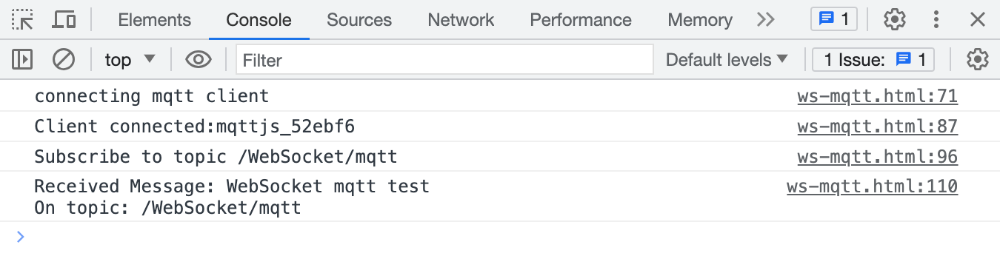

# 使用 JavaScript 连接到部署

本文主要介绍如何在 JavaScript 中使用 `MQTT.js` ，实现客户端与 MQTT 服务器的连接、订阅、收发消息、取消订阅等功能。

## 前置准备

### 获得 MQTT 服务器部署

- 使用 EMQX 提供的[免费公共 MQTT 服务器](https://www.emqx.com/zh/mqtt/public-mqtt5-broker)（仅支持单向认证），该服务基于 EMQX 的[全托管的 MQTT 消息云服务](https://www.emqx.com/zh/cloud)创建。服务器连接信息如下：

  - 连接地址: **broker.emqx.io**
  - WebSocket 端口: **8083**
  - WebSocket TLS/SSL 端口: **8084**

- 您也可以自己[创建 EMQX Platform 部署](../create/overview.md)，待部署状态为**运行中**，点击部署卡片进入概览页面便可获取相关连接信息。此外，您还需在部署的 `认证鉴权` > `认证` 页面中设置用户名和密码，用于后续的连接验证。

## 安装依赖

[MQTT.js](https://github.com/mqttjs/MQTT.js) 是一个完全开源的 MQTT 协议的客户端库，使用 JavaScript 编写，可用于 Node.js 和浏览器环境。有关 `MQTT.js` 的更多内容和使用方法，您可以前往查阅 [MQTT.js GitHub 页面](https://github.com/mqttjs/MQTT.js#table-of-contents)。

MQTT.js 支持通过 NPM 或 Yarn 安装，通过 CDN 或相对路径引入。本示例将通过 CDN 引入 MQTT.js。

- 使用 NPM 或 Yarn：

  安装 MQTT.js 依赖

  ```shell
  # 使用 NPM
  npm install mqtt
  # 或使用 Yarn
  yarn add mqtt
  ```

  成功安装后，还需引入 MQTT.js。

  ```js
  import * as mqtt from 'mqtt/dist/mqtt.min'
  ```

- 通过 CDN 引入：

  ```html
  <script src="https://unpkg.com/mqtt/dist/mqtt.min.js"></script>
  ```

- 下载到本地，然后使用相对路径引入：

  ```html
  <script src="/your/path/to/mqtt.min.js"></script>
  ```

## 通过 Websocket 端口连接

MQTT-WebSocket 统一使用 `/path` 作为连接路径，连接时需指明，而 EMQX Broker 使用的路径为 `/mqtt`。

通过以下代码设置客户端 ID、用户名及密码，客户端 ID 应具有唯一性。

```js
const clientId = 'emqx_test_' + Math.random().toString(16).substring(2, 8)
const username = 'emqx_test'
const password = 'emqx_test'
```

通过以下代码建立客户端与 MQTT Broker 的连接。

```js
const client = mqtt.connect('ws://broker.emqx.io:8083/mqtt', {
  clientId,
  username,
  password,
  // ...other options
})
```

## 通过 Websocket TLS/SSL 端口连接

启用 TLS/SSL 加密时，连接[参数选项](https://github.com/mqttjs/MQTT.js#mqttclientstreambuilder-options)与通过 WebSocket 端口建立连接一致，您只需注意将协议改为 `wss`，且匹配正确的端口号即可。

通过以下代码建立客户端与 MQTT Broker 的连接。

```js
const client = mqtt.connect('wss://broker.emqx.io:8084/mqtt', {
  clientId,
  username,
  password,
  // ...other options
})
```

## 订阅和发布

### 订阅主题

设置将要订阅的主题及对应 [QoS 等级](https://www.emqx.com/zh/blog/introduction-to-mqtt-qos)。

```js
const topic = '/WebSocket/mqtt'
const qos = 0

client.subscribe(topic, { qos }, (error) => {
  if (error) {
    console.log('subscribe error:', error)
    return
  }
  console.log(`Subscribe to topic '${topic}'`)
})
```

### 取消订阅

通过以下代码取消订阅，此时应指定取消订阅的主题及对应的 QoS 等级。

```js
const topic = '/WebSocket/mqtt'
const qos = 0
client.unsubscribe(topic, { qos }, (error) => {
  if (error) {
    console.log('unsubscribe error:', error)
    return
  }
  console.log(`unsubscribed topic: ${topic}`)
})
```

### 发布消息

发布消息时需要告知 MQTT Broker 目标主题及消息内容。

```js
// 设置发布的主题、消息及 QoS
const topic = '/WebSocket/mqtt'
const payload = 'WebSocket mqtt test'
const qos = 0

client.publish(topic, payload, { qos }, (error) => {
  if (error) {
    console.error(error)
  }
})
```

### 接收消息

通过以下代码指定客户端对消息事件进行监听，并在收到消息后执行回调函数，将接收到的消息及其主题打印到控制台。

```js
client.on('message', (topic, payload) => {
  console.log(
    'Received Message: ' + payload.toString() + '\nOn topic: ' + topic
  )
})
```

### 断开连接

如客户端希望主动断开连接，可以通过如下代码实现：

```js
if (client.connected) {
  try {
    client.end(false, () => {
      console.log('disconnected successfully')
    })
  } catch (error) {
    console.log('disconnect error:', error)
  }
}
```

以上部分仅列出了一些关键代码，项目完整代码请见：[MQTT-Client-WebSocket](https://github.com/emqx/MQTT-Client-Examples/tree/master/mqtt-client-WebSocket)，您可以进行下载并体验。

## 测试验证

直接在浏览器中打开 HTML 文件并在控制台中查看演示结果如下：



我们看到了客户端已经成功连接到 [MQTT 服务器](https://www.emqx.com/zh/cloud) 并且订阅主题、接收和发布消息成功。此时我们再使用 [MQTT 5.0 客户端工具 - MQTTX](https://mqttx.app/zh) 作为另一个客户端进行消息收发测试。


可以看到控制台内打印出了 MQTTX 发送过来的消息。


## 常见问题

1. 是否支持自签名 TLS/SSL 证书？是否支持双向 TLS/SSL 认证？

   由于浏览器的限制，均暂不支持。参考 MQTT.js issue: [如何在浏览器环境中使用双向认证？](https://github.com/mqttjs/MQTT.js/issues/1515)和 [Node.js 中双向认证可用，但在浏览器中不支持](https://github.com/mqttjs/mqtt.js/issues/741)。

## 更多内容

综上所述，我们实现了在 JavaScript 中创建 MQTT 连接，模拟了客户端与 MQTT 服务器进行订阅、收发消息、取消订阅以及断开连接的场景。可以在 [MQTT-Client-WebSocket 页面](https://github.com/emqx/MQTT-Client-Examples/tree/master/mqtt-client-WebSocket)下载完整的示例源码，同时也欢迎前往 [MQTT Client 示例页面](https://github.com/emqx/MQTT-Client-Examples)探索更多其他语言的 Demo 示例。
