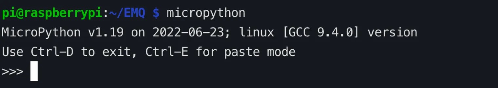

# 使用 MicroPython 连接树莓派到部署

本文主要介绍在树莓派（Raspberry Pi 4）上使用 MicroPython，实现客户端与 MQTT 服务器的连接、订阅、发布消息等功能。

[MicroPython](https://zh.wikipedia.org/wiki/MicroPython) 是 Python 3 编程语言的一个完整软件实现，用 C 语言编写，运行在 MCU（微控制器）硬件之上的完全的 Python 编译器和运行时系统，提供给用户一个交互式提示符（REPL）来立即执行所支持的命令。除了包括选定的核心 Python 库，MicroPython 还包括了给予编程者访问低层硬件的模块，是 Python 3 语言的精简实现 ，包括 Python 标准库的一小部分，经过优化可在微控制器和受限环境中运行。

[树莓派](https://www.raspberrypi.org/) 由英国树莓派基金会开发，是一款基于 ARM 的微型计算机主板。该主板提供 USB 接口和以太网接口，可以连接键盘、鼠标和网线，该主板具备 PC 的基本功能，同时树莓派集成了 Wi-Fi、蓝牙以及大量 GPIO，被广泛运用在教学、家庭娱乐、物联网等。

本文将介绍如何在树莓派（Raspberry Pi 4）上使用 MicroPython，分别通过 TCP 端口和 SSL/TLS 端口连接到 MQTT 服务器。对于使用 Serverless 部署的用户，请查看 SSL/TLS 端口连接示例，TCP 端口和 SSL/TLS 端口连接在连接设置部分略有不同，发布和订阅部分代码相同。

## 前置准备

在进行连接之前，您需要准备好 MQTT 服务器和客户端。

### 获得 MQTT Broker

使用 EMQX 提供的 [免费公共 MQTT 服务器](https://www.emqx.com/zh/mqtt/public-mqtt5-broker)，该服务基于 EMQX 的 [MQTT 物联网云平台](https://www.emqx.com/zh/cloud) 创建。服务器接入信息如下：

- Broker: **broker.emqx.io**
- TCP Port: **1883**
- TLS/SSL Port: **8883**

您也可以自己[创建部署](../create/overview.md)，在部署概览下可以查看到连接相关的信息，请确保部署状态为运行中。使用 TCP 端口或 TLS/SSL 端口  测试连接到 MQTT 服务器。

如果您是自己创建部署，请设置[认证鉴权](../deployments/auth_overview.md)，在部署控制台`认证鉴权` > `认证` 中设置用户名和密码，用于连接验证。

### 安装 MicroPython

要安装和使用 MicroPython 编写代码，我们需要在树莓派（Raspberry Pi 4）中完成以下安装。本文使用的树莓派操作系统为 Raspberry Pi OS with desktop (Debian version: 10，64-bit)。

1. 当树莓派使用的操作系统基于 Debian version: 10 时可直接使用如下命令安装 MicroPython。

    ```bash
    sudo apt-get update
    # 安装 MicroPython
    sudo apt-get -y install micropython
    ```

    ::: tip
    如果安装过程中出现 E: Unable to locate package micropython 错误，可使用下面的 snap 或者[源码编译](https://docs.micropython.org/en/latest/develop/gettingstarted.html)方式安装。
    :::

2. 如果您的树莓派使用的操作系统基于 Debian version: 11，则可使用如下 snap 方式进行安装。

    ```bash
    sudo apt update
    sudo apt install snapd
    sudo reboot
    # 安装 MicroPython
    sudo snap install core
    sudo snap install micropython
    ```

安装完成后，在终端执行 micropython，如果显示 MicroPython x.x（x 表示数字）则表示已经安装成功。


### 安装 MQTT 客户端库

为了方便连接到 MQTT 服务器，我们需要安装 umqtt.simple 库。

```bash
micropython -m upip install umqtt.simple
```

## 通过 TCP 端口连接

本章节介绍了如何在树莓派中通过 TCP 端口连接 MicroPython 和 MQTT 服务器，完整代码示例如下。

### 订阅消息

打开任意编辑器，输入下面的代码，并保存为 sub.py 文件：

```python
# sub.py
import time
from umqtt.simple import MQTTClient

SERVER="broker.emqx.io"
ClientID = f'raspberry-sub-{time.time_ns()}'
user = "emqx"
password = "public"
topic = "raspberry/mqtt"
msg = b'{"msg":"hello"}'

def sub(topic, msg):
    print('received message %s on topic %s' % (msg, topic))

def main(server=SERVER):
    client = MQTTClient(ClientID, server, 1883, user, password)
    client.set_callback(sub)
    client.connect()
    print('Connected to MQTT Broker "%s"' % (server))
    client.subscribe(topic)
    while True:
        if True:
            client.wait_msg()
        else:
            client.check_msg()
            time.sleep(1)

if __name__ == "__main__":
    main()
```

### 发布消息

打开任意编辑器，输入下面的代码，并保存为 pub.py 文件：

```python
# pub.py
import time
from umqtt.simple import MQTTClient

server="broker.emqx.io"
ClientID = f'raspberry-pub-{time.time_ns()}'
user = "emqx"
password = "public"
topic = "raspberry/mqtt"
msg = b'{"msg":"hello"}'

def connect():
    print('Connected to MQTT Broker "%s"' % (server))
    client = MQTTClient(ClientID, server, 1883, user, password)
    client.connect()
    return client

def reconnect():
    print('Failed to connect to MQTT broker, Reconnecting...' % (server))
    time.sleep(5)
    client.reconnect()

try:
    client = connect()
except OSError as e:
    reconnect()

while True:
  print('send message %s on topic %s' % (msg, topic))
  client.publish(topic, msg, qos=0)
  time.sleep(1)
```

## 通过 TLS/SSL 端口连接

本章节介绍了如何在树莓派中通过 TLS/SSL 端口连接 MicroPython 和 MQTT 服务器。TCP 端口和 TLS/SSL 端口连接在连接设置部分略有不同，发布和订阅部分代码相同。完整代码示例如下：

### 订阅消息

打开任意编辑器，输入下面的代码，并保存为 sub-tls.py 文件：

```python
# sub-tls.py
import time
import ussl
from umqtt.simple import MQTTClient

SERVER="broker.emqx.io"
ClientID = f'raspberry-sub-{time.time_ns()}'
user = "emqx"
password = "public"
topic = b'raspberry/mqtt'
msg = b"hello"

def sub(topic, msg):
    print('received message %s on topic %s' % (msg, topic))

def main(server=SERVER):
    client = MQTTClient(ClientID, server, 8883, user, password, ssl=True, ssl_params={'server_hostname': server})
    client.set_callback(sub)
    client.connect()
    print('Connected to MQTT Broker "%s"' % (server))
    client.subscribe(topic)
    while True:
        if True:
            client.wait_msg()
        else:
            client.check_msg()
            time.sleep(1)

if __name__ == "__main__":
    main()
```

### 发布消息

打开任意编辑器，输入下面的代码，并保存为 pub-tls.py 文件：

```python
# pub-tls.py
import time
import ussl
from umqtt.simple import MQTTClient

server = "broker.emqx.io"
ClientID = f'raspberry-pub-{time.time_ns()}'
user = "emqx"
password = "public"
topic = b'raspberry/mqtt'
msg = b'{"msg":"hello"}'

def connect():
    print('Connected to MQTT Broker "%s"' % server)
    client = MQTTClient(ClientID, server, 8883, user, password, ssl=True, ssl_params={'server_hostname': server})
    try:
        client.connect()
        return client
    except Exception as e:
        print('Failed to connect to MQTT broker:', e)
        raise

def reconnect():
    print('Failed to connect to MQTT broker. Reconnecting...')
    time.sleep(5)
    client = connect()
    return client

try:
    client = connect()
except Exception:
    client = reconnect()

while True:
    try:
        print('Sending message %s on topic %s' % (msg, topic))
        client.publish(topic, msg, qos=0)
        time.sleep(1)
    except Exception as e:
        print('Failed to publish message:', e)
        client = reconnect()
```

## 测试

我们使用 MQTT 5.0 客户端工具 - [MQTTX](https://mqttx.app/zh) 进行以下测试。

### 测试订阅消息

在成功连接 MQTT 服务器后，您可以使用树莓派和 MQTT X 测试连接。

1. 打开终端，运行 MicroPython 代码，监听消息 。

    ```bash
    micropython sub.py
    ```

    

2. 使用 MQTTX 客户端与 MQTT 服务器建立连接，并向主题 `raspberry/mqtt` 发送消息。

   

3. 在树莓派中查看 MicroPython 接收到的消息。

   

### 测试发布消息

1. 在 MQTTX 客户端中订阅 `raspberry/mqtt` 主题。

2. 在终端运行 MicroPython 代码 ，发布消息。

    ```bash
    micropython pub.py
    ```

    

3. 在 MQTTX 客户端中，查看树莓派发送的消息。

   

## 更多内容

综上所述，我们实现了在 MicroPython 项目中创建 MQTT 连接，模拟了使用客户端与 MQTT 服务器进行连接、订阅、收发消息的场景。可以在 [这里](https://github.com/emqx/MQTT-Client-Examples/tree/master/mqtt-client-Micropython) 下载到示例的源码，同时也可以在 [GitHub](https://github.com/emqx/MQTT-Client-Examples) 上找到更多其他语言的 Demo 示例。
