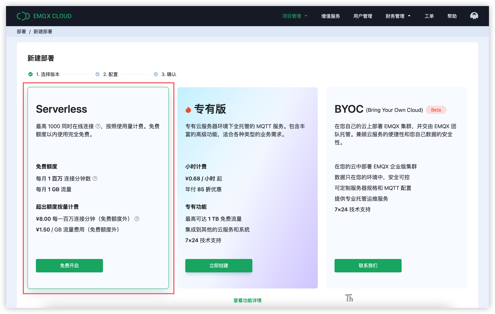
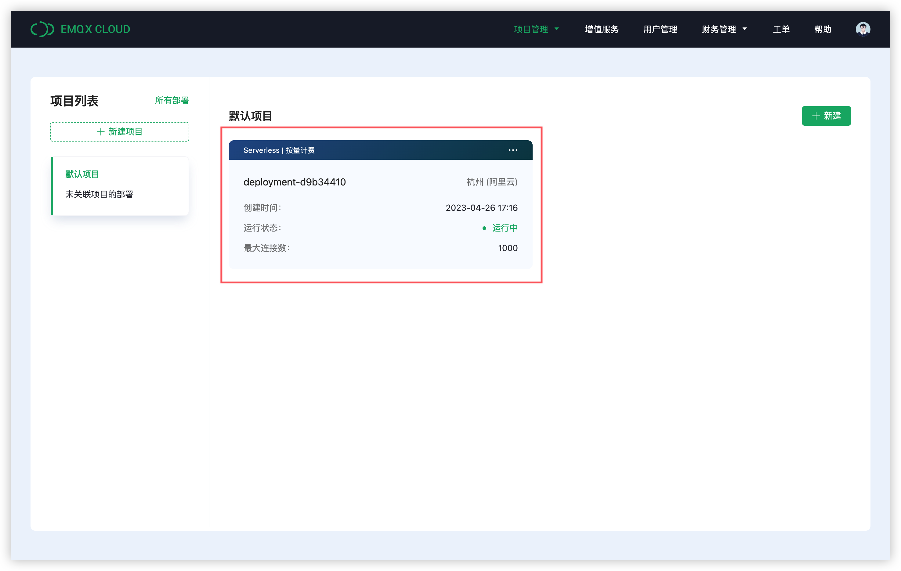
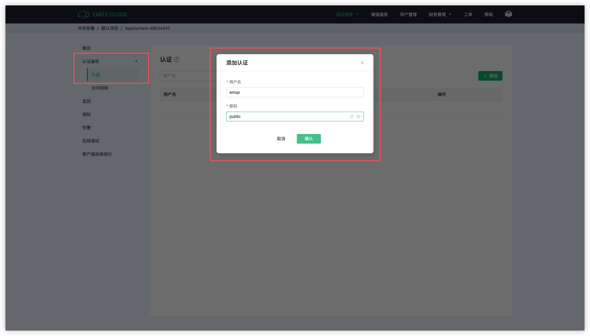
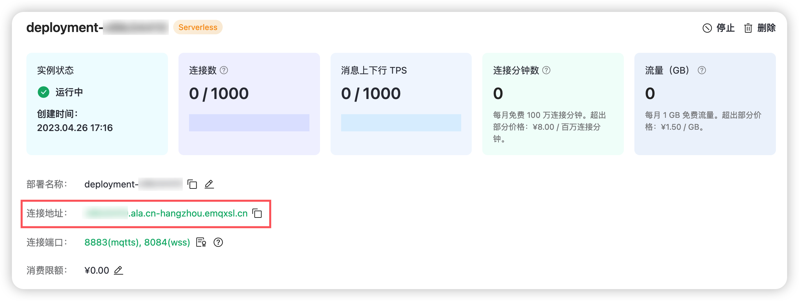
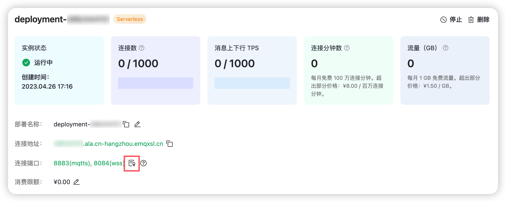

## 前言

[MicroPython](https://micropython.org/) 是 Python3 编程语言的精简高效实现，用 C 编写，经过优化以在微控制器上运行。MicroPython 包含了精选的核心 Python 标准库，也提供了 bluetooth、machine 这类特定的库，以便在 ESP32、Raspberry Pi Pico 这些不同的硬件平台中使用通用的 API 控制硬件底层。

[umqtt](https://github.com/micropython/micropython-lib/tree/master/micropython/umqtt.simple) 是一个用于 MicroPython 的简单 MQTT 客户端，支持消息回调，并且为接收消息提供了阻塞和非阻塞的两种实现。但目前它仅支持 MQTT v3.1.1，并且尚不支持 QoS 2。

本文将主要介绍如何在 MicroPython 中使用 `umqtt` 库，实现客户端与 MQTT 服务端的连接、订阅、收发消息等功能。

## 先决条件

### 1. 安装 MicroPython 固件

如何在 ESP32、ESP8266、Raspberry Pi Pico 这些硬件平台上安装 MicroPython 不是本文的重点，但它是必要的。如果您还没有安装 MicroPython，那么可以先参考这里：

[如何在 ESP32 中安装 MicroPython？](https://docs.micropython.org/en/latest/esp32/tutorial/intro.html#)

[如何在 ESP8266 中安装 MicroPython？](https://docs.micropython.org/en/latest/esp8266/tutorial/intro.html#intro)

[如何在 Raspberry Pi Pico 中安装 MicroPython？](https://www.raspberrypi.com/documentation/microcontrollers/micropython.html#drag-and-drop-micropython)

### 2. 接入网络

在刷入 MicroPython 固件后，我们还需要让设备接入 WiFi 网络，这样才能安装客户端库以及连接到外部的 MQTT Server。

我们可以创建一个 `wifi.py` 文件然后添加以下代码，然后将 "NAME OF YOUR WIFI NETWORK" 和 "PASSWORD OF YOUR WIFI NETWORK" 替换成自己的 WiFi 网络名称和密码：

```
import network
import time

def connect():
	ssid = 'NAME OF YOUR WIFI NETWORK'
	password = 'PASSWORD OF YOUR WIFI NETWORK'
	wlan = network.WLAN(network.STA_IF)
	wlan.active(True)
	wlan.connect(ssid, password)
	while wlan.isconnected() == False:
		print('Waiting for connection...')
		time.sleep(1)
	print('Connected on {ip}'.format(ip=wlan.ifconfig()[0]))
```

我们可以在 `main.py` 文件中引用这个模块并运行 `wifi.connect()`，以便让设备在每次启动后自动连接到网络：

```
import wifi

wifi.connect()
```

> `main.py` 需要自行创建。

## 正式开始

### 创建 EMQX Cloud Serverless 实例

在 [EMQX Cloud](https://www.emqx.com/zh/cloud) 官网首页，点击免费试用，注册一个免费的 EMQX Cloud 账户后，就可以创建一个拥有每月 **1百万** 连接分钟数的免费额度的 EMQX Cloud Serverless 实例：



创建成功后我们将看到一个 Serverless 实例处于运行状态：



由于客户端必须通过身份验证才能接入 Serverless，所以我们还需要进入认证页面，为客户端添加认证信息，这里我们添加了一个用户名为 `emqx`，密码为 `public` 的认证信息：



### 客户端代码

首先，我们导入本示例中将会用到的模块，分别是 `random`、`time`、`json`、`wifi`，以及 `umqtt.simple`：

```
import random
import time
import json
import wifi

from umqtt.simple import MQTTClient
```

#### 连接

接下来，我们需要初始化一些连接信息，分别是 MQTT 服务器地址、端口以及连接时使用的 Client ID、用户名和密码。最后，还有一个我们稍后发布订阅将要使用的主题：

```
SERVER = "xxxx.ala.cn-hangzhou.emqxsl.cn"
PORT = 8883
CLIENT_ID = 'micropython-client-{id}'.format(id=random.getrandbits(8))
USERNAME = 'emqx'
PASSWORD = 'public'
TOPIC = "raspberry/mqtt"
```

MQTT 服务器的连接地址和端口，我们可以通过查看 Serverless 的实例详情得到。



出于通信安全的考虑，EMQX Cloud Serverless 只接受 TLS 连接。我们可以点击 Serverless 实例详情中连接端口右侧的证书图标，下载签发 Serverless 证书的 CA 证书，以便在客户端中信任这个证书。



MicroPython 目前仅支持 PEM 格式的证书，所以我们不需要对证书进行格式转换。以下代码表示，我们将 `cadata` 设置为读取到的 CA 证书文件内容，表示信任该 CA 证书，将 `cert_reqs` 设置为 `ssl.CERT_REQUIRED`，表示客户端将要求服务端在握手时发送证书。

最后，我们还需要通过 `server_hostname` 选项将 SNI 设置为我们的连接地址，这一步是非常必要的，因为 Serverless 需要根据 SNI 来区分租户，而 MicroPython 默认不会发送 SNI，这将导致我们连接失败：

```
with open('emqxsl-ca.crt', 'rb') as f:
    cadata = f.read()
ssl_params = dict()
ssl_params["cert_reqs"] = ssl.CERT_REQUIRED
ssl_params["cadata"] = cadata
ssl_params["server_hostname"] = SERVER
```

除了 SSL 相关的连接参数，我们还需要指定连接地址、Client ID 等信息，完整的连接代码如下：

```python
def connect():
  	with open('emqxsl-ca.crt', 'rb') as f:
        cadata = f.read()
    ssl_params = dict()
    ssl_params["cert_reqs"] = ssl.CERT_REQUIRED
    ssl_params["cadata"] = cadata
    ssl_params["server_hostname"] = SERVER
    client = MQTTClient(CLIENT_ID, SERVER, PORT, USERNAME, PASSWORD, ssl = True, ssl_params = ssl_params)
    client.connect()
    print('Connected to MQTT Broker "{server}"'.format(server=SERVER))
    return client
```

这里我们使用的是 MicroPython 1.20.0，这一版本补充了之前遗漏的 `cert_reqs`、`cadata` 参数。如果你使用的是低于 1.20.0 的版本，那么你将不需要指定 SSL 参数：

```
client = MQTTClient(CLIENT_ID, SERVER, PORT, USERNAME, PASSWORD, ssl = True)
```

当然这也意味着此时客户端将不具备验证服务端身份的能力，这将引入一定的中间人攻击的风险。

#### 设置回调并订阅主题

接下来，我们实现了 `on_message` 回调函数，它的唯一作用就是在消息到达后打印消息的主题和内容。我们需要在订阅主题前将客户端的回调设置为 `on_message` 函数，以免错过消息：

```python
def on_message(topic, msg):
    print("Received '{payload}' from topic '{topic}'\n".format(
        payload=msg.decode(), topic=topic.decode()))

def subscribe(client):
    client.set_callback(on_message)
    client.subscribe(TOPIC)
```

#### 循环发布和接收

在本示例中，我们将使用同一个客户端来进行循环的消息发布和接收。以下代码的主要作用就是不断构造新的消息内容并发布，然后调用 `wait_msg()` 阻塞地等待从 MQTT 服务端转发的消息。一旦消息到达，就会触发 `on_message` 回调打印消息内容，回调完成后我们将等待一秒然后进入下一次循环：

```
def loop_publish(client):
    msg_count = 0
    while True:
        msg_dict = {
            'msg': msg_count
        }
        msg = json.dumps(msg_dict)
        result = client.publish(TOPIC, msg)
        print("Send '{msg}' to topic '{topic}'".format(msg=msg, topic=TOPIC))
        client.wait_msg()
        msg_count += 1
        time.sleep(1)
```

#### 主函数

在主函数中，我们首先调用 `wifi.connect()` 让设备接入网络，然后依次调用前面实现的连接、订阅和循环发布函数：

```
def run():
    wifi.connect()
    client = connect()
    subscribe(client)
    loop_publish(client)

if __name__ == "__main__":
    run()
```

### 测试验证

运行代码，控制台输出如下：

```
Waiting for connection...
Waiting for connection...
Connected on 192.168.0.145
Connected to MQTT Broker "xxxx.ala.cn-hangzhou.emqxsl.cn"
Send '{"msg": 0}' to topic 'raspberry/mqtt'
Received '{"msg": 0}' from topic 'raspberry/mqtt'

Send '{"msg": 1}' to topic 'raspberry/mqtt'
Received '{"msg": 1}' from topic 'raspberry/mqtt'

Send '{"msg": 2}' to topic 'raspberry/mqtt'
Received '{"msg": 2}' from topic 'raspberry/mqtt'
```

## 更多内容

现在，我们已经成功演示了如何在 MicroPython 中使用 `umqtt` 客户端库连接到 EMQX Cloud Serverless，你可以在 [这里](https://github.com/emqx/MQTT-Client-Examples/tree/master/mqtt-client-Micropython) 下载示例代码。同时也可以在 [GitHub](https://github.com/emqx/MQTT-Client-Examples)上找到更多其他语言的 Demo 示例。
