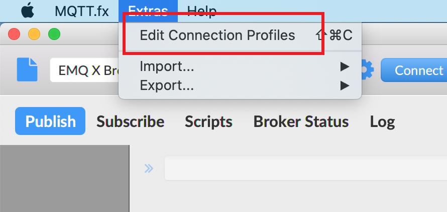
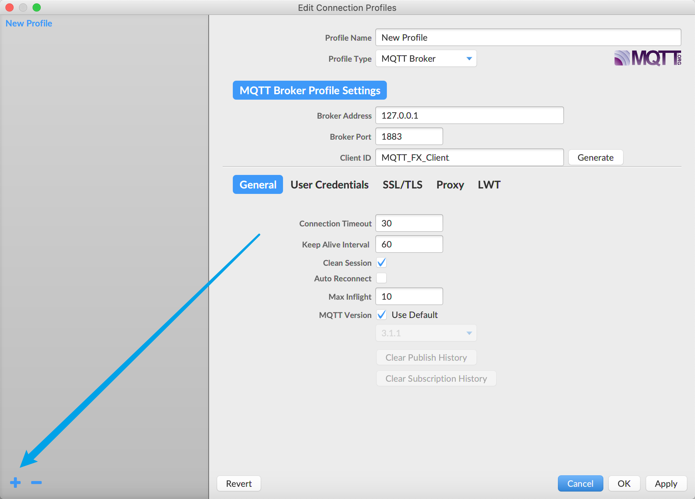
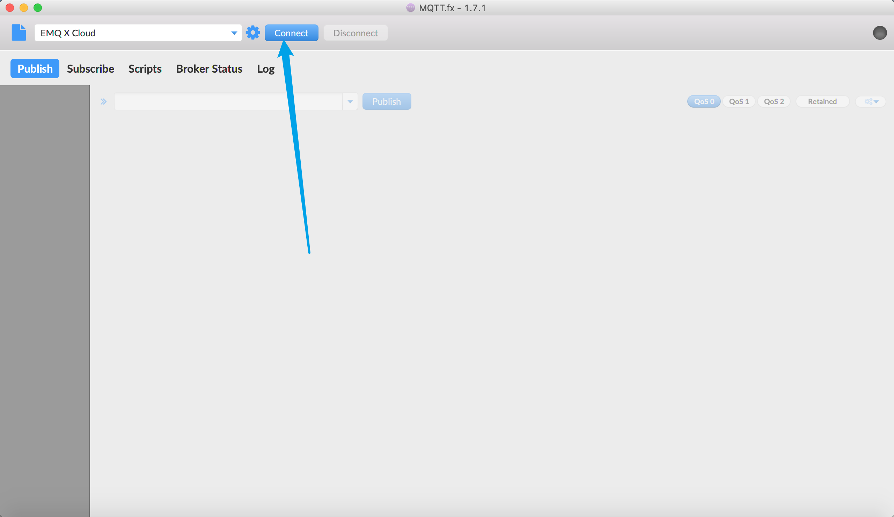

# 连接 MQTT.fx

本文将以 MQTT.fx 作为 MQTT 客户端测试工具，接入 MQTT 云服务 - EMQX Cloud 部署。

[MQTT.fx](http://www.mqttfx.jensd.de/) 是目前最为流行的 MQTT 桌面客户端工具，[MQTT.fx](http://www.mqttfx.jensd.de/) 1.0 Major 版本由 [Jens Deters](https://www.jensd.de/wordpress/) 使用 [JavaFX](https://en.wikipedia.org/wiki/JavaFX) 技术开发，即为 Java 虚拟机应用。遗憾的是 [MQTT.fx](http://www.mqttfx.jensd.de/) 目前已经停止维护，并转为由 Softblade 公司资助开发另发行了其商业版本 [MQTT.fx® 5.0](https://softblade.de/en/mqtt-fx/)，采用收费许可证方式经营该软件。本文中的 [MQTT.fx](http://www.mqttfx.jensd.de/) 不经特殊说明即特指 1.0 版本。

支持 TCP、TLS 协议，**但不支持 WebSocket**。

## 前提条件

> 1. [安装](http://www.mqttfx.jensd.de/index.php/download) MQTT.fx 客户端
> 2. 已在 EMQX Cloud 创建部署，并且部署状态为 **运行中**

## 连接配置

### Broker 信息

部署概览页面可获取到连接地址和连接端口（以下 **xxxxx 表示随机端口**，具体端口信息**以部署概览页面信息为准**）。

- 专业版地址：IP；端口：默认开启 1883(mqtt)、8083(ws)，您可以通过配置 TLS/SSL 开启 8883(mqtts) 和 8084(wss) 端口
- 基础版地址：以 emqx.cloud 后缀结尾的域名；端口：xxxxx(mqtt)，xxxxx(ws)，xxxxx(mqtts)，xxxxx(wss)

### 认证信息

EMQX Cloud 所有部署均开启了用户认证，因此使用 MQTT.fx 进行测试连接时，**需要填写用户名和密码字段**。

> 在 `认证鉴权` > `认证` 中设置用户名和密码，可逐一添加，也可批量导入认证信息

## 连接

1. 打开连接配置

   

2. 新建连接配置，并填写相关配置

   

3. 连接到部署

   

## 更多内容

更多订阅、发布等功能请参考：[使用 MQTT.fx 接入 EMQX Cloud](https://www.emqx.com/zh/blog/connecting-to-emqx-cloud-with-mqttfx)
