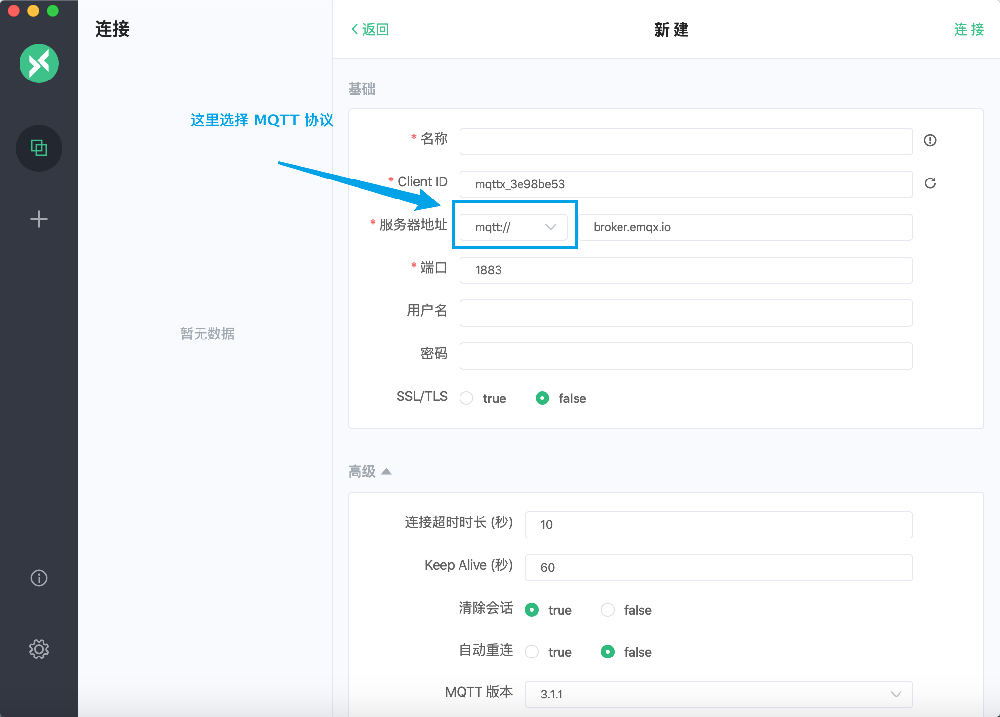
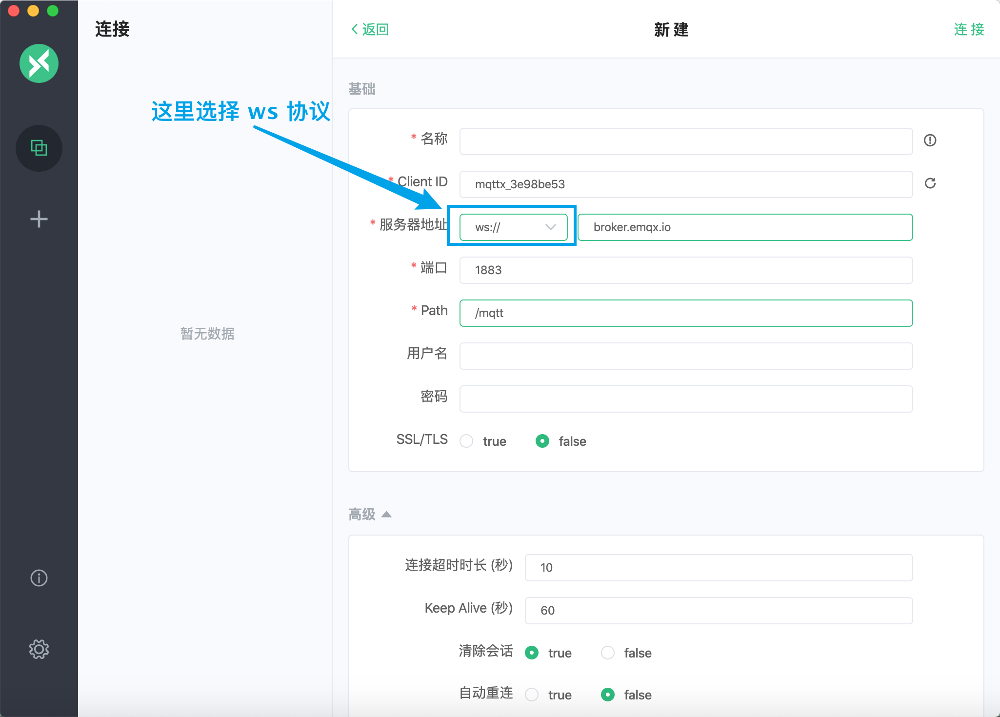
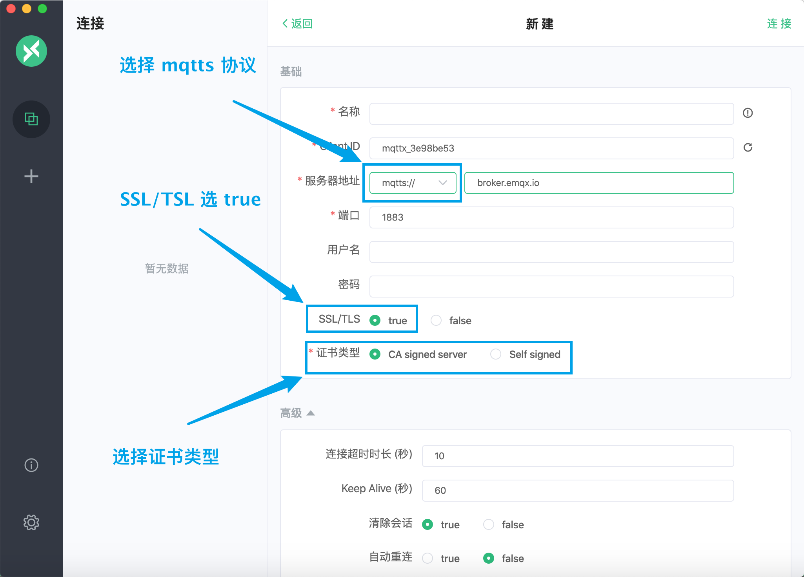
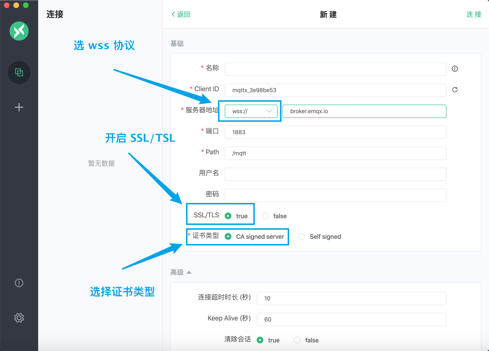

# 连接 MQTTX

本文将介绍以 MQTTX 作为 MQTT 客户端测试工具，接入 MQTT 云服务 - EMQX Cloud 部署。

[MQTTX](https://mqttx.app/zh) 是 [EMQ](https://emqx.com/zh) 开源的一款优雅的跨平台 MQTT 5.0 客户端工具，它支持 macOS、Linux 和 Windows，并且支持 MQTT 消息格式转换。

[MQTTX](https://mqttx.app/zh) 的用户界面借助聊天软件的形式简化了页面的操作逻辑，用户可以快速创建连接保存并同时建立多个连接客户端，方便用户快速测试 `MQTT/TCP`、`MQTT/TLS`、和 `MQTT/WebSocket` 的 `连接/发布/订阅` 功能及其他特性。

## 前提条件

> 1. [安装](https://www.emqx.com/zh/downloads/MQTTX) MQTTX 客户端工具
> 2. 已在 EMQX Cloud 创建部署，并且部署状态为 **运行中**

在下载和安装前请访问我们的 [官网](https://mqttx.app/zh) 或者是 [GitHub](https://github.com/emqx/MQTTX) 来了解并获取到最新的版本信息，使用最新版本有助于提高使用体验。如果你对本项目了解也可以直接 Clone [MQTTX](https://github.com/emqx/MQTTX) 的仓库源码，自行打包和使用。使用过程中，有任何问题都可以到 [GitHub issues](https://github.com/emqx/MQTTX/issues) 来发表问题和看法或者是 Fork 我们的项目，并向我们提交修改后的 PR，我们将会认真查阅和回复。

## 连接配置

### Broker 信息

部署概览页面可获取到连接地址和连接端口（以下 **xxxxx 表示随机端口**，具体端口信息**以部署概览页面信息为准**）。

- 专业版地址：IP；端口：默认开启 1883(mqtt)、8083(ws)，您可以通过配置 TLS/SSL 开启 8883(mqtts) 和 8084(wss) 端口
- 基础版地址：以 emqx.cloud 后缀结尾的域名；端口：xxxxx(mqtt)，xxxxx(ws)，xxxxx(mqtts)，xxxxx(wss)
- BYOC 地址：部署时指定的域名；端口：1883(mqtt)，8083(ws)，8883(mqtts)，8884(wss)

### 认证信息

EMQX Cloud 所有部署均开启了用户认证，因此使用 MQTTX 进行测试连接时，**需要填写用户名和密码字段**。

> 在 **访问控制** > **客户端认证** 中设置用户名和密码，可逐一添加，也可批量导入认证信息。

### 连接协议

- 通过 MQTT 协议连接到部署

  

- 通过 WebSocket 协议连接到部署

  

- 通过 MQTT over TLS/SSL 协议连接到部署

  

- 通过 WebSocket over TLS/SSL 协议连接到部署

  

### 名称和客户端 ID

名称是本次连接的一个标识，客户端 ID 已经被默认填写，可以点击右侧的刷新图标进行刷新。正确填写上诉信息后，点击右上角的连接按钮即可连接到 EMQX Cloud 部署。

## 更多内容

- 更多订阅、发布等功能请参考：[MQTTX 桌面客户端使用指南](https://www.emqx.com/zh/blog/mqtt-x-guideline)
- [MQTTX 脚本功能使用教程](https://www.emqx.com/zh/blog/mqttx-script-function-tutorial)
- [MQTTX - 优雅的跨平台 MQTT 5.0 桌面客户端](https://www.emqx.com/zh/blog/mqtt-x-elegant-cross-platform-mqtt5.0-desktop-client)
