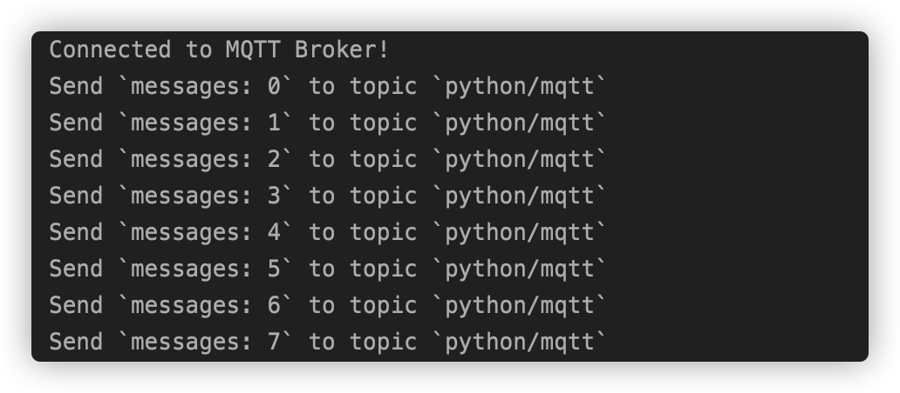
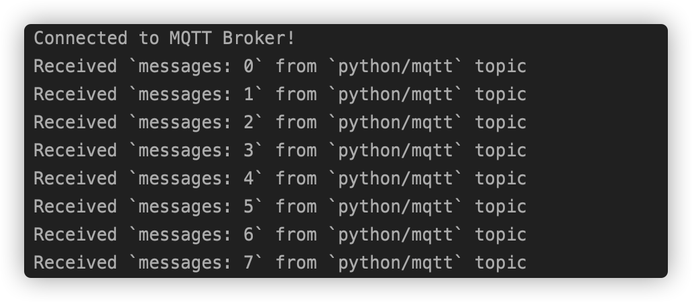

# 使用 Python SDK 连接到部署

本文主要介绍如何在 Python 项目中使用 **paho-mqtt** 客户端库 ，实现客户端与 MQTT 服务器的连接、订阅、取消订阅、收发消息等功能。

[Python](https://www.python.org/) 是一种广泛使用的解释型、高级编程、通用型编程语言。
Python 的设计哲学强调代码的可读性和简洁的语法（尤其是使用空格缩进划分代码块，而非使用大括号或者关键词）。
Python 让开发者能够用更少的代码表达想法，不管是小型还是大型程序，该语言都试图让程序的结构清晰明了。

## 前提条件

已经创建了部署，在部署概览下可以查看到连接相关的信息，同时你可以使用 WebSocket 先测试连接到 MQTT 服务器。

本项目使用 Python 3.8 进行开发测试，可用如下命令确认 Python 的版本。

```
➜  ~ python3 --version             
Python 3.8.6
```

## 安装使用客户端

[paho-mqtt](https://www.eclipse.org/paho/clients/python/) 是目前 Python 中使用较多的 MQTT 客户端库，
它在 Python 2.7.9+ 或 3.6+ 上为客户端类提供了对 MQTT v5.0，v3.1 和 v3.1.1 的支持。它还提供了一些帮助程序功能，使将消息发布到 MQTT 服务器变得非常简单。

1. Pip 是 Python 包管理工具，该工具提供了对 Python 包的查找、下载、安装、卸载的功能，使用以下命令安装 paho-mqtt。

```bash
pip install paho-mqtt
```

2. 导入 Paho MQTT 客户端

```python
from paho.mqtt import client as mqtt_client
```

## 连接

请在控制台的部署概览找到相关的地址以及端口信息，需要注意如果是基础版，端口不一定是 1883 或 8883 端口，请确认好端口

### 连接设置

设置 MQTT Broker 连接地址，端口以及 topic，同时我们调用 Python `random.randint` 函数随机生成 MQTT 客户端 id。

```python
broker = 'broker.emqx.io'
port = 1883
topic = 'python/mqtt'
client_id = f'python-mqtt-{random.randint(0, 1000)}'
# 如果 broker 需要鉴权，设置用户名密码
username = 'emqx'
password = '**********'
```

### 编写 MQTT 连接函数

编写连接回调函数 `on_connect`，该函数将在客户端连接后被调用，在该函数中可以依据 `rc` 来判断客户端是否连接成功。

```python
def connect_mqtt():
    def on_connect(client, userdata, flags, rc):
        if rc == 0:
            print("Connected to MQTT Broker!")
        else:
            print("Failed to connect, return code %d\n", rc)
    # Set Connecting Client ID
    client = mqtt_client.Client(client_id)
    client.username_pw_set(username, password)
    client.on_connect = on_connect
    client.connect(broker, port)
    return client
```

## 发布和订阅

### 发布消息

首先定义一个 while 循环语句，在循环中我们将设置每秒调用 MQTT 客户端 `publish` 函数向 `python/mqtt` 主题发送消息。

```python
 def publish(client):
     msg_count = 0
     while True:
         time.sleep(1)
         msg = f"messages: {msg_count}"
         result = client.publish(topic, msg)
         # result: [0, 1]
         status = result[0]
         if status == 0:
             print(f"Send `{msg}` to topic `{topic}`")
         else:
             print(f"Failed to send message to topic {topic}")
         msg_count += 1
```

### 订阅消息

编写消息回调函数 `on_message`，该函数将在客户端从 MQTT Broker 收到消息后被调用，在该函数中我们将打印出订阅的 topic 名称以及接收到的消息内容。

```python
def subscribe(client: mqtt_client):
    def on_message(client, userdata, msg):
        print(f"Received `{msg.payload.decode()}` from `{msg.topic}` topic")

    client.subscribe(topic)
    client.on_message = on_message
```

## 完整代码

**消息发布代码**

```python
# python 3.8

import random
import time

from paho.mqtt import client as mqtt_client


broker = 'broker.emqx.io'
port = 1883
topic = "python/mqtt"
# generate client ID with pub prefix randomly
client_id = f'python-mqtt-{random.randint(0, 1000)}'
username = 'emqx'
password = '**********'


def connect_mqtt():
    def on_connect(client, userdata, flags, rc):
        if rc == 0:
            print("Connected to MQTT Broker!")
        else:
            print("Failed to connect, return code %d\n", rc)

    client = mqtt_client.Client(client_id)
    client.username_pw_set(username, password)
    client.on_connect = on_connect
    client.connect(broker, port)
    return client


def publish(client):
    msg_count = 0
    while True:
        time.sleep(1)
        msg = f"messages: {msg_count}"
        result = client.publish(topic, msg)
        # result: [0, 1]
        status = result[0]
        if status == 0:
            print(f"Send `{msg}` to topic `{topic}`")
        else:
            print(f"Failed to send message to topic {topic}")
        msg_count += 1


def run():
    client = connect_mqtt()
    client.loop_start()
    publish(client)


if __name__ == '__main__':
    run()
```

**消息订阅代码**

```python
# python3.8

import random

from paho.mqtt import client as mqtt_client


broker = 'broker.emqx.io'
port = 1883
topic = "python/mqtt"
# generate client ID with pub prefix randomly
client_id = f'python-mqtt-{random.randint(0, 100)}'
username = 'emqx'
password = '**********'


def connect_mqtt() -> mqtt_client:
    def on_connect(client, userdata, flags, rc):
        if rc == 0:
            print("Connected to MQTT Broker!")
        else:
            print("Failed to connect, return code %d\n", rc)

    client = mqtt_client.Client(client_id)
    client.username_pw_set(username, password)
    client.on_connect = on_connect
    client.connect(broker, port)
    return client


def subscribe(client: mqtt_client):
    def on_message(client, userdata, msg):
        print(f"Received `{msg.payload.decode()}` from `{msg.topic}` topic")

    client.subscribe(topic)
    client.on_message = on_message


def run():
    client = connect_mqtt()
    subscribe(client)
    client.loop_forever()


if __name__ == '__main__':
    run()
```

## 测试验证

运行代码，控制台输出如下

### 消息发布



### 消息订阅



## 下一步

以上为您演示了如何使用 paho.mqtt.m2mqtt 客户端库连接到 EMQ X Cloud，可以在 [这里](https://github.com/emqx/MQTT-Client-Examples/tree/master/mqtt-client-Python3/) 下载到示例的源码。
同时也可以在 [GitHub](https://github.com/emqx/MQTT-Client-Examples) 上找到更多其他语言的 Demo 示例。