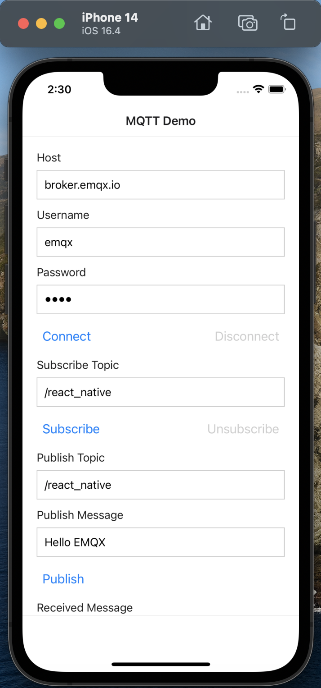
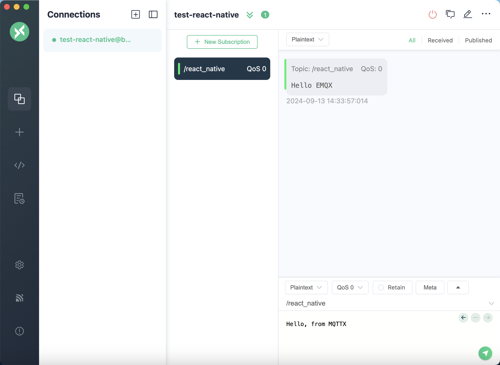
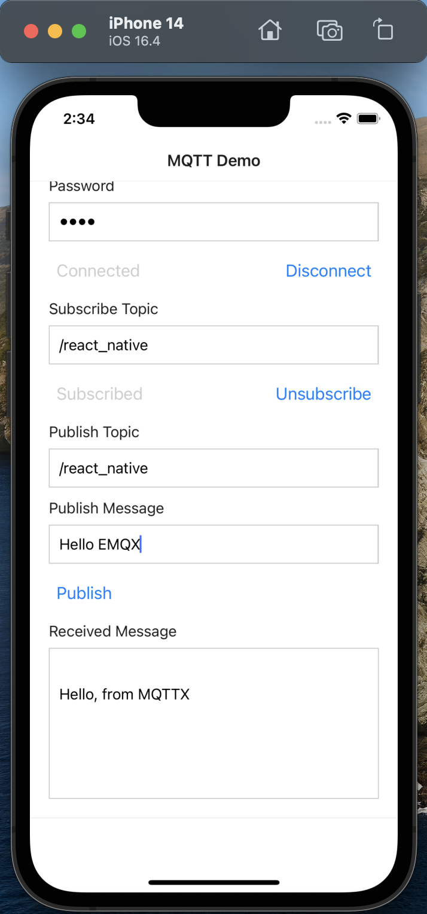

# 使用 React Native 通过 MQTT.js 连接到部署

本文主要介绍如何在使用 Expo 创建的 React Native 项目中使用 `MQTT.js` ，实现客户端与 MQTT 服务器的连接、订阅、收发消息、取消订阅等功能。

## 前置准备

### 获得 MQTT 服务器

- 使用 EMQX 提供的[免费公共 MQTT 服务器](https://www.emqx.com/zh/mqtt/public-mqtt5-broker)（仅支持单向认证），该服务基于 EMQX 的[全托管的 MQTT 消息云服务](https://www.emqx.com/zh)创建。服务器连接信息如下：

  - 连接地址: **broker.emqx.io**
  - WebSocket 端口: **8083**
  - WebSocket TLS/SSL 端口: **8084**

- 您也可以自己[创建 EMQX Platform 部署](../create/overview.md)，待部署状态为**运行中**，点击部署卡片进入概览页面便可获取相关连接信息。此外，您还需在部署的**访问控制** -> **客户端认证**页面中设置用户名和密码，用于后续的连接验证。

### 创建 React Native Expo 应用

使用 Expo CLI 创建 React Native 应用：

```shell
npx create-expo-app@latest mqtt-test
```

参考链接：[https://docs.expo.dev/get-started/create-a-project/](https://docs.expo.dev/get-started/create-a-project/)。

## 安装依赖

[MQTT.js](https://github.com/mqttjs/MQTT.js) 是一个完全开源的 MQTT 协议的客户端库，使用 JavaScript 编写，可用于 Node.js 和浏览器环境。有关 `MQTT.js` 的更多内容和使用方法，您可以前往查阅 [MQTT.js GitHub 页面](https://github.com/mqttjs/MQTT.js#table-of-contents)。

MQTT.js 支持通过 npm、yarn 或 pnpm 进行安装。本文使用 npm 进行安装。

1. 使用 npm 命令安装：

   ```shell
   npm install mqtt
   # or
   yarn add mqtt
   # or
   pnpm add mqtt
   ```

2. 在使用到的地方引入 MQTT.js：

   ```js
   import mqtt from "mqtt";
   ```

## 通过 WebSocket 端口连接

通过以下代码设置客户端 ID、用户名及密码，客户端 ID 应具有唯一性。

```js
const clientId =
  "emqx_react_native_" + Math.random().toString(16).substring(2, 8);
const username = "emqx_test";
const password = "emqx_test";
```

通过以下代码建立客户端与 MQTT Broker 的连接。

```js
const client = mqtt.connect("ws://broker.emqx.io:8083/mqtt", {
  clientId,
  username,
  password,
  // ...other options
});
```

## 通过 WebSocket TLS/SSL 端口连接

启用 TLS/SSL 加密时，连接[参数选项](https://github.com/mqttjs/MQTT.js#mqttclientstreambuilder-options)与通过 WebSocket 端口建立连接一致，您只需注意将协议改为 `wss`，且匹配正确的端口号即可。

通过以下代码建立客户端与 MQTT Broker 的连接。

```js
const client = mqtt.connect("wss://broker.emqx.io:8084/mqtt", {
  clientId,
  username,
  password,
  // ...other options
});
```

## 订阅和发布

### 订阅主题

设置将要订阅的主题及对应 [QoS 等级](https://www.emqx.com/zh/blog/introduction-to-mqtt-qos)。

```javascript
const doSubscribe = () => {
  setSubBtnText("Subscribing...");
  client?.subscribe(subTopic, { qos: 0 }, (error) => {
    if (error) {
      console.error("Failed to subscribe to topic:", subTopic, error);
      setSubBtnText("Subscribe");
    } else {
      setSubBtnText("Subscribed");
      console.log("Subscribed to topic:", subTopic);
    }
  });
};
```

### 取消订阅

通过以下代码取消订阅，此时应指定取消订阅的主题。

```javascript
const doUnsubscribe = () => {
  client?.unsubscribe(subTopic, {}, (error) => {
    if (error) {
      console.error("Failed to unsubscribe from topic:", subTopic, error);
      setSubBtnText("Subscribe");
    } else {
      console.log("Unsubscribed from topic:", subTopic);
      setSubBtnText("Subscribe");
    }
  });
};
```

### 发布消息

```javascript
const doPublish = () => {
  client?.publish(pubTopic, pubMessage, { qos: 0 }, (error) => {
    if (error) {
      console.error("Failed to publish message:", error);
    } else {
      console.log("Message published to topic:", pubTopic);
    }
  });
};
```

### 接收消息

通过以下代码指定客户端对消息事件进行监听，并在收到消息后执行回调函数，保存接收到的消息。

```js
client.on("message", (topic, payload) => {
  setReceivedMsg((prevMsg) => {
    return prevMsg.concat(`\n${payload.toString()}`);
  });
});
```

### 断开连接

如客户端希望主动断开连接，可以通过如下代码实现：

```javascript
const doDisconnect = () => {
  client?.end();
  setClient(null);
  setConnectBtnText("Connect");
};
```

以上部分仅列出了一些关键代码，项目完整代码请见：[MQTT Client - React-Native-Expo](https://github.com/emqx/MQTT-Client-Examples/tree/master/mqtt-client-React-Native-Expo)，您可以进行下载并体验。

## 测试验证

我们使用 React Native 编写了如下简单的应用，该应用具备：创建连接、订阅主题、收发消息、取消订阅、断开连接等功能。



使用 [MQTT 5.0 客户端工具 - MQTTX](https://mqttx.app/zh) 作为另一个客户端进行消息收发测试。



可以看到 MQTTX 可以正常接收来自 React Native 应用发送的消息。同样，使用 MQTTX 向该主题发送一条消息时，也可以看到 React Native 端可以正常接收到该消息。



## 更多内容

综上所述，我们实现了在 React Native 项目中创建 MQTT 连接，模拟了客户端与 MQTT 服务器进行订阅、收发消息、取消订阅以及断开连接的场景。

可以在 [MQTT Client - React-Native-Expo](https://github.com/emqx/MQTT-Client-Examples/tree/master/mqtt-client-React-Native-Expo) 下载完整的示例源码，同时也欢迎前往 [MQTT Client 示例页面](https://github.com/emqx/MQTT-Client-Examples)探索更多其他语言的 Demo 示例。
