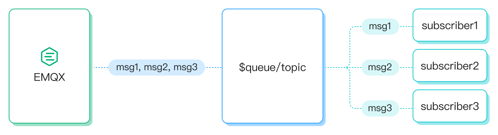

# 共享订阅

共享订阅是一种订阅模式，用于在多个订阅者之间实现负载均衡。客户端可以分为多个订阅组，消息仍然会被转发到所有订阅组，但每个订阅组内只有一个客户端接收消息。EMQX Platform 支持两种格式的共享订阅前缀，分别为带群组的共享订阅（前缀为 `$share/<group-name>/`）和不带群组的共享订阅（前缀为 `$queue/`）。两种共享订阅格式示例如下：

| 前缀格式     | 示例           | 前缀        | 真实主题名 |
| ------------ | -------------- | ----------- | ---------- |
| 带群组格式   | $share/abc/t/1 | $share/abc/ | t/1        |
| 不带群组格式 | $queue/t/1     | $queue/     | t/1        |

您可以使用客户端工具连接 EMQX Platform 并尝试这个消息服务。 本页介绍了共享订阅的机制并演示了如何使用 [MQTTX Desktop](https://mqttx.app/zh) 来模拟客户端尝试通过共享订阅来接收消息。

## 带群组的共享订阅

您可以通过在原始主题前添加 `$share/<group-name>` 前缀为分组的订阅者启用共享订阅。组名可以是任意字符串。EMQX Platform 同时将消息转发给不同的组，属于同一组的订阅者可以使用负载均衡接收消息。

例如，如果订阅者 `s1`、`s2` 和 `s3` 是组 `g1` 的成员，订阅者 `s4` 和 `s5` 是组 `g2` 的成员，而所有订阅者都订阅了原始主题 `t1`。共享订阅的主题必须是 `$share/g1/t1` 和 `$share/g2/t1`。当 EMQX 发布消息 `msg1` 到原始主题 `t1` 时：

- EMQX Platform 将 `msg1` 发送给 `g1` 和 `g2` 两个组。
- `s1`、`s2`、`s3` 中的一个订阅者将接收 `msg1`。
- `s4` 和 `s5` 中的一个订阅者将接收 `msg1`。

## 不带群组的共享订阅

以 `$queue/` 为前缀的共享订阅是不带群组的共享订阅。它是 `$share` 订阅的一种特例。您可以将其理解为所有订阅者都在一个订阅组中，如 `$share/$queue`。

## 共享订阅与会话

在 MQTT 客户端中，共享订阅和持久会话功能的概念存在矛盾，因此无法同时使用这两个特性。如果您正在使用共享订阅功能，则必须通过将 `clean_session` 参数设置为 `true` 来启用 clean session 功能。

持久会话功能（`clean_session=false`）确保订阅者在重新连接后可以立即恢复数据流，而无需丢失任何消息。这对于确保可靠的消息传递至关重要。通过将 `clean_session` 参数设置为 `false`，即使客户端离线，会话仍将持续存在，使设备可以继续接收消息。然而，由于设备处于离线状态，可能无法及时处理接收到的消息，导致消息在会话中随着时间的推移积累。

当启用共享订阅功能并且同一组内的另一个设备接管离线设备的数据流时，它将不会收到任何已积累的消息，因为这些消息被视为原始设备会话的一部分。因此，如果设备长时间保持离线状态，持久会话的消息缓冲区可能会溢出，导致消息丢失。这种情况会影响负载平衡，并最终导致内存和存储资源耗尽，对系统的稳定性和性能产生负面影响。

更多关于持久会话功能的信息，参阅 [MQTT 持久会话与 Clean Session 详解](https://www.emqx.com/zh/blog/mqtt-session)。

## 使用 MQTTX 测试共享订阅

1. 使用 MQTTX 模拟客户端订阅。

* s1，s2 订阅主题 `$share/g1/test`，为带群组的共享订阅
* s3 订阅主题 `test` 为普通订阅

2. 使用 MQTTX 创建客户端 p1 向主题 `test` 发送3条信息。

3. 3个订阅者中，s1 接收到msg1，msg2，而 s2 接收到 msg3，s3 接收到所有3条 msg 信息。

您可以查看[教程视频](https://player.bilibili.com/player.html?aid=254440768&bvid=BV1vY411G74L&cid=541242226&page=1)进一步了解。
