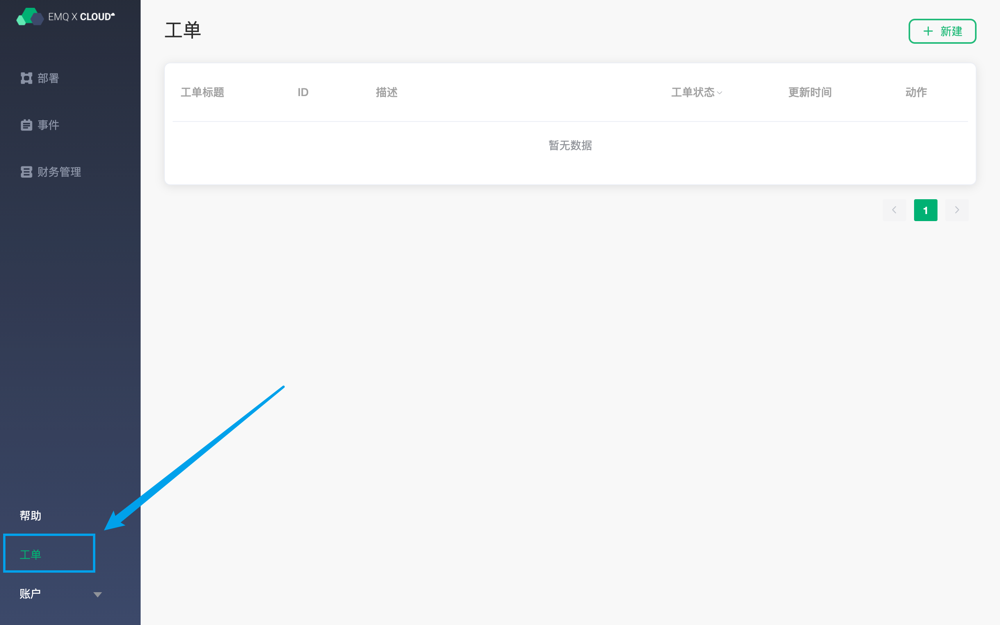
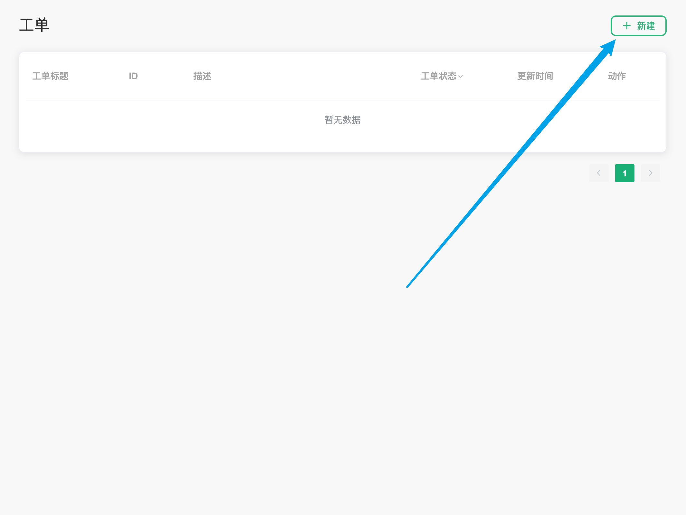
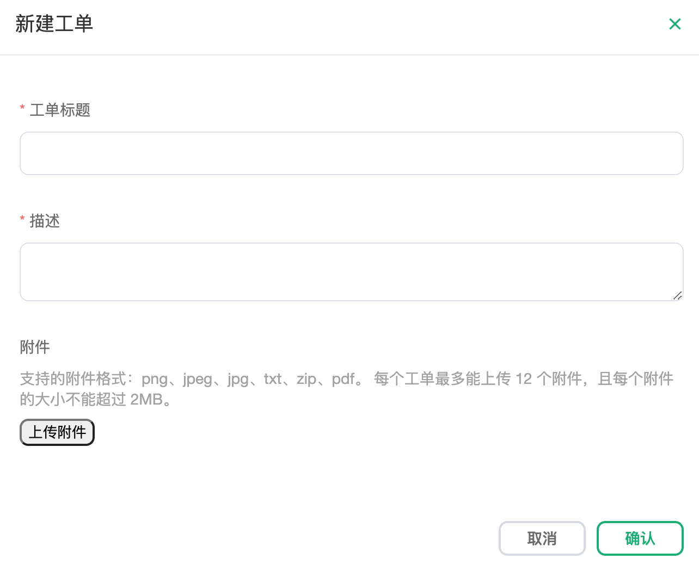
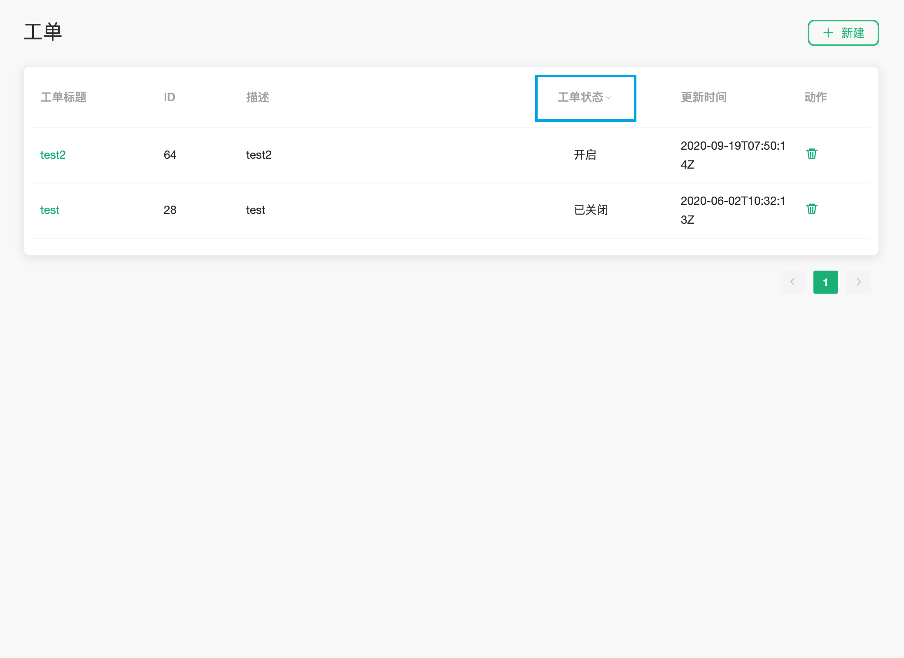

# 联系我们

## 工单联系

您可以通过下面的步骤进入进入工单系统：

1. 登录 [EMQ X Cloud 控制台](https://cloud.emqx.io/console/)
2. 点击左下角的 `工单`

### 创建工单

1. 点击右上角的 `新建`
2. 在弹出的页面中输入 `工单标题`、`描述`

### 查看工单

你可以点击 `工单状态` 对工单的状态进行筛选

