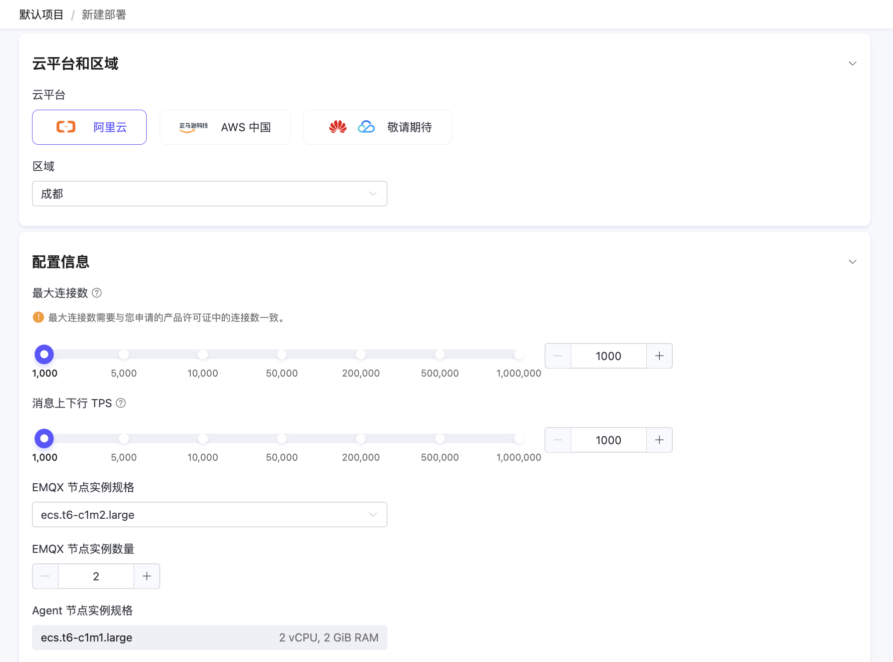
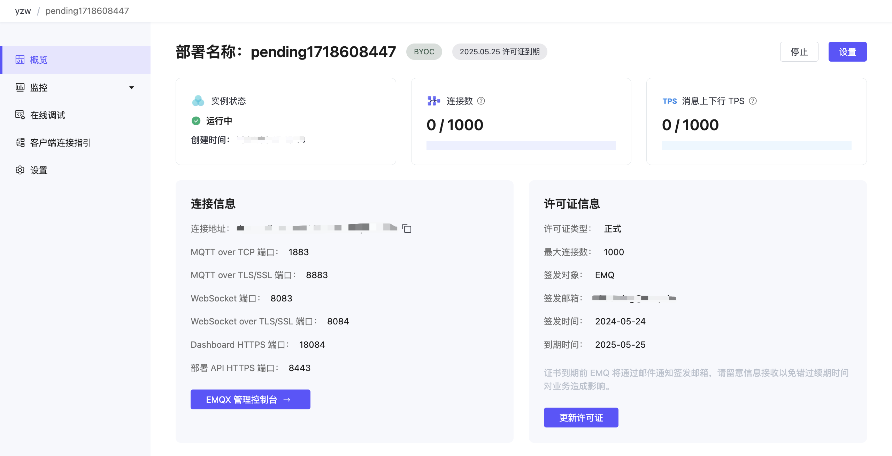

# 创建 BYOC 部署

作为一款 MQTT 消息中间件，EMQX Cloud BYOC 支持在您自己的云基础设施中创建部署，确保数据只在您的环境中，安全可控。这种部署方式可以提高数据安全性和可控性，同时也可以避免数据泄漏等风险。另外，EMQX Cloud BYOC 还能够提供更好的性能和可扩展性，以满足不同场景下的需求。本节将介绍如何创建和使用 BYOC 部署。

## 前置准备

创建 BYOC 部署前，您应首先准备好对应公有云的账号、做好云资源规划、并申请 EMQX Cloud BYOC 产品许可证等。详细信息，请参考[部署前置准备页面](../deployments/byoc_prerequisite.md)。

## 准备部署

1. 登录账户，进入 EMQX Cloud [控制台](https://cloud.emqx.com/console/)。

2. 在控制台首页或部署列表页，点击**新建部署**。

3. 点击 BYOC 面板上的**前往部署**。

4. 依据您的需求选择相应规格配置。

   

   **云平台相关配置**

   - **选择云平台**：选择**阿里云**。

     如您希望部署在其他云平台，可通过[工单](../feature/tickets.md)或邮件（cloud-support@emqx.io）联系我们。

   - **选择区域**：选择待部署的区域。

     如您希望部署在其他区域，可通过 [工单](../feature/tickets.md) 或邮件（cloud-support@emqx.io）联系我们。

   - **部署名称**：填写具有业务意义的部署名称。

   - **VPC 网段**：选择用于创建 VPC 的私网地址范围。

   **EMQX 集群相关配置**
   ::: tip
   最大连接数需要与您申请的 EMQX Cloud BYOC 许可证保持一致。部署完成后，如需修改相关配置，可通过工单联系我们。
   :::
   - **最大连接数**：指定部署集群的 MQTT 设备最大连接数。部署完成后，也可通过工单联系我们进行升降此部署规格。

   - **消息上下行 TPS**：指定部署集群的消息上下行的每秒事务处理数（TPS）。

   - **EMQX 节点实例规格**：系统将自动根据**最大连接数**和**消息上下行 TPS** 填入推荐的实例规格，您也可以实际业务需求修改实例规格。

   - **EMQX 节点实例数量**：系统将自动根据**最大连接数**和**消息上下行 TPS** 填入推荐的实例数量，您也可以实际业务需求修改节点的数量（2-5 个节点）。

5. 点击**下一步**进入**高级配置**，依据您的需求添加云资源标签，便于后续识别和管理，最多支持 10 个标签。

6. 点击**下一步**进入**确认**页面。核对并确认上述步骤指定的配置信息，同时您也可以在此设置部署所属的项目。信息确认后，点击**前往部署**。

接下来，我们将根据右侧 **部署指南**中的步骤正式开始部署。

## 执行部署

我们将在联网的 Ubuntu 20.04 (AMD64) LTS 环境中完成部署，正式部署前，请首先将部署所需的 TLS / SSL 证书和 BYOC 许可证文件提前复制到您的 Ubuntu 环境目录。

1. 打开提前准备好的 Ubuntu 20.04 (AMD64) LTS 环境。注意：此 Ubuntu 应能够直接访问互联网。

2. 在 Ubuntu 命令行界面，使用以下命令下载工具包，并保存到您的 Ubuntu 目录中。<!--这里有客户需要替换的地方吗？-->
	
	```bash
	wget https://cloudassets.emqx.com/cn/byoc-deployments/1.0/create-aliyun-byoc-deployment.tar.gz
	```

3. 在 Ubuntu 命令行界面，通过以下命令解压缩，然后导航到解压后的文件夹目录。

   ```bash
   tar -zxvf create-aliyun-byoc-deployment.tar.gz && cd create-aliyun-byoc-deployment
   ```

4. 运行以下命令执行部署。

   ```bash
   ./byoc create \
         --accessKey <Your AccessKey> \
         --secretKey <Your SecretKey> \
         --domain <Your Domain> \
         --sslCertPath <Your Domain SSL Absolute Cert Path>  \
         --emqxLicPath <Your EMQX License Absolute Path> \
         --byocEndpoint https://cloud.emqx.com \
         --byocKey abcdXXXXXXXXXX111
   ```

   注意：执行 `./byoc create` 命令前，请将以下字段填充为实际参数：

   - `--accessKey`：您公有云账号的 AccessKey ID。阿里云平台可以在 [工作台 RAM 访问控制](https://ram.console.aliyun.com/manage/ak) 中查看。
   - `--secretKey`：您公有云账号的 AccessKey Secret。请使用与 AccessKey ID 对应的 AccessKey Secret。
   - `--domain` ：输入部署中 MQTT 服务的域名，后续客户端将通过此域名访问 MQTT 服务。
   - `--sslCertPath`：指定 TLS/SSL 证书所在的绝对路径，支持 **自签名证书** 和 **CA 签名证书**。SSL 证书格式要求请参考 [TLS/SSL 配置 - 证书要求](../deployments/tls_ssl.md#证书要求)。注：BYOC 提供 **自定义单向** TLS/SSL 认证。
   - `--emqxLicPath`：输入 EMQX Cloud BYOC 许可证文件所在的绝对路径。

   此外，上述命令中的 `--byocEndpoint` 为 EMQX Cloud 访问地址，`--byocKey` 为 BYOC 部署的认证密钥，在控制台生成部署指引时已自动填入相应的值，请勿修改。其中生成的 byocKey 有效期为一小时，请在生成脚本命令后尽快执行。

5. 等待数分钟，系统提示确认需要创建的云资源，输入 `yes` 回车后继续。

   ```bash
   Do you want to perform these actions?
     Terraform will perform the actions described above.
     Only 'yes' will be accepted to approve.
   
     Enter a value: 
   ```

## 添加 DNS 记录

部署创建完成后，系统将返回以下内容。您可根据返回的 IP 地址，在 DNS 服务中添加一条域名解析记录，将部署的公网 IP 与您的域名进行绑定。

```bash
Apply complete! Resources: 30 added, 0 changed, 0 destroyed.

Outputs:
cloud_register_data = <sensitive>
jwt_token = <sensitive>
lb_address = "120.55.12.49"
vpc_id = "vpc-bp1wllXXXXXXXXX5j8i0"
*****************************
You need add a record to your DNS service provider.
IP address: 120.55.12.49
Domain: myexample.mqttce.com
*****************************
Checking if https://myexample.mqttce.com is resolved to the 120.55.12.49 of the load balancer
```

您可以选择主流云平台提供的 DNS 解析服务。以阿里云平台的云解析 DNS 服务为例，您可以根据 [云解析 DNS - 添加网站解析页面](https://help.aliyun.com/document_detail/106535.html) 的操作步骤，添加一条域名解析记录。关于 DNS 和域名解析等基本概念，请参考 [DNS 概念](https://help.aliyun.com/document_detail/102237.html)。

解析记录生效时，系统将返回 `HTTPS listener is ready`。

```bash
HTTPS listener is ready
```

## 完成部署
完成域名解析后，Ubuntu 命令行界面将输出以下内容，说明该部署执行成功。
```bash
The deployment is successful! Here is the service information:
--------------------------------------------------------
EMQX service connection address: <Your Custom Domain>
You can log in to the EMQX Cloud Console(https://cloud.emqx.com/console)
to manage your deployment.
--------------------------------------------------------
Thank you for choosing our service. Happy IoT!
```

## 部署概览

返回**部署指南**页面，点击**完成部署**。系统随机将跳转到控制台页面，点击 BYOC 部署卡片进入概览页面，可获取到部署实时状态和连接信息：

   

* 实例状态：运行状态和创建时间。
* 连接数：当前连接数和最大连接数。
* 消息上下行 TPS：部署当前每秒钟消息发送和接收条数，以及 TPS 上限。
* 部署名称：部署名称，同时也是云资源的前缀，方便在公有云控制台中快速查找。
* 部署规格：显示当前部署的最大连接数、最大消息上下行和计费模式。
* 连接地址：部署时用户指定的域名。
* 连接端口：默认开启 1883(mqtt)、8083(ws)、8883(mqtts) 和 8084(wss) 端口。如您希望自定义端口，可通过 [工单](../feature/tickets.md) 或邮件（cloud-support@emqx.io）联系我们。

## 高级网络设置


### VPC 对等连接配置

VPC 对等连接是两个 VPC 之间的网络连接，通过此连接，两个位于不同网络中的 VPC（Virtual Private Cloud） 也可以彼此通信。该功能由云服务商提供，支持在同云服务商、同区域内，BYOC 部署所在的 VPC 与客户其他 VPC 创建对等连接。 请参考各公有云 VPC 对等连接文档进行配置：
- [阿里云 VPC 对等连接](https://help.aliyun.com/document_detail/418507.html)


### 私网连接 PrivateLink 配置
私网连接（PrivateLink）能够实现 BYOC 部署所在的 VPC 与公有云上的服务建立安全稳定的私有连接，简化网络架构，实现私网访问服务，避免通过公网访问服务带来的潜在安全风险。请参考各公有云 VPC 私网连接文档进行配置：
- [阿里云私网连接 PrivateLink](https://help.aliyun.com/product/120462.html)

### NAT 网关配置

公有云平台提供的 NAT 网关可以提供网络地址转换服务，为 BYOC 部署提供访问公网资源的能力，无需 VPC 对等连接。您可以在 BYOC 部署所在 VPC 内添加 NAT 网关，请参考各公有云 NAT 网关文档进行配置：
- [阿里云公网 NAT 网关](https://help.aliyun.com/document_detail/121139.html)

## 连接到部署

您可以使用任何 MQTT 客户端工具连接到部署进行测试，我们推荐使用 [MQTTX 连接到部署](../connect_to_deployments/mqttx.md)。