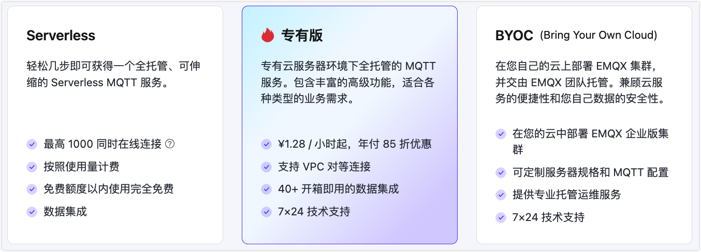
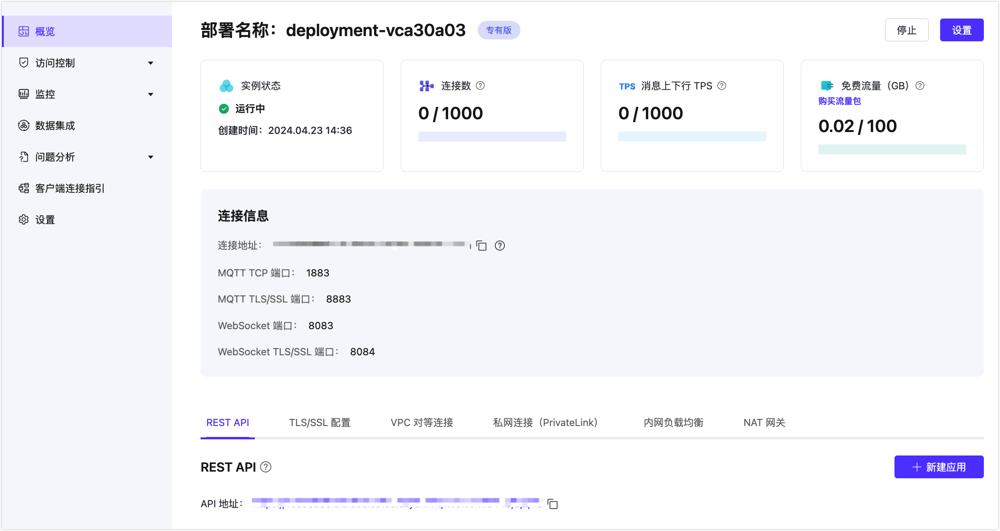

# 创建专有版部署

EMQX Cloud 专有版提供独立的 MQTT 服务实例/集群，有更高的连接上限和 TPS 上限，并且拥有更多的扩展能力。

## 创建部署

1. 登录账户，进入 EMQX Cloud [控制台](https://cloud.emqx.com/console/)。

2. 在控制台首页或者部署管理页面，点击新建部署进入创建步骤。

3. 选择专有版面板。

   
   <!--TODO 更新图片-->

4. 依据您的需求选择相应规格配置。

   - 类型： 基础版（单节点）和专业版（多节点）
   - 云平台和区域：请查看[云服务商和地区](../price/plans.md#支持云服务商和地区)支持
   - 选择规格：每类规格限制了不同的连接数上限和 TPS 上限。如无法满足您的要求，可以[联系我们](https://www.emqx.com/zh/contact?product=cloud)。
   - 可以选择按小时计费或包年计费购买。
   - 设置部署名称和项目。

6. 确认部署信息后，点击 **立即部署**。并同意 EMQX Cloud 标准服务条款开始创建。

7. 部署创建需要一定的时间，当部署运行状态为**运行中**后，部署创建完成并可使用。

## 查看部署信息

部署概览页面可获取到部署实时状态和连接信息：

  
<!--   TODO 更新图片-->

### 基本信息

* 实例状态：运行状态和运行时长
* 连接数：当前连接数和最大连接数
* 消息上下行 TPS：部署当前每秒钟消息发送和接收条数，以及 TPS 上限。
* 流量： 部署本月已经使用的流量以及免费流量额度显示。

### 连接信息
* 连接地址：客户端连接到部署的地址

  * 专业版部署连接地址：IP

  * 基础版连接地址：以 emqx.cloud 后缀结尾的域名

* 连接端口：

  * 专业版部署端口：默认开启 1883(MQTT TCP 端口)、8083(WebSocket 端口)，您可以通过配置 TLS/SSL 开启 8883(MQTT TLS/SSL 端口) 和 8084(WebSocket TLS/SSL) 端口。
  * 基础版部署端口：开启 15xxx(MQTT TCP 端口)，15xxx(MQTT TLS/SSL 端口)，8083(WebSocket 端口)， 8084(MQTT TLS/SSL 端口) 端口。

建议查看 [端口连接指引](../deployments/port_guide_dedicated.md) 了解协议和端口。

## 部署功能使用

您可以通过一下具体章节了解转有版部署特有功能的使用。

### [REST API](../api/introduction.md)

提供了 REST API 以实现与外部系统的集成，例如查询客户端信息、发布消息和创建规则等。

### [TLS/SSL 配置](../deployments/tls_ssl.md)

仅**专业版**提供**自定义单双向** TLS/SSL 认证，并支持 **自签名证书** 和 **CA 签名证书**。

### [VPC 对等连接](../deployments/vpc_peering.md)

仅**专业版**支持同云服务商、同区域与客户已有 VPC(Virtual Private Cloud) 创建对等连接。 VPC 对等连接是两个 VPC 之间的网络连接，通过此连接，使两个 VPC 中的实例可以彼此通信，就像它们在同一网络中一样。

### [私网连接（PrivateLink）](../deployments/privatelink.md)
仅**专业版**提供私网连接（PrivateLink）能够实现 EMQX Cloud 部署所在的专有网络 VPC 与公有云上的服务建立安全稳定的私有连接，简化网络架构，实现私网访问服务，避免通过公网访问服务带来的潜在安全风险。

### [内网负载均衡](../vas/intranet-lb.md)

仅**专业版**支持。内网负载均衡是一种在内网中对流量进行按需分发的服务，提供部署内网访问能力。内网负载均衡为增值服务，需要单独开通。

### [NAT 网关](../vas/nat-gateway.md)

仅**专业版**支持。NAT 网关可以提供网络地址转换服务，为专业版部署提供访问公网资源的能力。NAT 网关为增值服务，需要单独开通。

## 连接到部署

您可以使用任何 MQTT 客户端工具连接到部署进行测试，我们推荐使用 [MQTTX 连接到部署](../connect_to_deployments/mqttx.md)。

