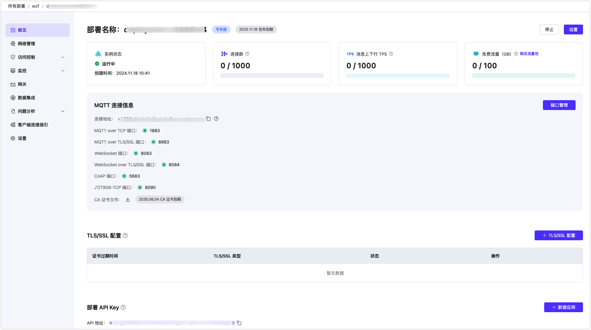

# 创建专有版部署

EMQX Cloud 专有版提供独立的 MQTT 服务实例/集群，有更高的连接上限和 TPS 上限，并且拥有更多的扩展能力。我们以其中专业版为例介绍如何创建和使用。

## 创建部署

1. 登录账户，进入 EMQX Cloud [控制台](https://cloud.emqx.com/console/)。

2. 在控制台首页或者部署列表页面都可以在指定项目下创建，点击新建部署进入创建步骤。

3. 点击专有版面板上的 `立即创建`。

   

4. 依据您的需求选择相应规格配置。

   

   - 选择云平台：专业版支持华为云、阿里云、腾讯云和 AWS 中国，如您有其他云服务提供商需求，您可以提交 [工单](../feature/tickets.md) 或通过邮件（cloud-support@emqx.io）和我们联系。
   - 选择区域：专业版支持华为云（广州，上海，北京），阿里云（深圳，上海，杭州，北京，张家口，成都），腾讯云（广州，上海，北京），AWS 中国（北京，宁夏）如您有其他区域需求，您可以提交 [工单](../feature/tickets.md) 或通过邮件（cloud-support@emqx.io）和我们联系。
   - 选择规格：每类规格限制了不同的连接数上限和 TPS 上限。后续可以通过升降部署规格实现增加和减少最大连接数和 TPS 上限。
   - 可以选择按小时计费或包年计费进行购买。

6. 在 **确认** 页核对部署信息。 点击 **立即部署** 并同意 EMQX Cloud 标准服务条款。您将跳转到控制台部署详情页面。
7. 等待 5 分钟左右直至部署运行状态为**运行中**即可使用。

## 部署概览

部署概览页面可获取到部署实时状态和连接信息：

   

* 实例状态：运行状态和运行时长
* 连接数：当前连接数和最大连接数
* 消息上下行 TPS：部署当前每秒钟消息发送和接收条数，以及 TPS 上限。
* 流量： 部署本月已经使用的流量以及免费流量额度显示。
* 部署名称：部署名称可自定义。
* 部署规格：显示当前部署的规格。如果是按时计费类型的部署，可以在此转化为包年付费。
* 连接地址

  * 专业版部署连接地址：IP

  * 基础版连接地址：以 emqx.cloud 后缀结尾的域名

* 连接端口：

  * 专业版部署端口：默认开启 1883(mqtt)、8083(ws)，您可以通过配置 TLS/SSL 开启 8883(mqtts) 和 8084(wss) 端口。
  * 基础版部署端口：开启 15xxx(mqtt)，15xxx(mqtts)，8083(ws)， 8084(wss) 端口

查看 [端口连接指引](../deployments/port_guide_serverless.md) 了解协议和端口。

### [TLS/SSL 配置](../deployments/tls_ssl.md)

**专业版**提供**自定义单双向** TLS/SSL 认证，并支持 **自签名证书** 和 **CA 签名证书**。

### [VPC 对等连接配置](../deployments/vpc_peering.md)

**专业版**支持同云服务商、同区域与客户已有 VPC(Virtual Private Cloud) 创建对等连接。 VPC 对等连接是两个 VPC 之间的网络连接，通过此连接，使两个 VPC 中的实例可以彼此通信，就像它们在同一网络中一样。

### [私网连接 PrivateLink 配置](../deployments/privatelink.md)
**专业版**提供私网连接（PrivateLink）能够实现 EMQX Cloud 部署所在的专有网络 VPC 与公有云上的服务建立安全稳定的私有连接，简化网络架构，实现私网访问服务，避免通过公网访问服务带来的潜在安全风险。

### [API 访问](../api/introduction.md)

提供了 REST API 以实现与外部系统的集成，例如查询客户端信息、发布消息和创建规则等。

### [内网负载均衡](../vas/intranet-lb.md)

内网负载均衡是一种在内网中对流量进行按需分发的服务，提供部署内网访问能力。内网负载均衡为增值服务，需要单独开通。

### [NAT 网关](../vas/nat-gateway.md)

NAT 网关可以提供网络地址转换服务，为专业版部署提供访问公网资源的能力。NAT 网关为增值服务，需要单独开通。

## 连接到部署

您可以使用任何 MQTT 客户端工具连接到部署进行测试，我们推荐使用 [MQTTX 连接到部署](../connect_to_deployments/mqttx.md)。

