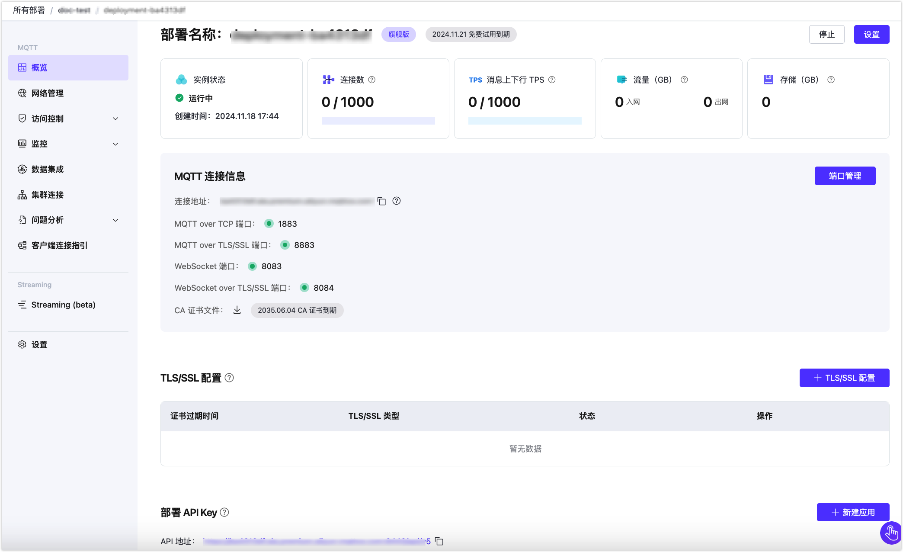

# 创建旗舰版部署

EMQX Platform 旗舰版为大规模、关键任务应用程序提供了一个强大的 EMQX 集群，并带有高级功能。本指南将提供如何在 EMQX Platform 上创建旗舰版部署的操作步骤。

## 申请试用

EMQX 旗舰版部署只能通过申请试用来创建，用户不能自行创建。您可以联系我们申请试用期。在试用期内，每个用户可以创建两个旗舰版部署试用。如果试用期间删除了这两个部署，则不能再次申请试用。试用期是免费的，您可以使用旗舰版本的所有功能。

1. 登录 [EMQX 平台控制台](https://cloud-intl.emqx.com/console/)。

2. 要为您的项目发起新部署，请导航到控制台主页或部署列表页面。在此处，点击 **+ 新建部署**。

3. 在**选择版本**中，选择**旗舰版**。

4. 点击底部的**联系我们**，将跳转到**联系销售**页面，您可以在此提交试用申请。

   

如果您的试用申请获得批准，您将收到一封电子邮件，其中包含试用期、部署平台和区域的详细信息，以及激活时间。

## 创建部署

当您的试用被激活后，您可以前往控制台部署您的旗舰版本。

1. 在**云平台和区域**下，选择部署区域。

2. 在**部署名称和项目**下，提供您的部署名称并选择相应的项目。

3. 在**概要**区域确认部署信息，然后点击**立即部署**按钮。在此阶段，系统将提示您查看并接受 *EMQX Platform 标准服务条款*。请务必仔细阅读协议并接受其条款以继续。

   

4. 接受条款后，部署将开始。当部署状态变为**运行中**时，您的部署就已成功创建并可使用。

## 查看部署信息

部署创建后，它将显示在 EMQX Platform 控制台主页上。点击旗舰版部署卡片以进入部署概览页面。在概览页面上，您可以查看部署的实时状态和连接信息。

### 基本信息

- **实例状态**：运行状态及部署创建时间。
- **连接数**：当前连接数和最大连接数。
- **消息上下行 TPS**：部署当前每秒钟消息发送和接收条数，以及 TPS 上限。
- **流量**： 部署的流量使用信息，包括所有进出部署的公网流量。
- **存储**：存储空间可用于持久会话和事件历史记录。

### 连接信息

- **连接地址**：客户端连接到部署的地址。
- **连接端口**：默认开启 `1883` (MQTT 端口)、`8083` (WebSocket 端口)、`8883` (MQTT TLS/SSL 端口) 和 `8084` (WebSocket TLS/SSL) 端口。
- **端口管理**: 通过端口管理，可以对某一个端口进行单独关闭和开启。
- **CA 证书文件**：允许您下载一个由服务器端 CA 签署的证书文件用于验证，并提醒您证书的到期时间。

建议查看 [端口连接指引](../deployments/port_guide_dedicated.md)了解协议和端口。

## 部署功能使用

您可以通过以下具体章节了解旗舰版部署特有功能的使用。

### [REST API](https://docs.emqx.com/zh/cloud/latest/api/dedicated)

提供了 REST API 以实现与外部系统的集成，例如查询客户端信息、发布消息和创建规则等。

### [TLS/SSL 配置](../deployments/tls_ssl.md)

提供**自定义单双向** TLS/SSL 认证，并支持 **自签名证书** 和 **CA 签名证书**。

### [VPC 对等连接](../deployments/vpc_peering.md)

支持同云服务商、同区域与客户已有 Virtual Private Cloud (VPC) 创建对等连接。 VPC 对等连接是两个 VPC 之间的网络连接，通过此连接，使两个 VPC 中的实例可以彼此通信，就像它们在同一网络中一样。

### [私网连接（PrivateLink）](../deployments/privatelink.md)

提供私网连接（PrivateLink）能够实现旗舰版部署所在的专有网络 VPC 与公有云上的服务建立安全稳定的私有连接，简化网络架构，实现私网访问服务，避免通过公网访问服务带来的潜在安全风险。

### [内部接入点](../vas/intranet-lb.md)

内部接入点允许您在部署的 VPC 内创建一个内部负载均衡服务，实现安全访问 EMQX 集群。

### [NAT 网关](../vas/nat-gateway.md)

NAT 网关可以提供网络地址转换服务，使 EMQX 集群能够通过公网安全地建立对外连接。

### 独立存储层

旗舰版为每个部署提供了独立的存储层，确保数据的隔离和安全性。数据跨多个可用区存储，以确保高可用性，并提供自动备份和轻松的恢复选项，最大限度地保障数据的可靠性和安全性。

### 持久会话

持久会话允许 EMQX Platform 将客户端会话存储在内置数据库中，而不是内存中。即使服务器重新启动，客户端会话数据仍然保留，确保连接的不中断。

### [历史事件](../deployments/event_history.md)

历史事件服务使 EMQX Platform 能够记录客户端和消息事件，以便进一步监控和分析。

### [集群连接](../cluster_linking/cluster_linking.md)

集群连接功能有助于跨地理分布的高级部署之间进行客户端通信和消息传输。

## 连接到部署

您可以使用任何 MQTT 客户端工具连接到部署进行测试，我们推荐使用 [MQTTX 连接到部署](../connect_to_deployments/mqttx.md)。

## 转为商业部署

试用期结束时，您的试用部署将自动停止。如果您希望继续使用旗舰版部署，请联系[销售](https://www.emqx.com/zh/contact?product=cloud&productEdition=Premium)团队购买旗舰版服务。有关详细的定价信息，请参考[旗舰版计费](../price/pricing.md#旗舰版计费)。

::: tip 提示

用户无法直接通过 Platform 控制台将试用部署转换为包年付费部署。要进行此转换，请联系销售团队，他们将在后台协助处理。

:::
