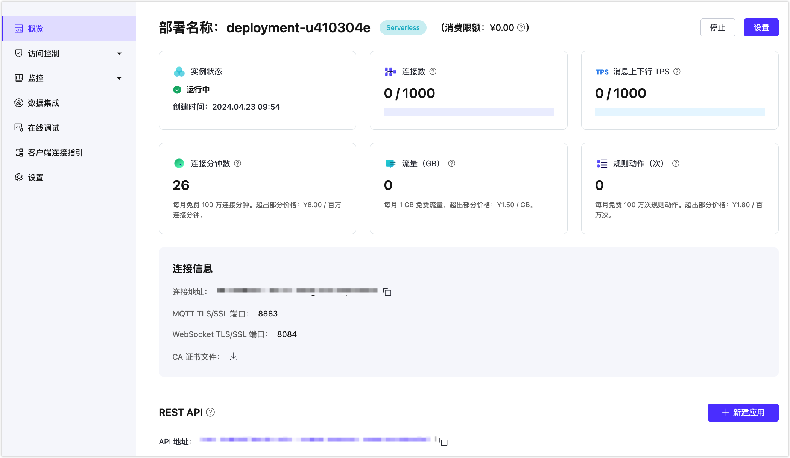

# 创建 Serverless 部署

EMQX Cloud 已经推出了安全可扩展的 MQTT 服务 —— EMQX Cloud Serverless，赋予开发者或微小企业更低成本且高效测试开发物联网应用的能力。简单几步就创建一个 Serverless 部署。

Serverless 部署最大的优势在于连接场景只按照实际的使用量进行计费，Serverless 详细的计费方式请查看[定价计费](../price/pricing.md)部分。

## 创建部署

1. 登录 [EMQX Cloud 控制台](https://cloud.emqx.com/console/)。

2. 在控制台首页或者部署管理页面都可以在指定项目下创建，点击**新建部署**进入创建步骤。

3. 选择 Serverless 面板。

   
   
4. 在配置步骤，您可以设置 Serverless 部署的本月最大[消费限额](../deployments/spend_limit.md)，默认值为 0，即为只使用免费额度。消费限额在部署创建之后也可以进行修改。

5. 设置部署名称和项目。

6. 点击**立即部署**，并同意 EMQX Cloud 标准服务条款和 Serverless 服务使用条款。

7. 部署将进入创建，当状态显示为**运行中**后，部署创建完成并可使用。

## 查看部署信息

部署概览页面可获取到部署实时状态和连接信息：

### 基本信息

- 实例状态：部署实例运行状态和创建时间。
- 连接数：当前的连接数和最大连接数。
- 消息上下行 TPS：部署当前每秒钟消息发送和接收条数，以及 TPS 上限。
- 连接分钟数：本月已经使用的总连接分钟数。此数值的统计有 1 小时的延时。
- 流量：本月已经产生入网和出网的流量。此数值的统计有 1 小时的延时。
- 规则动作：本月已经执行的规则动作数。此数值的统计有 1 小时的延时。
- 消费限额：部署当月最高消费限制设置，具体可查看[消费限额设置](../deployments/spend_limit.md)。

### 连接信息
- 连接地址：客户端/终端设备的连接地址。
- 连接端口：默认开启 8883 (MQTT TLS/SSL 端口) 和 8084 (WebSocket TLS/SSL) 端口。查看[端口连接指引](../deployments/port_guide_serverless.md)了解如何使用协议和端口。
- CA 证书文件：如客户端需要验证服务端 CA，请下载此证书。

## 使用 MQTTX 连接 Serverless 部署

除了使用 MQTTX 客户端，您也可以使用 [SDK 或其他工具](../connect_to_deployments/overview.md)连接到部署。在使用 MQTTX 连接到部署之前您需要先获取到部署的连接地址 (Host) 和端口 (Port) 以及认证信息。

1. 获取连接信息。在概览页找到连接地址以及连接端口。Serverless 默认支持 8883(mqtts), 8084(wss) 端口。

2. 添加客户端认证信息。点击左侧菜单中的**访问控制**->**认证**，点击**添加**按钮，输入客户端或设备用户名和密码并点击**确认**。

3. 设置 [MQTTX](https://mqttx.app/zh/) 连接信息并连接到部署。

   

4. 连接成功之后即可以发布和订阅消息。

   

## 部署停止和删除

**系统停止**：若部署持续 30 天没有活跃客户端连接，部署将会被系统停止。如需继续使用，请在控制台手动启用。

**系统删除**：如果部署停止之后 30 天未开启，部署可能会被删除。
