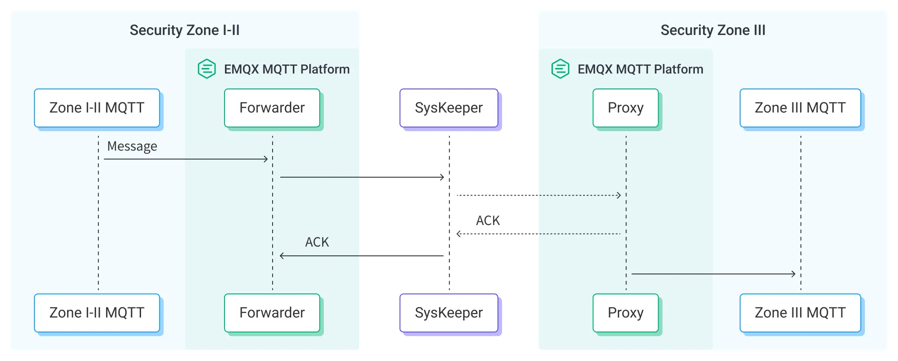

# 将 MQTT 数据写入到 SysKeeper
Nari SysKeeper 2000 是一种网络物理隔离设备。作为一种安全管理系统，它广泛应用于各个行业，特别是在需要高级别安全措施的领域，如关键基础设施和企业 IT 系统。EMQX Cloud 支持部署在不同生产区的 EMQX Cloud 之间的数据桥接。生产区按照安全级别划分为 I-III 3种类型，安全区 I-II 是更安全、受控的区域，而安全区 III 是一个限制较少的区域，充当了面向公众服务与更安全内部区域之间的桥梁。通常安全区 I-II 和安全区 III 之间是隔离的。通过数据桥接，MQTT 消息可以穿透安全区 I-II 与安全区 III 之间的单向 SysKeeper 网闸，与另一个安全区的 EMQX Cloud 集群进行桥接。

本页面提供了不同生产区中的 EMQX Cloud 进行桥接时，消息如何穿透 Nari SysKeeper 的全面介绍，以及创建和验证数据桥接的实用指导。

## 工作原理

Nari SysKeeper 的数据桥接是 EMQX Cloud 中的即用型功能，结合了 MQTT 的实时数据捕获和桥接能力与 SysKeeper 的强大安全隔离能力。通过内置的[规则引擎](./rules.md)组件，集成简化了 EMQX Cloud 桥接穿透 SysKeeper 的过程，无需复杂编码。

下图展示了 EMQX Cloud 与 SysKeeper 之间的典型架构。



穿透操作可以视为部署在安全区 I-II 与安全区 III 的两个 EMQX Cloud 集群之间的单向数据桥接，工作流程如下：

1. **创建 SysKeeper 接收器**：需要在安全区 III 的 EMQX Cloud 上创建 SysKeeper 接收器，SysKeeper 接收器将启动一个特殊的 TCP 监听器，用于接收来自 SysKeeper 转发器的消息。
2. **消息发布和接收**：电力系统各类设备通过直连到 EMQX Cloud，或通过网关（例如 [NeuronEX](https://www.EMQX Cloud.com/zh/products/neuronex)）转换为 MQTT 协议成功连接到 EMQX Cloud，并根据其运行状态、读数或触发的事件通过 MQTT 发送消息。当 EMQX Cloud 接收到这些消息时，它会启动其规则引擎中的匹配过程。
3. **消息数据处理**：当消息到达时，它会经过规则引擎并由 EMQX Cloud 中定义的规则进行处理。规则根据预定义的标准确定哪些消息需要经过 SysKeeper 桥接到另一个 EMQX Cloud 集群。如果规则中指定了数据处理操作，则应用这些操作，例如转换数据格式、过滤特定信息或用额外的上下文丰富消息。
4. **通过 SysKeeper 转发器转发**：规则输出的结果将通过 SysKeeper 转发器，穿透 SysKeeper 隔离设备，发送到安全区 III 中 EMQX Cloud 创建的 SysKeeper 接收器中，于是消息被摄入到安全区 III。当 SysKeeper 接收器不可用时，EMQX Cloud 提供一个内存中的消息缓冲区以防止数据丢失。数据暂时保存在缓冲区中，可能会转储到磁盘以防止内存过载。请注意，如果数据集成或 EMQX Cloud 节点重启，数据将不会被保留。
5. **数据利用**：在安全区 III 中，MQTT 消息将以其原始形式重新发布，企业可以使用规则引擎与数据集成进行进一步的处理。

<!-- 特性与优势在此处不适用 -->

## 准备工作

本节描述了在 Dashboard 中创建 SysKeeper 数据桥接之前必须完成的准备工作。

### 前置准备

- 了解EMQX Cloud数据集成[规则](./rules.md)
- 了解[数据集成](./data-bridges.md)

### 在安全区 III 启动 Nari SysKeeper 接收器

要将 MQTT 消息通过 Nari SysKeeper 传送，您需要在安全区 III 启用 SysKeeper 接收器，以接收来自安全区 I-II 的 SysKeeper 转发器的连接。

本节介绍如何在安全区 III 启动 SysKeeper 接收器。

1. 转到 Dashboard，点击 **集成** -> **连接器**。
2. 点击页面右上角的 **创建**。选择 **SysKeeper 接收器** 并点击 **下一步**：
3. 为连接器输入一个名称。名称应结合使用大写/小写字母或数字，例如，`my_sysk_proxy`。
4. 将 **监听地址** 设置为 `Address:9002`，例如，`172.17.0.1:9002`。SysKeeper 接收器将启动一个 TCP 监听器，请确保端口不被其他进程占用，并且防火墙允许访问该端口。
5. 其他配置选项保留默认值。
6. 点击 **创建** 按钮。

现在您已在安全区 III 创建了一个 SysKeeper 接收器。接下来，您需要创建一个 Nari SysKeeper 转发器。

## 创建连接器

本节展示如何在安全区 I-II 配置用于 SysKeeper 转发器的连接器，以便将连接转发到 SysKeeper 代理。

1. 转到 Dashboard，点击 **集成** -> **连接器**。
2. 点击页面右上角的 **创建**。点击选择 **SysKeeper 转发器**，然后点击 **下一步**。
3. 为连接器输入一个名称。名称应结合使用大写/小写字母或数字，例如，`my_sysk`。
4. 将 **服务器** 设置为 SysKeeper 代理服务器的地址，例如，`172.17.0.1:9002`。
5. 在点击 **创建** 之前，您可以点击 **测试连接**，以测试连接器是否能够连接到 SysKeeper 接收器。
6. 点击 **创建** 完成连接器的创建。在弹出对话框中，您可以点击 **返回连接器列表** 或点击 **创建规则** 继续创建规则和 Sink，以指定要转发到 SysKeeper 的数据。

## 创建规则和 Sink

本节展示如何在 EMQX Cloud 中创建一个规则来处理来自源 MQTT 主题 `t/#` 的消息，并通过配置好的 SysKeeper 转发器 Sink 将处理后的结果发送到另一个 EMQX Cloud 集群中的 SysKeeper 接收器。

1. 转到 Dashboard，点击 **集成 -> 规则**。

2. 点击页面右上角的 **创建**。

3. 输入一个规则 ID，例如 `my_rule`。

4. 在 SQL 编辑器中输入以下语句，它将转发与主题模式 `t/#` 匹配的 MQTT 消息：

   ```sql
   SELECT
     *
   FROM
     "t/#"
   ```

   ::: tip

   如果您是初学者，点击 **SQL示例** 和 **启用测试** 学习和测试 SQL 规则。

   :::

5. 点击 + **添加动作** 按钮定义规则触发的操作。通过这个操作，EMQX Cloud 将把规则处理后的数据发送到 SysKeeper。

6. 从 **动作类型** 下拉列表中选择 `SysKeeper 转发器`。将 **动作** 下拉框保留为默认的 `创建动作` 。您也可以选择一个之前已经创建好的 SysKeeper 转发器 Sink。本次演示将创建一个新的 Sink。

7. 为 Sink 输入一个名称。名称应结合使用大写/小写字母和数字。

8. 选择一个连接器，您可以选择之前创建的 `my_sysk`。

9. 输入配置信息：

   - **主题**：重新发布消息的主题。支持占位符，例如 `${topic}`。
   - **QoS**：重新发布消息的 QoS。
   - **消息模板**：重新发布消息的负载模板。支持占位符，例如 `${payload}`。

10. 点击 **创建** 完成 Sink 的创建。回到 **创建规则** 页面，您将看到新的 Sink 出现在 **动作输出** 标签下。

11. 在 **创建规则** 页面，验证配置的信息。点击 **创建** 按钮生成规则。

现在您已成功创建规则，您可以在 **规则** 页面上看到新的规则。点击 **动作(Sink)** 标签，您可以看到新的 SysKeeper 转发器。

您可以点击 **集成** -> **Flow 设计器** 查看拓扑。可以看到 `t/#` 下的消息在通过规则 `my_rule` 解析后并通过 SysKeeper 转发器发布。

## 测试 Sink 和规则

您可以使用 Dashboard 中内置的 WebSocket 客户端来测试您的 SysKeeper 转发器 Sink 和规则。

1. 在安全区 III中，点击 Dashboard 左侧导航菜单中的 **诊断** -> **WebSocket 客户端**。

2. 填写当前 EMQX Cloud 实例的连接信息。

   - 如果您在本地运行 EMQX Cloud，可以使用默认值。
   - 如果您更改了 EMQX Cloud 的默认配置。例如，认证方面的配置更改可能需要您输入用户名和密码。

3. 点击 **连接** 将客户端连接到 EMQX Cloud 实例。

4. 使用此客户端订阅主题 `t/test`。

5. 在安全区 I-II 中，重复上述步骤创建一个发布的客户端。

6. 向下滚动到发布区域，并输入以下内容：

   - **主题**：`t/test`

   - **负载**：

     ```json
     {
       "hello": "I am from the Security Zone I-II"
     }
     ```

   - **QoS**：`1`

7. 点击 **发布** 发送消息。

8. 在安全区 III 中，如果一切正确，您将看到客户端已接收到此消息。