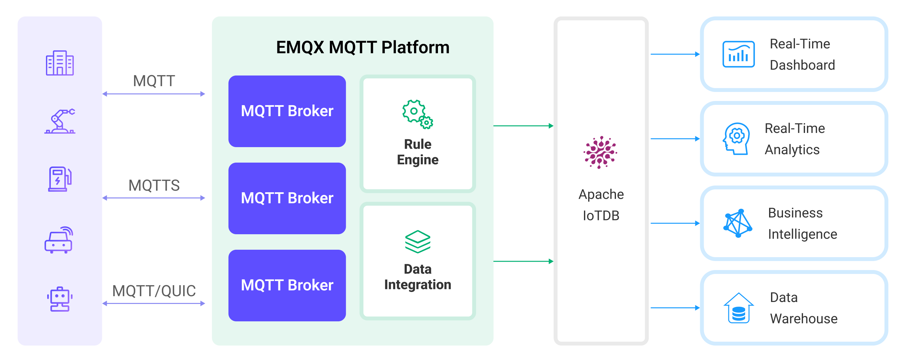

# 将 MQTT 数据写入到 Apache IoTDB

[Apache IoTDB](https://iotdb.apache.org/)）是一个高性能、可扩展的时序数据库，专为处理由各种物联网设备和系统生成的大量时序数据而设计。EMQX Platform 支持与 Apache IoTDB 的数据集成，使您能够通过轻量级的 MQTT 协议，使用 [REST API V2](https://iotdb.apache.org/UserGuide/Master/API/RestServiceV2.html) 无缝地将数据转发到 Apache IoTDB。这种数据集成确保了数据的单向流动。来自 EMQX Platform 的 MQTT 消息被写入 IoTDB 数据库，利用 EMQX Platform 卓越的实时数据摄取能力和 IoTDB 专有的时序数据存储和查询性能。这种强大的组合为希望有效管理其物联网数据的企业提供了坚实的基础。

本页面提供了关于 EMQX Platform 和 Apache IoTDB 之间数据集成的全面介绍，并附有创建和验证数据集成的实用指南。

## 工作原理

Apache IoTDB 的数据集成是 EMQX Platform 中的一个开箱即用的功能，在基于 MQTT 的原始时序数据与 IoTDB 强大数据存储能力之间架起桥梁。通过内置的[规则引擎](./rules.md)组件，该集成简化了从 EMQX Platform 到 IoTDB 的数据摄取过程，以便存储和查询，无需复杂的编码。

下图展示了 EMQX 与 IoTDB 之间数据集成的典型架构。<!-- 这张图片需要修改为特定于IoTDB的-->



数据集成的工作流程如下：

1. **消息发布和接收**：无论是连接车辆、工业物联网系统还是能源管理平台的一部分，设备都通过 MQTT 协议成功连接到 EMQX Platform，并根据其运行状态、读数或触发的事件通过 MQTT 发送消息。当 EMQX Platform 接收到这些消息时，它会启动其规则引擎中的匹配过程。
2. **消息数据处理**：当消息到达时，它通过规则引擎进行处理，然后由 EMQX Platform 中定义的规则进行处理。这些规则根据预定义的标准确定哪些消息需要路由到 IoTDB。如果任何规则指定了有效负载转换，则应用这些转换，例如转换数据格式、过滤特定信息或用额外的上下文丰富有效负载。
3. **数据缓冲**：EMQX 提供了一个内存中的消息缓冲区，以防止 IoTDB 不可用时数据丢失。数据暂时保存在缓冲区中，并可能转储到磁盘以防止内存过载。请注意，如果数据集成或 EMQX 节点重启，数据将不会被保留。
4. **数据摄入 IoTDB**：一旦规则引擎确定了 IoTDB 存储的消息，它就会触发将消息转发到 IoTDB 的动作。处理后的数据将以时序方式无缝写入 IoTDB。
5. **数据存储和利用**：现在数据存储在 IoTDB 中，企业可以利用其查询能力应用于各种用例。例如，在连接车辆领域，这些存储的数据可以帮助车队管理系统了解车辆健康状况，根据实时指标优化路线规划，或跟踪资产。同样，在工业物联网环境中，数据可能用于监控机械健康、预测维护或优化生产计划。

## 特性与优势

与 IoTDB 的数据集成提供了一系列特性和优势，旨在确保有效的数据处理和存储：

- **高效的数据采集**

  通过将 EMQX Platform 与 IoTDB 集成，可以通过轻量级 MQTT 消息协议从资源有限的物联网设备高效收集物联网时序数据，并摄入数据库，确保可靠和高效的数据采集。

- **灵活的数据转换**

  EMQX Platform 提供了基于 SQL 的强大规则引擎，允许组织在存储到 IoTDB 之前对数据进行预处理。它支持各种数据转换机制，如过滤、路由、聚合和丰富，使组织能够根据他们的需要塑造数据。

- **可扩展性和高吞吐量**

  EMQX Platform 为水平可扩展性而设计，轻松管理不断增长的物联网设备生成的激增消息流量。该解决方案轻松适应扩展的数据量，并支持高并发访问。因此，物联网时序工作负载可以轻松管理物联网部署规模扩大到前所未有水平时数据摄入、存储和处理的增长需求。

- **优化的时序数据存储**

  IoTDB 为时间戳数据提供了优化的存储。它利用时间分区、压缩和数据保留策略，有效地存储和管理大量时序数据。这确保了最小的存储占用空间，同时保持高性能，这对于生成大量时序数据的物联网工作负载至关重要。

- **快速和复杂的查询**

  IoTDB 具有丰富的查询语义，支持跨设备和传感器的时序数据时间对齐，时序字段的计算（频域转换）以及时间维度上丰富的聚合函数支持。它还与 Apache Hadoop、Spark 和 Flink 深度集成，提供更强大的分析能力。EMQX Platform 与 IoTDB 无缝集成，为存储和分析 MQTT 数据提供了统一的解决方案。

## 准备工作

本节介绍了在 EMQX Platform 中创建 Apache IoTDB 数据集成之前需要做的准备工作。

### 前置准备

- 了解[数据集成](./introduction.md)。
- 了解[规则](./rules.md)。

### 网络设置

<!--@include: ./network-setting.md-->

### 启动 Apache IoTDB 服务器

本节将介绍如何通过 [Docker](https://www.docker.com/) 启动 Apache IoTDB 服务器。 确保在您的 IoTDB 配置中具备该字段： `enable_rest_service=true`。

在 REST 接口开启的情况下运行下面的命令启动 Apache IoTDB 服务器：

```bash
docker run -d --name iotdb-service \
              --hostname iotdb-service \
              -p 6667:6667 \
              -p 18080:18080 \
              -e enable_rest_service=true \
              -e cn_internal_address=iotdb-service \
              -e cn_target_config_node_list=iotdb-service:10710 \
              -e cn_internal_port=10710 \
              -e cn_consensus_port=10720 \
              -e dn_rpc_address=iotdb-service \
              -e dn_internal_address=iotdb-service \
              -e dn_target_config_node_list=iotdb-service:10710 \
              -e dn_mpp_data_exchange_port=10740 \
              -e dn_schema_region_consensus_port=10750 \
              -e dn_data_region_consensus_port=10760 \
              -e dn_rpc_port=6667 \
              apache/iotdb:1.1.0-standalone
```

有关如何通过 Docker 运行 IoTDB 的更多信息，请参阅： [IoTDB in Docker on Docker Hub](https://hub.docker.com/r/apache/iotdb)。

## 创建 Apache IoTDB 连接器

在创建数据集成的规则之前，您需要先创建一个 Apache IoTDB 连接器用于访问 Apache IoTDB 服务器。

1. 在部署菜单中选择 **数据集成**，在数据持久化服务分类下选择 Apache IoTDB 服务。如果您已经创建了其他的连接器，点击**新建连接器**，然后在数据持久化服务分类下选择 Apache IoTDB 服务。
2. **连接器名称**：系统将自动生成一个连接器的名称。
3. 选择驱动：
   - 如果选择 `REST API` 作为驱动程序，请在 **IoTDB REST 服务基础 URL** 中输入外部 IoTDB 服务的 REST 接口基础 URL。URL 必须遵循 `Host:Port` 格式。
   - 如果要为该连接器使用 Thrift 协议，选择 `Thrift 协议`，并将 **服务器地址** 设置为 IotDB 的 Thrift 服务器地址。
4. 输入连接器访问 Apache IoTDB 服务器的用户名和密码。
5. 在**IoTDB 版本**中选择要连接的 IoTDB 系统的版本。
6. 其他选项保留默认。关于 **高级设置** 的配置（可选）：参见[高级配置](https://docs.emqx.com/zh/enterprise/latest/data-integration/data-bridge-iotdb.html#%E9%AB%98%E7%BA%A7%E9%85%8D%E7%BD%AE)。
7. 点击**测试连接**按钮，如果 Apache IoTDB 服务能够正常访问，则会返回成功提示。
6. 点击**新建**按钮完成连接器的创建。

## 创建规则

接下来您需要创建一条规则来指定需要写入的数据，并在规则中添加响应动作以将经规则处理的数据转发到 Apache IoTDB。

1.  点击连接器列表**操作**列下的新建规则图标或在**规则列表**中点击**新建规则**进入**新建规则**步骤页。

2.  在 SQL 编辑器中输入规则，客户端将温湿度消息发送到 `temp_hum/emqx` 主题时，就会触发引擎。这里需要对 SQL 进行一定的处理：

    ```sql
     SELECT
       payload.temp as temp,
       payload.hum as hum,
       payload.device_id as device_id
     FROM
       "temp_hum/emqx"
    ```

    ::: tip

    如果您初次使用 SQL，可以点击 **SQL 示例**和**启用调试**来学习和测试规则 SQL 的结果。

    :::

3.  点击**下一步**开始创建动作。

4.  从**使用连接器**下拉框中选择您之前创建的连接器。

5.  **设备 ID** （可选）：输入特定的设备 ID，用作将时序数据转发和插入到 IoTDB 实例的设备名称。
    ::: tip

    如果留空，设备 ID 仍然可以在发布的消息中指定或在规则中配置。例如，如果您发布一个包含 `device_id` 字段的 JSON 编码消息，该字段的值将确定输出设备 ID。要使用规则引擎提取这些信息，您可以使用类似以下的 SQL：

    ```sql
    SELECT
      payload,
      `my_device` as payload.device_id
    ```

    但是，此字段中配置的固定设备 ID 优先于前面提到的任何方法。

    :::

6.  **对齐时间序列**：默认禁用。启用后，一组对齐的时序数据的时间戳列将在 IoTDB 中仅存储一次，而不是在该组内的每个单独时序数据中重复存储。有关更多信息，请参见[对齐时序数据](https://iotdb.apache.org/UserGuide/V1.1.x/Data-Concept/Data-Model-and-Terminology.html#aligned-timeseries)。

7.  配置 **写入数据**

您可以在 **写入数据** 部分定义一个模板，包括所需的每行的上下文信息。当提供此模板时，系统将通过应用它到 MQTT 消息来生成 IoTDB 数据。写入数据的模版支持通过 CSV 文件批量设置，详细说明请参考[批量设置](#批量设置)。

例如，使用以下模板：

| 时间戳 | 字段 | 数据类型 | 值      |
| ------ | ---- | -------- | ------- |
|        | temp | text     | ${temp} |
|        | hum  | text     | ${hum}  |

::: tip

每列支持占位符语法以用变量填充。如果省略时间戳，它将自动填充为当前系统时间（毫秒）。

:::

然后，您的 MQTT 消息将如下所示：

```json
{
  "temp": "27.5",
  "hum": "41.8"
}
```

8.  高级设置选项（可选），详细请参考[高级设置](https://docs.emqx.com/zh/enterprise/latest/data-integration/data-bridge-iotdb.html#%E9%AB%98%E7%BA%A7%E9%85%8D%E7%BD%AE)。

9.  点击**确认**按钮完成动作的配置。

10. 在弹出的**成功创建规则**提示框中点击**返回规则列表**，从而完成了整个数据集成的配置链路。

### 批量设置

在 Apache IoTDB 中，可能需要同时写入数百条数据，在 EMQX Platform 上进行配置是具有挑战性的工作。为了解决这个问题，EMQX Platform 提供了批量设置数据写入的功能。

当配置 **写入数据** 时，您可以使用批量设置功能，从 CSV 文件中导入要进行插入操作的字段。

1. 点击 **写入数据** 表格的 **批量设置** 按钮，打开 **导入批量设置** 弹窗。

2. 根据指引，先下载批量设置模板文件，然后在模板文件中填入数据写入配置，默认的模板文件内容如下：

   | Timestamp | Measurement | Data Type | Value             | Remarks (Optional)                                                                               |
   | --------- | ----------- | --------- | ----------------- | ------------------------------------------------------------------------------------------------ |
   | now       | temp        | FLOAT     | ${payload.temp}   | 字段、值、数据类型是必填选项，数据类型可选的值为 BOOLEAN、 INT32、 INT64、 FLOAT、 DOUBLE、 TEXT |
   | now       | hum         | FLOAT     | ${payload.hum}    |                                                                                                  |
   | now       | status      | BOOLEAN   | ${payload.status} |                                                                                                  |
   | now       | clientid    | TEXT      | ${clientid}       |                                                                                                  |

   - **Timestamp**: 支持使用 ${var} 格式的占位符，要求是时间戳格式。也可以使用以下特殊字符插入系统时间：
     - now: 当前毫秒级时间戳
     - now_ms: 当前毫秒级时间戳
     - now_us: 当前微秒级时间戳
     - now_ns: 当前纳秒级时间戳
   - **Measurement**: 字段名，支持常量或 ${var} 格式的占位符。
   - **Data Type**: 数据类型，可选值包括 BOOLEAN、 INT32、 INT64、 FLOAT、 DOUBLE、 TEXT。
   - **Value**: 写入的数据值，支持常量或 ${var} 格式的占位符，需要与数据类型匹配。
   - **Remarks**: 仅用于 CSV 文件内字段的备注，无法导入到 EMQX Platform 中。

   注意，仅支持 1M 以内的 CSV 格式文件，文件中数据不能超过 2000 行。

3. 将填好的模板文件保存并上传到 **导入批量设置** 弹窗中，点击**导入**完成批量设置。
4. 导入完成后，您可以在 **写入数据** 表格中对数据进行进一步的调整。

## 测试规则

推荐使用 [MQTTX](https://mqttx.app/) 模拟温湿度数据上报，同时您也可以使用其他任意客户端完成。

1. 使用 MQTTX 连接到部署，并向以下 Topic 发送消息。

   - topic: `temp_hum/emqx`

   - payload:

     ```json
     {
       "temp": "27.5",
       "hum": "41.8",
       "device_id": "root.sg27" // 设备 ID
     }
     ```

2. 查看消息是否转发到了 Apache IoTDB。

   - 您可以使用 IoTDB 的命令行查看。如果服务器在 docker 中运行，可以使用下面的命令连接服务器：

     ```bash
     $ docker exec -ti iotdb-service /iotdb/sbin/start-cli.sh -h iotdb-service
     ```

   - 查询数据：

     ```bash
     IoTDB> select * from root.sg27
     +------------------------+-------------+--------------+
     |                    Time|root.sg27.hum|root.sg27.temp|
     +------------------------+-------------+--------------+
     |2024-03-25T08:45:19.541Z|         41.8|          27.5|
     +------------------------+-------------+--------------+
     Total line number = 1
     It costs 0.166s
     ```

3. 在控制台查看运行数据。在规则列表点击规则 ID，在运行统计页面可以查看到规则的统计以及此规则下所有动作的统计。
