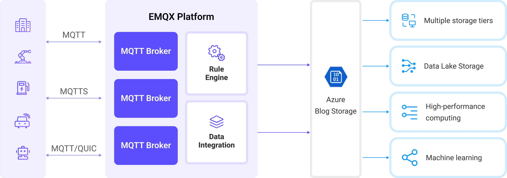
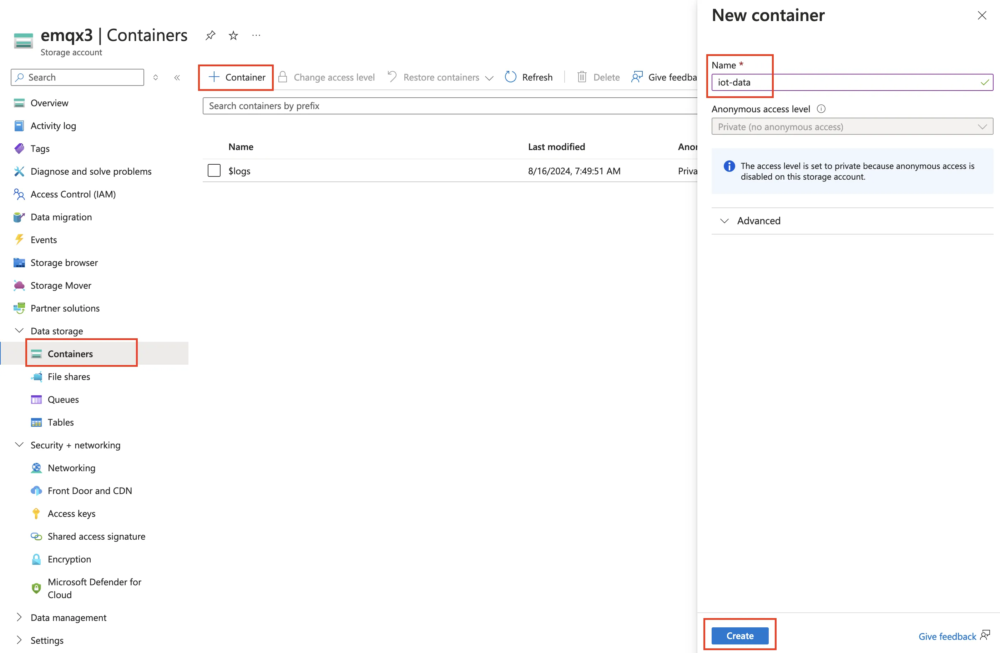
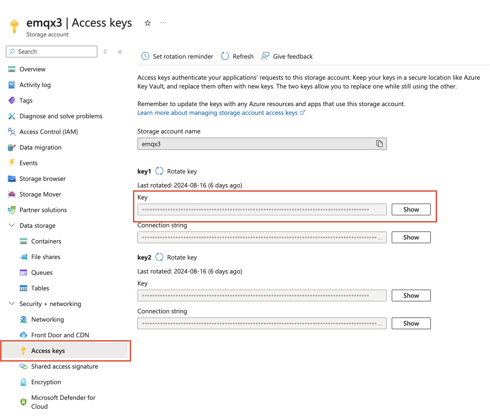

# 将 MQTT 数据导入 Azure Blob Storage

[Azure Blob Storage](https://azure.microsoft.com/en-us/products/storage/blobs/) 是微软基于云的对象存储解决方案，专为处理大量非结构化数据而设计。非结构化数据指的是不遵循特定数据模型或格式的数据类型，例如文本文件或二进制数据。EMQX Platform 可以高效地将 MQTT 消息存储在 Blob Storage 容器中，为物联网 (IoT) 数据存储提供了一个多功能的解决方案。

本页提供了 EMQX Platform 与 Azure Blob Storage 数据集成的全面介绍，并提供了创建和验证数据集成的实用指导。

## 工作原理

Azure Blob Storage 数据集成是 EMQX Platform 中一个开箱即用的功能，可以轻松配置以应对复杂的业务发展。在典型的 IoT 应用中，EMQX Platform 作为负责设备连接和消息传输的物联网平台，而 Azure Blob Storage 则作为数据存储平台，处理消息数据的存储。



EMQX Platform 利用规则引擎和数据接收器将设备事件和数据转发到 Azure Blob Storage。应用程序可以从 Azure Blob Storage 中读取数据，用于进一步的数据应用。具体工作流程如下：

1. **设备连接到 EMQX Platform**：IoT 设备通过 MQTT 协议成功连接后触发上线事件。该事件包括设备 ID、来源 IP 地址以及其他属性信息。
2. **设备消息发布和接收**：设备通过特定主题发布遥测和状态数据。EMQX Platform 接收这些消息，并在规则引擎中进行匹配。
3. **规则引擎处理消息**：内置规则引擎根据主题匹配处理来自特定来源的消息和事件。它匹配相应的规则，并处理消息和事件，如数据格式转换、过滤特定信息或用上下文信息丰富消息。
4. **写入 Azure Blob Storage**：规则触发一个动作，将消息写入存储容器。使用 Azure Blob Storage Sink，用户可以从处理结果中提取数据并发送到 Blob Storage。根据消息内容和 Sink 中的配置，消息可以以文本或二进制格式存储，或将多行结构化数据汇总到单个 CSV 文件中。

事件和消息数据写入存储容器后，可以连接到 Azure Blob Storage 读取数据，以实现灵活的应用开发，例如：

- 数据存档：将设备消息作为对象存储在 Azure Blob Storage 中，以实现长期保存，满足合规要求或业务需求。
- 数据分析：将存储容器中的数据导入分析服务，如 Snowflake，用于预测性维护、设备效率评估等数据分析服务。

## 特性与优势

在 EMQX Platform 中使用 Azure Blob Storage 数据集成可以为您的业务带来以下功能和优势：

- **消息转换**：消息在写入 Azure Blob Storage 之前，可以在 EMQX Platform 规则中进行广泛的处理和转换，以便后续存储和使用。
- **灵活的数据操作**：通过 Azure Blob Storage Sink，可以方便地将特定字段的数据写入 Azure Blob Storage 容器中，支持动态设置容器和对象键，实现灵活的数据存储。
- **集成的业务流程**：Azure Blob Storage Sink 允许设备数据与 Azure Blob Storage 丰富的生态系统应用结合，实现更多业务场景，如数据分析和存档。
- **低成本的长期存储**：与数据库相比，Azure Blob Storage 提供了一种高可用性、可靠且成本效益高的对象存储服务，适合长期存储需求。

这些功能使您能够构建高效、可靠且可扩展的 IoT 应用，并从业务决策和优化中受益。

## 准备工作

本节介绍了在 EMQX Platform 中创建 Azure Blob Storage 数据集成之前需要做的准备工作。

### 前置准备

- 了解[数据集成](./introduction.md)。
- 了解[规则](./rules.md)。
- 开启 [NAT网关](../vas/nat-gateway.md),以支持部署公网访问到 Azure Storage。
### 在 Azure Storage 中创建容器

1. 要访问 Azure Storage，您需要一个 Azure 订阅。如果您还没有订阅，请在开始之前创建一个[免费账户](https://azure.microsoft.com/free/)。

2. 所有对 Azure Storage 的访问都通过存储账户进行。对于本指南，请使用 [Azure 门户](https://portal.azure.com/)、Azure PowerShell 或 Azure CLI 创建一个存储账户。有关创建存储账户的帮助，请参阅[创建存储账户](https://learn.microsoft.com/en-us/azure/storage/common/storage-account-create)。

3. 要在 Azure 门户中创建容器，请导航到您的新存储账户。在存储账户的左侧菜单中，滚动到数据存储部分，然后选择 **Container**。选择 + **Container** 按钮，使用 `iot-data` 作为新容器的名称，然后点击 **Create** 以创建容器。

   

4. 导航到存储账户中的 **Security + networking** -> **Access keys**，并复制 **Key**。您将需要此密钥来配置 EMQX Platform 中的 Sink。

   

## 创建 Azure Blob Storage 连接器

在创建数据集成的规则之前，您需要先创建一个 Azure Blob Storage 连接器用于访问 Azure Blob Storage。

1. 在部署菜单中选择 **数据集成**，在数据持久化服务分类下选择 Azure Blob Storage 服务。如果您已经创建了其他的连接器，点击**新建连接器**，然后在数据持久化服务分类下选择 Azure Blob Storage 服务。

2. **连接器名称**：系统将自动生成一个连接器的名称。

3. 输入连接信息：

   - **账户名称**：您的存储账户名称
   - **访问密钥**：之前创建的存储账户的 Key
   - **高级设置（可选）**：请参阅[高级配置](https://docs.emqx.com/zh/emqx/latest/data-integration/azure-blob-storage.html#%E9%AB%98%E7%BA%A7%E8%AE%BE%E7%BD%AE)。

4. 点击**测试连接**按钮，如果 Azure Blob Storage 服务能够正常访问，则会返回成功提示。

5. 点击**新建**按钮完成连接器的创建。

## 创建规则

接下来您需要创建一条规则来指定需要写入的数据，并在规则中添加响应动作以将经规则处理的数据转发到 Azure Blob Storage。

1. 点击连接器列表**操作**列下的新建规则图标或在**规则列表**中点击**新建规则**进入**新建规则**步骤页。

2. 在 SQL 编辑器中输入规则：

   ```sql
   SELECT
     *
   FROM
       "t/#"
   ```

   ::: tip

   如果您初次使用 SQL，可以点击 **SQL 示例**和**启用调试**来学习和测试规则 SQL 的结果。

   :::

3. 点击**下一步**开始创建动作。

4. 从**使用连接器**下拉框中选择您之前创建的连接器。

5. 设置**容器**，输入 `iot-data`。

6. 选择**上传方式**。两种方式的区别如下：

   - **直接上传**：每次触发规则时，数据会根据预设的对象键和值直接上传到 Azure Storage。这种方式适合存储二进制或大型文本数据，但可能会生成大量文件。
   - **聚合上传**：此方式将多个规则触发结果打包到一个文件（如 CSV 文件）中，并上传到 Azure Storage，适合存储结构化数据。它可以减少文件数量并提高写入效率。

   每种方式的配置参数不同。请根据选择的方式进行配置：

   :::: tabs type

   ::: tab 直接上传

   直接上传需要配置以下字段：

   - **Blob 名称**：定义要上传到容器的对象位置。支持使用 `${var}` 格式的占位符，并可以使用 `/` 来指定存储目录。还需要设置对象的后缀以便管理和区分。在此处，输入 `msgs/${clientid}_${timestamp}.json`，其中 `${clientid}` 是客户端 ID，`${timestamp}` 是消息的时间戳。这确保每个设备的消息被写入不同的对象中。
   - **对象内容**：默认是包含所有字段的 JSON 文本格式，支持使用 `${var}` 格式的占位符。在此处，输入 `${payload}`，以将消息体作为对象内容。对象的存储格式取决于消息体的格式，支持压缩文件、图像或其他二进制格式。

   :::

   ::: tab 聚合上传

   聚合上传需要配置以下参数：

   - **Blob 名称**：用于指定对象的存储路径。可以使用以下变量：

     - **`${action}`**：操作名称（必需）。
     - **`${node}`**：执行上传的 EMQX Platform 节点名称（必需）。
     - **`${datetime.{format}}`**：聚合的开始日期和时间，格式由 `{format}`字符串指定（必需）：
       - **`${datetime.rfc3339utc}`**：UTC 格式的 RFC3339 日期和时间。
       - **`${datetime.rfc3339}`**：本地时区格式的 RFC3339 日期和时间。
       - **`${datetime.unix}`**：Unix 时间戳。
     - **`${datetime_until.{format}}`**：聚合的结束日期和时间，格式选项同上。
     - **`${sequence}`**：同一时间间隔内聚合上传的序列号（必需）。

     请注意，如果模板中未使用所有标记为必需的占位符，这些占位符将自动添加到 Blob 名称作为路径后缀，以避免重复。所有其他占位符被视为无效。

   - **增强类型**：目前仅支持 CSV。数据将以逗号分隔的 CSV 格式写入 Azure Storage。

   - **列排序**：通过下拉选择调整规则结果列的顺序。生成的 CSV 文件将首先按所选列排序，未选择的列按字母顺序排列在所选列之后。

   - **最大记录数**：当达到最大记录数时，将完成单个文件的聚合并上传，重置时间间隔。

   - **时间间隔**：当达到时间间隔时，即使未达到最大记录数，也将完成单个文件的聚合并上传，重置最大记录数。

   :::

   ::::

7. 展开**高级设置**，根据需要配置高级设置选项（可选）。有关详细信息，请参阅[高级配置](https://docs.emqx.com/zh/emqx/latest/data-integration/azure-blob-storage.html#%E9%AB%98%E7%BA%A7%E8%AE%BE%E7%BD%AE)。

8. 点击**确认**按钮完成动作的配置。

9. 在弹出的**成功创建规则**提示框中点击**返回规则列表**，从而完成整个数据集成的配置。

## 测试规则

本节展示如何测试配置了直接上传方式的规则。

1. 使用 MQTTX 将消息发布到主题 `t/1`：

```bash
mqttx pub -i EMQX_c -t t/1 -m '{ "msg": "Hello Azure" }'
```

2. 发送几条消息后，访问 Azure 门户查看 `iot-data` 容器中上传的对象。

    登录 [Azure 门户](https://portal.azure.com/)，导航到存储账户，并打开 `iot-data` 容器。您应该在容器中看到上传的对象。

3. 在控制台查看运行数据。在规则列表点击规则 ID，在运行统计页面可以查看到规则的统计以及此规则下所有动作的统计。
