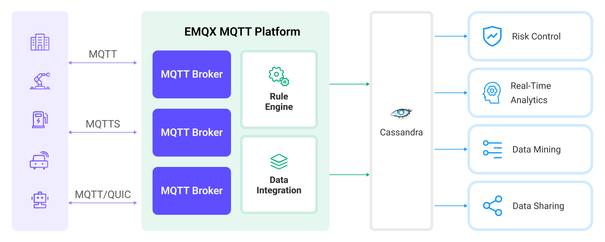

# 将 MQTT 数据写入到 Cassandra

[Apache Cassandra](https://cassandra.apache.org/_/index.html) 是一种流行的开源分布式 NoSQL 数据库管理系统，旨在处理大规模数据集并用于构建高吞吐量的应用程序。EMQX Platform 与 Apache Cassandra 的集成提供了将消息和事件存储在 Cassandra 数据库中的能力，实现时间序列数据存储、设备注册和管理以及实时数据分析等功能。

本页提供了 EMQX Platform 与 Cassandra 的数据集成的全面介绍，并提供了创建和验证数据集成的实用指导。

当前实现中：

- 仅支持 Cassandra v3.x，不兼容 v4.x。
- 仅支持同步方式存储数据。

## 工作原理

Cassandra 数据集成是 EMQX Platform 的开箱即用功能，结合了 EMQX Platform 的设备连接和消息传输能力以及 Cassandra 强大的数据存储能力。通过内置的[规则引擎](./rules.md)组件，集成简化了从 EMQX Platform 到 Cassandra 的数据摄取过程，无需复杂的编码。

下图展示了 EMQX 和 Cassandra 之间的数据集成的典型架构：



将 MQTT 数据摄取到 Cassandra 的工作流程如下：

1. **消息发布和接收**：无论是连接车辆、工业物联网 (IIoT) 系统还是能源管理平台的物联网设备，都通过 MQTT 协议成功连接到 EMQX Platform，并向特定主题发布 MQTT 消息。当 EMQX Platform 接收到这些消息时，它将在其规则引擎中启动匹配过程。
2. **消息数据处理**：当消息到达时，它会通过规则引擎进行处理，然后由 EMQX Platform 中定义的规则处理。规则根据预定义的标准确定哪些消息需要路由到 Cassandra。如果任何规则指定了载荷转换，那么这些转换将被应用，例如转换数据格式、过滤出特定信息，或用额外的上下文丰富载荷。
3. **数据写入到 Cassandra**：一旦规则引擎识别出一条消息需要存储到 Cassandra，它将触发一个将消息转发到 Cassandra 的动作。处理过的数据将被无缝写入 Cassandra 数据库的集合中。
4. **数据存储和利用**：数据现存储在 Cassandra 中，企业可以利用其查询能力应用于各种用例。例如，在连接车辆的领域，存储的数据可以用于通知车队管理系统关于车辆健康状况、根据实时指标优化路线规划或跟踪资产。类似地，在工业物联网 (IIoT) 设置中，数据可能用于监控机械运行状态、预测维护或优化生产计划。

## 特性与优势

与 Cassandra 的数据集成提供了一系列特性和优势，确保了数据传输、存储和利用的高效性：

- **大规模时序数据存储**：EMQX Platform 能够处理海量设备连接与消息传递，借助 Cassandra 高度可扩展性和分布式存储的特性，能够实现大规模数据集包括时序数据的存储和管理，并支持基于时间范围的查询和聚合操作。
- **实时数据流**：EMQX Platform 专为处理实时数据流而构建，确保了从源系统到 Cassandra 的数据传输的高效性和可靠性。它使组织能够实时捕获和分析数据，非常适合需要立即洞察和行动的用例。
- **高可用性保障**：EMQX 与 Cassandra 均提供了集群能力，两者结合使用的情况下，设备连接以及数据可以分布在多台服务器上，当一个节点发生故障时，系统可以自动切换到其他可用节点，从而实现高度可扩展性和容错性。
- **数据转换的灵活性**：EMQX Platform 提供了强大的基于 SQL 的规则引擎，允许组织在将数据存储到 Cassandra 之前进行预处理。它支持各种数据转换机制，如过滤、路由、聚合和丰富，使组织能够根据他们的需求塑造数据。
- **灵活的数据模型**：Cassandra 使用基于列的数据模型，支持灵活的数据模式和动态添加列，适用于存储和管理结构化的设备事件与消息数据，能够轻松存储不同的 MQTT 消息数据。

## 准备工作

本节介绍了在 EMQX Platform 中创建 Cassandra 数据集成之前需要做的准备工作，包括如何设置 Cassandra 服务器、创建 Keyspace 和 Table。

### 前置准备

- 了解[数据集成](./introduction.md)。
- 了解[规则](./rules.md)。

### 安装 Cassandra

使用 docker 启动一个简单的 Cassandra 服务：

```bash
docker run --name cassa --rm -p 9042:9042 cassandra:3.11.14
```

### 创建 Keyspace 和 Table

使用 Docker 命令行创建名为 `mqtt` 的 Keyspace：

```bash
docker exec -it cassa cqlsh "-e CREATE KEYSPACE mqtt WITH REPLICATION = {'class': 'SimpleStrategy', 'replication_factor': 1}"
```

使用 Docker 命令行创建名为 `temp_hum` 的 Table：

```bash
docker exec -it cassa cqlsh "-e \
    CREATE TABLE mqtt.temp_hum( \
        msgid text, \
        temp text, \
        hum text, \
        arrived timestamp, \
        PRIMARY KEY(msgid));"
```

## 创建 Cassandra 连接器

在创建数据集成的规则之前，您需要先创建一个 Cassandra 连接器用于访问 Cassandra 服务器。

1. 在部署菜单中选择 **数据集成**，在数据持久化服务分类下选择 Cassandra 服务。如果您已经创建了其他的连接器，点击**新建连接器**，然后在数据持久化服务分类下选择 Cassandra 服务。

2. **连接器名称**：系统将自动生成一个连接器的名称。

3. 输入连接信息：

   - **服务器**：填写服务器的 IP 地址以及端口。
   - **Keyspace**：`mqtt` 作为键空间。
   - 其它保留为默认。
   - 如果您想建立加密连接，请点击 **启用 TLS** 切换开关。

4. 高级配置（可选）。

5. 点击**测试连接**按钮，如果 Cassandra 服务能够正常访问，则会返回成功提示。

6. 点击**新建**按钮完成连接器的创建。

## 创建规则

接下来您需要创建一条规则来指定需要写入的数据，并在规则中添加响应动作以将经规则处理的数据转发到 Cassandra。

1. 点击连接器列表**操作**列下的新建规则图标或在**规则列表**中点击**新建规则**进入**新建规则**步骤页。

2. 在 SQL 编辑器中输入规则，在下面规则中我们从 `temp_hum/emqx` 主题读取消息上报时间 `arrived`、客户端 ID、消息体(Payload)，并从消息体中分别读取温度和湿度：

   ```sql
     SELECT
       id as msgid,
       payload.temp as temp,
       payload.hum as hum,
       timestamp as arrived
     FROM
       "temp_hum/emqx"
   ```

3. 点击**下一步**开始创建动作，为规则在被触发的情况下指定一个动作。通过这个动作，EMQX Platform 会将经规则处理的数据发送到 Cassandra。

4. 从**使用连接器**下拉框中选择您之前创建的连接器。

5. 配置 CQL 模版，将字段 `msgid`, `temp`, `hum` 和 `arrived` 存储到 Cassandra 数据库中。该模板将通过 Cassandra 查询语言执行，对应模板如下：

   ```sql
     INSERT INTO temp_hum(msgid, temp, hum, arrived)
     VALUES (
       ${msgid},
       ${temp},
       ${hum},
       ${arrived}
     )
   ```

6. 高级配置（可选）。

7. 点击**确认**按钮完成动作的配置。

8. 在弹出的**成功创建规则**提示框中点击**返回规则列表**，从而完成了整个数据集成的配置链路。

## 测试规则

推荐使用 [MQTTX](https://mqttx.app/) 模拟温湿度数据上报，同时您也可以使用其他任意客户端完成。

1. 使用 MQTTX 连接到部署，并向以下 Topic 发送消息。

   - topic: `temp_hum/emqx`

   - payload:

     ```json
     {
       "temp": "27.5",
       "hum": "41.8"
     }
     ```

2. 通过 Cassandra 命令查看消息是否已经写入 `temp_hum` 表中：

   ```bash
    $ docker exec -it cassa cqlsh "-e SELECT * FROM mqtt.temp_hum;"

    msgid                            | arrived                         | hum  | temp
    ----------------------------------+---------------------------------+------+------
    00061488D7FBFE8F2C770000467D0011 | 2024-03-26 04:37:11.987000+0000 | 41.8 | 27.5

    (1 rows)
   ```

3. 在控制台查看运行数据。在规则列表点击规则 ID，在运行统计页面可以查看到规则的统计以及此规则下所有动作的统计。
