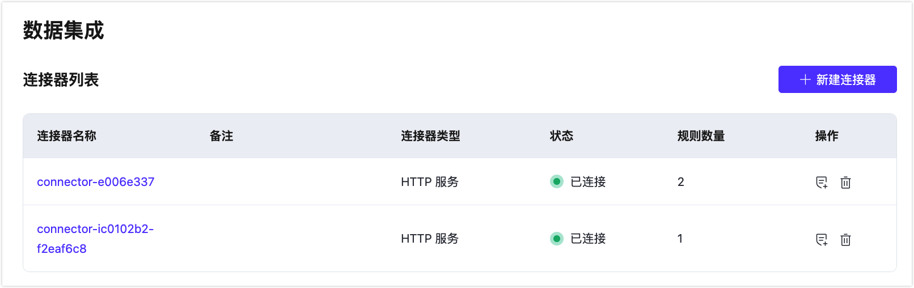

# 连接器

连接器用于将 EMQX Platform 连接到云资源，即由云服务商提供的服务或自己运维的服务。连接器仅关注与云资源的连接，用户可以为不同的云资源创建不同的连接器。

## 创建连接器

创建连接器前，请确保当前部署处在运行状态。

1. 进入部署，从左侧菜单中点击**数据集成**访问数据集成页面。
1. 如果您首次创建连接器，在数据集成页面选择需要连接的资源，例如 **Kafka**。如果您之前已经创建过连接器，则可以通过点击连接器列表页面右上角的**新建连接器**来创建一个新的连接器。
2. 填写相应的资源配置并点击**测试连接**按钮。如果连接成功，将显示成功提示，并可以点击新建。如果失败，请检查连接器配置。

## 查看连接器列表和详情

新建的连接器信息将会显示在**连接器列表**中，包括连接器的名称、类型、状态以及关联规则的数量。一个连接器可以对应多个规则。

点击连接器 ID 可以查看详情。基础信息和配置信息显示默认的配置和您在设置时填写的内容。

## 编辑连接器

::: tip 注意
该功能仅适用于专有版部署。
:::

1. 在**连接器列表**的**操作**列中，点击**编辑**图标进入编辑连接器页面。
2. 修改相应的配置并点击**测试连接**按钮。如果连接成功，将显示成功提示，并可以点击**保存**按钮进行更新。如果失败，请检查连接器配置。

## 删除连接器

1. 确保在删除连接器之前已清空该连接器下的所有规则。

2. 在**连接器列表**的**操作**列中，点击**删除**图标进行删除。

3. 必须输入连接器的 ID 来确认删除。
