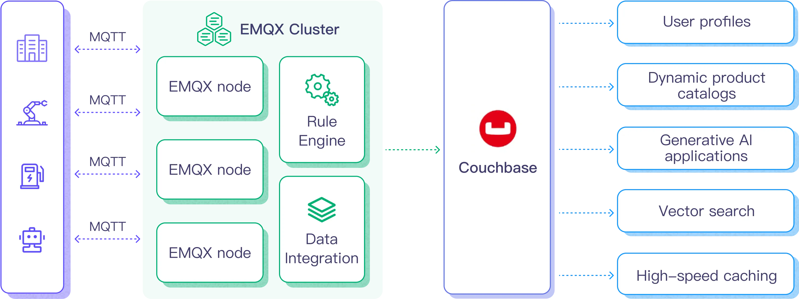

# 将 MQTT 数据写入到 Couchbase

[Couchbase](https://couchbase.com/) 是一个多用途的分布式数据库，它结合了关系型数据库的优势（如 SQL 和 ACID 事务）与 JSON 的多功能性。Couchbase 的基础架构性能极高且可扩展，广泛应用于各行业的用户画像、动态产品目录、生成式 AI 应用、向量搜索、高速缓存等场景。

本页提供了 EMQX Platform 与 Couchbase 数据集成的全面介绍，并提供了创建和验证数据集成的实用指导。

## 工作原理

Couchbase 数据集成是 EMQX 中开箱即用的功能，旨在将 MQTT 的实时数据捕获和传输能力与 Couchbase 的强大数据处理功能结合在一起。通过内置的[规则引擎](https://docs.emqx.com/zh/emqx/latest/data-integration/rules.html)组件，这种集成简化了将数据从 EMQX 导入 Couchbase 进行存储和分析的过程，无需复杂的编码。

下图展示了 EMQX 与 Couchbase 数据集成的典型架构。



将 MQTT 数据导入 Couchbase 的工作流程如下：

1. **消息发布和接收**：工业物联网设备通过 MQTT 协议成功连接到 EMQX，并基于其操作状态、读数或触发事件，将机器、传感器和生产线的实时 MQTT 数据发布到 EMQX。当 EMQX 接收到这些消息时，它会启动其规则引擎中的匹配过程。
2. **消息数据处理**：消息到达后，它会通过规则引擎并由 EMQX 中定义的规则进行处理。这些规则基于预定义的条件，决定哪些消息需要路由到 Couchbase。如果规则指定了负载转换，则会进行相应的转换，如数据格式转换、过滤特定信息或用额外的上下文丰富负载。
3. **数据导入到 Couchbase**：一旦规则引擎识别出某条消息需要存储到 Couchbase，它会触发一个操作，将消息转发到 Couchbase。处理后的数据将无缝地写入 Couchbase 数据库的数据集中。
4. **数据存储和利用**：数据存储在 Couchbase 中后，企业可以利用其强大的查询能力支持各种用例。例如，在动态产品目录的场景中，企业可以使用 Couchbase 高效管理和检索产品信息，支持实时库存更新，并向客户提供个性化推荐，从而提升购物体验并增加销售额。

## 特性与优势

Couchbase 数据集成具有以下特性与优势：

- **实时数据流**：EMQX 专为处理实时数据流而设计，确保从源系统到 Couchbase 的数据传输高效且可靠。它使组织能够实时捕获和分析数据，非常适合需要即时见解和行动的使用场景。
- **高性能和可扩展性**：EMQX 的分布式架构和 Couchbase 的列式存储格式在数据量增加时实现无缝扩展。这确保了即使在处理大数据集时，性能和响应速度也能保持一致。
- **数据转换的灵活性**：EMQX 提供了强大的基于 SQL 的规则引擎，允许组织在将数据存储到 Couchbase 之前进行预处理。它支持多种数据转换机制，如过滤、路由、聚合和丰富，帮助组织根据自身需求调整数据。
- **易于部署和管理**：EMQX 提供了一个用户友好的界面，用于配置数据源、预处理数据规则和 Couchbase 存储设置。这简化了数据集成过程的设置和持续管理。
- **高级分析功能**：Couchbase 强大的基于 SQL 的查询语言和对复杂分析功能的支持，使用户能够从物联网数据中获得有价值的见解，实现预测性分析、异常检测等功能。

## 准备工作

本节介绍了在 EMQX Platform 中创建 Couchbase 数据集成之前需要做的准备工作。

### 前置准备

- 了解[数据集成](./introduction.md)。
- 了解[规则](./rules.md)。

### 网络设置

<!--@include: ./network-setting.md-->

### 安装 Couchbase

#### 通过 Docker 安装 Couchbase

您可以在[官方文档](https://docs.couchbase.com/server/current/getting-started/do-a-quick-install.html)页面找到有关在 Docker 中运行 Couchbase 的更多信息。

1. 使用以下命令启动 Couchbase 服务器。
   服务器需要开放这些端口：8093（用于连接和插入数据），8091（用于访问 Web UI）。

    ```bash
    docker run -t --name db -p 8091-8096:8091-8096 -p 11210-11211:11210-11211 couchbase/server:enterprise-7.2.0
    ```

    运行该命令时，Docker 会下载并安装 Couchbase 服务器。Couchbase 服务器在 Docker 虚拟环境中启动后，您应该会看到以下消息：

    ```bash
    Starting Couchbase Server -- Web UI available at http://<ip>:8091
    and logs available in /opt/couchbase/var/lib/couchbase/logs
    ```

2. 在浏览器中打开 Couchbase Web 控制台，访问 http://x.x.x.x:8091。

    ①点击 **Setup New Cluster** 并为您的集群命名。为了便于入门，将完整管理员凭据设置为 admin 和 password。

    然后接受条款和条件，点击 **Finish with Defaults**，使用默认值完成配置。

    ②输入完配置信息后，点击右下角的 **Save & Finish** 按钮。这将根据配置设置服务器，并打开 Couchbase Web 控制台仪表板。

    ③在左侧导航面板中选择 **Buckets**，然后点击 **ADD BUCKET** 按钮，输入 bucket 的名称，例如 `emqx`，然后点击 **Create** 以创建 bucket。

    ④为默认集合创建主索引：

    ```bash
    docker exec -t db /opt/couchbase/bin/cbq -u admin -p password -engine=http://127.0.0.1:8091/ -script "create primary index on default:emqx._default._default;"
    ```

#### 使用 Couchbase Cloud 创建 Couchbase 服务

1. 登录 [Couchbase Cloud](https://cloud.couchbase.com/sign-in)。

2. 打开 Couchbase UI，在 Operational 页面点击 **Create Cluster** 并选择 Project。

3. 在 Create Cluster 页面，选择集群类型，填写集群名称，云提供商，其他选项默认，点击继续，即可创建集群。

4. 在创建好集群后，进入 **Home** 页面，点击集群名称进入管理，在 **Data Tools** 页面创建一个 **Bucket**、**Scope**、**Collection**。

5. 点击 **Connect**，找到 **Public Connection String** 并记录下来用于后续连接。

6. 前往 **Cluster Access** ，填写 Cluster access name 和 Password 用于认证，然后点击 **Bucket-Level Access**给第四步创建的 Bucket 授予合适的权限。

7. 前往 Allowed IP Addresses，点击 **Add Allowed IP**，添加 IP 白名单。

至此，您已经成功创建好 Couchbase Cloud 实例了，可以继续下一步的连接测试。

## 创建 Couchbase 连接器

在创建数据集成的规则之前，您需要先创建一个 Couchbase 连接器用于访问 Couchbase 服务器。

1. 在部署菜单中选择 **数据集成**，在数据持久化服务分类下选择 Couchbase 服务。如果您已经创建了其他的连接器，点击**新建连接器**，然后在数据持久化服务分类下选择 Couchbase 服务。

2. **连接器名称**：系统将自动生成一个连接器的名称。

3. 输入连接信息：

   - **服务器地址**：填写服务器的 IP 地址以及端口。如果是 Couchbase Cloud，需要去掉前缀couchbases://，默认端口为 18093，并且启用 TLS。
   - **认证信息**：按照安装 Couchbase 中的设定完成**用户名**及**密码**的设定。
   - **高级设置（可选）**：请参阅[高级配置](https://docs.emqx.com/zh/emqx/latest/data-integration/data-bridge-couchbase.html#%E9%AB%98%E7%BA%A7%E9%85%8D%E7%BD%AE)。

4. 点击**测试连接**按钮，如果 Couchbase 服务能够正常访问，则会返回成功提示。

5. 点击**新建**按钮完成连接器的创建。

## 创建规则

接下来您需要创建一条规则来指定需要写入的数据，并在规则中添加响应动作以将经规则处理的数据转发到 Couchbase。

1. 点击连接器列表**操作**列下的新建规则图标或在**规则列表**中点击**新建规则**进入**新建规则**步骤页。

2. 在 SQL 编辑器中输入规则，客户端将温湿度消息发送到 `temp_hum/emqx` 主题时，就会触发引擎。这里需要对 SQL 进行一定的处理：

   ```sql
    SELECT 
    timestamp,
    clientid, 
    payload.temp as temp, 
    payload.hum as hum

    FROM
    "temp_hum/emqx"
   ```

   ::: tip

   如果您初次使用 SQL，可以点击 **SQL 示例**和**启用调试**来学习和测试规则 SQL 的结果。

   :::

3. 点击**下一步**开始创建动作。

4. 从**使用连接器**下拉框中选择您之前创建的连接器。

5. 在 SQL 模板中输入以下命令：

   ```bash
    insert into emqx(key, value) values(${.clientid}, {"Timestamp": ${.timestamp}, "Temp": ${.temp}, "Hum": ${.hum}})
   ```

6. 根据需要配置高级设置选项（可选），详情请参考[高级设置](https://docs.emqx.com/zh/enterprise/latest/data-integration/data-bridge-Couchbase.html#%E9%AB%98%E7%BA%A7%E8%AE%BE%E7%BD%AE)。

7. 点击**确认**按钮完成动作的配置。

8. 在弹出的**成功创建规则**提示框中点击**返回规则列表**，从而完成了整个数据集成的配置链路。

## 测试规则

推荐使用 [MQTTX](https://mqttx.app/) 模拟温湿度数据上报，同时您也可以使用其他任意客户端完成。

1. 使用 MQTTX 连接到部署，并向以下 Topic 发送消息。

   - topic: `temp_hum/emqx`

   - payload:

     ```json
     {
       "temp": "27.5",
       "hum": "41.8"
     }
     ```

2. 点击发布发送消息。Couchbase 服务器中的 `emqx` bucket 中应已插入一个条目。您可以通过在终端运行以下命令来检查：

   ```bash
     docker exec -t db /opt/couchbase/bin/cbq -u admin -p password -engine=http://127.0.0.1:8091/ -script "SELECT * FROM emqx._default._default LIMIT 5;""
   ```

    如果一切正常，上述命令应输出类似以下内容（`requestID` 和指标可能有所不同）：

    ```bash
    {
        "requestID": "858b9a9a-986e-467f-b9ed-9d585bce43be",
        "signature": {
            "*": "*"
        },
        "results": [
        {
            "_default": {
                "Hum": "41.8",
                "Temp": "27.5",
                "Timestamp": 1727322935145
            }
        }
        ],
        "status": "success",
        "metrics": {
            "elapsedTime": "2.662873ms",
            "executionTime": "2.590901ms",
            "resultCount": 1,
            "resultSize": 133,
            "serviceLoad": 12
        }
    }
    ```

3. 在控制台查看运行数据。在规则列表点击规则 ID，在运行统计页面可以查看到规则的统计以及此规则下所有动作的统计。
