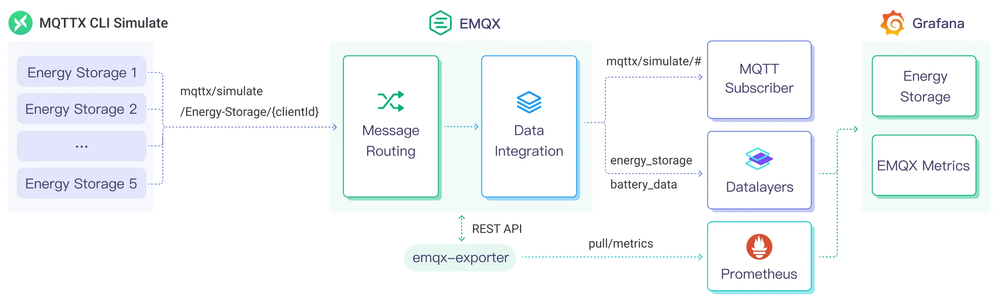

# 将 MQTT 数据写入到 Datalayers

Datalayers 是一款面向工业物联网、车联网、能源等行业的多模、超融合数据库。其强大的数据吞吐能力以及稳定的性能表现使其非常适合物联网领域。EMQX Platform 目前已支持通过 Sink 将消息和数据存储到 Datalayers 中，以便进行数据分析和可视化。

本页提供了 EMQX Platform 与 Datalayers 数据集成的全面介绍，并提供了创建和验证数据集成的实用指导。

## 工作原理

Datalayers 数据集成是 EMQX 中开箱即用的功能，它结合了 EMQX Platform 的设备接入、消息传输能力与 Datalayers 的数据存储和分析能力，通过简单的配置即可实现 MQTT 数据的无缝集成。EMQX 通过规则引擎与 Sink 将设备数据转发至 Datalayers 进行存储和分析，在对数据进行分析之后，Datalayers 会生成报表、图表等数据分析结果，通过 Datalayers 的可视化工具展示给用户。

下图展示了储能场景中 EMQX Platform 和 Datalayers 数据集成的典型架构。



EMQX Platform 和 Datalayers 提供了一个可扩展的物联网平台，用于高效地实时收集和分析能耗数据。在此架构中，EMQX Platform 作为物联网平台，负责设备接入、消息传输、数据路由等功能，Datalayers 作为数据存储和分析平台，负责数据存储、数据分析等功能。具体的工作流程如下：

1. 消息发布与接收：储能设备通过 MQTT 协议连接成功后定期发布能耗数据，这些数据包括电量、输入输出功率信息。EMQX 接收到消息后将在规则引擎中进行比对。
2. 规则引擎处理消息：通过内置的规则引擎，可以根据主题匹配处理特定来源的消息。当消息到达时，它会通过规则引擎，规则引擎会匹配对应的规则，并对消息数据进行处理，例如转换数据格式、过滤掉特定信息或使用上下文信息丰富消息。
3. 写入到 Datalayers：规则引擎中定义的规则触发将消息写入到 Datalayers 的操作。Datalayers Sink 提供了 SQL 模板，能够灵活地定义写入的数据格式，将消息中的特定字段写入到 Datalayers 的对应的表和列中。

储能数据写入到 Datalayers 后，您可以灵活的使用[行协议](https://docs.datalayers.cn/datalayers/latest/development-guide/writing-with-influxdb-line-protocol.html)对数据进行分析，例如：

- 连接到可视化工具，例如 Grafana，根据数据生成图表，展示储能数据。
- 连接业务系统，进行储能设备状态监控与告警。

## 特性与优势

Datalayers 数据集成具有以下特性与优势：

- **高效的数据处理能力**：EMQX Platform 能够处理海量物联网设备连接与消息吞吐，Datalayers 在数据写入、存储和查询方面具有出色的性能表现，能够满足物联网场景下的数据处理需求，不会导致系统不堪重负。
- **消息转换**：消息可以写入 Datalayers 之前，通过 EMQX Platform 规则中进行丰富的处理和转换。
- **可扩展性**：EMQX Platform 与 Datalayers 都具备集群扩展能力，能够随着业务的发展，利用灵活地进行集群水平扩展，满足业务的发展需求。
- **丰富的查询能力**：Datalayers 提供包括优化的函数、运算符和索引技术，可实现对时间戳数据的高效查询和分析，准确地从 IoT 时间序列数据中提取有价值的见解。
- **高效存储**：Datalayers 使用高压缩比的编码方式，可以大幅降低存储成本。也可以自定义不同数据的存储时间,避免不必要的数据占用存储空间。

## 准备工作

本节介绍了在 EMQX Platform 中创建 Datalayers 数据集成之前需要做的准备工作。

### 前置准备

- 了解 [Datalayers 行协议](https://docs.datalayers.cn/datalayers/latest/development-guide/writing-with-influxdb-line-protocol.html)。
- 了解[数据集成](./introduction.md)。
- 了解[规则](./rules.md)。

### 网络设置

<!--@include: ./network-setting.md-->

### 通过 Docker 安装 Datalayers

1. 通过 Docker 安装并启动 Datalayers，详细步骤请参考 [Install Datalayers](https://docs.datalayers.cn/datalayers/latest/getting-started/docker.html)。

```bash
# 启动一个 Datalayers 容器
docker run --name datalayers -p 8361:8361 datalayers/datalayers:v2.1.7
```

2. Datalayers 服务启动后，您可以通过以下步骤进入 Datalayers CLI 中创建数据库，默认的用户和密码为 admin/public：

    进入 Datalayers 容器：

    ```bash
    docker exec -it datalayers bash
    ```

    进入 Datalayers CLI：

    ```bash
    dlsql -u admin -p public
    ```

    创建数据库：

    ```sql
    create database emqx
    ```

## 创建 Datalayers 连接器

在创建数据集成的规则之前，您需要先创建一个 Datalayers 连接器用于访问 Datalayers 服务器。

1. 在部署菜单中选择 **数据集成**，在数据持久化服务分类下选择 Datalayers 服务。如果您已经创建了其他的连接器，点击**新建连接器**，然后在数据持久化服务分类下选择 Datalayers 服务。

2. **连接器名称**：系统将自动生成一个连接器的名称。

3. 输入连接信息：

   - **服务器地址**：填写服务器的 IP 地址以及端口: `{url}:8361` 。
   - 按照安装 Datalayers 中的设定完成**数据库名字**、**用户名**及**密码**设置。
   - 如果您想建立加密连接，请点击 **启用 TLS** 切换开关。

4. 点击**测试连接**按钮，如果 Datalayers 服务能够正常访问，则会返回成功提示。

5. 点击**新建**按钮完成连接器的创建。

## 创建规则

接下来您需要创建一条规则来指定需要写入的数据，并在规则中添加响应动作以将经规则处理的数据转发到 Datalayers。

1. 点击连接器列表**操作**列下的新建规则图标或在**规则列表**中点击**新建规则**进入**新建规则**步骤页。

2. 在 SQL 编辑器中输入规则，客户端将温湿度消息发送到 `temp_hum/emqx` 主题时，就会触发引擎。这里需要对 SQL 进行一定的处理：

   ```sql
     SELECT
       timestamp,
       payload.location as location,
       payload.temp as temp,
       payload.hum as hum
     FROM "temp_hum/emqx"
   ```

   ::: tip

   如果您初次使用 SQL，可以点击 **SQL 示例**和**启用调试**来学习和测试规则 SQL 的结果。

   :::

3. 点击**下一步**开始创建动作。

4. 从**使用连接器**下拉框中选择您之前创建的连接器。

5. 设定**时间精度**，默认为毫秒。

6. 写语句：使用 Datalayers API Line Protocol 写入 Datalayers 的数据。
   ::: tip

    由于 Datalayers 的写入完全兼容 InfluxDB v1 行协议，因此您可以参考 [InfluxDB 行协议](https://docs.influxdata.com/influxdb/v1/write_protocols/line_protocol_reference/) 来设置数据格式。

    例如，输入带符号的整型值，请在占位符后添加`i `作为类型标识，例如  `${payload.int}i `。参见 [InfluxDB 1.8](https://docs.influxdata.com/influxdb/v1/write_protocols/line_protocol_reference/#write-the-field-value-1-as-an-integer-to-influxdb) 写入整型值。
   :::

    此处，我们可以使用 Line Protocol 格式，将其设置为：

   ```bash
     temp_hum,location=${location} temp=${temp},hum=${hum} ${timestamp}
   ```

7. 根据需要配置高级设置选项（可选），详情请参考[高级设置](https://docs.emqx.com/zh/emqx/latest/data-integration/data-bridge-datalayers.html#%E9%AB%98%E7%BA%A7%E8%AE%BE%E7%BD%AE)。

8. 点击**确认**按钮完成动作的配置。

9. 在弹出的**成功创建规则**提示框中点击**返回规则列表**，从而完成了整个数据集成的配置链路。

## 测试规则

推荐使用 [MQTTX](https://mqttx.app/) 模拟温湿度数据上报，同时您也可以使用其他任意客户端完成。

1. 使用 MQTTX 连接到部署，并向以下 Topic 发送消息。

   - topic: `temp_hum/emqx`

   - payload:

     ```json
     {
       "temp": 27.5,
       "hum": 41.8,
       "location": "Prague"
     }
     ```

2. 前往 Datalayers CLI，查看数据是否成功写入到数据库，执行以下命令：

    ① 进入 Datalayers 控制台：

   ```bash
    $ docker exec -it datalayers bash
    $ dlsql -u admin -p public
    $ use emqx
   ```

   ② 执行 SQL 查询数据：

   ```bash
    > select * from "temp_hum"
    +-------------------------------+----------+------+------+
    | time                          | location | hum  | temp |
    +-------------------------------+----------+------+------+
    | 2024-09-24T11:36:58.831+08:00 | Prague   | 41.8 | 27.5 |
    +-------------------------------+----------+------+------+
    2 rows in set (0.002 sec)
   ```

3. 在控制台查看运行数据。在规则列表点击规则 ID，在运行统计页面可以查看到规则的统计以及此规则下所有动作的统计。
