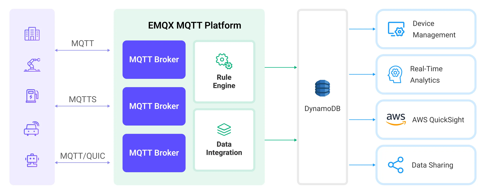

# 将 MQTT 数据流入 DynamoDB

[DynamoDB](https://www.amazonaws.cn/en/dynamodb/) 是 AWS 上一项全托管的高性能无服务器键值存储数据库服务。它专为需要快速、可扩展和可靠数据存储的应用程序设计。EMQX 支持与 DynamoDB 集成，使您能够将 MQTT 消息和客户端事件保存到 DynamoDB，从而实现物联网设备的注册与管理，以及设备数据的长期存储和实时分析。通过 DynamoDB 数据集成，MQTT 消息和客户端事件可以存储在 DynamoDB 中，事件也可以触发 DynamoDB 中数据的更新或删除，从而实现例如设备在线状态和连接历史记录等信息的记录。

本页面详细介绍了 DynamoDB 数据集成功能，并提供了创建 DynamoDB 数据集成的实践指南，内容包括创建 DynamoDB 连接器、创建规则和测试规则。它演示了如何通过 MQTT 协议将模拟的温湿度数据上报至 EMQX Platform，并通过已配置的数据集成将数据存储到 DynamoDB 中。

## 工作原理

DynamoDB 数据集成是 EMQX Platform 的开箱即用功能，它结合了 EMQX 的设备连接和消息传输能力与 DynamoDB 的强大数据存储能力。借助内置的数据集成组件，集成简化了将数据从 EMQX 导入到 DynamoDB 进行存储和管理的过程，无需复杂的编码。

下图展示了 EMQX 与 DynamoDB 之间数据集成的典型架构：



将 MQTT 数据流入 DynamoDB 的工作原理如下：

1. **消息发布与接收**：无论是连接车辆、工业物联网系统，还是能源管理平台的物联网设备，均可通过 MQTT 协议成功连接到 EMQX，并向特定主题发布 MQTT 消息。当 EMQX 接收到这些消息时，它会在其规则引擎中启动消息匹配过程。
2. **消息数据处理**：消息到达后，会通过规则引擎并由 EMQX 定义的规则处理。根据预定义的条件，规则决定需要将哪些消息路由到 DynamoDB。如果任何规则指定了有效 payload 转换，这些转换将被应用，例如转换数据格式、过滤特定信息或为有效 payload 添加额外的上下文。
3. **数据导入到 DynamoDB**：一旦规则引擎识别出某条消息需要存储到 DynamoDB，它将触发将消息转发到 DynamoDB 的操作。处理后的数据将无缝写入 DynamoDB 数据库的集合中。
4. **数据存储和利用**：数据存储在 DynamoDB 中后，企业可以利用其查询功能来满足各种使用场景。例如，在车辆连接领域，存储的数据可以为车队管理系统提供有关车辆健康状况的反馈、基于实时指标优化路线规划或跟踪资产。同样，在工业物联网环境中，数据可用于监控机械健康、预测维护或优化生产计划。

## 功能和优势

与 DynamoDB 的数据集成提供了一系列功能和优势，旨在确保高效的数据传输、存储和利用：

- **实时数据流**：EMQX Platform 专为处理实时数据流而构建，确保从源系统到 DynamoDB 的高效可靠的数据传输。它使组织能够实时捕获和分析数据，适用于需要即时洞察和行动的用例。
- **灵活的数据转换**：EMQX Platform 提供了强大的基于 SQL 的规则引擎，使组织能够在数据存储到 DynamoDB 之前预处理数据。它支持多种数据转换机制，如过滤、路由、聚合和丰富，能够根据需求塑造数据。
- **灵活的数据模型**：DynamoDB 使用键值和文档数据模型，适用于存储和管理结构化的设备事件和消息数据，便于存储不同的 MQTT 消息结构。
- **强大的可扩展性**：EMQX Platform 提供集群扩展性，能够基于设备连接数和消息量实现无缝的横向扩展；DynamoDB 无需服务器或基础设施管理，自动处理底层资源管理和扩展。两者的结合提供了高性能、高可靠性的数据存储和可扩展性。

## 准备工作

本节介绍在 EMQX Platform 中创建 DynamoDB 数据集成所需的准备工作。

### 前置准备

- 了解 [规则](./rules.md)。
- 了解 [数据集成](./introduction.md)。

### 网络设置

<!--@include: ./network-setting.md-->

### 设置 AWS DynamoDB 实例

要创建 AWS DynamoDB，您可以选择在云中或使用 Docker 安装。

#### 在控制台中创建 DynamoDB 实例和表

如果您是首次创建 DynamoDB 实例，可以参考 [AWS 帮助文档](https://docs.aws.amazon.com/zh_cn/amazondynamodb/latest/developerguide/GettingStartedDynamoDB.html)。

1. 进入 DynamoDB 控制台并点击创建表 `temp_hum`。
2. 填写表名、分区键等关键信息，其他默认值可以根据实际需求进行设置。
3. 当表的状态为激活时，表示您已成功创建表 `temp_hum`。

#### 安装本地 DynamoDB 服务器并创建表

1. 准备 docker-compose 文件 dynamo.yaml，用于设置本地 DynamoDB 服务器。`AWS_DEFAULT_REGION` 一般选择和 EMQX Platform 部署相同的区域。

   ```bash
   version: '3.8'
   services:
   dynamo:
       command: "-jar DynamoDBLocal.jar -sharedDb"
       image: "amazon/dynamodb-local:latest"
       container_name: dynamo
       ports:
       - "8000:8000"
       environment:
       AWS_ACCESS_KEY_ID: root 
       AWS_SECRET_ACCESS_KEY: public
       AWS_DEFAULT_REGION: us-west-2
   ```

2. 启动服务器。

   ```bash
   docker-compose -f dynamo.yaml up
   ```

3. 准备表定义并将其保存到主目录中，命名为 `temp_hum.json`。

   ```bash
   {
       "TableName": "temp_hum",
       "KeySchema": [
           { "AttributeName": "id", "KeyType": "HASH" }
       ],
       "AttributeDefinitions": [
           { "AttributeName": "id", "AttributeType": "S" }
       ],
       "ProvisionedThroughput": {
           "ReadCapacityUnits": 5,
           "WriteCapacityUnits": 5
       }
   }
   ```

4. 通过此文件创建新表。

   ```bash
   docker run --rm -v ${HOME}:/dynamo_data -e AWS_ACCESS_KEY_ID=root -e AWS_SECRET_ACCESS_KEY=public -e AWS_DEFAULT_REGION=us-west-2 amazon/aws-cli dynamodb create-table --cli-input-json file:///dynamo_data/temp_hum.json --endpoint-url http://host.docker.internal:8000
   ```

5. 检查表是否创建成功。

   ```bash
   docker run --rm -e AWS_ACCESS_KEY_ID=root -e AWS_SECRET_ACCESS_KEY=public -e AWS_DEFAULT_REGION=us-west-2 amazon/aws-cli dynamodb list-tables --endpoint-url http://host.docker.internal:8000
   ```

   如果表创建成功，以下 JSON 将会打印出来。

   ```bash
       {
           "TableNames": [
               "temp_hum"
           ]
       }
   ```

## 创建 DynamoDB 连接器

在创建数据集成规则之前，您需要先创建一个 DynamoDB 连接器，以访问 DynamoDB 服务器。

1. 进入您的部署。点击左侧导航菜单中的 **数据集成**。
2. 如果您是首次创建连接器，请在 **数据持久化** 类别下选择 **DynamoDB**。如果您已经创建了连接器，请选择 **新建连接器**，然后在 **数据转发** 类别下选择 **DynamoDB**。
3. 在新建连接器页面上，配置以下选项：
   - **DynamoDB 区域**：填写 DynamoDB 实例所在区域，此示例中为 `us-west-2`。
   - **DynamoDB 地址**：填写 DynamoDB 服务的 [端点](https://docs.aws.amazon.com/zh_cn/general/latest/gr/ddb.html)。确保包含前缀 "https://"。如果您使用的是 LocalStack，请使用 `http://localhost:8000`。
   - **AWS 访问密钥 ID**：填写 [访问密钥 ID](https://docs.aws.amazon.com/powershell/latest/userguide/creds-idc.html)。此示例中为 `root`。
   - **AWS 秘密访问密钥**：填写 [秘密访问密钥](https://docs.aws.amazon.com/powershell/latest/userguide/creds-idc.html)。此示例中为 `public`。
   - 其他设置可使用默认值，或根据您的业务需求进行配置。
4. 点击 **测试连接** 按钮。如果 DynamoDB 服务可访问，将返回成功提示。
5. 点击 **新建** 按钮以完成创建。

## 创建规则

接下来，您需要创建一个规则来指定要写入的数据，并在规则中添加相应的操作，将处理后的数据转发到 DynamoDB。

1. 在规则区域点击 **新建规则**，或点击您刚刚创建的连接器操作列中的新建规则图标。

2. 在 **SQL 编辑器** 中输入规则匹配 SQL 语句。以下 SQL 示例从发送到 `temp_hum/emqx` 主题的消息中读取消息上报时间 `up_timestamp`、客户端 ID 和消息体（Payload），并提取温度和湿度。

   ```sql
   SELECT 
    id as msgid,
    topic, 
    payload 
    
   FROM
    "temp_hum/emqx"
   ```

   要创建记录在线/离线状态的规则，输入以下语句：

   ```sql
   SELECT
    str(event) + timestamp as id, *
   FROM 
    "$events/client_connected", "$events/client_disconnected"
   ```

   ::: tip

   如果您是初学者用户，可以点击 **SQL 示例** 并启用测试，学习并测试 SQL 规则。

   :::

3. 点击 **下一步** 添加动作。

4. 从 **连接器** 下拉框中选择您刚刚创建的连接器。

5. 配置以下信息：

   - **动作名称**：系统将自动生成一个动作名称。

   - **表名称**：输入 `temp_hum`。

   - **消息模板**：当此值为空时，整个消息将被存储到数据库中。模板可以是任何有效的 JSON，并带有占位符，请确保表的所有键都在此处，例如：`{"id" : "${id}", "clientid" : "${clientid}", "data" : "${payload.data}"}`。

     如果 SQL 模板中的占位符变量未定义，您可以通过 **消息模板** 上方的 **未定义变量作为 NULL** 开关来定义规则引擎的行为：

     - **关闭**（默认）：规则引擎可能会将字符串 `undefined` 插入到数据库中。

     - **启用**：允许规则引擎在变量未定义时将 `NULL` 插入到数据库中。

       ::: tip

       如果可能，此选项应始终启用；关闭该选项仅用于确保向后兼容性。

       :::

   - 其他设置可使用默认值，或根据您的业务需求进行配置。

6. 点击 **确认** 按钮完成规则创建。

7. 在 **成功创建新规则** 弹窗中，点击 **返回规则**，从而完成整个数据集成配置链。

## 测试规则

建议您使用 [MQTTX](https://mqttx.app/zh) 模拟温湿度数据上报，但您也可以使用其他客户端。

1. 使用 MQTTX 连接到部署，并向以下主题发送消息。

   - 主题：`temp_hum/emqx`

   - 有效 payload：

     ```json
     {
       "temp": "27.5",
       "hum": "41.8"
     }
     ```

2. 检查消息是否已转发到 DynamoDB。

   - 在 NoSQL Workbench 中查看结果（可选）。

     **[NoSQL Workbench](https://docs.aws.amazon.com/amazondynamodb/latest/developerguide/workbench.settingup.html)** 是适用于 Amazon DynamoDB 的跨平台客户端 GUI 应用程序，用于现代数据库开发和操作。您可以通过它连接到 DynamoDB。进入 **Operation Builder** 页面，选择表 `temp_hum`。您可以在此处查看温湿度数据转发的结果。

   - 检查数据是否已写入数据表（可选）。

     ```bash
     docker run --rm -e AWS_ACCESS_KEY_ID=root -e AWS_SECRET_ACCESS_KEY=public -e AWS_DEFAULT_REGION=us-west-2 amazon/aws-cli dynamodb scan --table-name=temp_hum --endpoint-url http://host.docker.internal:8000
     ```

3. 在控制台中查看动作数据。点击规则列表中的规则 ID，您可以看到该规则的统计数据以及该规则下所有动作的统计数据。