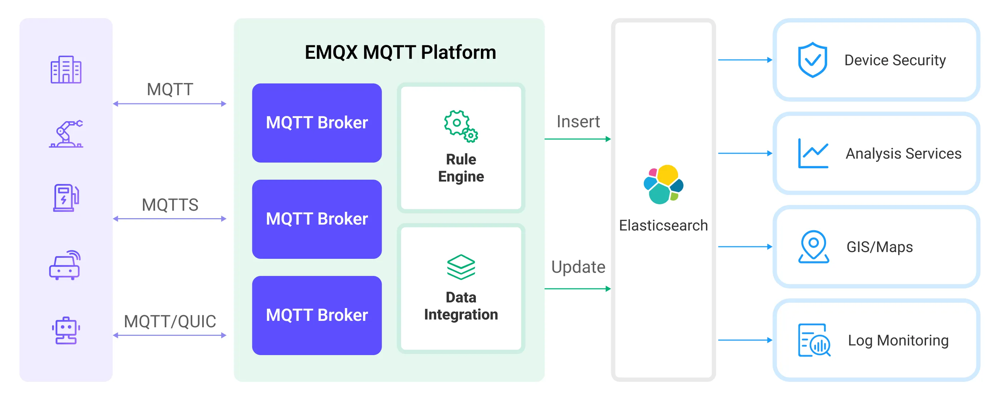

# 将 MQTT 数据写入到 Elasticsearch

[Elasticsearch](https://www.elastic.co/elasticsearch/)  是一个分布式的搜索和数据分析引擎，提供了多样化数据的全文搜索、结构化搜索以及分析等功能。EMQX Platform 通过与 Elasticsearch 集成，能够将 MQTT 数据无缝的集成到 Elasticsearch 进行存储，并借助其强大的可扩展性和分析能力，为物联网应用提供了高效、可扩展的数据存储和分析解决方案。

本页详细介绍了 EMQX Platform 与 Elasticsearch 的数据集成并提供了实用的规则和动作创建指导。

## 工作原理

Elasticsearch 数据集成是 EMQX Platform 中开箱即用的功能，它结合了 EMQX Platform 的设备接入、消息传输能力与 Elasticsearch 的数据存储和分析能力，通过简单的配置即可实现 MQTT 数据的无缝集成。

下图展示了 EMQX Platform 和 Elasticsearch 数据集成的典型架构。



EMQX Platform 和 Elasticsearch 提供了一个可扩展的物联网平台，用于高效地实时收集和分析设备数据。在此架构中，EMQX Platform 作为物联网平台，负责设备接入、消息传输、数据路由等功能，Elasticsearch 作为数据存储和分析平台，负责数据存储、数据搜索和分析等功能。

EMQX Platform 通过规则引擎与动作将设备数据转发至 Elasticsearch，Elasticsearch 通过其强大的搜索和分析能力，生成报表、图表等数据分析结果，通过 Kibana 的可视化工具展示给用户。其工作流程如下：

1. **设备消息发布与接收**：物联网设备通过 MQTT 协议连接成功后向特定的主题发布遥测和状态数据，EMQX Platform 接收到消息后将在规则引擎中进行比对。
2. **规则引擎处理消息**：通过内置的规则引擎，可以根据主题匹配处理特定来源的 MQTT 消息。规则引擎会匹配对应的规则，并对消息进行处理，例如转换数据格式、过滤掉特定信息或使用上下文信息丰富消息。
3. **写入到 Elasticsearch**：规则引擎中定义的规则触发将消息写入到 Elasticsearch 的操作。Elasticsearch 动作提供了灵活的操作方式以及文档模板，能够构造符合需求的文档格式，将消息中的特定字段写入到 Elasticsearch 的对应的索引中。

设备数据写入到 Elasticsearch 后，您可以灵活的使用 Elasticsearch 的搜索和分析能力对数据进行处理，例如：

- **日志监测**：物联网设备会生成大量的日志数据，这些数据可以被发送到 Elasticsearch 中进行存储和分析。通过连接到可视化工具，例如 Kibana，可以根据这些日志数据生成图表，实时展示设备状态、操作记录以及错误消息等信息。这样可以帮助开发者或运维人员快速定位和解决可能出现的问题。

- **地理位置数据（Maps）**：物联网设备往往会生成地理位置数据，这些数据可以被存储在 Elasticsearch 中。通过 Kibana 的 Maps 功能，可以在地图上可视化设备的位置信息，进行设备位置的追踪和分析。

- **终端安全**：物联网设备的安全日志数据可以被发送到 Elasticsearch，通过连接到 Elastic Security，可以生成安全报告，实时监控设备的安全状态，检测可能的安全威胁，并进行响应。

## 特性与优势

Elasticsearch 数据集成为您的业务带来以下特性和优势：

- **高效数据索引和搜索**： Elasticsearch 可以轻松处理来自 EMQX Platform 的大规模的实时消息数据。强大的全文搜索和索引功能使得物联网消息数据可以被快速、高效地检索和查询。
- **数据可视化**： 通过与 Kibana（Elastic Stack 的一部分）的集成，可以对物联网数据进行强大的数据可视化，帮助理解和分析数据。
- **灵活的数据操作**：EMQX Platform 的 Elasticsearch 集成支持动态设置索引、文档 ID 以及文档模板，能够进行文档的创建、更新与删除操作，适用于更多物联网数据集成场景。
- **扩展性**：Elasticsearch 与 EMQX Platform 均支持集群，都可以通过添加更多的节点来轻松扩展其处理能力，实现不中断的业务扩展。

## 准备工作

本节介绍了在 EMQX Platform 中创建 Elasticsearch 数据集成之前需要做的准备工作，包括安装 Elasticsearch 和创建索引。

### 前置准备

- 了解[数据集成](./introduction.md)。
- 了解[规则](./rules.md)。

### 安装 Elasticsearch 并创建索引

EMQX Platform 支持与私有部署的 Elasticsearch 或与云上的 Elastic 集成。您可以使用 Elastic Cloud 或者 Docker 部署一个 Elasticsearch 实例。

#### 使用 Docker 部署一个 Elasticsearch 实例

1. 如果没有 Docker 环境请[安装 Docker](https://docs.docker.com/install/)。

2. 启动 Elasticsearch 容器，开启 X-Pack 安全认证，设置默认用户名 `elastic` 的密码为 `public`。

   ```bash
   docker run -d --name elasticsearch \
       -p 9200:9200 \
       -p 9300:9300 \
       -e "discovery.type=single-node" \
       -e "xpack.security.enabled=true" \
       -e "ELASTIC_PASSWORD=public" \
       docker.elastic.co/elasticsearch/elasticsearch:7.10.1
   ```

3. 创建  `device_data`  索引用于存储设备发布的消息，请注意替换 Elasticsearch 用户名和密码。

   ```bash
   curl -u elastic:public -X PUT "localhost:9200/device_data?pretty" -H 'Content-Type: application/json' -d'
   {
     "mappings": {
       "properties": {
         "ts": { "type": "date" },
         "clientid": { "type": "keyword" },
         "payload": {
           "type": "object",
           "dynamic": true
         }
       }
     }
   }'
   ```

#### 使用 Elastic Cloud

1. Elastic Cloud 提供 14 天 的免费试用版(https://cloud.elastic.co/registration)，您可以在其中创建自己的部署。 注册后，您将看到 Elastic Cloud 控制台。

2. 要启动部署，请单击 Create depolyment。

3. Elastic Cloud 的使用教程请参考其官网教程(https://www.elastic.co/guide/en/starting-with-the-elasticsearch-platform-and-its-solutions/8.13/getting-started-guides.html)

4. 记录 Elasticsearch endpoint 信息，以及相关认证信息，以供后续连接使用

5. 创建  `device_data`  索引用于存储设备发布的消息，请注意替换 Elasticsearch 用户名和密码。

```bash
  curl -u elastic:xxxx -X PUT "{Elasticsearch endpoint}/device_data?pretty" -H 'Content-Type: application/json' -d'
  {
    "mappings": {
      "properties": {
        "ts": { "type": "date" },
        "clientid": { "type": "keyword" },
        "payload": {
          "type": "object",
          "dynamic": true
        }
      }
    }
  }'
```

## 创建连接器

在创建数据集成的规则之前，您需要先创建一个 Elasticsearch 连接器用于访问 Elasticsearch 服务。

1. 在部署菜单中选择 **数据集成**，在数据转发分类下选择 Elasticsearch。如果您已经创建了其他的连接器，点击**新建连接器**，然后在数据转发服务分类下选择 Elasticsearch。

2. **连接器名称**：系统将自动生成一个连接器的名称。

3. 填写连接相关配置：

   - **服务器地址**：Elasticsearch 服务的 REST 接口 URL，如果 Elasticsearch 服务在远程运行，则填写实际服务器地址，此处填写格式 `http://{host}:9200`。
   - **用户名**: Elasticsearch 服务的用户名，此处填写 `elastic`。
   - **密码**: Elasticsearch 服务的密码，此处根据实际情况填写。
   - **启用 TLS**: 如果您想建立一个加密连接，单击切换按钮。
   - 根据业务需求配置高级设置（可选）。

4. 点击**测试连接**按钮，如果 Elasticsearch 能够正常访问，则会返回**连接器可用**提示。

5. 点击**新建**按钮完成连接器的创建。

接下来，您可以基于此连接器创建数据桥接规则。

## 创建规则

本节演示了如何创建 Elasticsearch 数据集成的规则来指定需要转发至 Elasticsearch 的数据并为规则添加触发的动作。

1. 点击连接器列表**操作**列下的新建规则图标或在**规则列表**中点击**新建规则**进入**新建规则**步骤页。

2. 在 SQL 编辑器中输入规则，客户端将温湿度消息发送到 `temp_hum/emqx` 主题时，就会触发引擎。这里需要对 SQL 进行一定的处理：

```sql
  SELECT

   timestamp as up_timestamp,
   clientid as client_id,
   payload

  FROM

   "temp_hum/emqx"
```

::: tip

如果您初次使用 SQL，可以点击 **SQL 示例**和**启用调试**来学习和测试规则 SQL 的结果。

:::

3. 点击**下一步**开始创建动作。

4. 从**使用连接器**下拉框中选择您之前创建的连接器。

5. 完成消息从 EMQX Platform 到发布到 Elasticsearch 的配置：

   - **操作**：可选项`创建`，`更新`和`删除`操作。
   - **索引名称**：要执行操作的索引或索引别名的名称，支持 `${var}` 格式的占位符。
   - **文档 ID**：当操作为`创建`时为可选项，对于其他操作为必填项。索引内文档的唯一标识符，支持 `${var}` 格式的占位符。如果未指定 ID，则由 Elasticsearch 自动生成。
   - **路由**：指定应将文档存储在索引的哪个分片中，留空则由 Elasticsearch 决定。
   - **文档模板**：自定义文档模板，支持 `${var}` 格式的占位符，要求必须可以被转换为 JSON 对象。 例如  `{ "field": "${payload.field}"}` 或 `${payload}`。
   - **最大重试次数**：当写入失败时，最大重试次数。默认为 3 次。
   - **是否覆盖文档**（`创建`操作特有的参数）：当文档已经存在时是否覆盖文档，为“否”时文档将写入失败。

     在本示例中，索引名称设置为 `device_data`，使用客户端 ID 与时间戳组合 `${client_id}_${up_timestamp}` 作为文档 ID，文档保存客户端 ID、当前时间戳以及整个消息体，填写文档模板如下：

     ```json
     {
       "clientid": "${client_id}",
       "ts": ${up_timestamp},
       "payload": ${payload}
     }
     ```

6. 展开**高级设置**，根据情况配置同步/异步模式，队列与缓存等参数高级设置选项（可选）

7. 点击**确认**按钮完成动作的配置。
8. 在弹出的**成功创建规则**提示框中点击**返回规则列表**，从而完成了整个数据集成的配置链路。

## 测试规则

推荐使用 [MQTTX](https://mqttx.app/) 模拟温湿度数据上报，同时您也可以使用其他任意客户端完成。

1. 使用 MQTTX 连接到 EMQX Platform 部署，并向以下 Topic 发送消息。

   - topic: `temp_hum/emqx`

   - client id: `test_client`

   - payload:

     ```json
     {
       "temp": "27.5",
       "hum": "41.8"
     }
     ```

2. 使用 `_search` API 来查看索引中的文档内容，查看数据是否已经写入 `device_data` 索引中：

   ```bash
   curl -u elastic:public -X GET "localhost:9200/device_data/_search?pretty"
   ```

   正确的响应结果如下：

   ```json
   {
     "took": 484,
     "timed_out": false,
     "_shards": {
       "total": 1,
       "successful": 1,
       "skipped": 0,
       "failed": 0
     },
     "hits": {
       "total": {
         "value": 1,
         "relation": "eq"
       },
       "max_score": 1.0,
       "hits": [
         {
           "_index": "device_data",
           "_type": "_doc",
           "_id": "mqttx_a2acfd19_1711359139238",
           "_score": 1.0,
           "_source": {
             "clientid": "mqttx_a2acfd19",
             "ts": 1711359139238,
             "payload": {
               "temp": "27.5",
               "hum": "41.8"
             }
           }
         }
       ]
     }
   }
   ```
