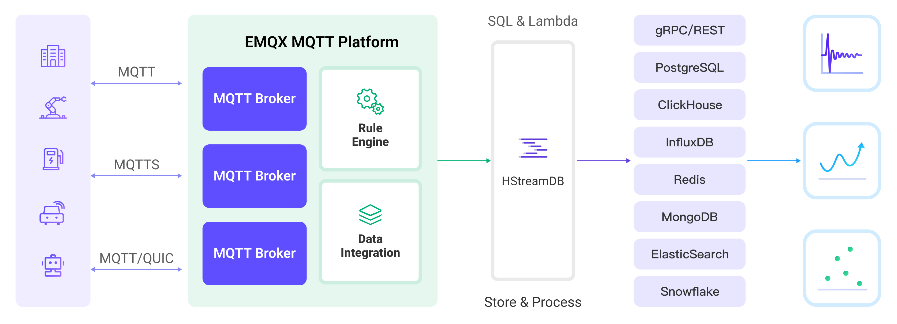

# 将 MQTT 数据写入到 HStreamDB

[HStreamDB](https://hstream.io/) 是一个开源的流数据平台，使您能够在一个统一的平台中高效地摄取、存储、处理和分发所有实时消息、事件和其他数据流。通过 EMQX Cloud 与 HStreamDB 的集成，您可以将 MQTT 消息和客户端事件保存到 HStreamDB 中，实现大规模物联网数据的采集、传输与存储，并使用标准 SQL 和物化视图对数据流进行实时处理以及监测和分析。

本页提供了 EMQX Cloud 与 HStreamDB 的数据集成的全面介绍，并提供了创建和验证数据集成的实用指导。

## 工作原理

HStreamDB 数据集成是 EMQX Cloud 的即开即用功能，结合了 EMQX Cloud 的设备连接和消息传输能力以及 HStreamDB 强大的数据存储和处理能力。内置的[规则引擎](./rules.md)组件简化了两个平台之间的数据流和处理过程。

下图展示了 EMQX 和 HStreamDB 之间的数据集成的典型架构：



EMQX Cloud 通过规则引擎和配置的规则将 MQTT 数据转发到 Apache HStreamDB，整个过程如下：

1. **消息发布和接收**：物联网设备通过 MQTT 协议建立成功连接，随后发布遥测和状态数据到特定主题。当 EMQX Cloud 接收到这些消息时，它将在其规则引擎中启动匹配过程。
2. **规则引擎处理消息**：使用内置的规则引擎，可以根据主题匹配处理来自特定来源的 MQTT 消息。规则引擎匹配相应规则并处理消息，例如数据格式转换、过滤特定信息或用上下文信息丰富消息。
3. **数据流入 HStreamDB**：规则触发将消息转发到 HStreamDB 的动作，可以轻松配置数据到 HStreamDB 流名称、分区键和记录，便于后续的数据处理和分析。

在 MQTT 消息数据写入 HStreamDB 后，您可以进行灵活的应用程序开发，例如：

- 在接收到特定 MQTT 消息时，可以使用 HStreamDB 的规则引擎组件触发相应的动作或事件，实现跨系统和应用的事件驱动功能。
- 在 HStreamDB 中实时分析 MQTT 数据流，检测异常或特定事件模式，并根据这些条件触发警报通知或执行相应动作。
- 将多个 MQTT 主题的数据集中到一个统一的数据流中，并利用 HStreamDB 的计算能力进行实时聚合、计算和分析，以获得更全面的数据洞察。

## 特性与优势

与 HStreamDB 的数据集成为您的业务带来以下特性和优势：

- **可靠的物联网数据消息传递**：EMQX Cloud 能够可靠地批量发送 MQTT 消息到 HStreamDB，使物联网设备与 HStreamDB 和应用系统集成。
- **MQTT 消息转换**：使用规则引擎，EMQX Cloud 可以过滤和转换 MQTT 消息。在发送到 HStreamDB 之前，消息可以经过数据提取、过滤、丰富和转换。
- **大规模数据流存储**：HStreamDB 支持在专门设计的分布式、容错的日志存储集群中可靠地存储数百万数据流，并在需要的时候重放或推送实时数据流的更新到应用中。能够与 EMQX 消息模型完美结合，实现大规模物联网数据采集传输与存储。
- **集群和可扩展性**：EMQX 和 HStreamDB 采用云原生架构构建，支持集群在线伸缩、动态扩缩容，随着业务增长灵活地水平扩展以满足不断扩大的需求。
- **灵活的处理能力**：在 HStreamDB 可以使用熟悉的 SQL 来过滤、转换、聚合以及连接多个数据流，也支持使用标准 SQL 和物化视图进行数据流实时处理以及监测和分析，获取实时数据洞察。
- **高吞吐量场景中的处理能力**：HStreamDB Sink 支持同步和异步写入模式，允许根据不同场景在延迟和吞吐量之间灵活平衡。

## 准备工作

本节介绍了在 EMQX Cloud 中创建 HStreamDB 数据集成之前需要做的准备工作。

以下小节描述如何使用 Docker 镜像在 Linux/MacOS 安装启动 HStreamDB，因此请确保 Docker 已安装并尽可能使用 Docker Compose v2。关于其他 HStreamDB 的安装方式及 HStreamDB Platform，请参阅[使用 Docker-Compose 快速开始](https://docs.hstream.io/zh/start/quickstart-with-docker.html)以及[开始使用 HStream Platform](https://docs.hstream.io/zh/start/try-out-hstream-platform.html)。

### 前置准备

- 了解[数据集成](./introduction.md)。
- 了解[规则](./rules.md)。

### 启动 HStreamDB TCP 服务并创建 Stream

本节介绍了如何在本地的 Docker 环境中启动一个单节点的 HStreamDB TCP 服务并创建 Stream。

::: tip 注意

HStreamDB 资源已连接状态下，在 HStreamDB 中对 Stream 进行操作，例如删除并重新创建 Stream 后，需要重新连接 HStreamDB，即重启 HStreamDB 资源。

:::

1. 将以下 yaml 文件保存至 `docker-compose-tcp.yaml`，请将 `< 服务器 ip >` 更换为您的服务器 IP 地址。

  <details>
  <summary><code>docker-compose-tcp.yaml</code></summary>

    ```yaml
    version: '3.9'

    services:
      hserver:
        image: hstreamdb/hstream:v0.17.0
        container_name: quickstart-tcp-hserver
        depends_on:
          - zookeeper
          - hstore
        ports:
          - '6570:6570'
        expose:
          - 6570
        networks:
          - quickstart-tcp
        volumes:
          - /var/run/docker.sock:/var/run/docker.sock
          - /tmp:/tmp
          - data_store:/data/store
        command:
          - bash
          - '-c'
          - |
            set -e
            /usr/local/script/wait-for-storage.sh hstore 6440 zookeeper 2181 600 \
            /usr/local/bin/hstream-server \
            --bind-address 0.0.0.0 --port 6570 \
            --internal-port 6571 \
            --server-id 100 \
            --seed-nodes "$$(hostname -I | awk '{print $$1}'):6571" \
            --advertised-address < 服务器 ip > \
            --metastore-uri zk://zookeeper:2181 \
            --store-config /data/store/logdevice.conf \
            --store-admin-host hstore --store-admin-port 6440 \
            --store-log-level warning \
            --io-tasks-path /tmp/io/tasks \
            --io-tasks-network quickstart-tcp

      hstore:
        image: hstreamdb/hstream:v0.17.0
        container_name: quickstart-tcp-hstore
        networks:
          - quickstart-tcp
        volumes:
          - data_store:/data/store
        command:
          - bash
          - '-c'
          - |
            set -ex
            # N.B. "enable-dscp-reflection=false" is required for linux kernel which
            # doesn't support dscp reflection, e.g. centos7.
            /usr/local/bin/ld-dev-cluster --root /data/store \
            --use-tcp --tcp-host $$(hostname -I | awk '{print $$1}') \
            --user-admin-port 6440 \
            --param enable-dscp-reflection=false \
            --no-interactive

      zookeeper:
        image: zookeeper:3.8.1
        container_name: quickstart-tcp-zk
        expose:
          - 2181
        networks:
          - quickstart-tcp
        volumes:
          - data_zk_data:/data
          - data_zk_datalog:/datalog

    networks:
      quickstart-tcp:
        name: quickstart-tcp

    volumes:
      data_store:
        name: quickstart_tcp_data_store
      data_zk_data:
        name: quickstart_tcp_data_zk_data
      data_zk_datalog:
        name: quickstart_tcp_data_zk_datalog
    ```

  </details>

2. 执行以下 shell 命令以启动 HStreamDB TCP 服务。

```bash
docker compose -f docker-compose-tcp.yaml up --build
```

3. 进入 HStreamDB 容器并创建名为 `temp_hum` 的 Stream。

   ::: tip

   您也可以使用 HStreamDB 交互式 SQL CLI 来创建 Stream。使用 `hstream --help` 命令获取更多有关 `hstream` 命令的其他用法。

   :::

  <details>
  <summary><b>进入 HStreamDB 容器创建 Stream 的命令</b></summary>

    ```bash
    $ docker container exec -it quickstart-tcp-hserver bash
    # 创建 Stream `temp_hum`
    root@ed6a64e65ac0:/# hstream stream create temp_hum
    +-------------+---------+----------------+-------------+
    | Stream Name | Replica | Retention Time | Shard Count |
    +-------------+---------+----------------+-------------+
    | temp_hum    | 1       | 604800 seconds | 1           |
    +-------------+---------+----------------+-------------+
    # 列出所有 Stream
    root@ed6a64e65ac0:/# hstream stream list
    +-------------+---------+----------------+-------------+
    | Stream Name | Replica | Retention Time | Shard Count |
    +-------------+---------+----------------+-------------+
    | temp_hum    | 1       | 604800 seconds | 1           |
    +-------------+---------+----------------+-------------+
    ```

  </details>

### 启动 HStreamDB TLS 服务并创建 Stream

本节介绍了如何在本地的 Docker 环境中启动一个双节点的 HStreamDB TLS 服务并创建 Stream。

::: tip 关于 Docker 网络环境与证书文件

- 请注意不要为容器设置默认的 `http_proxy`, `https_proxy`, `all_proxy` 等环境变量，目前版本中这些环境变量会影响 HStream 各个容器间的通讯。参考 [_Docker Network Proxy_](https://docs.docker.com/network/proxy/)。
- 根证书及自签名证书使用了 [_smallstep/step-ca_](https://hub.docker.com/r/smallstep/step-ca) 容器进行自动化生成。
- 如有其他证书需求，请自行挂载证书文件至 HStreamDB 容器或参考 [_Configuring step-ca_](https://smallstep.com/docs/step-ca/configuration/index.html)。
  - step-ca 默认配置下生成的证书仅有一天有效期，若要更改证书有效期配置，请删除 `ca` 目录下的证书，并根据 [_step-ca-configuration-options_](https://smallstep.com/docs/step-ca/configuration/#configuration-options) 更改证书有效期。

:::

1. 新建目录 tls-deploy/ca 作为证书存储目录。

   ```bash
   mkdir tls-deploy/ca
   ```

   ```bash
   $ cd tls-deploy
   # 给 "ca" 目录增加写权限
   $ sudo chmod 777 ca
   ```

2. 将以下 yaml 文件保存至 `tls-deploy/docker-compose-tls.yaml`，请将 `< 服务器 ip >` 更换为您的服务器 IP 地址。

  <details>
  <summary><code>docker-compose-tls.yaml</code></summary>

```yaml
version: '3.9'

services:
  step-ca:
    image: smallstep/step-ca:0.23.0
    container_name: quickstart-tls-step-ca
    networks:
      - quickstart-tls
    volumes:
      - ${step_ca}:/home/step
    environment:
      - DOCKER_STEPCA_INIT_NAME=HStream
      - DOCKER_STEPCA_INIT_DNS_NAMES=step-ca

  generate-hstream-cert:
    image: smallstep/step-ca:0.23.0
    container_name: quickstart-tls-generate-hstream-cert
    depends_on:
      step-ca:
        condition: service_healthy
    networks:
      - quickstart-tls
    volumes:
      - ${step_ca}:/home/step
    command:
      - bash
      - '-c'
      - |
        sleep 1
        if [ -f hstream.crt ]; then exit 0; fi
        step ca certificate "hstream" hstream.crt hstream.key \
        --provisioner-password-file secrets/password --ca-url https://step-ca:9000 \
        --root certs/root_ca.crt \
        --san localhost \
        --san 127.0.0.1 \
        --san < 服务器 ip >

  hserver0:
    image: hstreamdb/hstream:v0.19.3
    container_name: quickstart-tls-hserver-0
    depends_on:
      - generate-hstream-cert
      - zookeeper
      - hstore
    ports:
      - '6570:6570'
      - '6571:6571'
      - '26570:26570'
    expose:
      - 6571
      - 26570
    networks:
      - quickstart-tls
      #quickstart-tls:
      #  ipv4_address: 172.100.0.10
    volumes:
      - /var/run/docker.sock:/var/run/docker.sock
      - /tmp:/tmp
      - data_store:/data/store
      - ${step_ca}:/data/server
    command:
      - bash
      - '-c'
      - |
        set -e
        /usr/local/script/wait-for-storage.sh hstore 6440 zookeeper 2181 600; \
        timeout=60; \
        until ( \
          [ -f /data/server/hstream.crt ] && [ -f /data/server/hstream.key ] \
        ) >/dev/null 2>&1; do
            >&2 echo 'Waiting for tls files ...'
            sleep 1
            timeout=$$((timeout - 1))
            [ $$timeout -le 0 ] && echo 'Timeout!' && exit 1;
        done; \
        /usr/local/bin/hstream-server \
        --bind-address 0.0.0.0 --port 6570 \
        --internal-port 6571 \
        --server-id 100 \
        --seed-nodes "hserver0:6571,hserver1:6573" \
        --advertised-address < 服务器 ip > \
        --metastore-uri zk://zookeeper:2181 \
        --store-config /data/store/logdevice.conf \
        --store-admin-host hstore --store-admin-port 6440 \
        --io-tasks-path /tmp/io/tasks \
        --io-tasks-network quickstart-tls \
        --tls-cert-path /data/server/hstream.crt \
        --tls-key-path /data/server/hstream.key \
        --enable-tls \
        --advertised-listeners l1:hstream://< 服务器 ip >:26570 \
        --listeners-security-protocol-map l1:plaintext

        # NOTE:
        # advertised-listeners ip addr should same as container addr for tls listener

  hserver1:
    image: hstreamdb/hstream:v0.19.3
    container_name: quickstart-tls-hserver-1
    depends_on:
      - generate-hstream-cert
      - zookeeper
      - hstore
    ports:
      - '6572:6572'
      - '6573:6573'
      - '26572:26572'
    expose:
      - 6573
      - 26572
    networks:
      - quickstart-tls
      #quickstart-tls:
      #  ipv4_address: 172.100.0.11
    volumes:
      - /var/run/docker.sock:/var/run/docker.sock
      - /tmp:/tmp
      - data_store:/data/store
      - ${step_ca}:/data/server
    command:
      - bash
      - '-c'
      - |
        set -e
        /usr/local/script/wait-for-storage.sh hstore 6440 zookeeper 2181 600; \
        timeout=60; \
        until ( \
          [ -f /data/server/hstream.crt ] && [ -f /data/server/hstream.key ] \
        ) >/dev/null 2>&1; do
            >&2 echo 'Waiting for tls files ...'
            sleep 1
            timeout=$$((timeout - 1))
            [ $$timeout -le 0 ] && echo 'Timeout!' && exit 1;
        done; \
        /usr/local/bin/hstream-server \
        --bind-address 0.0.0.0 --port 6572 \
        --internal-port 6573 \
        --server-id 101 \
        --seed-nodes "hserver0:6571,hserver1:6573" \
        --advertised-address < 服务器 ip > \
        --metastore-uri zk://zookeeper:2181 \
        --store-config /data/store/logdevice.conf \
        --store-admin-host hstore --store-admin-port 6440 \
        --io-tasks-path /tmp/io/tasks \
        --io-tasks-network quickstart-tls \
        --tls-cert-path /data/server/hstream.crt \
        --tls-key-path /data/server/hstream.key \
        --enable-tls \
        --advertised-listeners l1:hstream://< 服务器 ip >:26572 \
        --listeners-security-protocol-map l1:plaintext

        # NOTE:
        # advertised-listeners ip addr should same as container addr for tls listener

  hserver-init:
    image: hstreamdb/hstream:v0.19.3
    container_name: quickstart-tls-hserver-init
    depends_on:
      - hserver0
      - hserver1
    networks:
      - quickstart-tls
    command:
      - bash
      - '-c'
      - |
        timeout=60
        until ( \
            /usr/local/bin/hadmin server --host hserver0 --port 26570 status && \
            /usr/local/bin/hadmin server --host hserver1 --port 26572 status \
        ) >/dev/null 2>&1; do
            >&2 echo 'Waiting for servers ...'
            sleep 1
            timeout=$$((timeout - 1))
            [ $$timeout -le 0 ] && echo 'Timeout!' && exit 1;
        done; \
        /usr/local/bin/hadmin server --host hserver0 --port 26570 init

  hstore:
    image: hstreamdb/hstream:v0.19.3
    container_name: quickstart-tls-hstore
    networks:
      - quickstart-tls
    volumes:
      - data_store:/data/store
    command:
      - bash
      - '-c'
      - |
        set -ex
        /usr/local/bin/ld-dev-cluster --root /data/store \
        --use-tcp --tcp-host $$(hostname -I | awk '{print $$1}') \
        --user-admin-port 6440 \
        --no-interactive

  zookeeper:
    image: zookeeper:3.8.1
    container_name: quickstart-tls-zk
    expose:
      - 2181
    networks:
      - quickstart-tls
    volumes:
      - data_zk_data:/data
      - data_zk_datalog:/datalog

networks:
  quickstart-tls:
    #ipam:
    #  driver: default
    #  config:
    #    - subnet: "172.100.0.0/24"
    name: quickstart-tls

volumes:
  data_store:
    name: quickstart_tls_data_store
  data_zk_data:
    name: quickstart_tls_data_zk_data
  data_zk_datalog:
    name: quickstart_tls_data_zk_datalog
```

  </details>

至此目录结构应为：

```bash
$ tree tls-deploy
tls-deploy
├── ca
└── docker-compose-tls.yaml

2 directories, 1 file
```

3. 进入 `tls-deploy` 目录执行以下 shell 命令以启动 HStreamDB TLS 服务。

```bash
env step_ca=$PWD/ca docker compose -f docker-compose-tls.yaml up --build
```

4. 进入 HStreamDB 容器并创建名为 `mqtt_connect` 和 `mqtt_message` 的两个 Stream。
   :::tip TLS 连接命令行选项
   类似于 HStreamDB TCP 服务，此处仅需为命令行增加 `--tls-ca [CA_PATH]` 选项。
   需要注意的是，如需在节点 `quickstart-tls-hserver-1` 中执行命令，需要额外指定选项 `--port 6572` 以保证与 docker-compose 文件中指定的端口一致。
   :::

  <details>
  <summary><b>进入 HStreamDB 创建 Stream 的命令</b></summary>

```bash
$ docker container exec -it quickstart-tls-hserver-0 bash
# 创建 Stream `temp_hum`
root@9aa62aef0910:/# hstream --tls-ca /data/server/certs/root_ca.crt stream create temp_hum
+-------------+---------+----------------+-------------+
| Stream Name | Replica | Retention Time | Shard Count |
+-------------+---------+----------------+-------------+
| temp_hum    | 1       | 604800 seconds | 1           |
+-------------+---------+----------------+-------------+
# 列出所有 Stream
root@9aa62aef0910:/# hstream --tls-ca /data/server/certs/root_ca.crt stream list
+-------------+---------+----------------+-------------+
| Stream Name | Replica | Retention Time | Shard Count |
+-------------+---------+----------------+-------------+
| temp_hum    | 1       | 604800 seconds | 1           |
+-------------+---------+----------------+-------------+
```

</details>

## 创建连接器

在创建数据集成的规则之前，您需要先创建一个 HStreamDB 连接器用于访问 HStreamDB 服务器。

1. 在部署菜单中选择 **数据集成**，在数据持久化服务分类下选择 HStreamDB 服务。如果您已经创建了其他的连接器，点击**新建连接器**，然后在数据持久化服务分类下选择 HStreamDB 服务。

2. **连接器名称**：系统将自动生成一个连接器的名称。

3. 输入连接信息：

   - **服务器**：填写服务器的 IP 地址以及端口。
   - **gRPC 超时**：指定当发出 gRPC 请求到 HStreamDB 服务器时，系统将等待响应的最长时间。默认值是 `30` 秒。
   - 如果您想建立加密连接，请点击 **启用 TLS** 切换开关。启用 TLS 连接时，关闭**验证服务器证书**。

4. 高级配置（可选）。

5. 点击**测试连接**按钮，如果 HStreamDB 服务能够正常访问，则会返回成功提示。

6. 点击**新建**按钮完成连接器的创建。

## 创建规则

接下来您需要创建一条规则来指定需要写入的数据，并在规则中添加响应动作以将经规则处理的数据转发到 HStreamDB。

1. 点击连接器列表**操作**列下的新建规则图标或在**规则列表**中点击**新建规则**进入**新建规则**步骤页。

2. 在 SQL 编辑器中输入规则，在下面规则中我们从 `temp_hum/emqx` 主题读取消息上报时间 `up_timestamp`、客户端 ID、消息体(Payload)，并从消息体中分别读取温度和湿度：

   ```sql
   SELECT
     timestamp as up_timestamp,
     clientid as client_id,
     payload.temp as temp,
     payload.hum as hum
   FROM
     "temp_hum/emqx"
   ```

   ::: tip

   如果您初次使用 SQL，可以点击 **SQL 示例** 和**启用调试**来学习和测试规则 SQL 的结果。

   :::

3. 点击**下一步**开始创建动作，为规则在被触发的情况下指定一个动作。通过这个动作，EMQX Cloud 会将经规则处理的数据发送到 HStreamDB。

4. 从**使用连接器**下拉框中选择您之前创建的连接器。

5. 配置 **HStream Record 模板**以实现对指定主题消息的转发。使用如下 HRecord 模板完成数据插入：

   ```bash
   {
     "up_timestamp": ${up_timestamp},
     "client_id": ${client_id},
     "temp": ${temp},
     "hum": ${hum}
   }
   ```

6. 高级配置（可选）

7. 点击**确认**按钮完成动作的配置。

8. 在弹出的**成功创建规则**提示框中点击**返回规则列表**，从而完成了整个数据集成的配置链路。

## 测试规则

推荐使用 [MQTTX](https://mqttx.app/) 模拟温湿度数据上报，同时您也可以使用其他任意客户端完成。

1. 使用 MQTTX 连接到部署，并向以下 Topic 发送消息。

   - topic: `temp_hum/emqx`

   - payload:

     ```json
     {
       "temp": "27.5",
       "hum": "41.8"
     }
     ```

2. 查看消息是否转发到了 HStreamDB。

   ```bash
    # 读取 Stream `temp_hum` 之后按 `Control-C` 停止
    root@7f963b999883:/# hstream stream read-stream temp_hum
    timestamp: "1711442849073", id: 2241614080977213-21474836481-0, key: "", record: {"up_timestamp": 1711442848921, "client_id": mqttx_3f5a2868, "temp": 27.5, "hum": 41.8}
   ```

3. 在控制台查看运行数据。在规则列表点击规则 ID，在运行统计页面可以查看到规则的统计以及此规则下所有动作的统计。
