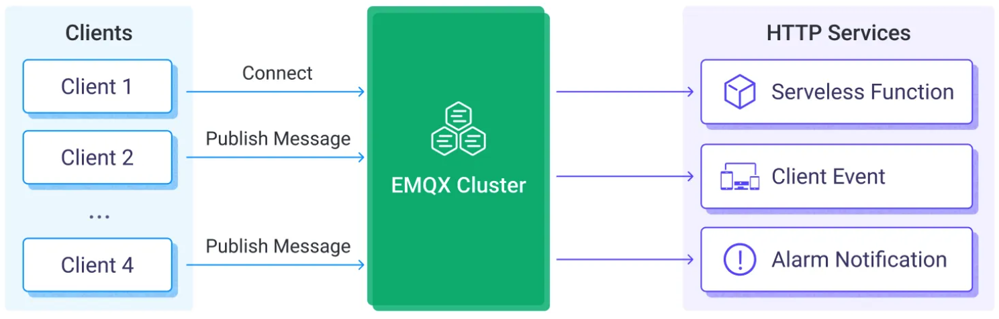

# 将 MQTT 数据发送到 HTTP 服务

HTTP 服务数据集成提供了将 EMQX Platform 与外部服务快速集成的方法。它支持灵活的配置请求方法和请求数据格式，提供了 HTTPS 安全的通信机制以及身份验证机制，能够实时传输客户端的消息和事件数据，高效、灵活地实现物联网设备状态推送、告警通知以及数据集成等场景。

本页详细介绍了 HTTP 服务数据集成的功能特性，并提供了实用的 HTTP 服务数据集成创建指导，内容包括创建 HTTP Server 连接器、创建规则和测试规则。


## 工作原理
HTTP 服务数据集成是 EMQX Platform 中开箱即用的功能，通过简单的配置即可实现 EMQX 与外部服务的集成。借助 HTTP 服务，用户可以使用自己熟悉的编程语言和框架编写代码，实现自定义的灵活和复杂的数据处理逻辑。



EMQX Platform 通过配置的数据集成将设备事件和数据转发至 HTTP 服务，其工作流程如下：

1. 设备连接到 EMQX Platform：物联网设备连接成功后将触发上线事件，事件包含设备 ID、来源 IP 地址以及其他属性等信息。
2. 设备发布消息：设备通过 MQTT 协议向特定的主题发布消息将遥测和状态数据上报到 EMQX Platform 并触发规则。
3. 规则引擎处理消息：通过内置的规则引擎，可以根据主题匹配处理特定来源的消息和事件。规则引擎会匹配对应的规则，并对消息和事件进行处理，例如转换数据格式、过滤掉特定信息或使用上下文信息丰富消息。
4. 发送到 HTTP 服务：规则触发将消息发送到 HTTP 服务事件的动作。用户可以从规则处理结果中提取数据，动态构造请求头、请求体甚至 URL，实现灵活的将数据与外部服务集成。

事件和消息数据发送到 HTTP 服务后，您可以进行灵活的处理，例如：

- 实现设备状态更新、事件记录，基于数据开发设备管理系统。
- 将消息数据写入到数据库中，实现轻量级数据存储功能。
- 对于规则 SQL 过滤的异常数据，可以直接通过 HTTP 服务调用告警通知系统，进行设备异常监控。

## 特性与优势
使用 EMQX Platform 的 HTTP 服务集成可以为业务带来以下优势：

- **将数据传递到更多的下游系统**：HTTP 服务可以将 MQTT 数据轻松集成到更多的外部系统中，比如分析平台、云服务等，实现多系统的数据分发。

- **实时响应并触发业务流程**：通过 HTTP 服务，外部系统可以实时接收到 MQTT 数据并触发业务流程，实现快速响应。例如接收报警数据并触发业务工作流。

- **自定义处理数据**：外部系统可以根据需要对接收到的数据进行二次处理，实现更复杂的业务逻辑，不受 EMQX 功能限制。

- **松耦合的集成方式**：HTTP 服务使用简单的 HTTP 接口，提供了一种松耦合的系统集成方式。

总之，HTTP 服务为业务提供了实时、灵活、自定义的数据集成能力，可以满足灵活，丰富的应用开发需求。


## 连接准备
本节介绍了在 EMQX Platform 中创建 HTTP 服务数据集成之前需要做的准备工作。

### 前置准备

- 了解[规则](./rules.md)。
- 了解[数据集成](./introduction.md)。

### 网络设置

<!--@include: ./network-setting.md-->

### 搭建简易 HTTP 服务

使用以下示例创建一个简易的 Web 服务器。

```python
from http.server import HTTPServer, BaseHTTPRequestHandler

class SimpleHTTPRequestHandler(BaseHTTPRequestHandler):
    def do_GET(self):
       self.send_response(200)
       self.end_headers()
       self.wfile.write(b'Hello, world!')

    def do_POST(self):
       content_length = int(self.headers['Content-Length'])
       body = self.rfile.read(content_length)
       print("Received POST request with body: " + str(body))
       self.send_response(201)
       self.end_headers()

httpd = HTTPServer(('0.0.0.0', 8080), SimpleHTTPRequestHandler)
httpd.serve_forever()
```

## 创建 HTTP Server 连接器
在创建数据集成的规则之前，您需要先创建一个 HTTP Server 连接器用于访问 HTTP 服务。

1. 在部署菜单中选择**数据集成**，在 Web 服务分类下选择 HTTP 服务。如果您已经创建过其他连接器，选择**新建连接器**，然后在 Web 服务分类下选择 HTTP 服务。
2. 在**创建连接器**页面中配置以下信息：
   - **连接器名称**：系统将自动生成一个连接器的名称，您也可以自己命名连接器的名称。在此示例中可以使用 `my_httpserver`。
   - **URL**：填写 URL，请确保您的 Web 服务可以正常通过网络访问。
   - 您可以根据需求配置 HTTP 请求头的键和值。其他选项使用默认值。
3. 点击**测试**按钮测试连接，如果 Web 服务能够正常访问，则会返回成功提示。
4. 点击**新建**按钮完成配置。

## 创建规则
接下来您需要创建一条规则来指定需要写入的数据，并在规则中添加响应的动作以将经规则处理的数据转发到 HTTP 服务。

1. 点击连接器列表**操作**列下的新建规则图标或在**规则列表**中点击**新建规则**进入**新建规则**步骤页。

2. 在 **SQL 编辑器**中输入规则匹配 SQL 语句。以下的 SQL 示例表示从发送到 `temp_hum/emqx` 主题的消息中读取消息上报时间、客户端 ID、消息体 (Payload)，并从消息体中分别读取温度和湿度。

   ```sql
   SELECT 
   
   timestamp as up_timestamp, clientid as client_id, payload.temp as temp, payload.hum as hum
   
   FROM
   
   "temp_hum/emqx"
   ```

   我们可以使用 **启用调试** 来模拟数据的输入并测试查看结果。

3. 点击**下一步**开始创建动作。

4. 从**使用连接器**下拉框中选择您之前创建的连接器。

5. 配置以下信息：

   - **动作名称**：系统将自动生成一个动作的名称，您也可以自己命名动作的名称。

   - **请求方法**：HTTP 请求方法选择 `POST`。

   - **URL 路径**：可以设置动作单独的请求路径，此路径将附加到连接器的 URL 配置中，以形成完整的 URL 地址。此选项中可以使用带有变量的模板。您需要首先在规则 SQL 中定义相关变量，例如，`select clientid as device_id`。之后，您可以在 HTTP 动作的 URL 路径中使用变量 `${device_id}`。

   - **请求头**：对这个动作可以单独设置请求头，也可以直接使用连接器配置的请求头。

   - **请求体**：设置为以下消息内容模版，将规则里面输出的字段添加到动作的请求体中。

     ```json
     {"up_timestamp": ${up_timestamp}, "client_id": ${client_id}, "temp": ${temp}, "hum": ${hum}}
     ```

6. 点击**确认**按钮完成规则创建。

7. 在弹出的**成功创建规则**提示框中点击**返回规则列表**，从而完成了整个数据集成的配置链路。


## 测试规则

推荐使用 [MQTTX](https://mqttx.app/) 模拟温湿度数据上报，同时您也可以使用其他任意客户端完成。

1. 使用 MQTTX 连接到部署，并向以下 Topic 发送消息。

    - topic: `temp_hum/emqx`

    - payload:

      ```
      {
        "temp": "27.5",
        "hum": "41.8"
      }
      ```

2. 查看消息是否已经转发到了 HTTP 服务：

   ```bash
   py server.py
   
   Received PosT request with body: b'[\n "temp": "27.5",\n "hum": "41.8"\n)127.0.0.1 - -[18/Dec/2023 14:50:44]"POST  HTTP/1.1" 201 -
   ```


3. 在控制台查看运行数据。在规则列表中点击规则 ID，在运行统计页面可以查看到规则的统计以及此规则下所有动作的统计。

