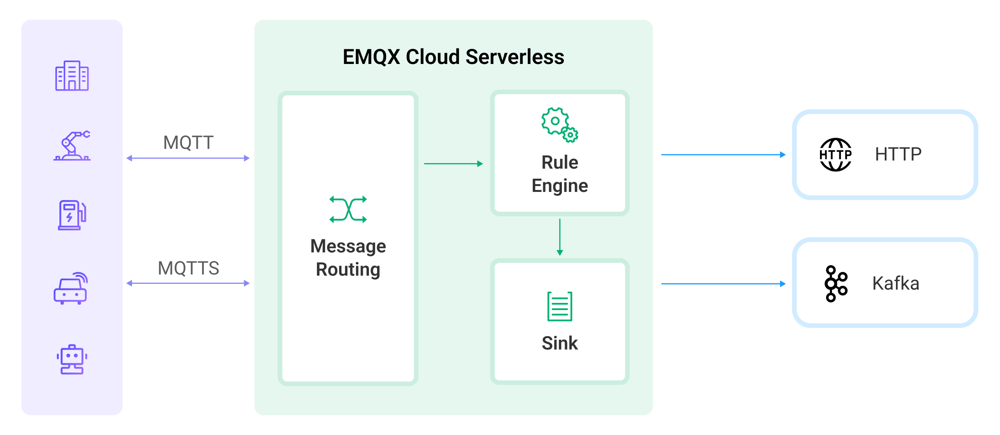

# 数据集成（Beta）简介

::: tip
本页的介绍适用于 Serverless 部署的数据集成（Beta）。如果您的部署是专有版，请阅读[数据集成（专有版）](../rule_engine/introduction.md)。
:::

作为全托管的 MQTT 消息云服务，EMQX Cloud 通过 MQTT 协议连接物联网设备并实时传递消息。在此基础上，数据集成为 EMQX Cloud 引入了与云资源的连接，从而实现设备与其他业务系统的无缝集成。EMQX Cloud 数据集成不仅提供了一个清晰灵活的"可配置"架构解决方案，而且还简化了开发过程，提高了用户的可用性，降低了业务系统和 EMQX Cloud 之间的耦合程度，提供了一个更优秀的数据转发的基础架构。

## 工作原理

在 Serverless 部署中，当设备或应用程序建立连接时，MQTT 代理会路由这些消息。消息到达后，将由规则引擎处理，这是一个强大的组件，使用 SQL 语句进行数据操作。处理后的数据随后通过“动作”（Action）转发到目标服务。动作分为两种类型：“Sink”，用于向服务发送数据；和 “Source”，用于从服务接收数据。目前，Serverless 部署的数据集成功能主要在 “Sink” 模式下运行，便于将数据无缝集成到各种云服务中。

### [连接器](./connectors.md)

连接器关联了您从云平台购买的云服务产品，可以是 Kafka 这样的消息队列服务，也可以是 RDS 存储服务。“连接器”等同与专有版数据集成中的“资源”，用于连接由云服务商提供的服务。

### [规则](./rules.md)

规则描述了「数据从哪里来」和「如何筛选并处理数据」。规则使用类 SQL 语句来自定义编写数据，并且可以使用 SQL 测试来模拟导出的数据。想要学习和了解如何编写规则 SQL，参阅[规则 SQL 编写](https://docs.emqx.com/zh/enterprise/v4.2/rule/rule-engine.html#sql-%E8%AF%AD%E5%8F%A5)。

### [动作](./rules.md)

动作解决了「处理后的数据到哪里去」，一个规则可以对应一个或者多个动作，动作关联定义好的连接器，也就是将处理后的数据发送到哪个服务。

## 创建流程

以下是创建数据集成的基本流程：

1. 选定或创建一个“连接器”。您可以从数据集成的初始页面选择需要集成的连接服务并配置连接器。
2. 创建规则来处理从设备上收集的数据。该规则可以通过使用 SQL 语句，以你想要的方式收集和处理数据。
3. 将动作添加到规则上。当规则触发动作后，经处理的数据将通过配置的连接器被转发到云资源。
4. 测试创建的数据集成是否能正常运行。

## 计费和限制

数据集成功能设定了 Beta 测试期，结束时间为 2024.2.29（海外站结束时间为 2024.1.31）。在 Beta 期间，数据集成免费使用，不会被计费。试用期结束后，提供给数据集成免费额度：每月 1 百万规则动作被执行次数。超过免费额度之外的部分，将以 ¥1.80 每百万次规则动作被执行次数进行计费。

在 Beta 期间，数据集成可创建的连接器、规则、动作的数量限制如下：

| **配额名称**         | **限制数**            |
| --------------------| ----------------------- |
| 可创建的连接器数量   | 2  |
| 可创建的规则数量     | 4   |
| 单个规则下关联动作数量     | 1   |

