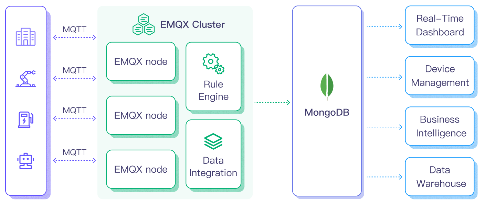

# 将 MQTT 数据写入到 MongoDB

[MongoDB](https://www.mongodb.com/)，作为领先的 NoSQL 数据库，以其在模式设计的灵活性、可扩展性以及存储大量结构化和半结构化数据的能力而闻名。通过将 EMQX Platform 与 MongoDB 的数据集成，用户可以高效地将 MQTT 消息和客户端事件直接导入 MongoDB。这有助于在 MongoDB 中进行长期序列数据存储和高级查询。集成确保了单向流动，即 EMQX Platform 的 MQTT 消息被写入 MongoDB 数据库。这种强大的组合是寻求有效管理其物联网数据的企业的坚实基础。

本页提供了 EMQX Platform 与 MongoDB 数据集成的全面介绍，并提供了创建和验证数据集成的实用指导。

## 工作原理

MongoDB 数据集成是 EMQX Platform 中的开箱即用功能，旨在弥合基于 MQTT 的物联网数据与 MongoDB 强大的数据存储能力之间的差距。借助内置的[规则引擎](./rules.md)组件，集成简化了将数据从 EMQX Platform 导入 MongoDB 进行存储和管理的过程，无需复杂的编码。

下图展示了 EMQX 与 MongoDB 之间数据集成的典型架构。



将 MQTT 数据写入 MongoDB 的过程如下：

1. **消息发布和接收**：无论是连接车辆、工业物联网系统还是能源管理平台的一部分，物联网设备都通过 MQTT 协议成功连接到 EMQX，并向特定主题发布 MQTT 消息。当 EMQX Platform 收到这些消息时，它启动其规则引擎中的匹配过程。
2. **消息数据处理**：消息到达后，经过规则引擎处理，然后由 EMQX Platform 中定义的规则处理。基于预定义标准的规则确定哪些消息需要路由到 MongoDB。如果任何规则指定了有效载荷转换，则应用这些转换，例如转换数据格式、过滤特定信息或使用额外上下文丰富有效载荷。
3. **数据导入 MongoDB**：一旦规则引擎识别出一个消息用于 MongoDB 存储，它就会触发一个动作，将消息转发到 MongoDB。处理过的数据将被无缝写入 MongoDB 数据库的集合中。
4. **数据存储和利用**：随着数据现在存储在 MongoDB 中，企业可以利用其查询能力应用于各种用例。例如，在连接车辆领域，存储的数据可以通知车队管理系统关于车辆健康状况，根据实时指标优化路线规划或跟踪资产。同样，在工业物联网环境中，数据可能用于监控机械健康，预测维护或优化生产计划。

通过使用这种集成系统，像电力和能源等行业的企业可以持续监控电网健康状况，预测需求或在发生之前识别潜在停电。从实时和历史数据中获得的价值不仅确保了运营效率，还可以带来显著的成本节约和增强客户体验。

## 特性与优势

EMQX Platform 与 MongoDB 的数据集成提供了一系列功能和优势，以确保有效的数据处理和存储：

- **简化物联网数据管理**

  您可以在一个地方摄取、存储、处理和分析您的物联网数据，消除了复杂集成和繁琐数据迁移的需求。告别数据孤岛，迎接物联网数据的统一视图。

- **实时数据处理**

  EMQX Platform 专为处理实时数据流而构建，确保从源系统到 MongoDB 的高效可靠数据传输。它使组织能够实时捕获和分析数据，非常适合需要立即洞察和行动的用例。

- **灵活的 MongoDB 连接选项**

  无论您是操作单个 MongoDB 实例还是利用副本集的强大性能，数据集成都提供原生支持以连接这两种配置，为企业提供根据其基础设施需求进行调整的灵活性。

- **高性能和可扩展性**

  EMQX 的分布式架构和 MongoDB 的列式存储格式实现随着数据量增加的无缝扩展。这确保了即使在大数据集下也能保持一致的性能和响应能力。随着您的物联网部署增长，您的数据存储能力也可以轻松扩展。

- **灵活的数据转换**

  EMQX Platform 提供了强大的基于 SQL 的规则引擎，允许组织在将数据存储到 MongoDB 之前对数据进行预处理。它支持各种数据转换机制，如过滤、路由、聚合和丰富，使组织能够根据其需求塑造数据。

- **NoSQL**

  MongoDB 的无模式架构确保了多样化的 MQTT 消息结构可以轻松存储，无需固定模式，适应物联网数据的动态特性。

- **可靠的数据存储**

  一旦 EMQX Platform 规则引擎处理并路由消息，它将存储在 MongoDB 中，平台已证明的可靠性确保了数据的完整性和持续可用性。

- **运营指标和高级分析**

  从诸如总消息计数、出口流量速率等指标中获得洞察。这些指标与 MongoDB 强大的查询能力相结合，可用于监控、分析和优化数据流，赋予用户从物联网数据中获得宝贵洞察的能力，实现预测分析、异常检测等。

- **支持最新的 MongoDB 版本**

  数据集成兼容并支持 MongoDB 的最新版本，确保用户受益于数据库平台提供的最新功能、优化和安全更新。

MongoDB 数据集成加强了您的物联网基础设施，确保您的设备生成的大量数据不仅被存储，而且还为将来的查询和分析做好了准备。它带来的简便设置和运营卓越性能可以大大提高您的物联网系统的效率和可靠性。

## 连接准备

本节介绍了在 EMQX Platform 中创建 MongoDB 数据集成之前需要做的准备工作。

### 前置准备

- 了解[数据集成](./introduction.md)
- 了解[规则](./rules.md)
- 了解 [MongoDB](https://www.mongodb.com/)

### 安装 MongoDB 并创建数据库

#### 通过 Docker 安装 MongoDB

通过 Docker 安装并启动 MongoDB：

```bash
# 启动一个 MongoDB 容器并设置密码为 public
docker run -d --name mongodb -p 27017:27017 mongo

# 进入容器
docker exec -it mongodb bash

# 在容器中连接到 MongoDB 服务器，
mongosh

# 创建用户
use admin
db.createUser({ user: "admin", pwd: "public", roles: [ { role: "root", db: "admin" } ] })

# 创建名为 emqx_data 的数据库
use emqx_data

# 创建名为 temp_hum 的集合
db.createCollection('temp_hum')
```

<!-- TODO: 使用 MongoDB Atlas 创建 MongoDB 服务 -->

## 创建 MongoDB 连接器

在创建数据集成的规则之前，您需要先创建一个 MongoDB 连接器用于访问 MongoDB 服务器。

1. 在部署菜单中选择 **数据集成**，在数据持久化服务分类下选择 MongoDB 服务。如果您已经创建了其他的连接器，点击**新建连接器**，然后在数据持久化服务分类下选择 MongoDB 服务。

2. **连接器名称**：系统将自动生成一个连接器的名称。

3. 输入连接信息：

   - **部署模式**: 根据您实际的部署模式选择要连接的 MongoDB 部署类型。在此演示中，您可以选择 `single`。
     - `single`：单个独立的 MongoDB 实例。
     - `rs`：副本集，一组维护相同数据集的 `mongod` 进程。
     - `sharded`：MongoDB 的分片集群。
   - **服务器地址**：填写服务器的 IP 地址以及端口。
   - **数据库名字**：输入 `emqx_data`。
   - **写模式**：保持默认值 `unsafe`。
   - **用户名**：输入 `admin`。
   - **密码**：输入 `public`。
   - **认证源**：填写与用户证书关联的数据库名称。
   - **使用旧协议**：可选择是否应使用 MongoDB 的旧版通信协议（MongoDB 在 3.6 版本中引入了新的线协议，旧协议保留用于向后兼容。），可以设置为 `true`、 `false` 或 `auto`。在 `auto` 模式（默认选项）下，EMQX 将根据检测到的 MongoDB 版本自动决定使用哪种协议。
   - **Srv 记录**：默认禁用。启用后，允许 EMQX Platform 使用 DNS SRV 记录来发现它应该连接的 MongoDB 主机，这使得连接到副本集或分片集群更加容易，无需在连接字符串中指定每个主机。
   - 如果您想建立加密连接，请点击 **启用 TLS** 切换开关。

4. 根据需要配置高级设置选项（可选），详情请参考[高级设置](https://docs.emqx.com/zh/enterprise/latest/data-integration/data-bridge-mongodb.html#%E9%AB%98%E7%BA%A7%E9%85%8D%E7%BD%AE)。

5. 点击**确认**按钮完成动作的配置。

6. 在弹出的**成功创建规则**提示框中点击**返回规则列表**，从而完成了整个数据集成的配置链路。

## 创建规则

接下来您需要创建一条规则来指定需要写入的数据，并在规则中添加响应动作以将经规则处理的数据转发到 MongoDB。

1. 点击连接器列表**操作**列下的新建规则图标或在**规则列表**中点击**新建规则**进入**新建规则**步骤页。

2. 在 SQL 编辑器中输入规则，在下面规则中我们从 `temp_hum/emqx` 主题读取消息上报时间 `up_timestamp`、客户端 ID、消息体(Payload)，并从消息体中分别读取温度和湿度：

   ```sql
    SELECT
      timestamp as up_timestamp,
      clientid as client_id,
      payload.temp as temp,
      payload.hum as hum
      FROM
    "temp_hum/emqx"
   ```

   ::: tip

   如果您初次使用 SQL，可以点击 **SQL 示例** 和**启用调试**来学习和测试规则 SQL 的结果。

   :::

3. 点击**下一步**开始创建动作，为规则在被触发的情况下指定一个动作。通过这个动作，EMQX Platform 会将经规则处理的数据发送到 MongoDB。

4. 从**使用连接器**下拉框中选择您之前创建的连接器。

5. 配置 **有效载荷模板**，将 `client_id`、`up_timestamp`、`temp`、 `hum` 字段存储到 MongoDB 中，该模板将通过 MongoDB insert 命令执行，对应模板如下：

   ```json
   {
     "client_id": "${client_id}",
     "timestamp": ${up_timestamp},
     "temp": ${temp},
     "hum": ${hum}
   }
   ```

   ::: tip

   配置有效载荷模板时需注意以下几点：

   - 所有的**键**需要使用双引号 `"` 包裹；

   - 不支持自动推导**值**的数据类型：

     - 字符类型的字段需要使用 `"` 包裹，否则将报错；
     - 数值类型字段不需要包裹，否则将被识别为字符类型；
     - 时间戳、日期和时间类型，如不做特殊处理，则将被识别为数值或字符类型，如希望以日期和时间类型存储，需要在规则 SQL 中使用 `mongo_date` 函数对字段进行处理。

   - 允许嵌套对象，当 **值** 为 JSON 对象时：

     - 模板中禁止使用双引号嵌套该值，否则将导致执行错误；

     - 对象将按自身结构嵌套存储；

     - 如需将对象存储为 JSON 字符，可以在规则 SQL 中使用 `json_encode` 函数转换，模板中对应的**值**仍然禁止使用双引号包裹。

   :::

6. 根据需要配置高级设置选项（可选），详细请参考[高级配置](https://docs.emqx.com/zh/enterprise/latest/data-integration/data-bridge-mongodb.html#%E9%AB%98%E7%BA%A7%E9%85%8D%E7%BD%AE)。

7. 点击**确认**按钮完成动作的配置。

8. 在弹出的**成功创建规则**提示框中点击**返回规则列表**，从而完成了整个数据集成的配置链路。

您还可以点击**集成** -> **Flow 设计器**可以查看拓扑，通过拓扑可以直观的看到，主题 `t/#` 下的消息在经过规则 `my_rule` 解析后被发送到 MongoDB 中。

### 测试规则

推荐使用 [MQTTX](https://mqttx.app/) 模拟温湿度数据上报，同时您也可以使用其他任意客户端完成。

1. 使用 MQTTX 连接到部署，并向以下 Topic 发送消息。

   - topic: `temp_hum/emqx`

   - payload:

     ```json
     {
       "temp": "27.5",
       "hum": "41.8"
     }
     ```

2. 查看数据转存结果

```bash
emqx_data> db.temp_hum.find()
[
  {
    _id: ObjectId('65fba3d0ac7ad8048e000001'),
    client_id: 'test_client',
    hum: 41.8,
    temp: 27.5,
    timestamp: 1710990288
  }
]
```

3. 在控制台查看运行数据。在规则列表点击规则 ID，在运行统计页面可以查看到规则的统计以及此规则下所有动作的统计。
