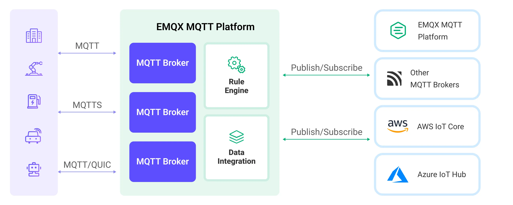

# 与其他 MQTT 服务桥接

MQTT 服务数据集成提供了一种连接到另一个 EMQX 集群或其它 MQTT 服务进行消息桥接的功能，能够用于实现跨网络、跨服务的数据交互和通信。本页提供了 EMQX Platform 中 MQTT 消息桥接的工作原理介绍，以及如何创建和验证消息桥接的实际指导。

## 工作原理

在桥接时，EMQX Platform 以客户端的身份与目标服务建立 MQTT 连接，通过发布订阅模式实现消息的传输：

- 消息流出：将当前部署的主题的消息发布到远程 MQTT 服务指定的主题。
- 消息流入：订阅远程 MQTT 服务的主题，并将其消息转发到当前部署。


EMQX Platform 支持在同一个连接上配置多个桥接规则，每个规则都可以配置不同的主题映射和消息转换规则，实现类似消息路由的功能。在桥接过程中，您还可以通过规则引擎对消息进行处理，实现消息转发前的过滤、丰富和转换等操作。

下图展示了 EMQX Platform 和 其他 MQTT 服务之间的数据集成的典型架构：



## 特性与优势

EMQX Platform 的 MQTT 消息桥接具有以下特性和优势：

- **广泛的兼容性**：使用标准的 MQTT 协议，可以桥接到各类物联网平台，包括 AWS IoT Core、Azure IoT Hubs 等，同时也支持开源或其他行业 MQTT Broker 和物联网平台。这使得它可以与各种设备和平台进行无缝集成和通信。
- **灵活的主题映射**：基于 MQTT 发布订阅模式，实现了灵活的主题映射。桥接过程中支持为主题添加前缀，可以利用客户端的上下文信息（如客户端 ID、用户名等）动态构造主题。这种灵活性使得可以根据具体需求对消息进行定制化处理和路由。
- **高性能**：提供了性能优化选项，如连接池和共享订阅，以降低单个桥接客户端的负载压力，实现更低的桥接延迟和更高的桥接消息吞吐量。通过这些优化措施，可以提升整体系统的性能和可扩展性。
- **消息 payload 转换**：允许通过定义 SQL 规则对消息 payload 进行处理，在消息传输过程中，可以对 payload 进行数据提取、过滤、丰富和转换等操作。例如，可以从 payload 中提取实时指标，并在消息传递到其他 MQTT 服务之前进行数据转换和处理。
- **指标监控**：提供了详细的运行指标的监控，可以查看消息总数、成功/失败计数、当前速率等指标，帮助用户实时监控和评估 MQTT 消息桥接 的性能和健康状况。

## 准备 MQTT 服务连接信息

### 前置准备

- 了解[数据集成](./introduction.md)。
- 了解[规则](./rules.md)。

在创建 MQTT 消息桥接之前，您需要获取远程 MQTT 服务的连接信息，包括：

- **MQTT 服务地址**：目标 MQTT 服务的地址和端口，例如  `broker.emqx.io:1883`。
- **用户名**：进行连接所需的用户名，如果目标服务不需要认证，此项可留空。
- **密码**：进行连接所需的密码，如果目标服务不需要认证，此项也可留空。
- **协议类型**：需要明确目标服务是否启用了 TLS，以及是否使用的是 MQTT over TCP/TLS 协议。值得注意的是，EMQX Platform MQTT 桥接暂时不支持 MQTT over WebSocket 和 MQTT over QUIC 类型的协议。
- **协议版本**：目标 MQTT 服务使用的协议版本，EMQX Platform 支持 MQTT 3.1, 3.1.1 和 MQTT 5.0。

对于 EMQX Platform 或者其他标准的 MQTT 服务器，桥接都能提供良好的兼容和支持。如果您需要连接的是其他类型的 MQTT 服务，你可以参考其相关文档来获取这些连接信息。一般来说，大多数的物联网平台都会提供标准的 MQTT 接入方式，你可以依据他们的指引将设备信息转化为以上所述的 MQTT 连接信息。

::: tip
EMQX Platform 运行在集群模式下或启用连接池时，多个节点使用相同的客户端 ID 连接到同一 MQTT 服务通常会导致设备互踢，因此 EMQX Platform MQTT 桥接暂不支持设置固定的客户端 ID。
:::


## 创建连接器（目标数据和源数据）

本节将以 EMQX 的[在线 MQTT 服务器](https://www.emqx.com/zh/mqtt/public-mqtt5-broker)作为远程 MQTT 服务器，指导您如何配置与远程 MQTT 服务器的连接。

在创建数据集成的规则之前，您需要先创建一个 MQTT 服务 连接器用于访问 MQTT 服务。

1. 在部署菜单中选择**数据集成**，在数据转发分类下选择 MQTT 服务。如果您已经创建了其他的连接器，点击**新建连接器**，然后在数据转发服务分类下选择 MQTT 服务。

2. **连接器名称**：系统将自动生成一个连接器的名称。

3. 填写连接相关配置：

   - **MQTT 服务地址**：仅支持 MQTT over TCP/TLS，此处设为 `broker.emqx.io:1883`。
   - **客户端 ID 前缀**：此处可以留空，实际使用中，指定客户端 ID 前缀可以便于客户端管理，EMQX Platform 会根据客户端 ID 前缀和连接池大小自动生成客户端 ID。
   - **用户名**和**密码**：此处可以留空，该服务器不需要认证。

4. 其他配置保持默认即可，点击**测试连接**按钮，如果 MQTT 服务能够正常访问，则会返回**连接器可用**提示。

5. 点击**新建**按钮完成连接器的创建。

接下来，您可以基于此连接器创建数据桥接规则。

### 连接池与客户端 ID 生成规则

EMQX Platform 允许多个客户端同时连接到桥接的 MQTT 服务，在创建连接器时您可以设置一个 MQTT 客户端连接池，并配置连接池大小以表明连接池中的客户端连接数。连接池可以充分利用服务器资源，以实现更大的消息吞吐和更好的并发性能，这对于处理高负载、高并发的场景非常重要。

由于 MQTT 协议要求连接到一个 MQTT 服务器的客户端必须具有唯一的客户端 ID，且 EMQX Platform 可能以集群方式部署，因此 MQTT 桥接的每个客户端都被分配了一个唯一的客户端 ID。EMQX Platform 根据以下模式自动生成客户端 ID：

```bash
[客户端 ID 前缀]:{连接器名称}{8 位随机字符串}:{连接池中的连接序号}
```

例如当客户端 ID 前缀为 `myprefix`，连接器名称为 `foo`，实际的客户端 ID 可能是：

```bash
myprefix:foo2bd61c44:1
```

## 创建 MQTT 服务（目标数据） 规则

本节演示了如何创建一条规则来指定需要转发至远程 MQTT 服务的数据。

1. 点击连接器列表**操作**列下的新建规则图标或在**规则列表**中点击**新建规则**进入**新建规则**步骤页。

2. 在 SQL 编辑器中输入规则，客户端将温湿度消息发送到 `temp_hum/emqx` 主题时，就会触发引擎。这里需要对 SQL 进行一定的处理：

   ```sql
    SELECT
      topic,
      payload
    FROM
      "temp_hum/emqx"
   ```

   ::: tip

   如果您初次使用 SQL，可以点击 **SQL 示例**和**启用调试**来学习和测试规则 SQL 的结果。

   :::

3. 点击**下一步**开始创建动作。

4. 从**使用连接器**下拉框中选择您之前创建的连接器。

5. 完成消息从 EMQX Platform 到发布到外部 MQTT 服务的配置：

   - **主题**：发布到外部 MQTT 服务的主题，支持 `${var}` 格式的占位符。此处输入 `pub/${topic}`，表示在原主题的基础上添加 `pub/` 前缀进行转发。例如，当原始消息主题为 `t/1` 时，转发到外部 MQTT 服务的主题为 `pub/t/1`。
   - **QoS**：消息发布 QoS，下拉选择 `0` 、 `1` 、`2` 或 `${qos}`，也可以输入占位符从其他字段中设置 QoS，此处选择 `${qos}` 表示跟随原始消息的 QoS。
   - **Retain**：选择 `true` 、`false` 或 `${falgs.retain}`，确认是否以保留消息方式发布消息，也可以输入占位符从其他字段中设置保留消息标志位。此处选择 `${falgs.retain}` 表示跟随原始消息的保留消息标志位。
   - **消息模板**：用于生成转发消息 Payload 的模板，默认留空表示转发规则输出结果。此处可以输入 `${payload}` 表示仅转发 Payload。

6. 其他高级设置中的配置使用默认值，点击**确认**按钮完成规则的创建

7. 在弹出的**成功创建规则**提示框中点击**返回规则列表**，从而完成了整个数据集成的配置链路。

### 测试规则

推荐使用 [MQTTX CLI](https://mqttx.app/zh/cli) 模拟温湿度数据上报，同时您也可以使用其他任意客户端完成。

1. 订阅外部 MQTT 服务 `pub/#` 主题：

   ```bash
   mqttx sub -t pub/# -q 1 -h broker.emqx.io -v
   ```

1. 使用 MQTTX 连接到 EMQX Platform 部署，并向以下 Topic 发送消息。

   - topic: `temp_hum/emqx`

   - client id: `test_client`

   - payload:

     ```json
     {
       "temp": "27.5",
       "hum": "41.8"
     }
     ```

1. 您可以在 MQTTX 外部 MQTT 服务订阅到 `pub/temp_hum/emqx` 主题的消息，表示消息已经成功从 EMQX Platform 转发到外部 MQTT 服务：

   ```bash
   [2024-3-21] [10:43:13] › topic: pub/temp_hum/emqx
   payload:
   { "temp": "27.5", "hum": "41.8"}
   ```

## 创建 MQTT 服务（源数据）规则

本节演示了如何创建一条规则将远程 MQTT 服务的数据转发当前部署。您需要同时创建一个 MQTT 服务（源数据） 和一个消息重发布动作，实现消息从远程 MQTT 服务到 EMQX 的订阅，以及订阅数据的转发。

MQTT 服务（源数据）连接器和 MQTT 服务（目标数据）连接器创建方式相同，请参考创建。

1. 点击连接器列表**操作**列下的新建规则图标，或在**规则列表**中点击**新建规则**进入**新建规则**步骤页。

2. 对于源数据规则，您需要先配置输入的动作。规则编辑页面会自动弹出输入动作配置，或者选择面板右侧的**输入动作** -> **添加输入动作**，选择 **MQTT 服务（源数据）**，点击**下一步**进入配置。
    - 选择 MQTT 服务（源数据）连接器。
    - **主题**：输入需要从远程 MQTT 订阅的主题，如从远端订阅的主题为`temp_hum/emqx`。
    - **QoS**：选择消息 QoS。
    - 点击**确认**按钮完成配置。

3. **SQL 编辑器**中将更新数据源字段：

    ```sql
    SELECT
      *
    FROM
      "$bridges/mqtt:source-d1f51e81"
    ```
4. 点击**下一步**开始创建输出动作。
5. 在新建输出动作中，选择**消息重新发布**。
6. 配置输出动作信息：
   - **主题**：转发的 MQTT 主题，支持 `${var}` 格式的占位符。此处输入 `sub/${topic}`，表示在原主题的基础上添加 `sub/` 前缀进行转发。例如，当原始消息主题为 `t/1` 时，转发的主题为 `sub/t/1`。
   - **QoS**：消息发布 QoS，下拉选择 `0` 、 `1` 、`2` 或 `${qos}`，也可以输入占位符从其他字段中设置 QoS，此处选择 `${qos}` 表示跟随原始消息的 QoS。
   - **Retain**：选择 `true` 、`false` 或 `${falgs.retain}`，确认是否以保留消息方式发布消息，也可以输入占位符从其他字段中设置保留消息标志位。此处选择 `${falgs.retain}` 表示跟随原始消息的保留消息标志位。
   - **消息模板**：用于生成转发消息 Payload 的模板，默认留空表示转发规则输出结果。此处可以输入 `${payload}` 表示仅转发 Payload。
7. 其他配置使用默认值，点击**创建**按钮完成输出动作的创建。

创建成功后将回到创建规则页面，在**规则列表**中可以查看到新创建的规则。在**动作列表**中，**输入动作列表**可以查看到数据导入的动作列表。消息重新发布动作目前不显示在**输出动作列表**，如需查看，点击规则编辑按钮，在规则设置的下方，可以查看到消息重新发布的输出动作。

### 测试规则
在之前创建的规则中配置了将外部 MQTT 服务中 `temp_hum/emqx` 主题的消息桥接到当前部署 `sub/${topic}` 主题，因此当您向外部 MQTT 服务 `temp_hum/emqx` 主题发布消息时，消息将被转发到部署的 `sub/temp_hum/emqx` 主题中。

以下步骤演示了如何使用 [MQTTX](https://mqttx.app/zh/) 向外部 MQTT 服务中发送消息，并订阅转发的主题获取消息。

1. 使用 MQTTX 订阅当前部署的主题 `sub/#`。

2. 使用 MQTTX 向外部 MQTT 服务的 `temp_hum/emqx` 主题发布消息：

   ```json
   {
      "temp": 55,
      "hum": 32
   }
   ```
3. MQTTX 收到当前部署 `sub/temp_hum/emqx` 主题内消息：

   ```json
   {
      "temp": 55,
      "hum": 32
   }
   ```