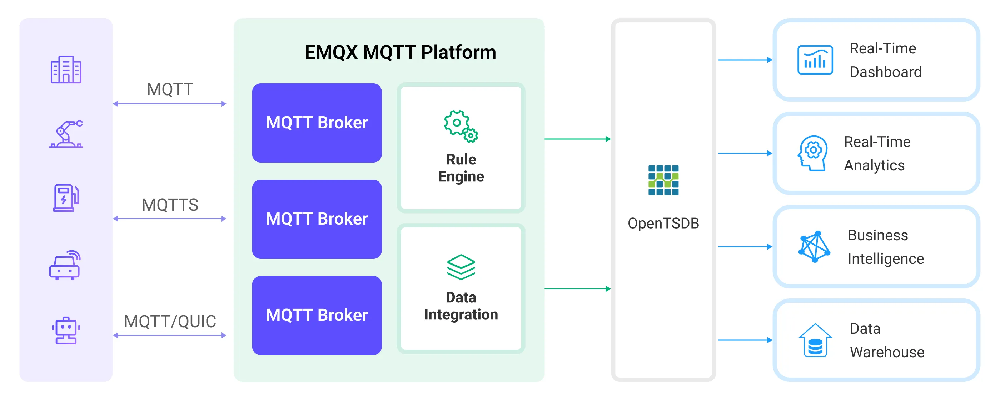

# 将 MQTT 数据写入到 OpenTSDB

[OpenTSDB](http://opentsdb.net/) 是一个可扩展的分布式时间序列数据库。EMQX Platform 支持与 OpenTSDB 集成，因此可以将 MQTT 消息保存到 OpenTSDB 以便后续进行分析和检索。

本页详细介绍了 EMQX Platform 与 OpenTSDB 的数据集成并提供了实用的规则和动作创建指导。

## 工作原理

OpenTSDB 数据集成是 EMQX Platform 的开箱即用功能，结合了 EMQX Platform 的实时数据捕获和传输能力以及 OpenTSDB 的数据存储和分析功能。通过内置的[规则引擎](./rules.md)组件，集成简化了从 EMQX Platform 到 OpenTSDB 的数据摄取过程，无需复杂编码。

下图展示了 EMQX Platform 和 OpentsDB 之间的数据集成的典型架构：



EMQX Platform 通过规则引擎和动作将设备数据插入到 OpenTSDB。OpenTSDB 提供丰富的查询功能，支持生成报告、图表和其他数据分析结果。以工业能耗管理场景为例，工作流程如下：

1. **消息发布和接收**：工业设备通过 MQTT 协议成功连接到 EMQX Platform，并定期使用 MQTT 协议发布能耗数据。这些数据包括生产线标识符和能耗值。当 EMQX Platform 接收到这些消息时，它将在其规则引擎中启动匹配过程。
2. **规则引擎处理消息**：内置的规则引擎根据主题匹配处理来自特定来源的消息。当消息到达时，它通过规则引擎进行匹配，规则引擎将处理消息数据。这可能包括转换数据格式、过滤特定信息或用上下文信息丰富消息。
3. **数据写入到 OpenTSDB**：规则引擎中定义的规则触发操作将消息写入 OpenTSDB。

在数据写入 OpenTSDB 后，你可以灵活地使用数据，例如：

- 连接到如 Grafana 等可视化工具生成基于数据的图表，显示能源存储数据。
- 连接到业务系统以监控和警报能源存储设备的状态。

## 特性与优势

在 EMQX Platform 中使用 OpenTSDB 数据集成能够为您的业务带来以下特性与优势：

- **高效数据处理**：EMQX Platform 能够处理大量物联网设备连接和消息吞吐量，而 OpenTSDB 在数据写入、存储和查询方面表现出色，提供出色的性能以满足物联网场景的数据处理需求，不会给系统带来过重负担。
- **消息转换**：消息可以在写入 OpenTSDB 之前通过 EMQX Platform 规则进行广泛的处理和转换。
- **大规模数据存储**: 通过将 EMQX Platform 与 OpenTSDB 集成，可以将海量设备数据直接存储到 OpenTSDB 中。OpenTSDB 是为存储和查询大规模时间序列数据而设计的数据库，能够高效地处理物联网设备产生的海量时间序列数据。
- **丰富的查询能力**: OpenTSDB 优化过存储结构和索引能够实现数十亿个数据点快速写入和查询，这对于需要对物联网设备数据进行实时监控、分析和可视化的应用场景非常有益。
- **可扩展性**：EMQX Platform 和 OpenTSDB 均能够实现集群扩展，随着业务需求的增长允许灵活的水平扩展集群。

## 准备工作

本节介绍了在 EMQX Platform 中创建 OpenTSDB 数据集成 之前需要做的准备工作，包括如何设置 OpenTSDB 服务器。

### 前置准备

- 了解 [规则](./rules.md)。
- 了解[数据集成](./introduction.md)。

### 网络设置

<!--@include: ./network-setting.md-->

### 安装 OpenTSDB

通过 Docker 安装并启动 OpenTSDB （目前仅支持 x86 平台）：

```bash
docker pull petergrace/opentsdb-docker

docker run -d --name opentsdb -p 4242:4242 petergrace/opentsdb-docker

```

## 创建连接器

在创建 OpenTSDB 动作之前，您需要创建一个 OpenTSDB 连接器，以便 EMQX Platform 与 OpenTSDB 服务建立连接。

1. 在部署菜单中选择 **数据集成**，在数据持久化分类下选择 OpenTSDB。如果您已经创建了其他的连接器，点击**新建连接器**，然后在数据持久化分类下选择 OpenTSDB。

2. **连接器名称**：系统将自动生成一个连接器的名称。

3. 填写连接相关配置：

   - **服务器地址**填写示范 `http://127.0.0.1:4242`，如果您在远程运行 OpenTSDB 服务器，需填写实际地址。
   - 其他选项使用默认值即可。
   - 根据业务需求配置高级设置（可选）。

4. 点击**测试连接**按钮，如果 OpenTSDB 能够正常访问，则会返回**连接器可用**提示。

5. 点击**新建**按钮完成连接器的创建。

接下来，您可以基于此连接器创建数据桥接规则。

## 创建规则

本节演示了如何创建 OpenTSDB 数据集成的规则来指定需要持久化至 OpenTSDB 的数据并为规则添加触发的动作。

1. 点击连接器列表**操作**列下的新建规则图标或在**规则列表**中点击**新建规则**进入**新建规则**步骤页。

2. 在 SQL 编辑器中输入规则，例如将 `t/#` 主题的 MQTT 消息存储至 OpenTSDB，需输入以下 SQL 语法：

   注意：如果您希望制定自己的 SQL 语法，需要确保规则选出的字段（SELECT 部分）包含所有 SQL 模板中用到的变量。

   ```sql
   	SELECT
     		payload.metric as metric, payload.tags as tags, payload.value as value
   	FROM
     		"t/#"
   ```

   ::: tip

   如果您初次使用 SQL，可以点击 **SQL 示例**和**启用调试**来学习和测试规则 SQL 的结果。

   :::

3. 点击**下一步**开始创建动作。

4. 从**使用连接器**下拉框中选择您之前创建的连接器。

5. 在**写入数据**字段中指定数据如何写入 OpenTSDB 以确保正确地将 MQTT 消息转换为 OpenTSDB 所需的格式。例如，客户端报告以下数据：

   - 主题：`t/opents`
   - Payload：

   ```json
   {
     "metric": "cpu",
     "tags": {
       "host": "serverA"
     },
     "value": 12
   }
   ```

   根据提供的 Payload 数据格式，配置以下格式信息：

   - **时间戳**: OpenTSDB 需要一个时间戳来记录数据点的时间。如果 MQTT 消息中没有提供时间戳，您可以在 EMQX Platform 规则 SQL 配置中使用当前时间作为时间戳，或者你需要修改客户端上报的数据格式，包含一个时间戳字段。
   - **度量**: 写入${metric}，在这个例子中，`"metric": "cpu"` 表示度量名称是 `cpu`。
   - **标签**: 写入${tags}，标签用于描述度量的额外信息，这里的标签是 `"tags": {"host": "serverA"}`，表示这个度量数据来自于主机 `serverA`。
   - **值**: 写入${value}，这是实际的度量值，这个例子中是 `"value":12`，表示度量的值为 12。

6. 高级配置（可选），根据情况配置同步/异步模式，队列与批量等参数。

7. 点击**确认**按钮完成动作的配置。
8. 在弹出的**成功创建规则**提示框中点击**返回规则列表**，从而完成了整个数据集成的配置链路。

## 测试规则

使用 MQTTX 向 `t/opents` 主题发布一条消息:

```bash
mqttx pub -i emqx_c -t t/opents -m '{"metric":"cpu","tags":{"host":"serverA"},"value":12}'
```

查看 OpenTSDB 规则的动作统计，命中、动作成功次数均 +1。

查看数据是否已经写入 OpenTSDB 中:

```bash
curl -X POST -H "Accept: Application/json" -H "Content-Type: application/json" http://localhost:4242/api/query -d '{
    "start": "1h-ago",
    "queries": [
        {
            "aggregator": "last",
            "metric": "cpu",
            "tags": {
                "host": "*"
            }
        }
    ],
    "showTSUIDs": "true",
    "showQuery": "true",
    "delete": "false"
}'
```

查询结果经格式化输出后如下：

```json
[
  {
    "metric": "cpu",
    "tags": {
      "host": "serverA"
    },
    "aggregateTags": [],
    "query": {
      "aggregator": "last",
      "metric": "cpu",
      "tsuids": null,
      "downsample": null,
      "rate": false,
      "filters": [
        {
          "tagk": "host",
          "filter": "*",
          "group_by": true,
          "type": "wildcard"
        }
      ],
      "percentiles": null,
      "index": 0,
      "rateOptions": null,
      "filterTagKs": [
        "AAAB"
      ],
      "explicitTags": false,
      "useFuzzyFilter": true,
      "preAggregate": false,
      "rollupUsage": null,
      "rollupTable": "raw",
      "showHistogramBuckets": false,
      "useMultiGets": true,
      "tags": {
        "host": "wildcard(*)"
      },
      "histogramQuery": false
    },
    "tsuids": [
      "000001000001000001"
    ],
    "dps": {
      "1711678449": 12
    }
  }
]%
```
